(chp:conttwodim)=
# Two-dimensional continuous systems

## Introduction

In this chapter, we study systems of two simultanous ODEs given by

```{math}
:label: eq:cont2d:2dgeneric_x
\begin{aligned}
\dot{x} &= f(x,y)\\
\dot{y} &= g(x,y)
\end{aligned}
```

Here $x(t)$ and $y(t)$ are the dependent variables and $t$ is the independent variable. Only autonomous systems will be considered, which explains why the functions $f$ and $g$ do not have a dependence on $t$.

Second order ODEs can be converted to a system of two first order ODEs. Consider the general second order ODE

$$
\ddot{x} = f(x, \dot{x})
$$

By introducing a new variable for the first derivative $y=\dot{x}$, a system of two first order ODEs is obtained:

$$
\begin{aligned}
\dot{x} &= y \\
 \dot{y} &= f(x, y)
\end{aligned}
$$

In general, any $N$-th order ODE can be converted to $N$ simultaneous first order ODEs by introducing $N-1$ new variables for all but the highest derivative.

A classical example of an autonomous system of two ODEs are the *Lotka-Volterra* equations

$$
\begin{aligned}
\dot{N} &= r_1 N - \theta_1 N P \\
 \dot{P} &= r_2 N P - \theta_2 P.
\end{aligned}
$$

These equations have found wide-spread application in various fields, ranging from autocatalytic chemical reactions, *predator-prey* systems in biology/ecology {cite:p}`Case2000` and economical models. An amusing version involving the attraction between lovers is presented in {cite}`Strogatz1994`. Here, we will focus on the biological interpretation of the model, i.e. the predator-prey model.

The prey and predator populations are $N$ and $P$, respectively. In absence of predators, the prey population grows exponentially. The rate of predation is modeled based on the  meeting probability and is therefore proportional to the product of $P$ and $N$. The predator birth rate is dependent on the availability of food and therefore also takes the form $PN$ but with a different prefactor. Finally, the death rate of predators is proportional to $P$, as caused by either natural death or emigration.

There are four parameters in the problem above, which can be reduced to one when the equations are made dimensionless. Indeed, with the change of variables

$$
x = \frac{r_2}{r_1} N, \quad y=\frac{\theta_1}{r_1}, \quad t' = r_1 t, \quad \alpha = \frac{\theta_1}{r_1}
$$

the system simplifies to

```{math}
:label: eq:cont2d:lv_x
\begin{aligned}
\dot{x} &= x - xy \\
 \dot{y} &= x y - \alpha y
\end{aligned}
```

To get a feeling for the behaviour of this nonlinear system we perform numerical simulation with `maple`. The key commands are `dsolve` and `odeplot`, and the solution method is exactly identical to that of a 1-D system (see section XXX).

````{admonition} Maple
:class: maple

```{code-block} maple
restart; with(DEtools); with(plots);
f := (x, y) -> x*(1-y);
g := (x, y) -> y*(x-alpha);
DE1 := diff(x(t), t) = f(x(t), y(t));
DE2 := diff(y(t), t) = g(x(t), y(t));
DE := DE1, DE2;
alpha := 3/4;
ic1 := x(0) = .25, y(0) = .25;
sol1 := dsolve({DE, ic1}, [x(t), y(t)], type = numeric, maxfun = -1);
tstart := 0; tend := 20;
odeplot(sol1, [ [t, x(t)], [t, y(t)] ], tstart .. tend,
        labels = ["t", "x(t), y(t)"], numpoints = 1000,
        legend = ['x', 'y']);

```
````

The result of the `maple` fragment, which uses $\alpha=3/4$ and initial condition $x(0) = 0.25$, $y(0) = 0.25$, is shown in {numref}`fig:cont2d:lv_time`. As can be seen, the predator- and prey-populations do not reach an equilibrium but instead vary periodically. This behaviour will be analysed in detail in subsequent sections.

```{figure} _static/cont2d/cont2d_LV_time.png
:name: fig:cont2d:lv_time
:width: 10cm

Timeseries of Lotka-Volterra system for $\alpha=3/4$ and $x(0)=0.25$, $y(0)=0.25$.
```

## The phase-space

The general 2-D system ({eq}`eq:cont2d:2dgeneric_x`) can be written succinctly as

```{math}
:label: eq:cont2d:vecx
\dot{\mathbf{x}} = \mathbf{f}(\mathbf{x})
```

where

$$
\mathbf{x}(t) = \left( \begin{array}{c} x(t) \\ y(t) \end{array} \right)
 \quad \textnormal{and} \quad
 \mathbf{f}(\mathbf{x}) = \left( \begin{array}{c} f(x,y) \\ g(x,y) \end{array} \right)
$$

The vector $\mathbf{x}$ is called the *state vector* of the system. The space spanned by the dependent variables $x$ and $y$  is called the *phase space*. Each point $\mathbf{x}$ in this space represents a unique state of the system. The function $\mathbf{f}$ will change the state of the system as time progress, thereby tracing out a trajectory $\mathbf{x}(t)$ in the phase space. This is shown schematically in {numref}`fig:cont2d:phasespace`.

```{figure} _static/cont2d/cont2d_phasespace.png
:name: fig:cont2d:phasespace
:width: 65mm

The system {eq}`eq:cont2d:vecx` cases the state vector $\mathbf{x}$ to change at a rate $\mathbf{f}$, thereby moving it though the phase space and tracing out a unique trajectory.
```

The phase space is an important concept in the study of dynamical systems, because it allows for a geometrical perspective on the system. Indeed, by comparing equation {eq}`eq:cont2d:vecx` to that describing a weightless particle (tracer) in a flow field $\mathbf{u}(x,y)$

$$
\dot{\mathbf{x}} = \mathbf{u}(\mathbf{x})
$$

it is immediately clear that $\mathbf{f}=\mathbf{u}$ and therefore we can interpret the ODE system as a point particle at location $\mathbf{x}$ which moves through the phase space with a velocity $\mathbf{f}(\mathbf{x})$.

When the system has a fixed point and the initial conditions are within the domain of attraction of that fixed point, the state vector will trace out a unique trajectory through the phase space which starts at the initial conditions and finds its way to the fixed point never to leave it again. Periodic solutions will trace out closed orbits in phase space.

```{figure} _static/cont2d/cont2d_LV_phase.png
:name: fig:cont2d:lv_phaseportrait
:width: 60mm

Phase portrait of a periodic solution of the Lotka-Volterra system.
```

The phase space representation of the timeseries shown in {numref}`fig:cont2d:lv_time` is a closed orbit ({numref}`fig:cont2d:lv_phaseportrait`). Hence, this is strong evidence that the solution is periodic. The arrows displayed in the plot are tangent vectors of $\mathbf{f}$ which indicate the direction of the trajectories (flow) in phase space.

This figure was created using the following `maple` fragment:

````{admonition} Maple
:class: maple

```{code-block} maple
restart; with(DEtools); with(plots);
f := (x, y) -> x*(1-y);
g := (x, y) -> y*(x-alpha);
DE1 := diff(x(t), t) = f(x(t), y(t));
DE2 := diff(y(t), t) = g(x(t), y(t));
DE := DE1, DE2;
alpha := 3/4;
phaseportrait([DE], [x(t), y(t)], t = 0 .. 10, [[x(0) = .5, y(0) = .5]],
              stepsize = .1, x = 0 .. 4, y = 0 .. 4);
```
````

The workhorse in this fragment is the function `phaseportrait` from the `DEtools` toolbox. This command plots a grid of tangent vectors (flow direction), as well as one or more trajectories with differing initial conditions.

(sec:cont2d:linear)=
## A brief review of linear 2-D systems

Before continuing the discussion on non-linear systems, a brief revision is required for linear systems of the form

$$
\begin{aligned}
\dot{x} &= a x + b y \\
 \dot{y} &= c x + d y
\end{aligned}
$$

where the coefficients $a$, $b$, $c$ and $d$ are assumed to be real-valued. This system can be written in a matrix form as

$$
\dot{\mathbf{x}} = A \mathbf{x} \quad \textnormal{ where }
 \mathbf{x} = \left( \begin{array}{c} x \\ y \end{array} \right) \textnormal{ and }
 A = \left[ \begin{array}{cc} a & b \\ c & d \end{array} \right]
$$

A closed-form solution to this system can be found by diagonalization of $A$ , which comprises the identification of an invertible coordinate transformation

$$
\left( \begin{array}{c} \tilde{x} \\ \tilde{y} \end{array} \right) = S^{-1} \left( \begin{array}{c} x \\ y \end{array} \right)
$$

for which the matrix $A$ diagonalises:

$$
\left( \begin{array}{c} \dot{\tilde{x}} \\ \dot{\tilde{y}} \end{array} \right) = S^{-1} A S
 \left( \begin{array}{c} \tilde{x} \\ \tilde{y} \end{array} \right) =
 \left( \begin{array}{cc} \sigma_1 & 0 \\ 0 & \sigma_2 \end{array} \right)
 \left( \begin{array}{c} \tilde{x} \\ \tilde{y} \end{array} \right)
$$

If this is the case, then $\tilde{x}$ and $\tilde{y}$ represent the coordinates in the eigenframe of this system. As before, we disregard the situation in which the matrix $A$ is not diagonalizable, which occurs when $\sigma_1 = \sigma_2$. Note that in its diagonal form, the system is given by

$$
\begin{aligned}
\dot{\tilde{x}} &= \sigma_1 \tilde{x} \\
 \dot{\tilde{y}} &= \sigma_2 \tilde{y}
\end{aligned}
$$

with solution

```{math}
:label: eq:cont2d:linsol
\tilde{x}(t) = \tilde{x}(0) e^{\sigma_1 t}, \quad \tilde{y}(t) = \tilde{y}(0) e^{\sigma_2 t}
```

The eigenvalues $\sigma_1$ and $\sigma_2$ determine the character of the system. The characteristic polynomial of the eigenvalue problem $A \mathbf{x} = \sigma \mathbf{x}$ is

$$
\sigma^2 - T \sigma + D = 0
$$

Where $T=a+c$ and $D=ac-bd$ are the trace and determinant of $A$, respectively. The roots of this second order polynomial are given by

$$
\sigma_{1,2} = \frac{1}{2} \left( T \pm \sqrt{T^2 - 4 D} \right)
$$

When the eigenvalues are real ($T^2 - 4 D > 0$), three cases can be distinguished:

- $\sigma_1 < 0$ and $\sigma_2 < 0$. The fixed point is a *stable node* which all trajectories converge to. If $\sigma_1 = \sigma_2$, the system will move to the fixed point in straight lines. If $\sigma_1>\sigma_2$, the trajectories will first move in the $y_1$ direction until $y_1$ is small enough;
- $\sigma_1 > 0$ and $\sigma_2 < 0$. This is a *saddle*. The fixed point attracts in the $y_2$ direction, but repels in the $y_1$ direction.
- $\sigma_1>0$ and $\sigma_2 >0$. The fixed point is an *unstable node*.

When $T^2 - 4 D < 0$. the eigenvalues will be imaginary, in which case oscillatory motion is to be expected. As the coefficients $a$, $b$, $c$ and $d$ are real, the eigenvalues will be a conjugate pair: if $\sigma_1 = \alpha + \beta i$ then $\sigma_2 = \alpha - \beta i$, or simply $\sigma_1^* = \sigma_2$. The character of the system is then determined by $\text{Re}( \sigma_1 ) = \text{Re}( \sigma_2 )  = \alpha$; the imaginary part determines the oscillation frequency only. Three cases can be distinguished:

- $\text{Re}( \sigma_1 ) = \text{Re}( \sigma_2 ) < 0$. The fixed point is an attractor, and trajectories describe a *stable spiral*;
- $\text{Re}( \sigma_1 ) = \text{Re}( \sigma_2 ) = 0$. The system has two identical eigenvalues and the system is therefore not diagonalizable. In this case, the fixed point is a *center*;
- $\text{Re}( \sigma_1 ) = \text{Re}( \sigma_2 ) > 0$. The system has an repellor, and trajectories describe a *unstable spiral*;

```{figure} _static/cont2d/cont2d_phase_r1.png
:name: fig:cont2d:classification
:height: 30mm

The behaviour of a dynamic system in the neigbourhood of a fixed point.
```

```{figure} _static/cont2d/cont2d_classification.png
:name: fig:cont2d:classification2
:width: 12cm

Classification of 2-D linear ODEs based on the trace $T$ and determinant $D$ of the matrix $A$.
```

The eigenvalues of the 2-D matrix are related to $T$ and $D$ as:

$$
\begin{aligned}
T &= \sigma_1 + \sigma_2 \\
 D &= \sigma_1 \sigma_2
\end{aligned}
$$

This is useful for checking whether the eigenvalues are calculated properly. A systematic was to present the behaviour of 2-D systems is by plotting the behaviour as a function of $T$ and $D$ ({numref}`fig:cont2d:classification2`). Here we note that $D$ is positive when both eigenvalues are positive or negative; hence the saddle will occur for $D<0$. The distinction between a spiral and a node will depend on the value of the discriminant $T^2 - 4 D$.

## Nonlinear systems

Linear systems are “uninteresting” in the sense that no matter where you start in the phase space, the system behavior is exactly identical and is governed by {eq}`eq:cont2d:linsol`. For nonlinear systems, the dynamics are much richer. The behaviour of a nonlinear ODE in one region of the phase space can be entirely different from another region ({numref}`fig:cont2d:zoo`). Because the system of ODEs is non-linear, the phase space may contain several fixed points each with their own dynamics; some may be attractors, some repellors, some may be saddles.

```{figure} _static/cont2d/cont2d_zoo.png
:name: fig:cont2d:zoo
:width: 80mm

Example of the rich behavior of phase space for a nonlinear ODE.
```

Fixed points $(x^*, y^*)$ can be determined in the same way as for one-dimensional continuous systems, and need to satisfy $\dot{x}=0$ and $\dot{y}=0$, i.e.

```{math}
:label: eq:cont2d:nullcline_x
\begin{aligned}
f(x^*,y^*) &= 0 \\
g(x^*,y^*) &= 0
\end{aligned}
```

The lines for which $f(x,y)=0$ and $g(x,y)=0$ are called *nullclines* and fixed points exist on the intersection of both nullclines.

For the Lotka-Volterra equations {eq}`eq:cont2d:lv_x`,{eq}`eq:cont2d:lv_x`, the requirements of $\dot{x}=x-xy=0$ and $\dot{y}=xy - \alpha y = 0$ lead to, respectively

$$
\begin{aligned}
\dot{x}=0 \,\, \rightarrow &\,\, x = 0 \,\, \vee \,\, y = 1 \\
 \dot{y}=0 \,\, \rightarrow &\,\, x= \alpha \,\, \vee \,\, y = 0
\end{aligned}
$$

and the system therefore has two fixed points $(x^*, y^*) = (0, 0)$ and $(x^*, y^*) = (\alpha, 1)$. The fragment below shows how to determine the fixed points in `maple`:

````{admonition} Maple
:class: maple

```{code-block} maple
restart; with(LinearAlgebra): with(plots):
f := (x,y) -> x*(1-y);
g := (x,y) -> y*(x-alpha);
fp := solve({f(x, y) = 0, g(x, y) = 0}, {x, y});
```
````

$$
\begin{aligned}
\mathtt{fp} := & \, \{ x=0, y=0 \}, \{ x= \alpha, y = 1 \} \\
\end{aligned}
$$

The stability of the fixed point $(x^*,y^*)$ can be studied by perturbing it slightly and looking what happens: $x(t) = x^* + \delta(t)$, $y(t) = y^* + \epsilon(t)$

$$
\begin{aligned}
\dot{\delta} &= f(x^*+\delta,y^*+\epsilon) \\
 &= f(x^*,y^*) + \frac{\partial f}{\partial x} \delta + \frac{\partial f}{\partial y}
\epsilon + {\cal O}(\delta^{2},\epsilon^{2})\\
\dot{\epsilon} &= g(x^*+\delta,y^*+\epsilon)\\
 &= g(x^*,y^*) + \frac{\partial g}{\partial x} \delta + \frac{\partial g}{\partial y}
\epsilon + {\cal O}(\delta^{2},\epsilon^{2})
\end{aligned}
$$

Using ({eq}`eq:cont2d:nullcline_x`) and neglecting terms of order $\delta^{2},\epsilon^{2}$ one arrives at the equations governing the deviations from the fixed-point:

$$
\begin{aligned}
\dot{\delta} &= \frac{\partial f}{\partial x}(x^*,y^*) \delta+ \frac{\partial f}{\partial y}(x^*,y^*)
\epsilon \\
\dot{\epsilon} &= \frac{\partial g}{\partial x}(x^*,y^*) \delta + \frac{\partial g}{\partial y}(x^*,y^*)
\epsilon
\end{aligned}
$$

We write this into a more formal form, by introducing the Jacobian $J(x,y)$ [^fn1]

$$
J(x,y)
= \left(\begin{array}{ll}
\frac{\partial f}{\partial x} & \frac{\partial f}{\partial y} \\[1mm]
\frac{\partial g}{\partial x} & \frac{\partial g}{\partial y} \\[1mm]
\end{array}\right)
$$

which yields

$$
\left(\begin{array}{l}
 \dot{\delta} \\
 \dot{\epsilon} \\
\end{array}\right)
= J(x^*,y^*)
\left(\begin{array}{l}
 \delta \\
 \epsilon \\
\end{array}\right)
$$

Stability of the fixed point requires that deviations $\delta, \epsilon$ vanish as $t$ increases. As $J(x^*, y^*)$ is a constant matrix, it has a closed-form solution of the form (see section {numref}`sec:cont2d:linear`):

$$
\tilde{\delta}(t) = \tilde{\delta}(0) \,\text{e}^{\textstyle \sigma_{1} t}\,\,\,\,\,\,\,\,\,\,\,\,\,\,\,\,\,\, \tilde{\epsilon}(t) = \tilde{\epsilon}(0)\,\text{e}^{\textstyle \sigma_{2} t}
$$

where $\tilde{\delta}$ and $\tilde{\epsilon}$ denote the coordinates in the the eigendirections and $\sigma_{1,2}$ are the eigenvalues of $J(x^*, y^*)$. The different types of fixed points are exactly those presented in {numref}`fig:cont2d:classification`, the only difference with linear systems being that the behaviour is limited to the local neighborhood of the fixed point.

The following `maple` fragment determines the stability of the two fixed points of the Lotka-Volterra equations {eq}`eq:cont2d:lv_x`,{eq}`eq:cont2d:lv_x`:

````{admonition} Maple
:class: maple

```{code-block} maple
restart; with(LinearAlgebra): with(plots):
f := (x,y) -> x*(1-y);
g := (x,y) -> y*(x-alpha);
fp := solve({f(x, y) = 0, g(x, y) = 0}, {x, y});
jac := VectorCalculus[Jacobian]([f(x, y), g(x, y)], [x, y]);
ev1 := Eigenvalues(subs(fp[1], jac), output='list');
ev2 := Eigenvalues(subs(fp[2], jac), output='list')
```
````

$$
\begin{aligned}
\mathtt{fp} := & \, \{ x=0, y=0 \}, \{ x= \alpha, y = 1 \} \\
 \mathtt{ev1} := & \, [ 1, -\alpha ] \\
 \mathtt{ev2} := & \, [ - \sqrt{-\alpha}, \sqrt{-\alpha} ]
\end{aligned}
$$

As $\alpha>0$, the first fixed point is a *saddle* and the second a *center* (see {numref}`fig:cont2d:classification`).

In non-linear systems, the stability of centers is fragile, as they are not attracting. Their behaviour can be easily destroyed by the nonlinearity. In the case of the Lotka-Volterra equations it is straightforward to show that the solutions are periodic because the system has a *constant of motion*

```{math}
:label: eq:cont2d:lv_constant
H = \frac{e^{x + y}}{x^\alpha y}
```

which remains constant under the action of the system for all time. This function has a minimum at the fixed point $(\alpha, 1)$, and increases monotonically away from the fixed points. The isolines of $H$ are the trajectories of solutions to the ODE system. A systems that has a constant of motion are called a *conservative system* and will form the topic of the next section. Contours of $H$ are plotted in {numref}`fig:cont2d:lv_e`, which are also trajectory paths.

```{figure} _static/cont2d/cont2d_LV_E.png
:name: fig:cont2d:lv_e
:width: 60mm

Isocontours of the constant of motion $H$ for the Lotka-Volterra system.
```

## Conservative and gradient systems

(sec:cont2d:conservative)=
### Conservative systems

Conservative systems are systems which have at least one constant of motion or *conserved quantity*. Let us see what the requirements are for the ODE function $\mathbf{f}$ to have a constant of motion $H$. Because $H$ needs to remain constant as the dynamical system traverses the phase space, we have $dH/dt=0$ along trajectories and therefore

```{math}
:label: eq:cont2d:constant
\dot{H} = \frac{d}{d t} H(x(t), y(t)) = \frac{\partial H}{\partial x} \dot{x} + \frac{\partial H}{\partial y} \dot{y} = \mathbf{f} \cdot \nabla H = 0
```

Using {eq}`eq:cont2d:constant`, it is straightforward to establish that {eq}`eq:cont2d:lv_constant` is indeed a constant of motion for the Lotka-Volterra system ({eq}`eq:cont2d:lv_x`):

$$
\mathbf{f} \cdot \nabla H = (x - xy) \frac{e^{x+y}}{x^\alpha y} \left(1-\frac{\alpha}{x} \right) + (xy - \alpha y) \frac{e^{x+y}}{x^\alpha y} \left(1-\frac{1}{y} \right) = 0
$$

In `maple`, this can be checked as

````{admonition} Maple
:class: maple

```{code-block} maple
restart;
f := (x,y)-> x - x*y;
g := (x,y)-> x*y - alpha * y;
H := exp(x+y)/(x^alpha * y);
dHdt := diff(H, x)*f(x, y) + diff(H, y)*g(x, y);
simplify(dHdt);
```
````

$$
\mathtt{dHdt} := 0
$$

The restriction $\mathbf{f} \cdot \nabla H = 0$ implies that $\mathbf{f}$ is everywhere perpendicular to $\nabla H$ (which in turn implies that $\mathbf{f}$ is everywhere tangential to isolines of $H$). Hence, if $f(x,y)$ and $g(x,y)$ take the form

```{math}
:label: eq:cont2d:constant_f
\begin{aligned}
f(x,y) &= \frac{1}{\rho(x,y)} \frac{\partial H}{\partial y} \\
 g(x,y) &= - \frac{1}{\rho(x,y)} \frac{\partial H}{\partial x}
\end{aligned}
```

where $\rho(x,y)$ is some weight function, then the system is conservative as can be demonstrated by substitution into {eq}`eq:cont2d:constant`. Note that ({eq}`eq:cont2d:constant_f`) satisfy

```{math}
:label: eq:cont2d:constant2
\nabla \cdot (\rho \mathbf{f}) = 0
```

Hence, if we can find a function $\rho(x,y)$ for which {eq}`eq:cont2d:constant2` holds, the system has a constant of motion[^fn2].

Clearly, it is nontrivial to obtain $H(x,y)$ and/or $\rho(x,y)$ from the vector function $\mathbf{f}$, as {eq}`eq:cont2d:constant` and {eq}`eq:cont2d:constant2` are partial differential equations. However, once either $H(x.y)$ or $\rho(x,y)$ is known, the oter can be calculated using ({eq}`eq:cont2d:constant_f`). For the Lotka-Volterra system, $\rho=-H/xy$.

The important class of *Hamiltonian systems* is obtained when the weight function $\rho(x,y) = 1$, for which ({eq}`eq:cont2d:constant_f`) become

```{math}
:label: eq:cont2d:fham
\begin{aligned}
f(x,y) &= \frac{\partial H}{\partial y} \\
 g(x,y) &= - \frac{\partial H}{\partial x}
\end{aligned}
```

Hamiltonian systems have a central place in physics. The constant of motion $H$ is called the *Hamiltonian* and represents the total energy of the system.

For Hamiltonian systems, {eq}`eq:cont2d:constant2` becomes

```{math}
:label: eq:cont2d:constantham
\nabla \cdot \mathbf{f} = 0
```

which implies that *area* is conserved in the phase space. If we consider a small patch of the phase space and follow its evolution in time, it might deform into exotic shapes but its area always remains the same.

The fixed points of a Hamiltonian system are those points where

$$
\frac{\partial H}{\partial x} = \frac{\partial H}{\partial y} = 0
$$

i.e. where the energy surface $H$ is entirely flat. As discussed, the trajectories of conservative systems are constrained to isolevels in $H$. If $H$ has a local minimum (i.e. a fixed point), as plotted in {numref}`fig:cont2d:esurface`(a), the orbits will be closed and circle around the fixed point ({numref}`fig:cont2d:esurface`(a), black lines). When there is a local maximum in $H$, the contours of $H$ will look identical to {numref}`fig:cont2d:esurface`(a), and we also expect closed periodic orbits. Note that the fixed point is non-attracting. When the fixed point is a saddle ({numref}`fig:cont2d:esurface`(b), black lines), the trajectories will escape the neigborhood of the fixed point along one of the diagonals.

```{subfigure} 2
:name: fig:cont2d:esurface
:align: center
:subcaptions: below

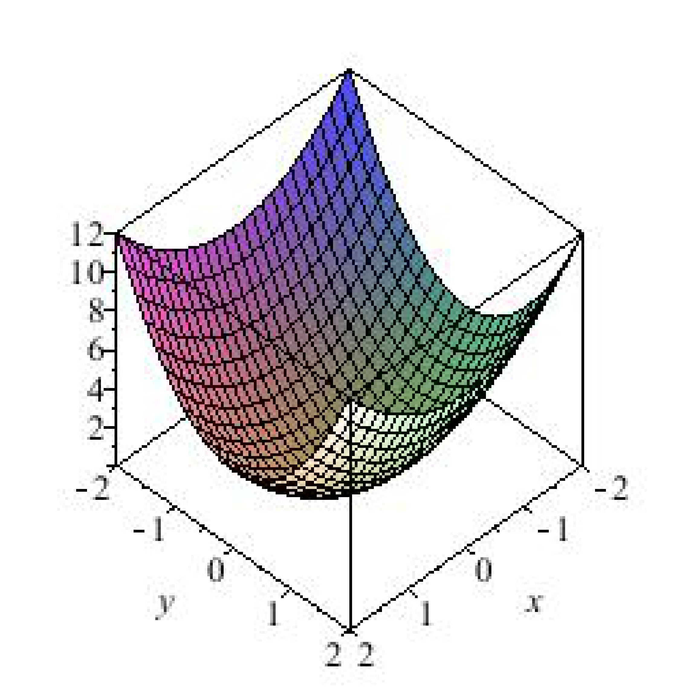
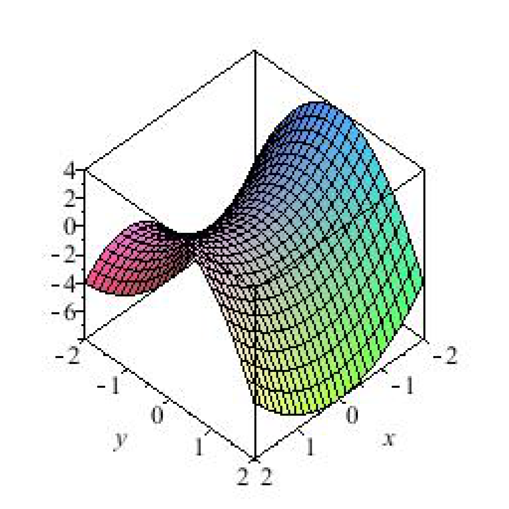

. Typical trajectories for conservative and gradient systems for a surface $S$ ($H$, $V$ for conservative and gradient systems, respectively).. Left figures: 3-D plot of $S$. Right figures: isolines of $S$ (black lines; trajectories for conservative systems) and $-\nabla S$ (red vectors; direction field for gradient systems). (a) Conservative systems will circle around the fixed point, whereas gradient systems will find their way to the minimum. (b) Conservative systems escape to infinity across one of the diagonals, whereas gradient systems escape the neigborhood of the fixed point along one of the axes. (a) Local minimum. (b) Saddle.
```

````{admonition} Example
:class: example

Consider the acceleration of a particle in a force field

$$
m \ddot{x} = F(x)
$$

where $F(x)$ is a *conservative force*, e.g. due to a magnetic field, a spring or a gravitational field. We will first demonstrate that this system is Hamiltonian and then calculate the $H$. Written as two first-order ODES, the system above is given by

```{math}
:label: eq:cont2d:smham_x
\begin{aligned}
\dot{x} &= y \\
 \dot{y} &= F(x) / m
\end{aligned}
```

and by using {eq}`eq:cont2d:constantham` we confirm that this is a Hamiltonian system. The Hamiltonian $H$ can be found using ({eq}`eq:cont2d:fham`):

$$
\begin{aligned}
H &= \int f(x,y) dy = \frac{1}{2} y^2 + c_1(x) \\
 H &= - \int g(x,y) dx = V(x) + c_2(y)
\end{aligned}
$$

where we have introduced $F(x) = - m dV/dx$, $V(x)$ is a *potential*, and $c_1(x)$ and $c_2(y)$ are unknown functions. Combining the two equations, the Hamiltonian of this system is

$$
H = V(x) + \frac{1}{2} y^2 + c
$$

where $c$ is a coefficient. Of course, the Hamiltonian is just the total energy per unit mass of the system: the first term is the potential energy per unit mass and the second term is the kinetic energy per unit mass.
````

````{admonition} Example
:class: example

Consider the motion of a particle in a double-well potential given by $V(x) = \frac{1}{4} x^4 - \frac{1}{2} x^2$ (and therefore $F(x) = - m (x^3-x)$), for which the governing equations are (cf. {eq}`eq:cont2d:smham_x`, {eq}`eq:cont2d:smham_x`):

```{math}
:label: eq:cont2d:doublewell_x
\begin{aligned}
\dot{x} &= y \\
 \dot{y} &= x - x^3
\end{aligned}
```

This system has three fixed points $(-1, 0)$, $(0, 0)$ and $(1, 0)$ which are denoted with open circles in {numref}`fig:cont2d:conservative_e`. A stability analysis reveals that these fixed points are a center, a saddle and a center, respectively. Also shown in {numref}`fig:cont2d:conservative_e` are the contours of $H$, which are solutions to the ODE system. There are two minima in $H$ at $(-1, 0)$ and $(1, 0)$, which are the energy wells. If the initial conditions are such that  $H(t=0)<0$, the orbits are trapped in one of the wells. For initial conditions with $H(t=0)>0$, the system has too much energy to remain caught and orbits around both wells.
````

```{figure} _static/cont2d/cont2d_conservative_E.png
:name: fig:cont2d:conservative_e
:width: 60mm

Contours of $H$ for the double well system. As the system is conservative, these are also the trajectories in phase space. Open circles: fixed points of the system.
```

(sec:cont2d:gradient)=
### Gradient systems

As the name suggest, gradient systems are of the form

```{math}
:label: eq:cont2d:gradientsystem
\dot{\mathbf{x}} = - \nabla V(\mathbf{x})
```

where $V(x,y)$ is a *potential function*. In terms of our generic system ({eq}`eq:cont2d:2dgeneric_x`), this means

$$
\begin{aligned}
f(x,y) &= - \frac{\partial V}{\partial x} \\
 g(x,y) &= - \frac{\partial V}{\partial y}
\end{aligned}
$$

As for Hamiltonian systems, the fixed points are located where the potential $V$ is entirely flat, i.e. where

$$
\frac{\partial V}{\partial x} = \frac{\partial V}{\partial y} = 0
$$

By definition, the gradient of a function points in the direction of steepest ascent and is perpendicular to the isolines of $V$. Hence, if $V$ has a local minimum, the system {eq}`eq:cont2d:gradientsystem` will travel towards the fixed point following the steepest path down ({numref}`fig:cont2d:esurface`(a), red arrows). If the fixed point is a saddle, the system will escape the neigbourhood of the fixed point ({numref}`fig:cont2d:esurface`(b)).

Now, we ask ourselves the question: how does $V$ change as a function of time for a specific trajectory $\mathbf{x}(t)$ governed by {eq}`eq:cont2d:gradientsystem`?

$$
\frac{d}{dt} V(\mathbf{x}(t)) = \nabla V \cdot \dot{\mathbf{x}} = - | \nabla V |^2
$$

This is a powerful result: $| \nabla V |^2$ is negative by definition and therefore $\dot{V} \le 0$ for *all* $\mathbf{x}$. Furthermore, $\dot{V} = 0$ implies that $| \nabla V | = 0$ and therefore indicates that $\dot{V} = 0$ occurs only at a fixed point $\mathbf{x} = \mathbf{x}^*$. If we further constrain ourselves to potential functions $V$ that are single-valued, the only possible long-time behavior (assuming that the solution remains bounded) is that the solution is attracted to a fixed point[^fn3].

One can verify whether the functions $f(x,y)$ and $g(x, y)$ comprise a gradient system by checking if

```{math}
:label: eq:cont2d:pot_requirement
\frac{\partial f}{\partial y} - \frac{\partial g}{\partial x} = - \frac{\partial }{\partial y} \frac{\partial V}{\partial x} + \frac{\partial }{\partial x} \frac{\partial V}{\partial y} = 0
```

Note that all linear systems which have a symmetric coefficient matrix $A$, i.e. $f(x,y) = a x + b y$, $g(x,y) = b x + c y$ can be written as a gradient system as is straightforward to verify with {eq}`eq:cont2d:pot_requirement`. For these systems, $V = -\frac{1}{2} a x^2 -\frac{1}{2} c y^2 - b x y$.

````{admonition} Example
:class: example

Potential functions can be used to determine the stability of fixed points. As an example, consider a gradient system which has a potential function  $V(x,y) = a x^4 + b y^4$ where $a>0$ and $b>0$. In components, this system is given by

$$
\begin{aligned}
\dot{x} &= - 4 a x^3 \\
 \dot{y} &= - 4 b y^3
\end{aligned}
$$

The system has a single fixed point at the origin. The Jacobian is

$$
J(x,y) = \left( \begin{array}{cc} -12 a x^2 & 0 \\ 0 & -12 b y^2 \end{array} \right)
$$

and the eigenvalues at the fixed point are $\sigma_1 = \sigma_2 = 0$. It is therefore not possible to decide the stability of the centers using the linearization technique. However, because the fixed point comprises a local minimum in the potential function $V$ because $a>0$ and $b>0$, we conclude that the fixed point is stable.
````

````{admonition} Example
:class: example

Situations in which $V$ is multi-valued are not as exotic as it may seem at first sight. In fact one can find a classical example in the velocity field induced by a point vortex in an incompressible and irrotational fluid (i.e. a *potential flow*), in which case $V$ is given by {cite:p}`White1999,Batchelor2000`

$$
V = \tan^{-1} \left( \frac{y}{x} \right)
$$

This is a fundamental building solution which is used e.g. to determine the lift on an airfoil {cite}`White1999` Assume that a weightless particle which is advected by the point vortex, in which case {eq}`eq:cont2d:gradientsystem` is given by

$$
\begin{aligned}
\dot{x} &= -\frac{y}{\sqrt{x^2 + y^2}} \\
 \dot{y} &= \frac{x}{\sqrt{x^2 + y^2}}
\end{aligned}
$$

If we were to simulate the system above using `maple`, we would see that the solutions describe closed orbits in phase space. This is a direct consequence of the multi=valued nature of $V$. Indeed note that one of the transformation rules for the polar coordinates is $\tan{\theta} = y/x$ and therefore $V = \theta$. This function is therefore similar to a spiral staircase, and the system will go round and round indefinitely. This can also be seen when expressing the equations of motion in polar coordinates which results in $\dot{r}=0$ and $\dot{\theta} = r^{-1}$. As the angular velocity $u_\theta=r \dot{\theta}=1$ is constant, we conclude that the vortex causes all the particles to move at the same velocity, or in our analogy all particles travel down the spiral staircase at the same velocity.
````

## Limit cycles

A new animal in the “zoo” of possibilities in nonlinear ODES is the *limit cycle*. Limit cycles occur in a wide variety of phenomena. Physically they represent self-sustained oscillations as occuring, for example, in meteorology, electronics, and in biological systems (hear-rhythms, body temperature).

A limit cycle has two defining properties:

- it is a closed orbit in the phase space;
- it is an attractor (or both a repellor and an attractor in exceptional cases).

Clearly, the closed orbits which occur for conservative systems such as the Lotka-Volterra equation are *not* limit cycles because they violate property 2.

An example of a limit cycle is shown in {numref}`fig:cont2d:limit:phase`. Two timeseries $x(t)$ starting with different initial conditions are plotted which were generated by numerically integrating the system

```{math}
:label: eq:cont2d:limit_x
\begin{aligned}
\dot{x} &= -y + \frac{x}{4 \sqrt{x^2 + y^2}} (1-x^2-y^2) \\
 \dot{y} &= x + \frac{x}{4 \sqrt{x^2 + y^2}} (1-x^2-y^2)
\end{aligned}
```

```{subfigure} 2
:name: fig:cont2d:limit:phase
:align: center
:subcaptions: below

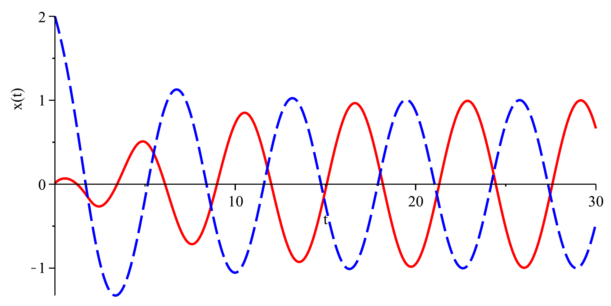
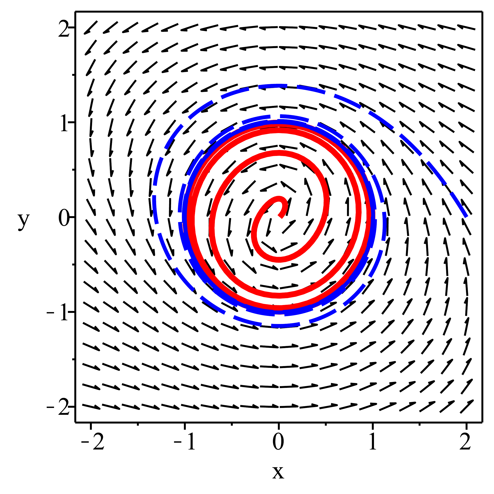

Limit cycle
```

The `maple` fragment used to create {numref}`fig:cont2d:limit:phase` is presented below.

````{admonition} Maple
:class: maple

```{code-block} maple
restart; with(LinearAlgebra): with(DEtools):
f := (x,y) -> -y + x/(4*sqrt(x^2+y^2)) * (1-x^2-y^2);
g := (x,y) ->  x + x/(4*sqrt(x^2+y^2)) * (1-x^2-y^2);
DE1 := diff(x(t),t) = f(x(t), y(t)):
DE2 := diff(y(t),t) = g(x(t), y(t)):
DE := DE1, DE2;
ic1 := x(0) = .01, y(0) = 0;
ic2 := x(0) = 2, y(0) = 0;
tstart:=0; tend:= 30;
phaseportrait([DE], [x(t), y(t)], t = tstart .. tend, [[ic1],[ic2]],
              stepsize = .1, x = -2 .. 2, y = -2 .. 2,
              color = black, linecolor = [red, green]);

```
````

After a short transient, the two time-series can be seen to display the same periodic motion ({numref}`fig:cont2d:limit:phase`(a)). Hence, the system forgets about its initial conditions, which is typical for all systems which have an attractor, and then remains locked in a periodic cycle. The limit cycle is perhaps even better discernable in the phase space ({numref}`fig:cont2d:limit:phase`(b)). The trajectory starting close to the origin (red solid line) can be seen to spiral outward initially as it is attracted to the limit cycle. The trajectory starting far from the the origin (blue dashed line) spirals inward and is rapidly attracted to the limit cycle.

In this particular case, the system ({eq}`eq:cont2d:limit_x`)  becomes much simpler when changing to polar coordinates (see Appendix {numref}`app:polars`):

$$
\begin{aligned}
\dot{r} &= \frac{1-r^2}{4} \\
 \dot{\theta} &= 1
\end{aligned}
$$

The point $r^* = 1$ is a stable fixed point of this system. Hence, the system will spiral outward when $r(t=0)<1$ and inward for $r(t=0)>1$. As the phase angle $\theta$ increases continuously, we conclude we have identified a limit cycle.

````{admonition} Example
:class: example

The *van der Pol* equation is a prototype system for self-excited oscillations given by

```{math}
:label: eq:cont2d:vdpol
\ddot{x} + x = \mu (1- x^2) \dot{x}
```

where the parameter $\mu>0$. This equation was developed by Balthasar van der Pol in 1920 and describes the behavior of a triode circuit. The equations are those of an oscillator $\ddot{x} + k \dot{x} + x = 0$ with damping coefficient $k=-\mu (1-x^2)$. Hence, for $|x|<1$ the damping will be *negative* and we expect the system to be repelled from the origin in an unstable spiral. For $|x|>1$ the damping will be positive and we expect a damped oscillation.

By introducing $y = \dot{x}$, {eq}`eq:cont2d:vdpol` can be written as

$$
\begin{aligned}
\dot{x} &= y \\
 \dot{y} &= -x + \mu (1-x^2) y
\end{aligned}
$$

```{figure} _static/cont2d/cont2d_vdPol_phase.png
:name: fig:cont2d:vdpol
:width: 60mm

van der Pol equation, $\mu=1$.
```

{numref}`fig:cont2d:vdpol` shows the phase portrait of the van der Pol equation for $\mu=1$. One trajectory has initial conditions close to the origin and the other far away from it. Both trajectories are rapidly attracted to the limit cycle.

Note that it is impossible with our fixed point analysis to investigate the stability of the limit cycle because of its nonlocality. However, the fixed point at the origin does provide some information, albeit incomplete. The eigenvalues of the Jacobian at the $(0,0)$ are

$$
\sigma_{1,2} = \frac{1}{2} (\mu \pm \sqrt{\mu^2 - 4})
$$

which indicates that the fixed point is an unstable spiral for $0 < \mu < 2$. Hence, the origin is a repellor which an indication for the possible existence of a limit cycle (see also sections {numref}`sec:cont2d:nolimits` and {numref}`sec:cont2d:nochaos`). For $\mu > 2$ the fixed point becomes an unstable saddle.

The van der Pol equation is a *Liénard system*, which is a class of dynamical systems which have a stable limit cycle surrounding the origin of the phase space. See [Strogatz1994, Verhulst1996] for more information.
````

(sec:cont2d:nolimits)=
## Ruling out limit cycles - Lyapunov functions

Because limit cycles are not confined to a single point in the phase space, local techniques such as linear stability analysis cannot be used to prove their existence of determine their stability. Unfortunately, there are no general methods to prove the existence of limit cycles. However, there are methods that are able to confirm whether or not limit cycles exist for specific classes of systems.

Conservative systems cannot have limit cycles. All point within a limit cycle's basin of attraction will end up on the limit cycle eventually. For a conservative system this means that $H$ is constant within the basin of attraction. However, because the motion is dependent on gradients in $H$, cf. ({eq}`eq:cont2d:constant_f`) we conclude that the basin of attraction cannot occupy any area and needs to be constrained to a line or point[^fn4].

Gradient systems cannot have limit cycles because $dV/dt\le0$ for all initial conditions. Hence, after a sufficiently long time, the system is either in a fixed point (if $V$ is single-valued) or may be on a non-attracting closed orbit (if $V$ is multi-valued).

A *Lyapunov function* is similar to a potential functions of gradient systems, but are more widely applicable because the restrictions on $V$ are much weaker. They are particularly useful to rule out the existence of limit cycles, but can also be used to demonstrate the stability of fixed points.

A Lyapunov function $V$ for a dynamical system is each function that satisfies the properties

- $V(\mathbf{x}^*) = 0$ and $V(\mathbf{x}) > 0$ for almost all other $\mathbf{x}$;
- $dV/dt<0$ for almost all $\mathbf{x}$.

Gradient system satisfies these requirements (see section {numref}`sec:cont2d:gradient`), as long as he potential function $V$ is single-valued and $V(\mathbf{x})>0$ for all values of $\mathbf{x}$ except the fixed point (i.e. the trajectories cannot escape to infinity). However, Lyapunov functions are applicable to a much wider range of problems because it does not have the constraint that the dynamics are governed by $V$, unlike gradient systems,

There is no general way of obtaining Lyapunov functions, and consequently they are often obtained by trying informed guesses, such as

- $V(\mathbf{x}) = || \mathbf{x} ||^2$
- $V(\mathbf{x}) = a x^2 + b y^2$

When considering mechanical systems, a natural candidate for a Lyapunov function is the total energy in the system. For example, the governing equations for a spring-mass system including a quadratic damping term with friction coefficient $\mu$ are

$$
\begin{aligned}
\dot{x} &= y \\
 \dot{y} &= -\frac{k}{m} x - \frac{\mu}{m} |y| y
\end{aligned}
$$

where $x$ is the displacement, $y$ the velocity, $k$ is the spring coefficient and $m$ is the mass. The total energy per unit mass in this system is $\frac{1}{2} \frac{k}{m} x^2 + \frac{1}{2} y^2$. Let us consider whether $V=\frac{1}{2} \frac{k}{m} x^2 + \frac{1}{2} y^2$ is a suitable Lyapunov function. First, $V(\mathbf{x}^*)=0$ which is easily shown since the only stable fixed point is $(0,0)$. Furthermore $V(\mathbf{x}) > 0$ for all $\mathbf{x} \ne \mathbf{x}^*$. Lastly,

$$
\frac{dV}{dt} = \mathbf{f} \cdot \nabla V = y \frac{k}{m} x + \left(-\frac{k}{m} x - \frac{\mu}{m} |y| y \right) y = -\frac{\mu}{m} |y| y^2
$$

which is $\le 0$ everywhere and therefore, $V$ is a Lyapunov function.

Based on the fact that this system has a Lyapunov function, we conclude that no limit cycles exist. Furthermore, we conclude that $\mathbf{x}^*=0$ is a stable node.

(sec:cont2d:nochaos)=
### Is chaos possible in 2-D systems?

The short answer to this question is no. There are two types of long-term behaviour in 2-D systems:

- a fixed point;
- a closed orbit (either limit cycle or non-attracting).

The fact that no chaos can occur in 2-D systems follows from the *Poincaré-Bendixson* theorem, which can be used to prove the existence of limit cycles. The theorem considers at a part of the phase space $\Omega$ which does not contain fixed points but does contain at least one trajectory which is confined within $\Omega$. If this is the case, then this trajectory is a *closed* orbit, because it is impossible for trajectories to cross (this would indicate that the solutions were not unique, because one point in the phase space then has multiple values for $\mathbf{f}$).

The theorem in itself is not very practical because it is nontrivial to prove that trajectories remain within $\Omega$. However, as the theorem proves that the only attractor which occupies a region in the phase space is a limit cycle, it automatically rules out chaos (more formally: no strange attractor can exist in 2-D, see section XXX).

We emphasize that this result is only valid for planar continuous 2-D systems. Indeed, chaos is possible in discrete systems with only one degree of freedom, and if the phase space is a torus, non-periodic motion is possible.

## Bifurcations in 2-D systems

As discussed in the previous chapter, bifurcations in 2-D are changes in the behaviour of a dynamical system upon variation of the control parameter $\mu$. More specifically, bifurcations occur when fixed points come into existence, when fixed points and/or limit cycles collide or when the stability of a fixed point changes.

The bifurcations identified in the previous chapter can all occur in 2-D as well. These bifurcations are discussed in section {numref}`sec:cont2d:bif_familiar`, and we will see that these are all associated with strictly real eigenvalues. A new bifurcation in 2-D is the Hopf-bifurcation ({numref}`sec:cont2d:bif_hopf`), which is associated with imaginary eigenvalues. When limit cycles come into existence, or collide with fixed points, global bifurcations can occur ({numref}`sec:cont2d:bif_global`).

(sec:cont2d:bif_familiar)=
### Familiar bifurcations

The bifurcations which also exist in 1-D all share the property that the eigenvalues are *strictly real*.

### Saddle-node bifurcation

The normal form of the saddle-node bifurcation is

$$
\begin{aligned}
\dot{x} &= \mu - x^2 \\
\dot{y} &= - y
\end{aligned}
$$

The characteristic feature of this bifurcation is that for $\mu<0$ there are no fixed points, whilst two fixed points $x^*=-\sqrt{\mu}$ and $x^*=\sqrt{\mu}$ exist for $\mu>0$. The Jacobian matrix is given by

$$
J(x, y) = \left( \begin{array}{cc} -2 x & 0 \\ 0 & -1 \end{array} \right)
$$

and since $J(x,y)$ is in diagonal form, the eigenvalues are $\sigma_1 = -2 x$ and $\sigma_2 = -1$. The character of the two fixed points are summarised in the table below.

```{list-table}
:header-rows: 0
:class: noheader

* - fixed point
  - $\sigma_1$
  - $\sigma_2$
  - $\mu<0$
  - $\mu>0$
* - $x^*=-\sqrt{\mu}, \, y^*=0$
  - $-2 \sqrt{\mu}$
  - -1
  - non-existent
  - stable node
* - $x^*= \sqrt{\mu}, \, y^*=0$
  - $2 \sqrt{\mu}$
  - -1
  - non-existent
  - saddle
```

### Transcritical bifurcation

The normal form of the transcritical bifurcation is

$$
\begin{aligned}
\dot{x} &= \mu x - x^2 \\
\dot{y} &= - y
\end{aligned}
$$

The characteristic feature of this bifurcation is there are two fixed points which exchange their stability property at $\mu=0$. The two fixed points are $x^*=0$ and $x^*=\mu$ and the Jacobian matrix is given by

$$
J(x, y) = \left( \begin{array}{cc} \mu - 2 x & 0 \\ 0 & -1 \end{array} \right)
$$

and the eigenvalues are $\sigma_1 = \mu - 2 x$ and $\sigma_2 = -1$. The character of the two fixed points are summarised in the table below.

```{list-table}
:header-rows: 0
:class: noheader

* - fixed point
  - $\sigma_1$
  - $\sigma_2$
  - $\mu<0$
  - $\mu>0$
* - $x^*=0, \, y^*=0$
  - $\mu$
  - -1
  - stable node
  - saddle
* - $x^*=\mu, \, y^*=0$
  - $- \mu$
  - -1
  - saddle
  - stable node
```

### Supercritical pitchfork bifurcation

The normal form of the supercritical pitchfork bifurcation is

$$
\begin{aligned}
\dot{x} &= \mu x - x^3 \\
\dot{y} &= - y
\end{aligned}
$$

The characteristic feature of this bifurcation that there exists one stable fixed point for $\mu<0$ which becomes unstable for $\mu>0$, and two further stable fixed points which come into existence for $\mu > 0$. The three fixed points are $x^*=0$, $x^*=\sqrt{\mu}$ and $-\sqrt{\mu}$ and the Jacobian matrix is given by

$$
J(x, y) = \left( \begin{array}{cc} \mu - 3 x^2 & 0 \\ 0 & -1 \end{array} \right)
$$

and the eigenvalues are $\sigma_1 = \mu - 3 x^2$ and $\sigma_2 = -1$. The character of the three fixed points are summarised in the table below.

```{list-table}
:header-rows: 0
:class: noheader

* - fixed point
  - $\sigma_1$
  - $\sigma_2$
  - $\mu<0$
  - $\mu>0$
* - $x^*=0, \, y^*=0$
  - $\mu$
  - -1
  - stable node
  - saddle
* - $x^*=-\sqrt{\mu}, \, y^*=0$
  - $- 2 \mu$
  - -1
  - non-existent
  - stable node
* - $x^*=\sqrt{\mu}, \, y^*=0$
  - $- 2 \mu$
  - -1
  - non-existent
  - stable node
```

### Subcritical pitchfork bifurcation

The normal form of the transcritical bifurcation is very similar to the supercritical version, except for the sign of the cubic:

$$
\begin{aligned}
\dot{x} &= \mu x + x^3 \\
\dot{y} &= - y
\end{aligned}
$$

The characteristic feature of this bifurcation that there are two stable and one unstable fixed point for $\mu<0$ and one unstable fixed point for $\mu>0$. As for the supercritical pitchfork bifurcation, the three fixed points are $x^*=0$, $x^*=i \sqrt{\mu}$ and $-i \sqrt{\mu}$ and the Jacobian is given by

$$
J(x, y) = \left( \begin{array}{cc} \mu + 3 x^2 & 0 \\ 0 & -1 \end{array} \right)
$$

and the eigenvalues are $\sigma_1 = \mu + 3 x^2$ and $\sigma_2 = -1$. The character of the three fixed points are summarised in the table below.

```{list-table}
:header-rows: 0
:class: noheader

* - fixed point
  - $\sigma_1$
  - $\sigma_2$
  - $\mu<0$
  - $\mu>0$
* - $x^*=0, \, y^*=0$
  - $\mu$
  - -1
  - stable node
  - saddle
* - $x^*=-i \sqrt{\mu}, \, y^*=0$
  - $- 2 \mu$
  - -1
  - saddle
  - non-existent
* - $x^*= i \sqrt{\mu}, \, y^*=0$
  - $- 2 \mu$
  - -1
  - saddle
  - non-existent
```

The “proper” way of analysing bifurcations is by reduction to normal forms, as was done for 1-D systems in section XXX. However, the mathematics become quite complex and are beyond the scope of this book. Please see [Crawford1991, Verhulst1996] for more information.

We will avoid some of the mathematical complexity by making use of `maple`'s versatility. In particular, by plotting the behaviour of the fixed points and the the eigenvalues as a function of the control parameter $\mu$, it is possible to determine for which $\mu$ bifurcations occur and to identify their type.

````{admonition} Example
:class: example

Consider the system

```{math}
:label: eq:cont2d:pitchfork:x
\begin{aligned}
\dot{x} = (\mu-2 ) x + y + \sin(x) \\
\dot{y} = x - y
\end{aligned}
```

We are interested in the behaviour of the fixed points in this system as a function of the parameter $\mu$. By implementing the system in `maple` and using `phaseportrait` to visualise the system behavior for various values of $\mu$, it becomes clear that there is a bifurcation at $\mu=0$ ({numref}`fig:cont2d:pitchfork`(a, b)).

To explore this in more detail, we would like to plot the fixed points ($x^*, y^*$) as a function of $\mu$. Although it is in principle possible `implicitplot3d` to plot the roots of the above equation, note that the nullcline for $\dot{y}=0$ is the diagonal $y = x$. Therefore, the governing equation for $x^*$ is

$$
(\mu-1 ) x^* + \sin(x^*) = 0
$$

This equation is not invertible, but can straightforwardly visualised using `implicitplot`. The fixed point $x^*=0$ is a solution for all $\mu$ and the eigenvalues of $J(0,0)$ are

$$
\sigma_{1, 2} := -1 + \frac{1}{2} \mu \pm \frac{1}{2} \left( 4 + \mu^2 \right)
$$

The single fixed point $(0,0)$ for $\mu<0$ can be seen to bifurcate into three fixed points at $\mu=0$ ({numref}`fig:cont2d:pitchfork`(c)). Judging from the eigenvalues of the Jacobian ({numref}`fig:cont2d:pitchfork`(d)), the fixed point changes from a stable node to a saddle node at $\mu=0$. Hence, a *supercritical pitchfork bifurcation* occurs at $\mu=0$. The `maple` code to generate these plots is given below.

```{code-block} maple
restart; with(plots): with(LinearAlgebra):
f := (x,y) -> (mu-2) * x + y + sin(x);
g := (x,y) -> x - y;
implicitplot(subs(y=x, f(x,y)), mu=-1..2, x=-10..10, gridrefine=4,
             color=black, thickness=2,
             labeldirections=[horizontal, vertical]);
jac := VectorCalculus[Jacobian]([f(x,y), g(x,y)], [x, y]);
ev := Eigenvalues(subs(x=0, jac), output='list');
plot([Re(ev[1]), Re(ev[2])], mu = -1..2, thickness=2,
     labels=['mu', "Re( sigma )"], legend=['sigma[1]', 'sigma[2]'],
     color = black, linestyle=[solid, dash],
     labeldirections=[horizontal, vertical]);

```

```{subfigure} 2
:name: fig:cont2d:pitchfork
:align: center
:subcaptions: below

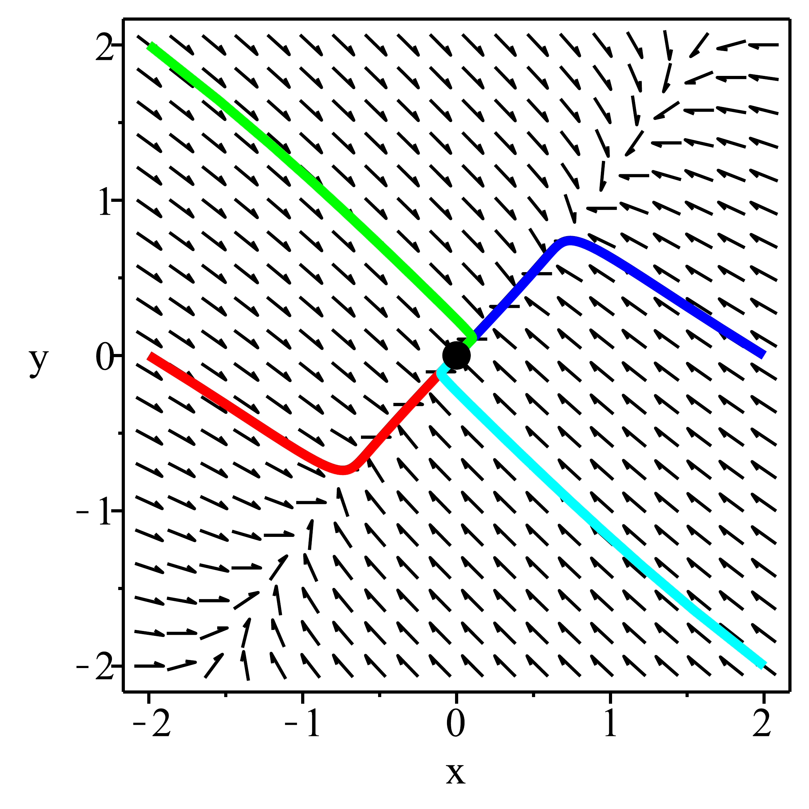
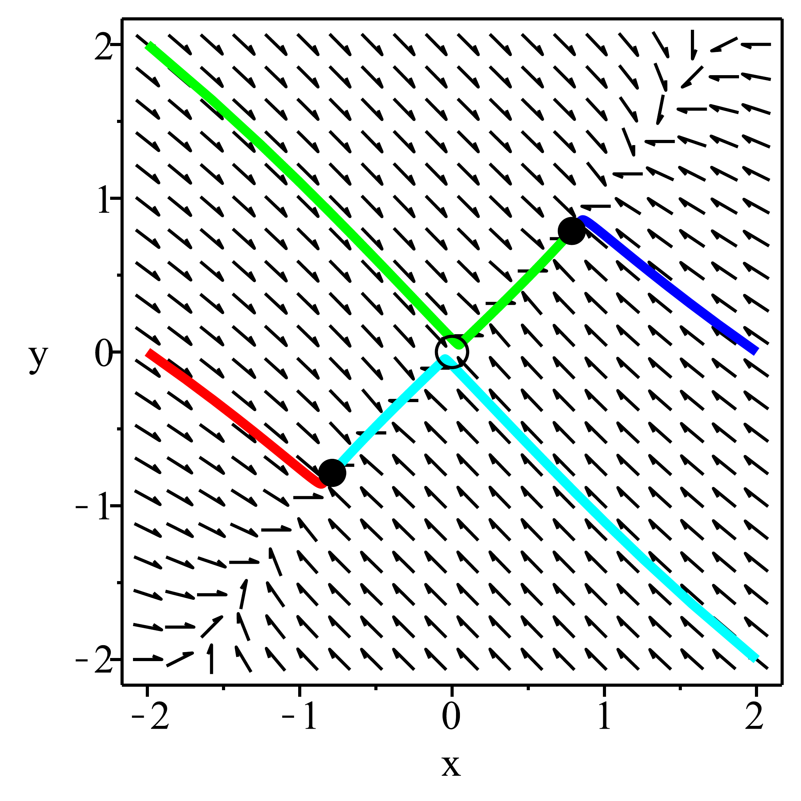
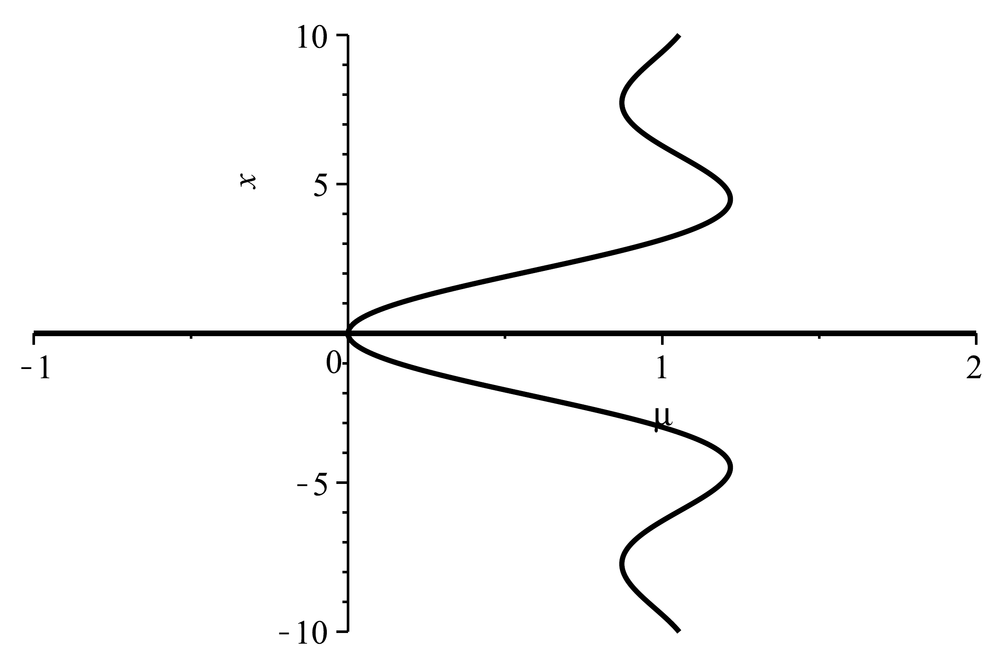
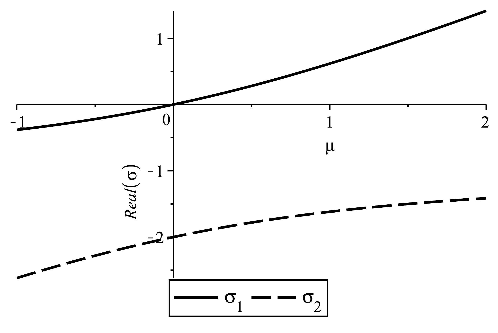

Supercritical pitchfork bifurcation for the system ({eq}`eq:cont2d:pitchfork:x`). (a, b) phase portraits for $\mu=-0.1$ and $\mu=0.1$; c) $x^*$ as a function of $\mu$; d) the eigenvalues (which are purely real in this case) for the fixed point $(0,0)$. (a) $\mu=-0.1$. (b) $\mu=0.1$.
```
````

(sec:cont2d:bif_hopf)=
### Hopf bifurcations

A new bifurcation in 2-D is the *Hopf bifurcation*. This bifurcation involves the transition from a stable spiral ($\text{Re}(\sigma) < 0)$ to an unstable spiral $(\text{Re}(\sigma) > 0)$, and can be linked to the "‘birth of a limit cycle"’.

Consider the system:

```{math}
:label: eq:cont2d:hopf_x
\begin{gathered}
\dot{x} = -y -x(-\mu + x^2 + y^2) \\
 \dot{y} = x -y(-\mu + x^2 + y^2)
\end{gathered}
```

We would like to know whether or not the system has a limit cycle, and if so for which values of $\mu$. The only fixed point of this system is $(0, 0)$, and its Jacobian is given by

$$
J(0,0) = \left[ \begin{array}{cc} -\mu & -1 \\ 1 & \mu \end{array} \right]
$$

The eigenvalues of this matrix are $\sigma_{1,2} = \mu \pm i$. As the fixed point changes from a stable to an unstable spiral at $\mu = 0$, we conclude that a Hopf bifurcation is taking place at $\mu=0$. This is confirmed by numerical simulations for $\mu = -0.1$ and $\mu = 0.1$. The transition from a stable to an unstable spiral is clearly discernable from the time series and phase portraits ({numref}`fig:cont2d:hopf`(a, b)). The real and imaginary parts of the eigenvalues are plotted as a function of $\mu$ in Figs {numref}`fig:cont2d:hopf`(c) and {numref}`fig:cont2d:hopf`(d), respectively.

```{subfigure} 2
:name: fig:cont2d:hopf
:align: center
:subcaptions: below

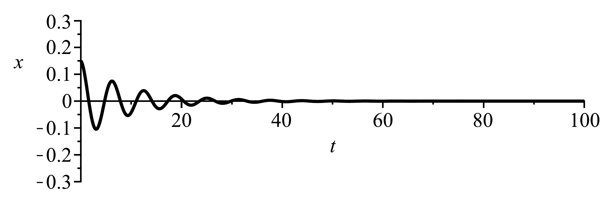
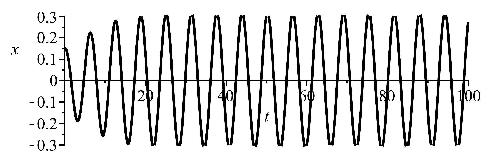
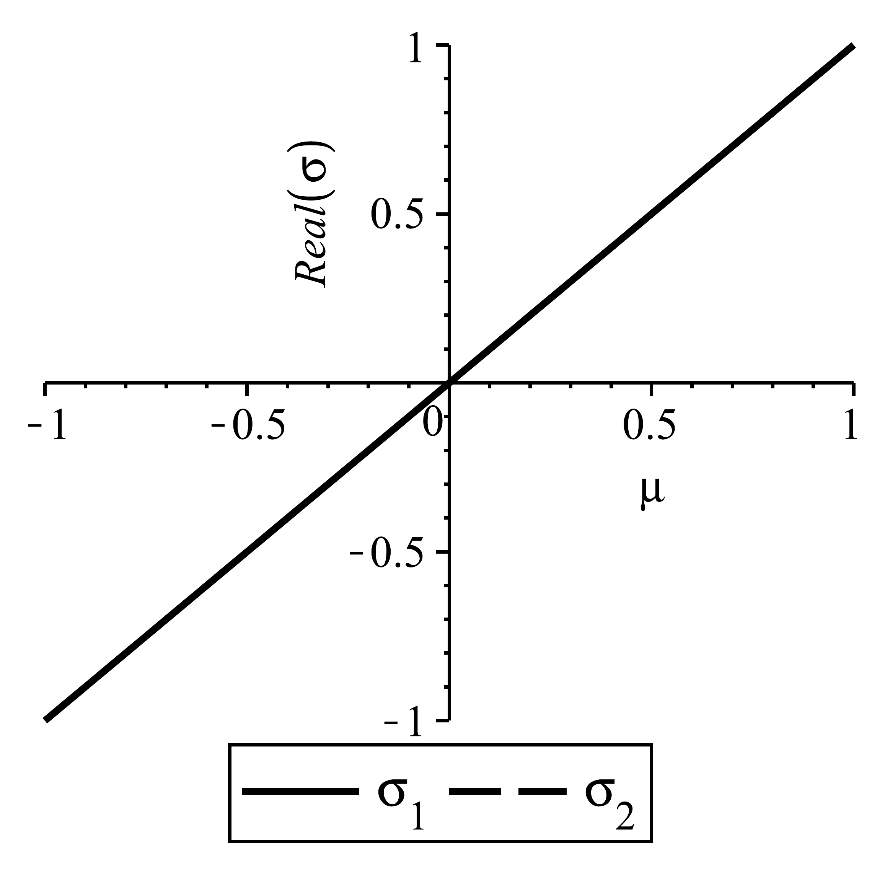
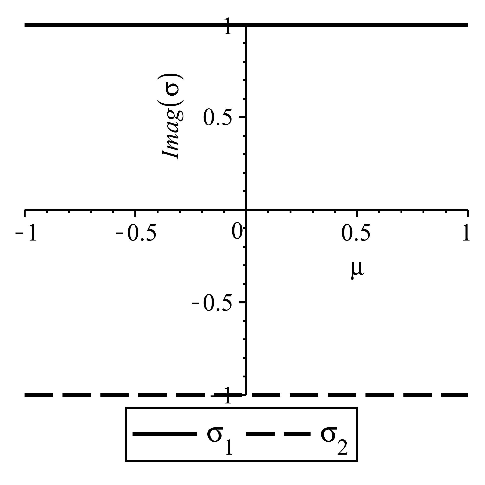

A Hopf bifurcation involves the transition of a fixed point from an stable spiral $(\text{Re}{\sigma_{1,2}}<0)$ to an unstable spiral $(\text{Re}{\sigma_{1,2}}>0)$. (a) $\mu=-0.1$. (b) $\mu=0.1$.
```

For the example under consideration, it can be proved that a limit cycle exists. Expressed in polar coordinates (see Appendix {numref}`app:polars`), the system ({eq}`eq:cont2d:hopf_x`) becomes:

$$
\begin{aligned}
\dot{r} &= \mu r - r^3 \\
 \dot{\theta} &= 1
\end{aligned}
$$

Hence, the phase angle increases linearly, and the equation for $\dot{r}$ has the normal form of a *supercritical pitchfork bifurcation*. Consequently, we know that the fixed point $r^*=0$ is stable for $\mu < 0$ and unstable for $\mu>0$. Furthermore, a stable fixed point $r^* = \sqrt{\mu}$ exists for $\mu > 0$, which shows that a limit cycle exists for this system.

We conclude this section with some bifurcation jargon for Hopf bifurcations. When a bifurcation take place which involves  a transition from a stable spiral to a limit cycle, it is called a *supercritical* Hopf bifurcation. However, it is also possible that the spiral simply becomes unstable without the development of a limit cycle. In this case, the system *loses* a fixed point, and all trajectories within the basin of attraction will suddenly display entirely different behaviour. This is not dissimilar to the the catastrophe in the ferromagnetic system discussed in the previous chapter. If the Hopf bifurcation does not generate a limit cycle, the bifurcation is called *subcritical*. One also distinguishes a *degenerate* Hopf-bifurcation, which usually occurs when a nonconservative system becomes conservative at the bifurcation parameter.

(sec:cont2d:bif_global)=
### Global bifurcations

Global bifurcations are bifurcations that are not confined to a local point in the phase space - hence the word global. Global bifurcations can involve the birth of limit cycles, collisions of limit cycles with fixed points or collisions between limit cycles.

Consider the system

$$
\begin{gathered}
\dot{x} = -y + x(\mu + x^2 + y^2 - (x^2+y^2)^2) \\
 \dot{y} = x + y(\mu + x^2 + y^2 - (x^2+y^2)^2)
\end{gathered}
$$

which has a limit cycle which comes into existence at $\mu=-1/4$. Shown in {numref}`fig:cont2d:global`(a, b) are two phase portraits for a trajectory starting close to the origin. At $\mu=-0.26$, the system can be seen to spiral outwards and eventually escape to infinity. For $\mu = -0.24$ however, the trajectory spirals outward and becomes trapped in the limit cycle. Because this bifurcation involves a change in topology of a finite region of the phase space, the bifurcation is global.

This system is much easier to understand when expressed in polar coordinates (which was of course how it was conceived):

$$
\begin{aligned}
\dot{r} &= - \mu r - r^3 + r^5 \\
 \dot{\theta} &= 1
\end{aligned}
$$

The equation for the phase angle $\theta$ has solution $\theta = \theta(0) + t$. The right hand side of the equation for $\dot{r}$ is plotted in {numref}`fig:cont2d:global`(c) for three different values of $r$. Clearly, when $\mu<-1/4$, $\dot{r}>0$ for all nonzero $r$ and the trajectory will escape to infinity. At $\mu=-1/4$, the function attains a new root in the neigbourhood of $r=0.7$. This develops into two roots for $\mu>-1/4$.

The fixed points are plotted as a function $\mu$ with the help of the function `implicitplot` ({numref}`fig:cont2d:global`(d)), using the code discussed in section XXX to distinguish between the stable branches (black) and the unstable branches (grey). In this plot it is very clear that two new fixed points, one stable and one unstable, come into existence at $\mu=-0,25$ via a saddle-node bifurcation. As discussed in section XXX, this bifurcation is referred to as a blue-sky bifurcation. It can therefore be said that this system features a “blue sky limit cycle”.

```{subfigure} 2
:name: fig:cont2d:global
:align: center
:subcaptions: below

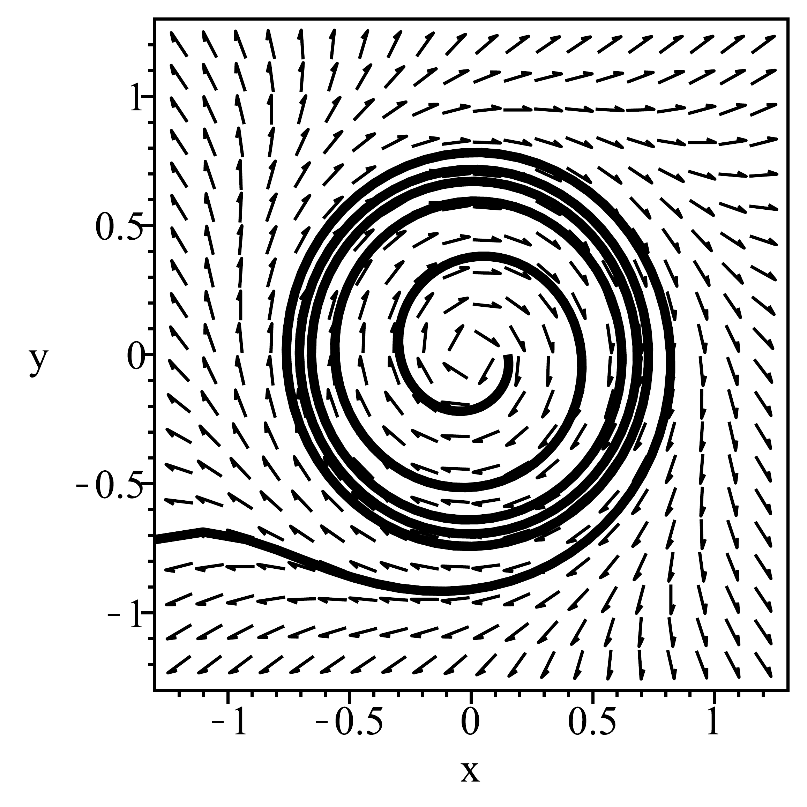
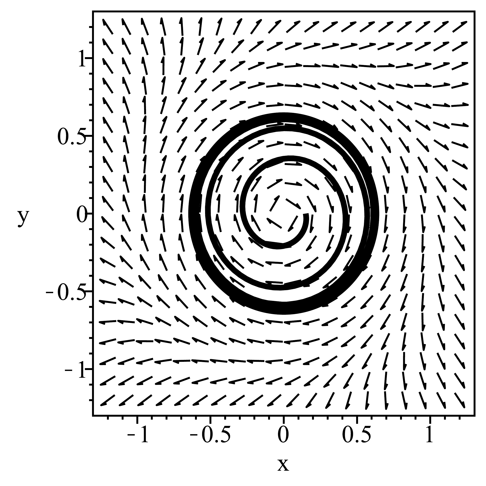
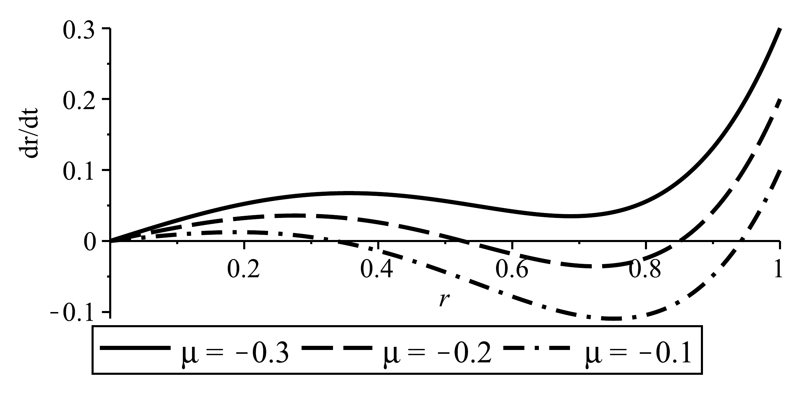
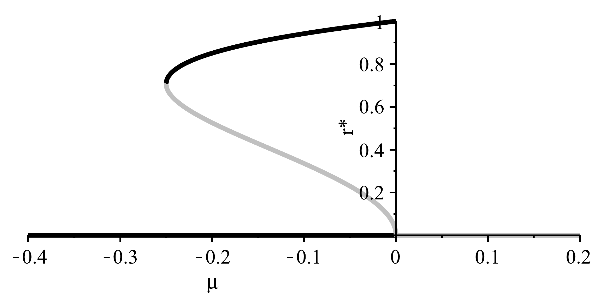

A blue sky limit cycle. (a, b) The phase portraits just before and after the bifurcation. (c) $dr/dt$ as a function of $r$. (d) stability diagram of the fixed points. (a) $\mu=-0.26$. (b) $\mu=-0.24$.
```

When comparing the phase portraits just before the bifurcation ({numref}`fig:cont2d:global`(a)) and after ({numref}`fig:cont2d:global`(b)), it is very clear that even though the bifurcation has not occured yet at $\mu=-0.26$, the signature of a limit cycle is clearly visible. Indeed, the system nearly gets trapped and takes a long time to escape the vicinity of the limit cycle-to-be. This behaviour is typical for bifurcations. By necessity $f'(r)=0$ at bifurcation, and $dr/dt$ will therefore become extremely small when $\mu$ is close to the bifurcation value.

[^fn1]: Note that for a linear system, $J(x,y) = A = \textnormal{constant}$.
[^fn2]: {eq}`eq:cont2d:constant2` has exactly the same form the equation for mass conservation in a compressible fluid, where $\rho$ represents the fluid density of the fluid and $\mathbf{f}$ the velocity.
[^fn3]: Assume that a closed orbit exists for which $\mathbf{x}(t+T) = \mathbf{x}(t)$ (periodic motion). If $V$ is single-valued, this implies that $\int_0^T \frac{dV}{dt} dt = 0$. Substituting $ds = | \dot{\mathbf{x}} | dt$ and $\frac{dV}{d t} = \nabla V \cdot \dot{\mathbf{x}} = - \dot{\mathbf{x}} \cdot \dot{\mathbf{x}}$, we obtain that $\oint | \dot{\mathbf{x}} | ds = 0$. This can only occur when $|\dot{\mathbf{x}}|=0$ for each point on the orbit. In this case, the entire “orbit” is a fixed “point” (e.g. $V(r) = 1 - r^2+ r^3$). We therefore conclude that closed orbits cannot exist when $V$ is single-valued.
[^fn4]: A more rigorous argument can be made using the property $\nabla \cdot \rho \mathbf{f} = 0$.

```{include} _includes/cont2d_exercises.md
```
