(chap:cont3d)=
# Chaos in continuous systems

(sec:cont3d:strangeattractor)=
## Strange attractors

The methods discussed in the previous chapter, such as the concept of phase space and the calculation of fixed points and their stability, are generally applicable to systems of arbitrary order that are of the form

```{math}
:label: eq:cont3d:system
\dot{\mathbf{x}} = \mathbf{f}(\mathbf{x}),
```

For 3-D continuous systems we will adopt the notation $\mathbf{x} = (x, y, z)^T$ and $\mathbf{f} = (f, g, h)^T)$. One important distinction between second-order continuous systems and higher-order systems is that the former cannot feature chaotic behavior, as it is topologically impossible for trajectories to cross in phase-space (Poincaré Bendixson theorem). Chaotic behaviour is possible for continuous systems of third order and higher.

As an example, let us return our attention to the celebrated Lorenz equations introduced in chapter {numref}`chap:endstart`, which are given by

```{math}
:label: eq:cont3d:lorenzx
\begin{aligned}
\dot{x} &= \sigma (y-x), \\
\dot{y} &= r x - y - x z, \\
\dot{z} &= x y - b z.
\end{aligned}
```

{numref}`fig:cont3d:lorenzxtime` gives an impression of the aperiodic behavior of $x$ for the Lorenz equations {eq}`eq:cont3d:lorenzx` with $r=28$, $b=8/3$ and $\sigma=10$. The signal flips between positive and negative values, the duration between these reversals different each time. Between reversals, the signal oscillates around a reference value, its amplitude growing with each cycle it completes. When some critical value is exceeded, the signal changes sign, after which the process repeats itself, at least qualitatively.

```{figure} _static/cont3d/cont3d_lorenz_time.png
:name: fig:cont3d:lorenzxtime
:width: 100mm

A typical timeseries of $x$ showing typical aperiodic behavior.
```

When all three variables $x(t)$, $y(t)$ and $z(t)$ are plotted in the phase space ({numref}`fig:cont3d:lorenzattractor`(a)) we get an impression of the *strange attractor* of the Lorenz equations. As for a regular attractor (such as a fixed point), the trajectory is caught in a region of the phase space. But in this case, the trajectory meanders erratically back and forth between the two lobes of the attractor. Starting from the center of the right lobe, a trajectory circles outward counterclockwise (from our frame of reference). When it is sufficiently far from the center, it 'falls' onto the other lobe, where it circles outward again, but clockwise. Then, it falls onto the first lobe again but on a different position as before. The trajectory circles outward again, and so on *ad infinitum*.

Trajectories starting far away ({numref}`fig:cont3d:lorenzattractor`(b)) can be seen to converge upon the strange attractor.

```{subfigure} 2
:name: fig:cont3d:lorenzattractor
:align: center
:subcaptions: below

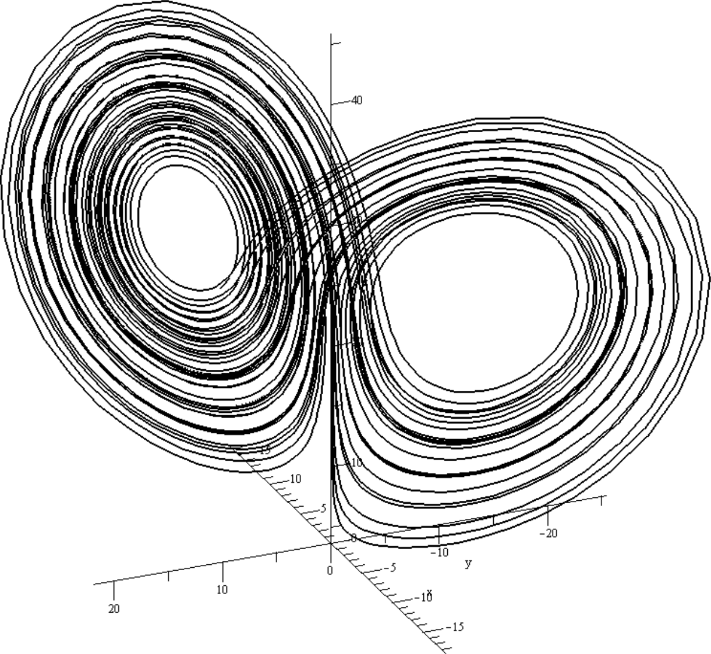
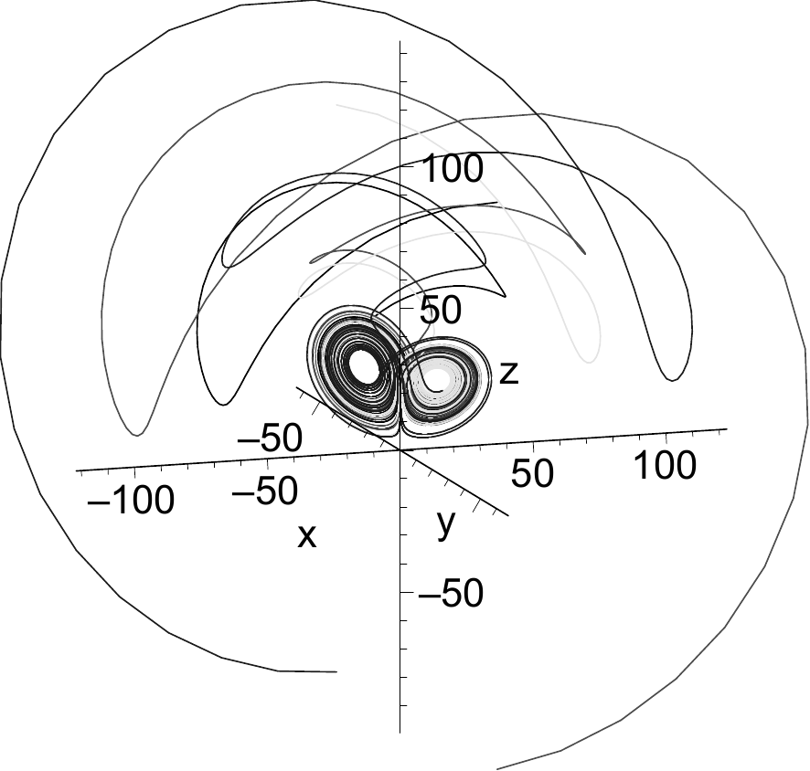

The strange attractor of the Lorenz equations. (a) single trajectory $\mathbf{x}(t)$. (b) All trajectories in the basin of attraction end up on the strange attractor.
```

It is time to put the term "strange attractor" on a firmer footing. The formal definition of a strange attractor is quite subtle {cite:p}`Guckenheimer1983`, and we will be satisfied with the following operational definition. The phase space region $A$ is an *attractor* $A$ for the system $\dot{\mathbf{x}} = \mathbf{f}(\mathbf{x})$ if

- $A$ is invariant under $\mathbf{f}$: any trajectory $\mathbf{x}(t)$ that starts
in $A$ cannot escape from $A$ for all times.
- There is a region $B$, of which $A$ is a subset, for which
trajectories $\mathbf{x}(t)$ starting in $B$ are attracted to $A$ in the limit of $t\rightarrow \infty$. This region $B$ is the *basin of attraction* of the attractor $A$.
- $A$ is minimal: there is no subset of $A$ that satisfies the two
conditions above.

When in addition, the trajectories $\mathbf{x}(t)$ on $A$ exhibit a sensitive dependence of initial conditions, it is called a *strange attractor*. The term "strange" originates from the fact that the geometry of strange attractors are often fractal. The terms chaotic attractor or fractal attractor are used as well.

Let us see if the Lorenz equations match these properties. To establish that there is an attractor, we consider a small volume $V(t)$ in phase space and determine the evolution in time of this volume. In this sense one can think of a collection of initial conditions $\mathbf{x}_k(0)$, $k=1,\ldots \infty$ such that $\forall_k:\, \mathbf{x}_k(0) \in V(0)$, and imagine $V(t)$ as the volume encompassing the positions $\mathbf{x}_k(t)$ at a later stage $t$, i.e. $\forall_k:\, \mathbf{x}_k(t) \in V(t)$. With $\dot{\mathbf{x}}_k = \mathbf{f}(\mathbf{x}_k)$ defining the flow in phase space, one can derive for the evolution of $V$

```{math}
:label: eq:cont3d:vevolution
\begin{aligned}
\dot{V} &= \oint_{S} \mathbf{n} \cdot \mathbf{f} \mathrm{d} S = \int_{V} \nabla \cdot \mathbf{f} \mathrm{d} V
\end{aligned}
```

where the first integral represents a surface integral over the outer surface of $V$, denoted by $S$, and $\mathbf{n}$ the normal vector at the surface. The physical interpretation here is that the change in volume is determined by the normal velocity of the bounding surface. The Gauss divergence theorem was used to obtain the volume integral over the divergence of $\mathbf{f}$:

$$
\nabla \cdot \mathbf{f} =\frac{\partial {f_1}}{\partial {x_1}} + \frac{\partial {f_2}}{\partial {x_2}} + \frac{\partial {f_3}}{\partial {x_3}}.
$$

When $\nabla   \cdot   \mathbf{f}=0$, the system conserves volume and is called *conservative*, the class of Hamiltonian systems (section {numref}`sec:cont2d:conservative`) being prime examples. When $\nabla   \cdot   \mathbf{f} < 0$, the volume reduces as a function of time and the system is called *dissipative*. Dissipative systems have attractors but conservative systems do not. However, that both conservative and dissipative systems may display chaotic behaviour.

For the Lorenz equations, the divergence is given by

$$
\nabla \cdot \mathbf{f} &= \frac{\partial {}}{\partial {x}}(\sigma (y - x)) + \frac{\partial {}}{\partial {y}}(r x - y - xz)
+ \frac{\partial {}}{\partial {z}}(xy - bz) \\ &= -\sigma -1 - b.
$$

As both $\sigma$ and $b$ are positive, the divergence $\nabla \cdot \mathbf{f}<0$ and the system is dissipative. As $\nabla \cdot \mathbf{f}$ does not depend on the position,  the evolution of $V(t)$ can be determined analytically from {eq}`eq:cont3d:vevolution`:

$$
V(t) = V(0) \mathrm{e}^{-(\sigma +1 +b)t }
$$

This equation confirms that all volumes $V(0)$ in the phase space shrink to zero volume: $V(t)\rightarrow 0$. Here we seem to hit a paradox: if everywhere in the phase space the volume tends to zero, then the resulting geometry must have a dimension lower than three (because it has no volume). But it cannot be two-dimensional either because as we have seen in the previous chapter, there can be no chaos in a flow with only two degrees of freedom (IS POINCARE BENDIXSON THEOREM IN C5?). As we will see later, the geometry of the attractor has a fractal dimension, slightly larger than 2, thus yielding an escape from the paradox.

How can one reconcile the shrinking of $V$ to zero on the one hand with the notion of sensitive dependence on initial conditions on the other hand? After all, the latter notion is associated with *diverging* trajectories. This will be investigated numerically, by slightly perturbing a point on the attractor and monitoring the growth of the difference $\mathbf{\delta}$. To get an initial condition which is already *on* the attractor, we start with an arbitrary initial boundary condition and integrate the system for some time $T$. When $T$ is large enough, the trajectory will have converged onto the attractor (see {numref}`fig:cont3d:lorenzattractor`) and we can take $\mathbf{x}(T)$ as the initial condition. In this way the transient phase is disregarded. With this new initial condition we integrate the system once more and obtain a trajectory $\mathbf{x}_1(t)$ which will be on the attractor. We also study the trajectory $\mathbf{x}_2(t)$ starting from an initial condition that is slightly perturbed: $\mathbf{x}_2(0) = \mathbf{x}_1(0) + \boldsymbol{\epsilon}(0)$, where it is understood that $\Vert \boldsymbol{\epsilon}\Vert \ll 1$. In particular we are now interested in the *evolution* of the deviation between the two trajectories, i.e.

```{math}
:label: eq:cont3d:epsdef
\begin{aligned}
\boldsymbol{\epsilon}(t) &= \mathbf{x}_2(t) - \mathbf{x}_1(t) & \delta(t) &= \Vert \boldsymbol{\epsilon}(t)\Vert = \Vert \mathbf{x}_2(t) - \mathbf{x}_1(t)\Vert
\end{aligned}
```

````{admonition} Maple
:class: maple

```{code-block} maple
* Define DE, simulate to remove transients, define ic1
...

* Calculate delta
sol_arr := dsolve({DE,ic1},[x(t),y(t),z(t)],type=numeric,maxfun=-1,output=timesteps):
soldd:=sol_arr[2,1];
T1 := soldd[1..N, 1]: X1 := soldd[1..N, 2]:
Y1 := soldd[1..N, 3]: Z1 := soldd[1..N, 4]:

epsilon := 1e-7;
ic2 := (x(0)=xx[N]+epsilon,y(0)=yy[N],z(0)=zz[N]);
sol_arr := dsolve({DE,ic2},[x(t),y(t),z(t)],type=numeric,maxfun=-1,output=timesteps):
soldd:=sol_arr[2,1];
T2 := soldd[1..N, 1]: X2 := soldd[1..N, 2]:
Y2 := soldd[1..N, 3]: Z2 := soldd[1..N, 4]:
delta := seq([T1[i],sqrt((X1[i]-X2[i])^2+(Y1[i]-Y2[i])^2 + (Z1[i]-Z2[i])^2)],i=1..N):
# delta now contains a sequence [t, distance]
```
````

```{figure} _static/cont3d/cont3d_lorenz_lyapunov.png
:name: fig:cont3d:lorenzlyapunov
:width: 100mm

The growth of a small perturbation in the initial values. The effective Lyapunov exponent $\Lambda_e \approx 0.9$.
```

In {numref}`fig:cont3d:lorenzlyapunov` the evolution of the vectorial distance between the trajectories $\delta(t)$ is shown on a logarithmic scale. Similar to the discrete mappings discussed in section {numref}`sec:disc1d:lyapunov_theory`, we observe that on average the trajectories diverge exponentially

```{math}
:label: eq:cont3d:lyap_eff
\delta(t) = \delta(0) \mathrm{e}^{\textstyle \Lambda_e t}
```

with an *effective* Lyapunov exponent $\Lambda_e \simeq 0.9$. As this Lyapunov exponent is positive, there is clearly a sensitive dependence to initial conditions. Note that the distance between the trajectories does not grow monotonically but fluctuates in time. This is because the distance between the trajectories varies along the attractor. At $t=15$, the distance reaches the size of the attractor and cannot grow any more. At this point the trajectories are no longer correlated to each other. Some caution needs to be taken with the effective Lyapunov exponent. First, the Lyapunov exponent can depend on the starting position on the attractor. Second, the Lorenz equations have three degrees of freedom, which means that there are three principle directions and therefore also three Lyapunov exponents.

To see the relation between these three Lyapunov exponents and the effective Lyapunov exponent, we first derive for the evolution of the distance between two trajectories

$$
\begin{aligned} \dot{\boldsymbol{\epsilon}} &= \mathbf{f}(\mathbf{x}_2) - \mathbf{f}(\mathbf{x}_1) = \mathbf{f}(\mathbf{x}_1 + \boldsymbol{\epsilon}) - \mathbf{f}(\mathbf{x}_1) \end{aligned}
$$

Assuming $\Vert\boldsymbol{\epsilon}(t)\Vert \ll 1$ and ignoring higher order terms, one obtains

$$
\begin{aligned} \dot{\boldsymbol{\epsilon}} &= J(\mathbf{x}_1) \boldsymbol{\epsilon} \end{aligned}
$$

where $J$ is the Jacobian matrix

$$
J
= \left(\begin{array}{lll}
\frac{\partial f_1}{\partial x_1} & \frac{\partial f_1}{\partial x_2} & \frac{\partial f_1}{\partial x_3} \\
\frac{\partial f_2}{\partial x_1} & \frac{\partial f_2}{\partial x_2} & \frac{\partial f_2}{\partial x_3} \\
\frac{\partial f_3}{\partial x_1} & \frac{\partial f_3}{\partial x_2} & \frac{\partial f_3}{\partial x_3} \\
\end{array}\right)
$$

Since $\delta^2 = \boldsymbol{\epsilon} \cdot \boldsymbol{\epsilon}$, we have

$$
\begin{aligned} \frac{1}{2} \frac{\mathrm{d} \delta^2}{\mathrm{d} t} = \delta \dot{\delta} &= \boldsymbol{\epsilon} \cdot \dot{\boldsymbol{\epsilon}} = \boldsymbol{\epsilon} \cdot J(\mathbf{x}_1) \boldsymbol{\epsilon} = \boldsymbol{\epsilon} \cdot J_{\text{S}}(\mathbf{x}_1) \boldsymbol{\epsilon} \end{aligned}
$$

In the last step, we used that only the symmetric part of the Jacobian $J_{\text{S}}=  [J + J^{\top}]/2$ contributes to the quadratic form. Using {eq}`eq:cont3d:lyap_eff` one can get an instantaneous expression the effective Lyapunov exponent from $\Lambda_e = \dot{\delta}/\delta$, which can be expressed using the equation above in terms of $\boldsymbol{\epsilon}$:

```{math}
:label: eq:cont3d:lyap_instant
\begin{aligned}
\Lambda_e(t) &= \frac{\boldsymbol{\epsilon} \cdot J_{\text{S}} \boldsymbol{\epsilon}}{\boldsymbol{\epsilon} \cdot \boldsymbol{\epsilon}}
\end{aligned}
```

So if one has the complete data of the trajectories $\mathbf{x}_1(t)$, $\mathbf{x}_2(t)$, at any $t$ one can calculate $\boldsymbol{\epsilon}(t) = \mathbf{x}_2(t)-\mathbf{x}_1(t)$ and $J_{\text{S}}(\mathbf{x}_1(t))$, and therefore $\Lambda_e(t)$ using {eq}`eq:cont3d:lyap_instant`. A plot of $\Lambda_e(t)$ derived in this way for the Lorenz system is shown in {numref}`fig:cont3d:lorenzlyapt`. A time average of these data  points gives $\Lambda_e \simeq 0.9$, consistent with the estimate from $\delta(t)$ in {numref}`fig:cont3d:lorenzlyapunov`

```{figure} _static/cont3d/cont3d_LorenzLyapEffective.png
:name: fig:cont3d:lorenzlyapt
:width: 100%

Instantaneous (effective) Lyapunov exponent $\Lambda_e$ determined for the Lorenz system from {eq}`eq:cont3d:lyap_instant`.
```

{eq}`eq:cont3d:lyap_instant` also provides the link between $\Lambda_e$ and the three Lyapunov exponents that are present in the system. Indeed, if $\boldsymbol{\epsilon}$ is exactly aligned with one of the eigenvectors of $J_{\text{S}}$, say $\mathbf{e}_1$, than $\Lambda_e = \Lambda_1$, where $\Lambda_1$ is the corresponding eigenvalue of $J_{\text{S}}$. The same holds for the other eigenvectors. So first we note that we can associate the Lyapunov exponents with the eigenvalues $J_{\text{S}}$; secondly, if we arrange $\Lambda_1 \leq \Lambda_2 \leq \Lambda_3$ we note from {eq}`eq:cont3d:lyap_instant` that

$$
\Lambda_1 \leq \Lambda_e \leq \Lambda_3
$$

i.e. the effective Lyapunov exponent is always between the three Lyapunov exponents based on $J_{\text{S}}$; thirdly we note that $J_{\text{S}}$ is time dependent as it depends on $\mathbf{x}_1(t)$, so also the eigenvectors depend on time, and also the Lyapunov exponents $\Lambda_1(t),\Lambda_2(t),\Lambda_3(t)$, see {numref}`fig:cont3d:lorenzlyapcomprehensive`.

```{figure} _static/cont3d/cont3d_LorenzLyapComprehensive.png
:name: fig:cont3d:lorenzlyapcomprehensive
:width: 70%

The three Lyapunov exponents of the Lorenz system as well as the effective Lyapunov exponent $\Lambda_e$ (black line). Bottom: Cumulative average of the Lyapunov exponents in time, showing the convergence to $\Lambda_e \simeq 0.9$.
```

{numref}`fig:cont3d:lorenzlyapcomprehensive` shows all Lyapunov exponents as a function of time. Apart from the strong fluctuations in time one notices that generally one Lyapunov exponent is negative, one positive and one near zero. This appears to be rather typical for chaotic systems. The negative exponent causes the contraction of trajectories towards the attractor, whereas the positive exponent causes the divergence along the attractor and hence the sensitivity to initial conditions. One also notes the fact that $\Lambda_e$ is always between the smallest and the largest Lyapunov exponent, but also that the effective Lyapunov exponent is by no means equal to the average $(\Lambda_1+\Lambda_2+\Lambda_3)/3$. Finally, it is interesting to study whether there are specific regions on the attractor that can be associated with strong divergence ($\Lambda_e \gg 0$), or strong convergence events ($\Lambda_e \ll 0$). This is indeed the case, as shown in {numref}`fig:cont3d:lorenzlyapattractor`.

```{figure} _static/cont3d/cont3d_lorenzlyapattractor.png
:name: fig:cont3d:lorenzlyapattractor

Effective Lyapunov exponent $\Lambda_e$ on the attractor. Circles denote $\Lambda_e > 6$, and crosses $\Lambda_e < -6$
```

The following maple program performs the calculation of the three Lyapunov exponents and the effective Lyapunov exponent such as shown in {numref}`fig:cont3d:lorenzlyapcomprehensive`.

````{admonition} Maple
:class: maple

```{code-block} maple
restart; with(plots): with(DEtools): with(LinearAlgebra):
Digits := 20;
f1 := (x,y,z) -> sigma * (y - x);
f2 := (x,y,z) -> -x * z + r * x - y;
f3 := (x,y,z) ->  x * y - b * z;
DE1 := diff(x(t),t) = f1(x(t),y(t),z(t)):
DE2 := diff(y(t),t) = f2(x(t),y(t),z(t)):
DE3 := diff(z(t),t) = f3(x(t),y(t),z(t));
DE := DE1, DE2, DE3;
r:=28; b:=8/3; sigma:=10;
ic0 := x(0)=2,y(0)=5,z(0)=5;
timesteps := Array([10]);          # integrate to t=10 to remove transient
sol_arr := dsolve({DE,ic0},[x(t),y(t),z(t)], type=numeric,maxfun=-1,output=timesteps):
soldd:=sol_arr[2,1]:
X := soldd[1, 2];
Y := soldd[1, 3];
Z := soldd[1, 4];
x0 := X; y0 := Y; z0 :=Z;
ic1 := (x(0)=x0,y(0)=y0,z(0)=z0);  # initial condition on the attaractor
N:=6000; dt := 0.005;
timesteps := Array(1..N, i -> (i-1)*dt):
sol_arr := dsolve({DE,ic1},[x(t),y(t),z(t)],type=numeric,maxfun=-1,output=timesteps):
soldd:=sol_arr[2,1];
T1 := soldd[1..N, 1]:
X1 := soldd[1..N, 2]:
Y1 := soldd[1..N, 3]:
Z1 := soldd[1..N, 4]:
epsilon := 1e-12;
ic2 := (x(0)=x0+epsilon,y(0)=y0,z(0)=z0);
sol_arr := dsolve({DE,ic2},[x(t),y(t),z(t)],type=numeric,maxfun=-1,output=timesteps):
soldd:=sol_arr[2,1];
T2 := soldd[1..N, 1]:
X2 := soldd[1..N, 2]:
Y2 := soldd[1..N, 3]:
Z2 := soldd[1..N, 4]:
VectorCalculus[Jacobian]([f1(x,y,z), f2(x,y,z),f3(x,y,z)], [x,y,z]);
J := unapply(%,[x,y,z]):
(J(x,y,z) + Transpose(J(x,y,z)))/2;
Js := unapply(%,[x,y,z]):          # Symmetric part of the Jacobian
l1 := Array(1..N): l2 := Array(1..N): l3 := Array(1..N): le := Array(1..N):
for i from 1 to N do
  ev := Eigenvalues(Js(X1[i],Y1[i],Z1[i]));
  l1[i] := Re(ev[1]); l2[i] := Re(ev[2]); l3[i] := Re(ev[3]);
  eps := Vector([X2[i]-X1[i], Y2[i]-Y1[i], Z2[i]-Z1[i]]);
  epsdot := J(X1[i], Y1[i], Z1[i]) . eps;
  le[i] := (epsdot . eps)/(eps . eps);
end do:
pl1 := plot([seq([T1[i],l1[i]],i=1..N)],color=blue,thickness=2):
pl2 := plot([seq([T1[i],l2[i]],i=1..N)],color=red,thickness=2):
pl3 := plot([seq([T1[i],l3[i]],i=1..N)],color=green,thickness=2):
ple := plot([seq([T1[i],le[i]],i=1..N)],color=black,thickness=2):
display([pl1,pl2,pl3,ple],labels=["t",'Lambda']);
```
````

## Reducing complexity

One of the challenges of analyzing higher order systems is that the dynamics are more complex and harder to visualize than for 1-D and 2-D systems. The complex system dynamics be made more tractable in several ways, for example by

- analysing projections of the phase space trajectory;
- recording the maxima of one of the variables;
- recording the time and location where the trajectory intersects a surface in phase space. This is called a Poincaré section.
- recording the phase space periodically. This is often used in forced systems, and is also called a strobocopic Poincaré section.

All but the first item comprise a reduction from a continuous system to a discrete system. Consequently, many of the concepts we have covered in earlier chapters, such as the return plots and the routes to chaos will be encountered in the following sections.

(sec:cont3d:lorenzmap)=
### Phase space projection and sampling of maxima

```{figure} _static/cont3d/cont3d_lorenz_attractoryz.png
:name: fig:cont3d:lorenzattractoryz
:width: 80mm

Phase space projection to the $y-z$ plane. Note the apparent relation between succeeding maxima of $z$.
```

We shall use the Lorenz equations as an example to show how projections and the sampling of maxima can be used to analyse continuous systems. One may ask oneself the question whether the data in {numref}`fig:cont3d:lorenzxtime` and {numref}`fig:cont3d:lorenzattractor` is truly nonperiodic of simply has a very long return period. In his original paper, {cite:t}`Lorenz1963` sampled the maxima in $Z$ to show that stable limit cycles do not exist (and hence the flow is nonperiodic), as will be elaborated below.

Consider an $y-z$ projection of the strange attractor timeseries of the $z$-variable ({numref}`fig:cont3d:lorenzattractoryz`). Focusing on the trajectories, it seems that there is a relation between one maximum in $z$ and the next. The trajectories spiral outward until some critical value is reached, after which it "falls" on the other lobe. The higher the trajectory is before the transition, the more it seems to end up in the center of the other lobe. Apparently, the maxima of $z$ are to some extent characteristic for the system. Lorenz collected the succesive maxima $z_n$ by integrating the system for a sufficiently long period and obtained a sequence of succesive maxima $z_n$ ({numref}`fig:cont3d:lorenzmap`). In maple, this can be achieved by

````{admonition} Maple
:class: maple

```{code-block} maple
* T,X,Y,Z are the Arrays containing t,x,y and z-data respectively.
* N is the number of elements

n := 0;
for j from 2 to N-1 do
  if( Z[j-1]< Z[j] and Z[j] >= Z[j+1] ) then # found a maximum
    n := n + 1;
    Tmx[n] := T[j];
    Zmx[n] := Z[j];
  end if;
end do:
```
````

Note that the transition from a 3-D continuous to a 1-D discrete system is a formidable reduction in complexity!

```{subfigure} 2
:name: fig:cont3d:lorenzmap
:align: center
:subcaptions: below

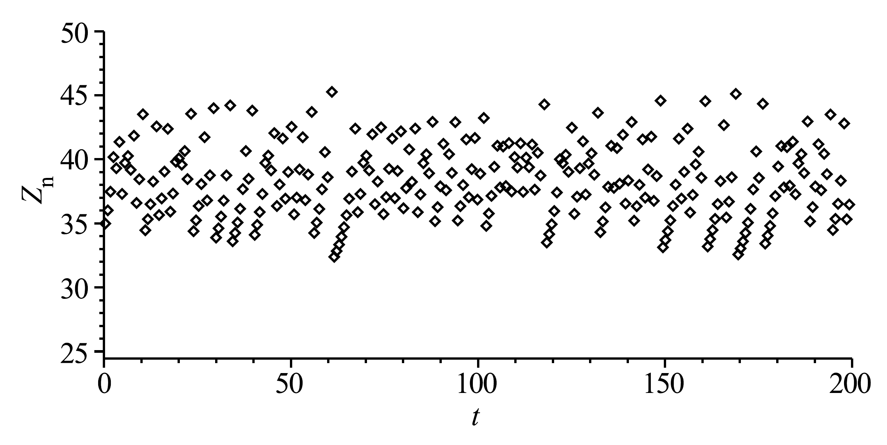
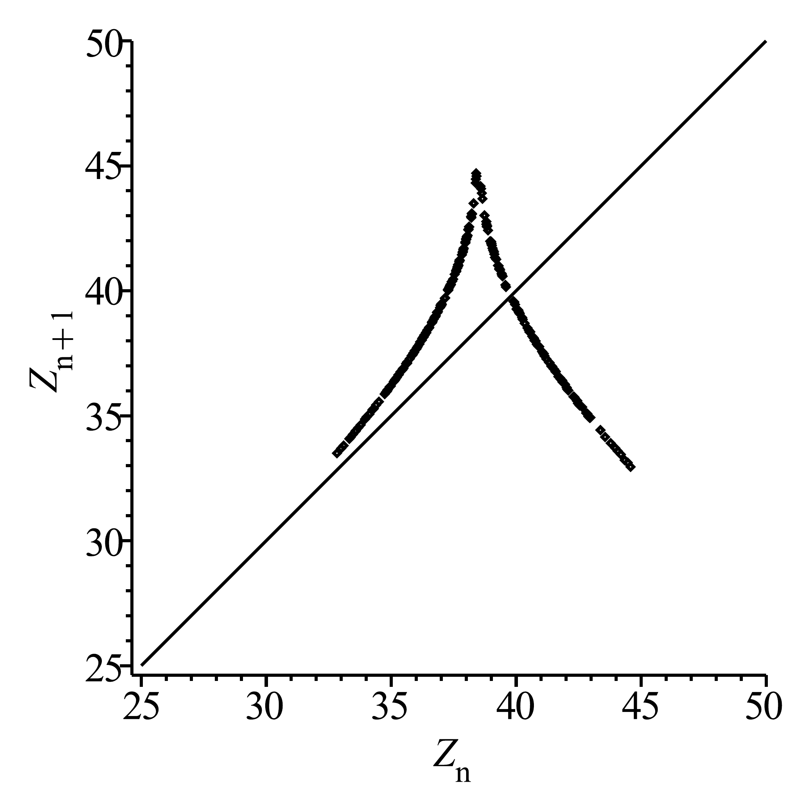

Construction of the Lorenz-map (b) of the Lorenz system, obtained by making a return plot of the data in {numref}`fig:cont3d:lorenzmap`. (a) The local maxima $z_n$ obtained from a time series $z(t)$ of the Lorenz system. (b) The Lorenz map.
```

With a discrete series $z_n$, plotted in {numref}`fig:cont3d:lorenzmap`, we have entered familiar territory (chapter {numref}`sec:disc1d`), and the natural next step is to study whether the relation between $z_n$ and $z_{n+1}$  can be described by a one-dimensional discrete mapping $z_{n+1} = f(z_n)$. This can be done by looking at the return plot of $z_n$, shown in {numref}`fig:cont3d:lorenzmap`. This plot defines the *Lorenz map* of the continuous Lorenz system {eq}`eq:cont3d:lorenzx`. Indeed, the sequence appears to collapse onto a practically symmetric curve with a cusp in the center. To a large extent the return-plot reminisces the tent map {eq}`eq:disc1d:tent_map`, but closer inspection reveals that the curve in {numref}`fig:cont3d:lorenzmap` has a finite thickness and formally cannot be described by a one-dimensional mapping. However, the thickness is so small that for the sake of argument the relation between $z_{n+1}$ and $z_n$ will still be treated as a one-dimensional map.

So how does the Lorenz map help in ruling out stable limit cycles? Sampling the maxima in $z(t)$ of a limit cycle would result in a *finite* sequence of order $m$, $z_1, z_2, ..., z_m$ after which the sequence repeats itself. Since the sequence is generated by the Lorenz map $z_{n+1} = f(z_n)$, we can use {eq}`eq:disc1d:periodm_stability_general2` to determine the stability $\sigma^{(m)}$ of this periodic solution:

```{math}
:label: eq:cont3d:stability_lorenzmap
\sigma^{(m)} = f'(z_1) (f'(z_2)) \ldots f'(z_m).
```

As discussed in section {numref}`sec:disc1d:period_m`, the criterion for stability is given by $| \sigma^{(m)} | < 1$. Now the remarkable observation to be made in {numref}`fig:cont3d:lorenzmap` is that at each $z$, the slope $|f'(z)|$ is larger than one. By {eq}`eq:cont3d:stability_lorenzmap` it is therefore inevitable that $| \sigma^{(m)} | > 1$ for all possible sequences, and hence there are no stable limit cycles possible. In this way Lorenz showed that the Lorenz system indeed produces a deterministic *non-periodic* flow in phase space[^fn1]. In the early sixties, this concept was truly groundbreaking. Associated with the term deterministic were systems, whose long term behavior was either to settle in a fixed point or end up in a limit cycle. Nonperiodic solutions on the other hand, were associated with random forcings which prevented the system from settling in a limit cycle or fixed point. But here was a deterministic system of ordinary differential equations with only three degrees of freedom which produced a flow that *never* repeats itself!

### Poincaré sections

The idea behind a Poincaré section is to reduce the complexity of an $N$-dimensional continuous dynamical system to a $N-1$-dimensional *discrete* map by inserting a *surface of section* $S$ into the phase space and sampling the intersections of a trajectory $\mathbf{x}(t)$ with $S$. This is particularly useful for oscillating systems, i.e. where the trajectory orbits in a limit cycle or has chaotic behavior. In {numref}`fig:cont3d:poincaresection`, a typical trajectory is sketched which starts on the surface of section $S$ at point $\mathbf{x}_k$. The trajectory $\mathbf{x}(t)$ is governed by the flow $\mathbf{f}(\mathbf{x}(t))$, and after a certain amount of time, the trajectory intersects $S$ again at $\mathbf{x}_{k+1}$, and so on.

The mapping $\mathbf{x}_{k+1} = P(\mathbf{x}_k)$ is called the *Poincar\'{e* map}. The surface of section does not need to be a plane, but can be curved if  convenient for the flow under consideration. The main requirement to choose the surface of section is that the trajectories must intersect it: the surface should not be parallel to the flow.

```{figure} _static/cont3d/cont3d_poincaresection.png
:name: fig:cont3d:poincaresection
:width: 50mm

A Poincaré section samples the intersections of a trajectory in phase space with the surface $S$. [Strogatz1994].
```

A simple limit cycle will correspond to a fixed point $\mathbf{x}^* = P(\mathbf{x}^*)$ on the surface of section $S$ ({numref}`fig:cont3d:poincaresection`). If the limit cycle is more complex than shown, i.e. when it requires $M$ intersections to return back to its original position, then the discrete mapping has period-$M$ behavior. For chaotic behavior, the Poincaré map will never return to the same place, and a low dimensional version of the attractor will emerge (for dissipative systems).

As dynamical systems are often nonlinear, a Poincaré section can in general only be obtained by numerically integrating the system and storing the intersections with the surface of section. Therefore, the Poincaré map $P$ is in general not known explicitly. To know $P$ explicitly, one would need the solution of the dynamical system, which only occurs in rare circumstances. However, it is quite insightful to how a Poincaré map is constructed from a dynamical system.

````{admonition} Example
:class: example

Consider the two-dimensional system

$$
\begin{aligned}
\dot{x} &= - y + a x (1 - x^2 - y^2 ) \\
\dot{y} &= x + a y (1 - x^2 - y^2 ),
\end{aligned}
$$

where $a$ is a positive parameter. This system contains a limit cycle, as shown in {numref}`fig:cont3d:poincare_ex`a for $a=0.2$. We define our "surface" of section as the line $x>0$, $y=0$. As the system is two-dimensional, the Poincaré section will result in a discrete one-dimensional map.

The system above can be solved analytically by converting it to polar coordinates $r = \sqrt{x^2+y^2}$ and $\theta=\tan^{-1}(y/x)$, yielding

$$
\begin{aligned}
\dot{r} &= a r ( 1 - r^2), \\
 \dot{\theta} &= 1.
\end{aligned}
$$

which has a solution

$$
\begin{aligned}
r(t) &= \left(1- \frac{r_0^2 - 1}{r_0^2} e^{-2 a t} \right)^{-1/2} \\
 \theta(t) &= t + \theta_0.
\end{aligned}
$$

Here $r_0=r(0)$ and $\theta_0=\theta(0)$ are the initial conditions.

```{subfigure} 2
:name: fig:cont3d:poincare_ex
:align: center
:subcaptions: below

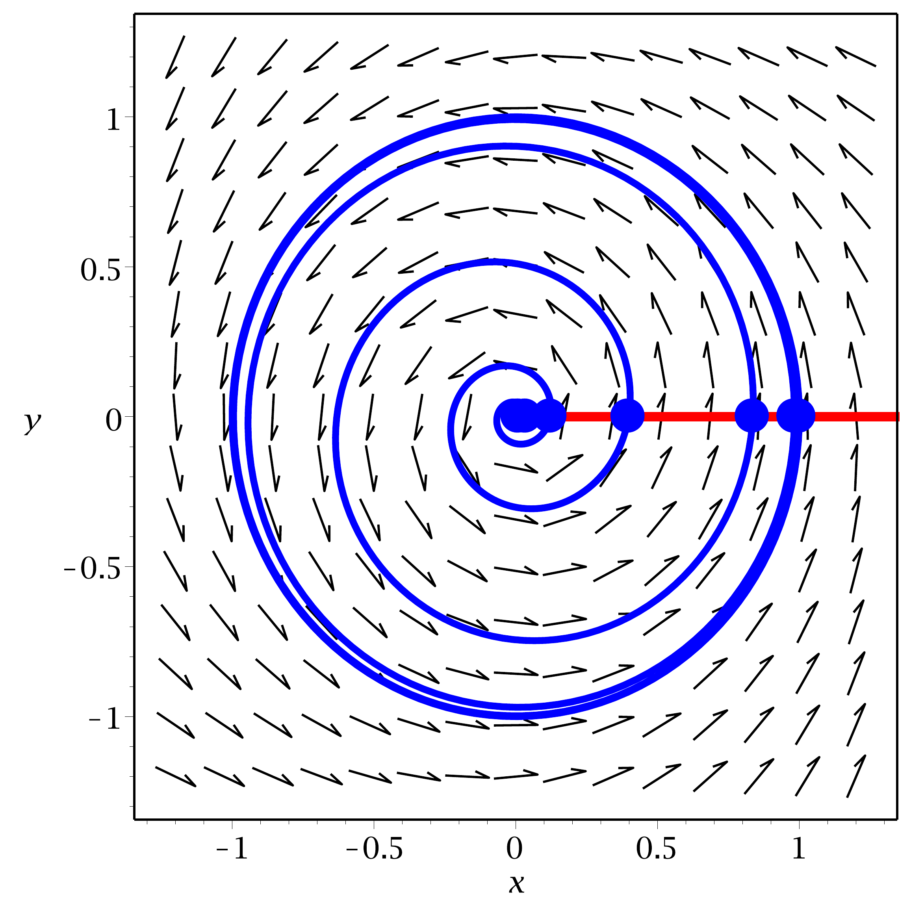
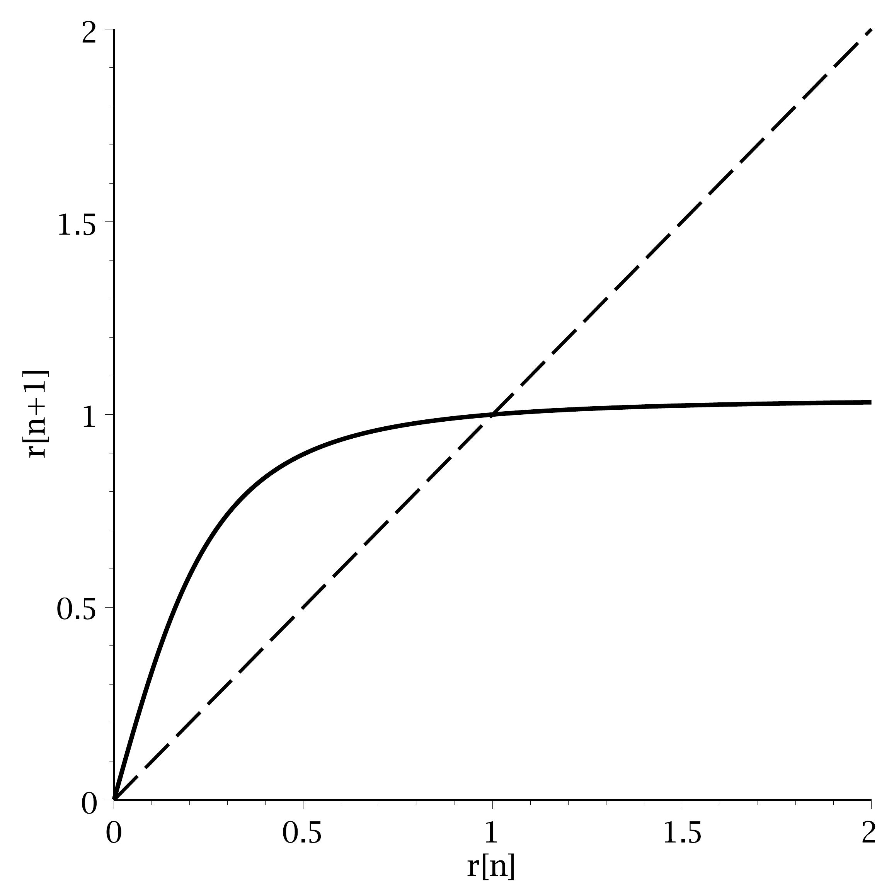
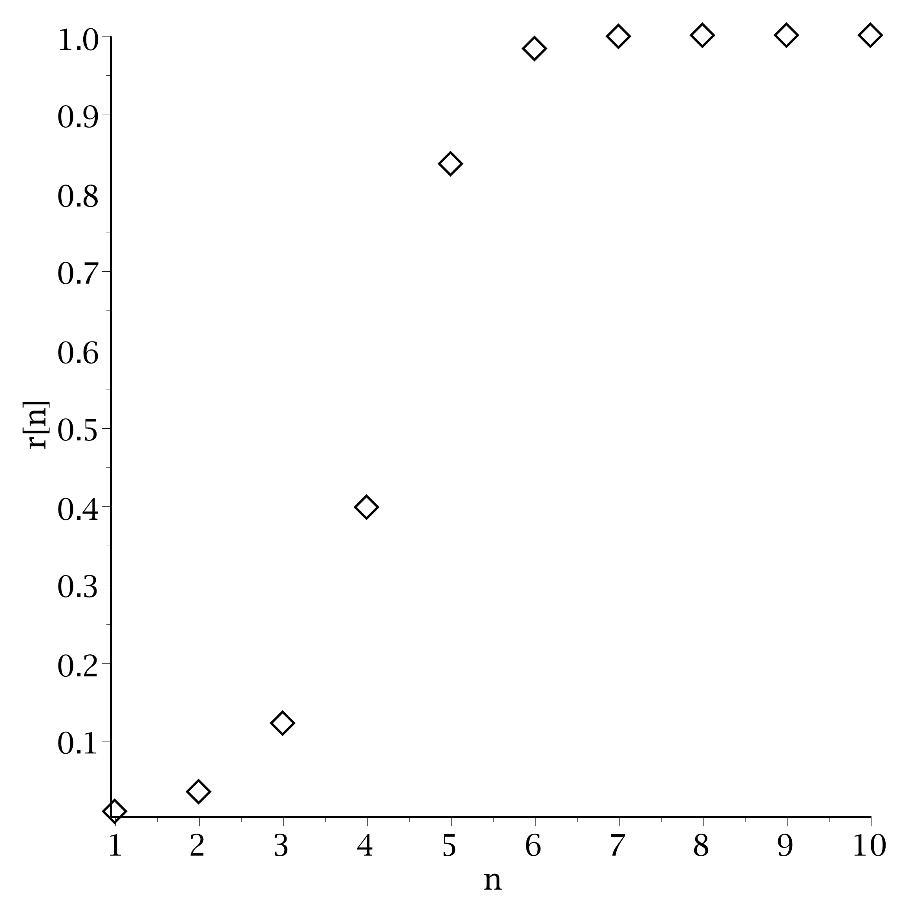

Phaseportrait and the mapping for the Poincaré section. (a) Phase portrait with surface of section (red line) and the intersections (solid circles). (b) The Poincaré map. (c) Some iterations of the Poincaré map, showing the approach towards the fixed point in $r$.
```

The surface of section $x>0$. $y=0$ transforms to $\theta = 0 \mod 2 \pi$, so that the Poincaré map $r_{n+1} = P(r_n)$ becomes

$$
P(r) = \left(1- \frac{r^2 - 1}{r^2} e^{-4 a \pi} \right)^{-1/2},
$$

where we used that $\theta_0=0$. This mapping is shown in {numref}`fig:cont3d:poincare_ex`b for $a=0.2$. Clearly, $r^*=1$ is a stable fixed point of this mapping, which confirms the convergence to a limit cycle.
````

````{admonition} Example
:class: example

In most circumstances, the Poincaré map will need to be constructed from the numerical solution. As an example, consider again the Lorenz system and a surface of section given by $y=0$. The following code fragment extracts the relevant data and plots the section (assumes that the solution is sampled with high time resolution and is stored in the arrays `xx, yy` and `zz`):

```{code-block} maple
pcx := NULL: pcz := NULL:
for i from N/4 to N-1 do
  if(yy[i] < 0 and yy[i+1] > 0 or yy[i] > 0 and yy[i+1] < 0 ) then
    pcx := pcx, xx[i]; pcz := pcz, zz[i];
  end if;
end do;
plot([seq([pcx[i], pcz[i]], i=1..nops([pcx]))], style=point, symbol=diamond);
```

```{figure} _static/cont3d/cont3d_lorenz_poincare.png
:name: fig:cont3d:lorenzpoincare
:width: 60mm

Poincare section at $y=0$ for the Lorenz system.
```

The result is shown in {numref}`fig:cont3d:lorenzpoincare`. As can be seen, the discrete mapping results in a (nearly) one-dimensional curve, which has strong similarities with the Lorenz map ({numref}`fig:cont3d:lorenzmap`). Note that the integration has only been carried out for a limited amount of time – longer integration would have resulted more data points on the map and therefore less holes.
````

(sec:cont3d:perioddoubling)=
## Routes to chaos

There is no universality in the route by which continuous systems become chaotic. Indeed, the route to chaos depends on the specifics of the system under consideration. Some systems will feature a classical route to chaos through period doubling, whilst others become chaotic instantaneously. Several other routes to chaos have been identified over the years. These are beyond the scope of this text; see e.g. {cite}`Schuster1995` for a review.

A classical period-doubling route can be observed in the Rössler system {cite:p}`Rossler1976`:

$$
\begin{aligned}
\dot{x} &= -y - z, \\
\dot{y} &= x + a y, \\
\dot{z} &= b + z ( x - c ),
\end{aligned}
$$

with parameters $a$, $b$ and $c$. Note that only the $z$-equation contains a nonlinearity. In the absence of $z$, the first two equations are just those of a harmonic oscillator. As the parameter $a$ is positive there is negative damping, so that the typical behavior when $z \approx 0$ will be that of an unstable spiral. The attractor is shown in {numref}`fig:cont3d:rosslerperiod`(d) for $a=0.432$, $b=2$ and $c=4$. Following a trajectories starting at the center at $z=0$, the trajectory spirals outward. When $x$ becomes sufficiently large (after one or more cycles), the $z$ equation becomes active and the trajectory shoots up. Due to the negative feedback in the $x$-equation it is then reinjected near the center of the spiral. Trajectories are reinjected further to the inside of the spiral when they were further on the outside, generating a surface similar to a Möbius strip. Note that the attractor is a topologically very complex object, as the outward spiralling trajectories are weaved through the reinjected trajectories.

```{subfigure} 2
:name: fig:cont3d:rosslerperiod
:align: center
:subcaptions: below

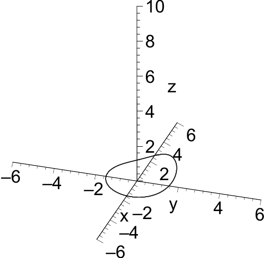
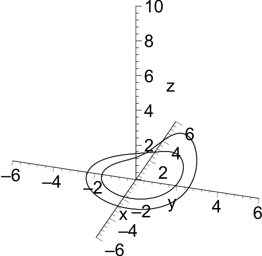
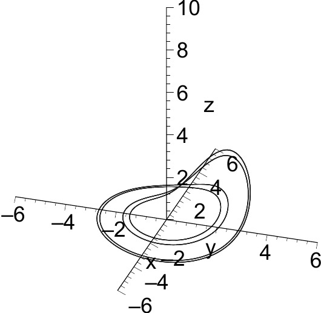
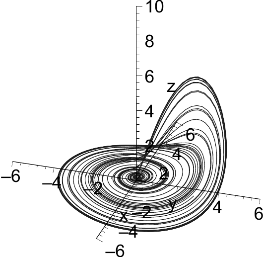

The period doubling route to chaos of the Rössler system. (a) $c=3$: Period 1. (b) $c=3.4$: Period 2. (c) $c=3.55$: Period 4. (d) $c=4.0$: Chaos.
```

As for the Lorenz map, we sample the maxima of $x$ in order to reduce the complexity of the data. In {numref}`fig:cont3d:rosslerperiod`, the behavior of the system is shown for four different values of $c$. For $c=3$ ({numref}`fig:cont3d:rosslerperiod`a), the system settles into a limit cycle, and subsequent maxima in $x$ will be identical. This situation resembles that of a fixed point (period-1) solution for a one-dimensional map. For $c=3.4$ ({numref}`fig:cont3d:rosslerperiod`b), the system  settles into a limit cycle which has become more complex: the trajectory performs two cycles before returning to the same location. This is reflected in the sequence of the $x$-maxima, which shows a period-2 solution. A period-4 limit cycle is shown in {numref}`fig:cont3d:rosslerperiod`c and the chaotic timeseries in {numref}`fig:cont3d:rosslerperiod`d. In fact, the Rössler system has a full period doubling route to chaos, which is shown in {numref}`fig:cont3d:bifurcation`a. Clearly, there is a strong similarity with the bifurcation diagram of the logistic map, {numref}`fig:disc1d:series_bifurcation_logist`.

A clue for the period-doubling behavior could have been inferred from the return plot of $z_n$ in a fully chaotic state ($c=4$) ({numref}`fig:cont3d:rosslerreturn`). The return plot is very similar to the logistic map, and has both requirements for Feigenbaum's universality (section {numref}`sec:disc1d:universality`): 1) a unimodal map; and 2) a differentiable maximum. From the Lorenz map ({numref}`fig:cont3d:lorenzmap`) one might  anticipate that the Lorenz system will behave rather differently than the Rössler system, as the cusp implies that the map is is not differentiable at its maximum. Shown in {numref}`fig:cont3d:bifurcation`b is the bifurcation diagram in terms of $r$ for the Lorenz equations. The other two parameters are $\sigma=10$ and $b=8/3$. As can be seen, the system is stable up to a certain value for $r$, after which it bursts into chaotic behaviour without a single trace of period doubling.

```{figure} _static/cont3d/cont3d_rosslerreturn.png
:name: fig:cont3d:rosslerreturn

Return map based on maxima in $x$ for the Rössler system at $c=4$
```

The critical value of $r$ for the transition to chaos for the Lorenz equations may be obtained using the linear stability analysis for the fixed points outlined in the previous chapter. The fixed points are given by $x^*_1=(0,0,0)$, $x^*_2=(\sqrt{b(r-1)}, \sqrt{b(r-1)}, r-1)$ and $x^*_3=(-\sqrt{b(r-1)}, -\sqrt{b(r-1)}, r-1)$. The origin $(0,0,0)$ is a stable fixed point for $0 < r < 1$. At $r=1$ a pitchfork bifurcation occurs, where two nonzero fixed points become stable. The stability range of $x^*_2$ and $x^*_3$ is

$$
1 < r < \frac{\sigma ( \sigma + b + 3)}{\sigma - b - 1}.
$$

at $r_c = \frac{\sigma ( \sigma  + b + 3)}{\sigma - b - 1}$, $x^*_2$ and $x^*_3$ undergo a Hopf bifurcation. Recall that the Hopf bifurcation represents a transition from a stable spiral (negative real part of eigenvalue) to an unstable spiral (positive real part of eigenvalue). In this case there is no stabilizing flow away from the fixed point, which means that no limit cycle can form; this bifurcation thence marks an immediate transition to chaos[^fn2].

```{subfigure} 2
:name: fig:cont3d:bifurcation
:align: center
:subcaptions: below

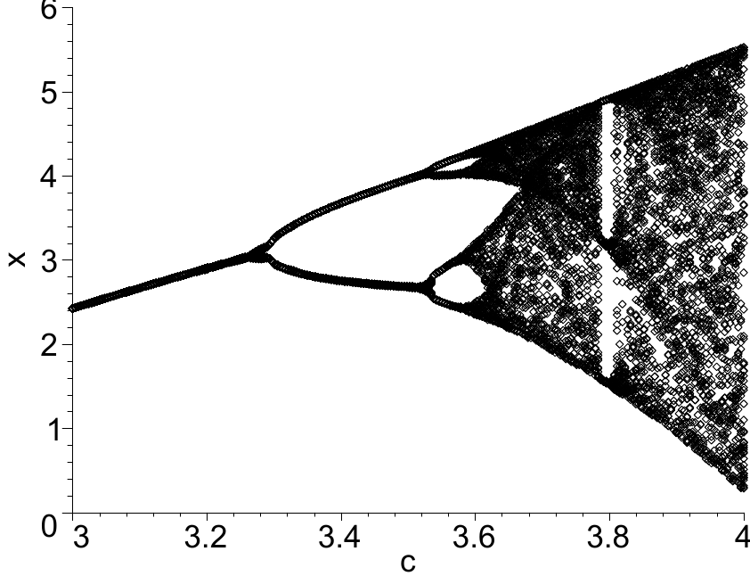
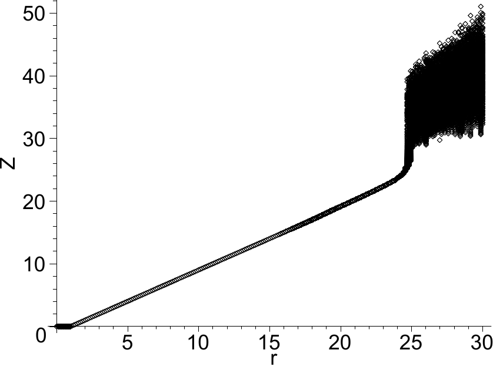

Bifurcation diagram of the Rössler and Lorenz equations based on maxima in $x$ and $z$, respectively. (a) Rössler system. (b) Lorenz system.
```

(sec:cont3d:forced)=
## Forced systems

The Poincaré-Bendixson theorem states that 2-D continuous systems cannot have chaotic behaviour. However, this only pertains to unforced (autonomous) systems – if 2-D  systems are forced they may become chaotic because a non-autonomous 2-D system is equivalent to an autonomous system of one degree higher. Consider for example a forced oscillator governed by

$$
m \ddot{x} = F + A \sin \omega t
$$

where $x$ is the position, $m$ is the mass, $F(x, \dot{x})$ is the force, and $A$ and $\omega$ are the forcing amplitude and frequency, respectively. The equation above is a non-autonomous second-order differential equation that can be converted to an autonomous system by introducing the variables $y= \dot{x}$ and $z=\omega t$. The result is

$$
\begin{aligned}
\dot{x} &= y \\
 \dot{y} &= F/m + (A/m) \sin z \\
 \dot{z} &= \omega
\end{aligned}
$$

Even though the equation for $z$ is trivial to solve, this result is significant because it incorporated non-autonomous systems into the geometrical interpretation that the phase space provides.

A commonly used concept to reduce the complexity of forced systems is to sample the state vector $\mathbf{x}(t)$ at time fixed intervals $2 \pi / \omega$. By sampling at the same frequency as the forcing, information is provided about whether the system displays forced periodic behavior or has more complex dynamics. This is commonly referred to as a *stroboscopic Poincar\'{e* section}.

````{admonition} Example
:class: example

Consider a damped and forced version of the double-well oscillator discussed in section {numref}`sec:cont2d:conservative` governed by

```{math}
:label: eq:cont3d:doublewell_x
\begin{aligned}
\dot{x} &= y \\
 \dot{y} &= x - x^3 -f y + A \cos(z) \\
 \dot{z} &= \omega
\end{aligned}
```

Here, $f$ is a damping coefficient and $\omega$ and $A$ are the forcing frequency $\omega$ and amplitude $A$, respectively. Physically, this system can represent a slender steel beam with a damping coefficient $f$  that is clamped in a rigid framework, with two permanent magnets at the base pulling the beam in opposite directions ({numref}`fig:cont3d:doublewell`). As we have seen in section {numref}`sec:cont2d:conservative`, in the absence of friction and forcing ($f=0$ and $A=0$) this system has a potential $V=x^4/4-x^2/2+y^2/2$ ({numref}`fig:cont2d:conservative_e` or {numref}`fig:cont3d:doublewell_results`(a)) that has two minima representing the stable equilibrium solutions in which the beam is buckled to one side; the problem earns its name due to the two wells that form as a result.

```{figure} _static/cont3d/cont3d_doublewell.png
:name: fig:cont3d:doublewell
:width: 60mm

Sketch of the mechanical system [Strogatz1994].
```

In the absence of the forcing, the system has three fixed points, $\mathbf{x}^* \in \{ (-1,0), (0,0), (1,0)\}$. The fixed point at the origin is a saddle node and the other two are stable fixed points. For low values of $A$, the damping will exceed the forcing and the system will end up in one of the wells in a limit cycle. If the forcing amplitude $A$ exceeds a certain value, the system is perturbed so strongly that it is no longer confined to one well only and can move between the two wells. An example is shown in {numref}`fig:cont3d:doublewell_results`(a) for parameter values  $\omega=1$, $f=0.15$, $A=0.3$, and initial conditions $x(0)=0$, $y(0)=0$ and $z(0)=0$. Apart from the trajectories, isolines of the potential $V$ and the three fixed points are shown. The code used to produce the figure is given below.

```{code-block} maple
restart; with(plots):
f1 := (x, y, z) -> y;
f2 := (x, y, z) -> -f * y +x-x^3 + A*cos(z);
f3 := (x, y, z) -> omega;
de1 := diff(x(t), t) = f1(x(t), y(t), z(t));
de2 := diff(y(t), t) = f2(x(t), y(t), z(t));
de3 := diff(z(t), t) = f3(x(t), y(t), z(t));
sys := de1, de2, de3;
# Plot total energy of system and fixed points
H := (x,y) -> x^4/4-x^2/2+y^2/2;
p1 := contourplot(H(x,y), x=-2..2, y=-2..2, grid=[70, 70]):
p2 := plot([-1, 0, 1], [0, 0, 0], symbol=circle, style=point):
# Calculate double-well oscillator dynamics and plot the results
f := 0.15; omega := 1; A := 0.3;
ic := x(0) = 0, y(0) = 0, z(0) = 0;
tend := 1000;
sol := dsolve({sys, ic}, type=numeric, maxfun=-1,output=listprocedure):
p3 := odeplot(sol, [x(t), y(t)], 800..tend, numpoints=tend*50)
display([p1, p3, p2]);
```

```{subfigure} 2
:name: fig:cont3d:doublewell_results
:align: center
:subcaptions: below

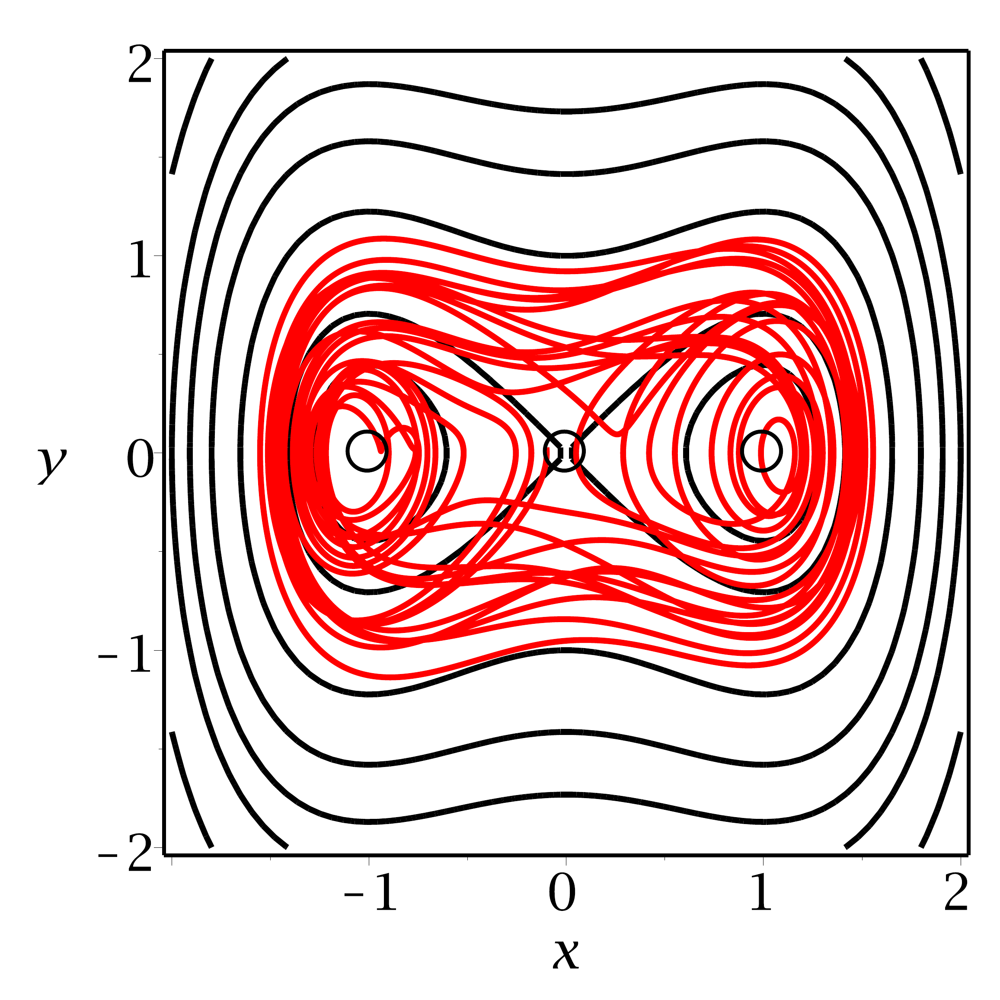
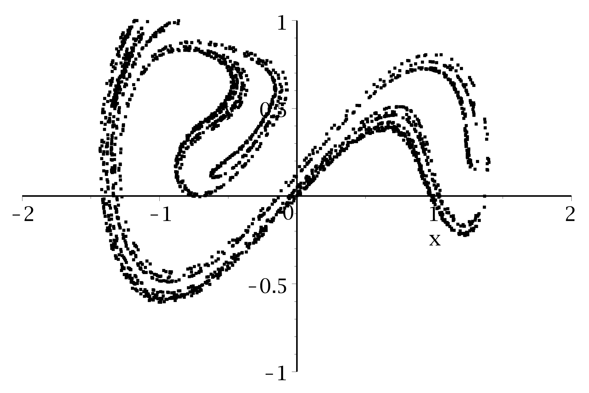

a) An (x,y) projection of a phase space trajectory for the forced double-well system (red line), together with contours of the total energy (black lines) and the three fixed points (circles). The forcing is of sufficient amplitude such that the state vector moves erratically between the two wells. b) A stroboscopic Poincaré section for the double-well system.
```

It is clear that the system moves erratically between the two wells, but there is not much more that can be inferred from this figure. To produce a stroboscopic Poincaré section, we sample the solution periodically with angular frequency $\omega$, i.e. at times $\omega t_n = \phi \mod 2 \pi$, where $\phi$ is the phase angle at which we would like to sample. We set $\phi=0$ and in maple we create an array `tt` with the times at which we require output, and pass this argument to `dsolve`:

```{code-block} maple
N := 5000;
phi := 0;
dt := evalf(2 * Pi / omega);
tlist := [seq(i*dt+phi/omega,i=1..N)]:
tt := Array(tlist);
sol := dsolve({sys, ic}, type=numeric, maxfun=-1,output=tt):
soldd := sol[2,1];
xx := soldd[1..N, 2];
yy := soldd[1..N,3];
pp := seq([xx[i], yy[i]], i=N/2..N):
pointplot([pp],view=[-2..2, -1..1], labels=["x", "y"],symbol=point);
```

The result is shown in {numref}`fig:cont3d:doublewell_results`(b). The system does not settle in an limit cycle (which would correspond to a period-$M$ solution) but instead traces out a  fractal object, not too dissimilar to the Hénon map discussed in section {numref}`sec:disc2d:henonlyap`. Note that the result is shown in {numref}`fig:cont3d:doublewell_results`(b) is for the specific case of $\phi=0$, and the Poincaré section will be different for different $\phi$, much like a regular Poincaré section will be different for different surfaces of section. This can be easily verified by experimenting with the maple sheet.
````

## Chaos in conservative systems

As a final topic of this book we consider the three-body problem that was briefly touched upon in chapter {numref}`chap:endstart`. The three-body problem is a canonical problem in celestial mechanics that was pivotal in the realisation that deterministic systems are not always predictable. Whilst the two-body problem is relatively straightforward to solve, as was done by Kepler and formalised by Newton in the 17th century, the solution to the three-body problem remained elusive for several centuries. Newton tried to solve the dynamics of the sun-earth-moon system and remarked about this problem that "...his head never ached but with his studies on the moon"[^fn3]. It was a strong-held belief that solving the three-body problem was merely a matter of time but despite important contributions made by heavy-weights like Euler and Lagrange the problem was not solved. It was not until the early 20th century that Henri Poincaré showed unambiguously that there are fundamental issues with the integrability of the three-body system, and thus its predictability.

NEEDS DIAGRAM

Poincaré's work mostly focussed on the restricted three-body problem, which is a simplified version of the three-body problem in which 1) one body is assumed much smaller than the other two, e.g. a sun-moon-satellite problem; 2) the two heavy bodies rotate in the same plane; and 3) the two heavy objects rotate around each other in a circular motion. Even in this very simplified setting the system governing the motion of the lightest body (the satellite) is governed by a system of four coupled ordinary differential equations:

```{math}
:label: eq:phenomenon_3body_simple1_m3_full__cont3d
\dot{X} &= U\\
 \dot{Y} &= V\\
 \dot{U} &= G m_1 [X_1 - X]/d_{1}^{3} \,\,+\,\, G m_2 [X_2 - X]/d_{2}^{3}\\
 \dot{V} &= G m_1 [Y_1 - Y]/d_{1}^{3} \,\,+\,\, G m_2 [Y_2 - Y]/d_{2}^{3}
```

where $(X(t),Y(t))$ and $U=\dot{X},V=\dot{Y}$ are the satellite coordinates and velocities, respectively. By convention, we assume $m_1>m_2$. The variables $d_1$ and $d_2$ are distances to the heavy bodies, given by

```{math}
:label: eq:phenomenon_3body_distances__cont3d
d_1 = \sqrt{(X_1 - X)^2 + (Y_1 - Y)^2}\,\,\,\,\,\,\,\,\,\, d_2 = \sqrt{(X_2 - X)^2 + (Y_2 - Y)^2}
```

and earth- and moon-positions

```{math}
:label: eq:phenomenon_3body_x1x2__cont3d
\begin{gathered}
\left[
 \begin{array}{c}
 X_1 \\
 Y_1
 \end{array} \right]=
 -\frac{m_2 R}{m_1+m_2} \left[
 \begin{array}{c}
 \cos \omega t \\
 \sin \omega t
 \end{array} \right],\,\,\,\,\,\,\,
 \left[
 \begin{array}{c}
 X_2 \\
 Y_2
 \end{array} \right]=
 \frac{m_1 R}{m_1+m_2} \left[
 \begin{array}{c}
 \cos \omega t \\
 \sin \omega t
 \end{array} \right]
\end{gathered}
```

This is a problem without friction and the system is thus conservative. The most convenient way to see this is to consider the system in terms of a coordinate system that co-rotates with the two bodies; the two heavy bodies are static in this reference frame, which considerably simplifies the analysis. The drawback of the transformation is that the rotating coordinate system introduces pseudo-forces, i.e. centripetal and Coriolis forces. For a derivation, we refer to {cite}`Tel2006`. The result is, after making the system dimensionless using the distance between the two heavy bodies $R$ and the angular velocity $\omega = \sqrt{G(m_1+m_2)/R^3}$:

```{math}
:label: eq:cont3d:3body_x_nd
\begin{aligned}
\dot{x} &= u \\
 \dot{y} &= v \\
 \dot{u} &= 2v - \frac{\partial V}{\partial x} \\
 \dot{v} &= -2u - \frac{\partial V}{\partial y}
\end{aligned}
```

where $V$ is the potential given by

$$
V(x,y) = -\underbrace{\frac{\mu_1}{d_1}}_{(a)}-\underbrace{\frac{\mu_2}{d_2}}_{(b)}-\underbrace{\frac{1}{2} (x^2+y^2)}_{(c)}-\underbrace{\frac{\mu_1 \mu_2}{2}}_{(d)}
$$

The potential comprises four different terms: (a) the potential of mass 1; (b) the potential of mass 2; (c) the centripetal force due to rotating frame of reference; and (d) a constant to make maximum value of the potential independent of $\mu$. The landscape generated by $V$ is interesting due to the competition between the two attracting gravitational forces (a,b) and the repelling centripetal force (c). In {numref}`fig:cont4d:3body_v`, the potential function is shown for $\mu = m_2/(m_1+m_2)=0.2$ (consistent with the values displayed in table {numref}`table:phenomenon_3bodyconstants`), and note that $\mu_1=1-\mu$ and $\mu_2 = \mu$. The singularities in the potential are at the positions of the two heavy bodies $\mathbf{x}_1 = (-\mu,0)$ and $\mathbf{x}_2=(1-\mu,0)$.

```{figure} _static/cont3d/cont4d_3body_V.png
:name: fig:cont4d:3body_v
:width: 60mm

The potential $V$ for the restricted three-body system at $\mu=0.2$. (a) isolines of $V$ and the Lagrange points (red diamonds). (b) a cross-section of $V$ at $y=0$, showing the wells with singularies at $x=-\mu$ and $x=1-\mu$, as well are the Lagrange points $L1-L3$ with $V_2 < V_1 < V_3$ (red diamonds).
```

It is straightforward to establish that the system {eq}`eq:cont3d:3body_x_nd` is conservative by calculating its divergence:

$$
\nabla \cdot \mathbf{f} = \frac{\partial f_x}{\partial x} +\frac{\partial f_y}{\partial y} + \frac{\partial f_u}{\partial u} +\frac{\partial f_v}{\partial v} = 0
$$

and thus the system will not have an attractor. The total energy of the system is a constant of motion

$$
H(x,y,u,v)=\frac{1}{2} (u^2 +v^2) + V(x,y)
$$

which by definition remains constant along a trajectory as a function of time. This allows for a geometrical interpretation of the system; a trajectory with initial energy $H_0$ will remain confined to the three-dimensional subspace in the four-dimensional phase space for which $H(x,y,u,v)=H_0$. The potential $V$ can be used to assess which region of the phase-space is accessible for a trajectory with a given $H=H_0$. Indeed, the system will by definition not be able to access the region for which $V>H_0$, which is called the *Hill region*.

The extrema on the surface of $V$ are positioned at locations for which both  $\partial V /\partial x=0$ and $\partial V /\partial y=0$. Lagrange discovered that for the restricted three-body problem there exist five distinct extrema, which are commonly referred to as the Lagrange points $L1-L5$. These are indicated by diamonds in {numref}`fig:cont4d:3body_v`. The Lagrange points L1-L3 are positioned on the x-axis and are numbered by convention as indicated in {numref}`fig:cont4d:3body_v`(b). A stability calculation shows that these are all saddle points. The Lagrange point L1 is the most important point for our purposes: its potential $V_{L1}$ dictates whether a satellite with energy $H_0$ is able to escape from the gravitational of pull of the two bodies. Indeed, for $H_0<V_{L1}$ the trajectory cannot escape. The Lagrange point L2 with $V_{L2} < V_{L1}$ dictates whether the satellite's orbit must remain confined to one of the two heavy bodies. There exists an energy band $V_{L2} < H_0 < V_{L1}$ for which the satellite can orbit both bodies whilst it is still unable to escape. Finally, a satellite with energy $V_{L1} < H_0 < V_{L3}$ is able to escape the system on the side of the light body only.

The equation governing the position of the Lagrange points $L1-L3$ is a fifth order polynomial that does not have a closed-form solution, although several approximations have been developed over the years. However, it is straightforward to determine these numerically using maple, by recognising that the two heavy bodies separate the Lagrange points $L1-L3$:

````{admonition} Maple
:class: maple

```{code-block} maple
restart;
s1 := (x,y) -> sqrt((x+mu2)^2 + y^2);
s2 := (x,y) -> sqrt((x-mu1)^2 + y^2);
V  := (x,y) -> - mu1 / s1(x,y) - mu2 / s2(x,y) - (x^2+y^2)/2 - mu1*mu2/2;
H  := (x,y,u,v) -> (u^2+v^2)/2 + V(x,y);
mu1 := 1-mu; mu2 := mu;
mu := 0.2;

L1 := op(maximize(V(x,0),x=1-mu..infinity, location)[2]):
L1[1] := rhs(op(L1[1])): L1;
L2 := op(maximize(V(x,0),x=-mu..1-mu, location)[2]):
L2[1] := rhs(op(L2[1])): L2;
L3 := op(maximize(V(x,0),x=-infinity..-mu, location)[2]):
L3[1] := rhs(op(L3[1])): L3;
```
````

For $\mu=0.2$, maple returns $(x_L1, x_L2, x_L3)=(1.27, 0.44. -1.08)$ and associated potentials $(V_{L1}, V_{L2}, V_{L3})=(-1.86, -1.98. -1.68)$.

```{subfigure} 2
:name: fig:cont4d:3body_poincare
:align: center
:subcaptions: below

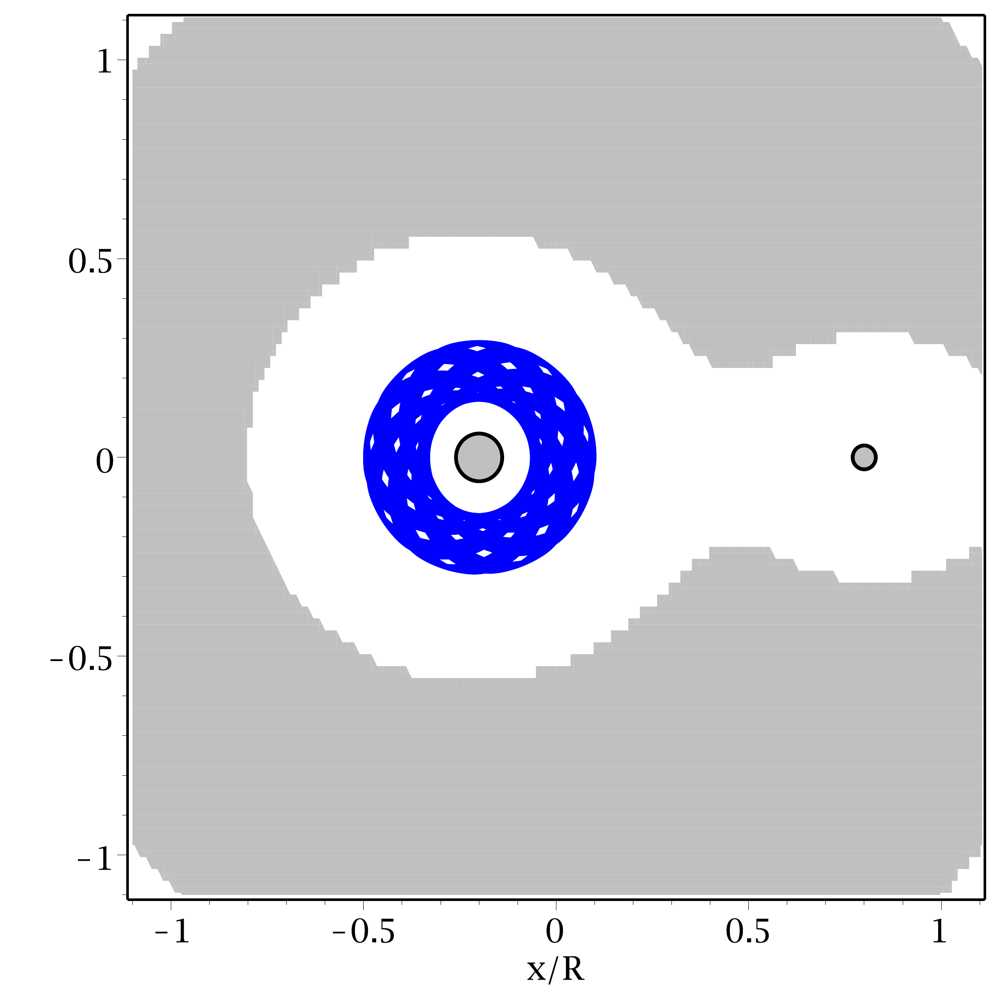
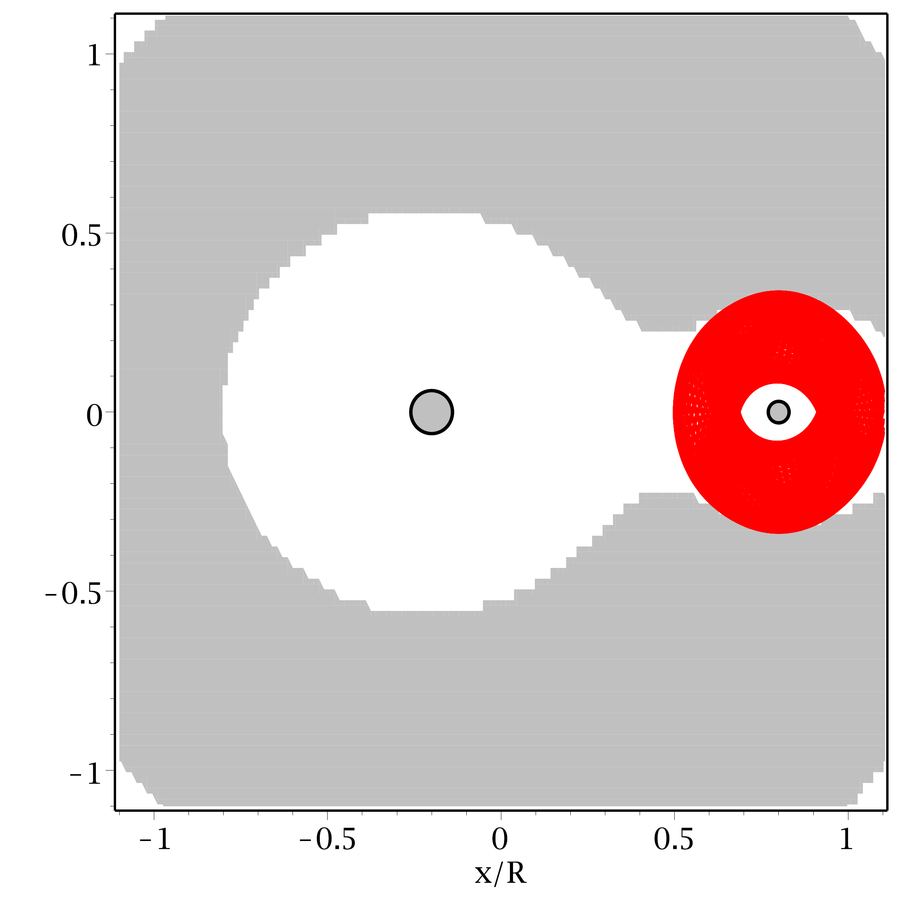
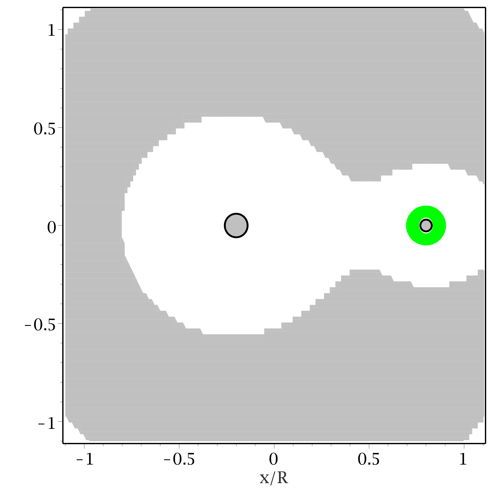
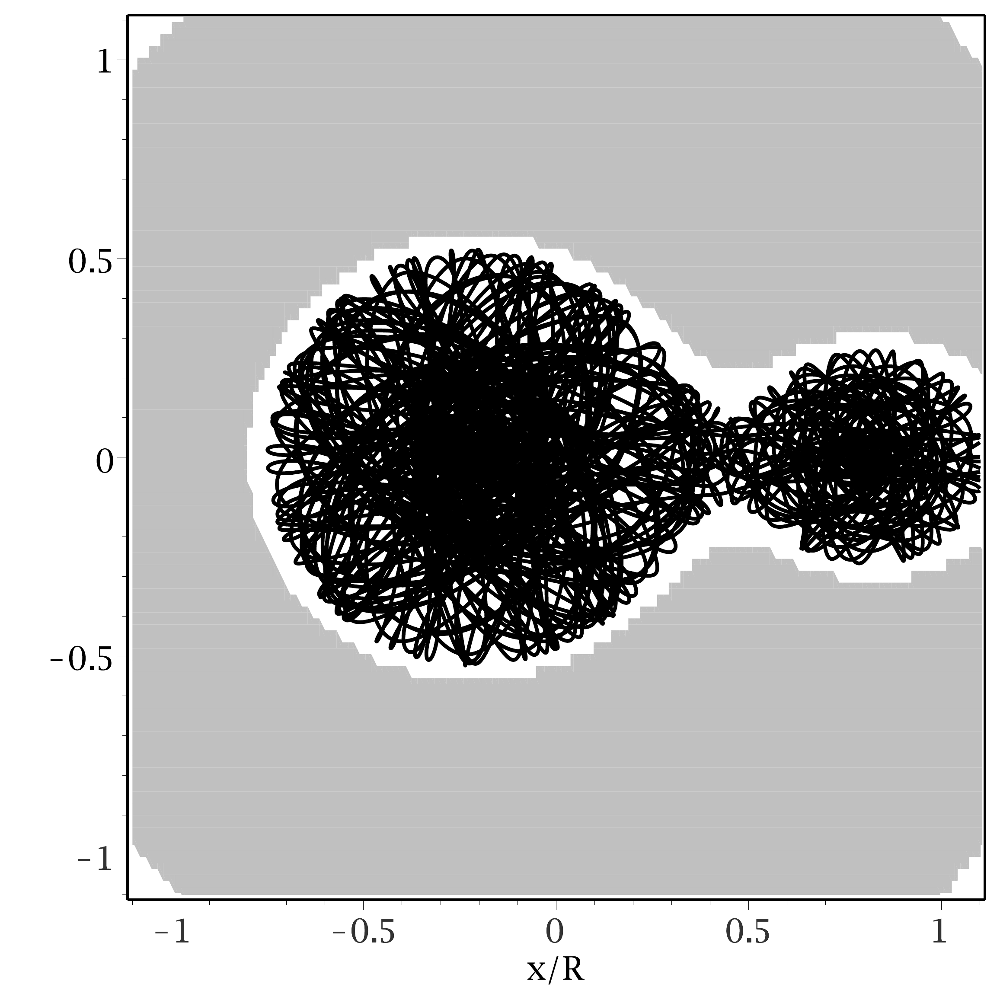
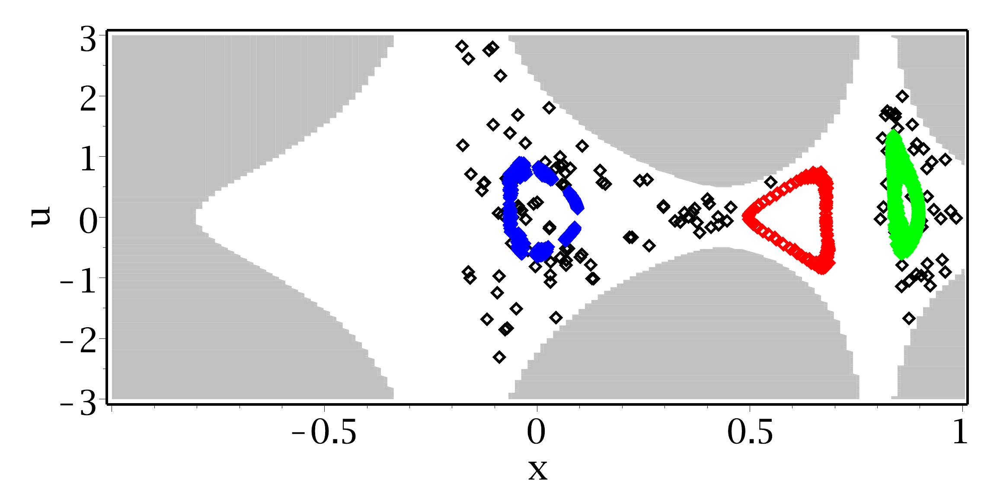

. The behaviour of the three-body system at $\mu=0.2$ for four different initial conditions. (a-d) the trajectories in space. (e) $(x_n, u_n)$ projection of a Poincaré section at $y=0$ (colours correspond to different initial conditions). The Hill region $V>V_1$ is denoted in grey. (e) Poincaré section.
```

One of the typical features of conservative system is that there are regions of the phase space in which the trajectories are periodic or quasi-periodic that are surrounded by regions in which the system displays chaotic behavior, similar to the standard map discussed in section {numref}`sec:disc2d:standardmap`. In {numref}`fig:cont4d:3body_poincare` the trajectories for four different initial conditions are shown. In Figs {numref}`fig:cont4d:3body_poincare`(a-c), $H_0 < V_{L1}$ and the trajectories orbit one of the two bodies. For the initial condition shown in {numref}`fig:cont4d:3body_poincare`(d) the trajectory has an energy $V_2 < H_0 < V_1$ and as can be seen the trajectory revolves around both bodies.

We construct a Poincaré section for the plane $y=0$ and consider only those crossings for which $v>0$, thereby ensuring that only full revelations are considered. The Poincaré section reduces the 4-D continuous system to a 3-D discrete system, of which we show the ($x_n, u_n$) projection in {numref}`fig:cont4d:3body_poincare`(e). Note that as conservative systems do not have an attractor, there is no need to discard transients, and all the data can be used. The orbits of Figs {numref}`fig:cont4d:3body_poincare`(a-c) correspond to quasi-periodic orbits as is clear from the  development of a closed loop in the Poincaré section. The behaviour of the orbit shown in {numref}`fig:cont4d:3body_poincare`(d) is entirely different, as the system visits very large regions in the phase space. This is a chaotic trajectory. Another interesting point is that the chaotic regions are intertwined with the (quasi)-periodic regions as is evident from the orbits of Figs {numref}`fig:cont4d:3body_poincare`(a,c).

Conservative systems represent a vast area of research and the observations above give a flavour of the dynamics. For more information we refer to e.g. {cite}`Ott1993,Schuster1995,Tel2006`.

````{admonition} Maple
:class: maple

```{code-block} maple
xdot := (x, y, u, v) -> u:
ydot := (x, y, u, v) -> v:
udot := (x, y, u, v) ->  2*v + x - mu1*(x+mu2)/s1(x,y)^3 - mu2*(x-mu1)/s2(x,y)^3:
vdot := (x, y, u, v) -> -2*u + y - mu1*y/s1(x,y)^3       - mu2*y/s2(x,y)^3:
DE1 := diff(x(t),t) = xdot(x(t),y(t),u(t),v(t)):
DE2 := diff(y(t),t) = ydot(x(t),y(t),u(t),v(t)):
DE3 := diff(u(t),t) = udot(x(t),y(t),u(t),v(t)):
DE4 := diff(v(t),t) = vdot(x(t),y(t),u(t),v(t)):
DE := DE1, DE2, DE3, DE4;
mu := 0.2;

ic := NULL;
ic := ic, [x(0) = 0.1,  y(0) = 0,   u(0) = 0,   v(0) = 1]:
ic := ic, [x(0) = 0.5,  y(0) = 0,   u(0) = 0,   v(0) = 1]:
ic := ic, [x(0) = 0.9,  y(0) = 0,   u(0) = 0,   v(0) = 1]:
ic := ic, [x(0) = 0.45, y(0) = 0.1, u(0) = 0.1, v(0) = -0.1];

N := 30000; dt := 0.01;
tP := Array(1..N, i -> (i-1)*dt):
col := [blue, red, green, black]:
for nIC from 1 to nops([ic]) do
  sol_arr := dsolve({DE, op(ic[nIC])}, [x(t), y(t), u(t), v(t)],
                     type=numeric, maxfun=-1, output=tP):
  soldd :=sol_arr[2,1];
  TT := soldd[1..N, 1];
  XX := soldd[1..N, 2]; YY := soldd[1..N, 3];
  UU := soldd[1..N, 4]; VV := soldd[1..N, 5];

  # Create Poincare section
  Px := NULL: Pu := NULL:
  for i from N/4 to N-1 do
    if(YY[i] < 0 and YY[i+1]>0)  then
      Px := Px, XX[i]; Pu := Pu, UU[i];
    end if;
  end do;

  satellite[nIC] := plot([seq([XX[i], YY[i]], i=1..N)], color=col[nIC],labels=["x","y"]):
  p[nIC] := plot([seq([Px[i], Pu[i]], i=1..nops([Px]))], style=point,
                 labels=["x", "u"], color=col[nIC]);
od:
PP := inequal(H(x,y,0,0) >L1[2], x = -1.5 .. 1.5, y = -3 .. 3, 'nolines'):
earth := disk([-mu2, 0],0.06,color=gray): # earth location
moon := disk([mu1, 0],0.03,color=gray):  # moon location
for n from 1 to nops([ic]) do
  display([PP, satellite[n], earth, moon]);
od;

PP := inequal(H(x,0,u,0) >L1[2], x = -1.5 .. 1.5, u = -3 .. 3, 'nolines'):
display({PP, seq(p[i], i=1..nops([ic]))}, axes=boxed):
display(P4, view=[-1..1, -3..3]);
```
````

[^fn1]: Note that the method to rule out stable limit cycles does not constitute a rigorous proof: the Lorenz map is obtained by long term numerical integration and is not constructed analytically.
[^fn2]: for an elaborate and quantitative treatment of the Lorenz equations, see {cite}`Sparrow1982`
[^fn3]: http://www.newtonproject.sussex.ac.uk/catalogue/record/THEM00169

:::{only} latex
```{toctree}
:hidden:

exercises_cont3d
```
:::
