(sec:disc1d)=
# Chaos in Iterative Maps

In the previous chapter we saw that a relatively simple system like the 3-body problem can exhibit chaotic behaviour. The trajectories in phase-space appear irregular to us, with no convergence to some sort of systematic, repetitive, pattern. In addition we saw that the computed solutions depended strongly on the initial conditions. A slight perturbation of the initial conditions, however small, gave rise to trajectories that sooner or later had nothing to do with the trajectories of the unperturbed system. This is the essence of chaotic systems. Because in any physical system one cannot know exactly the initial conditions, chaotic systems are in essence unpredictable in the long run. How long it takes for the system to reach this so-called 'prediction-horizon' depends 1) on the accuracy with which one knows the initial conditions, 2) on the accuracy of the computer on which the calculation is performed and 3) on the intrinsic dynamics of the system itself. In the next chapters we aim to make these notions more precise.

While the governing equations of the system in chapter {numref}`chap:endstart` were not overly complicated – in striking contrast with the complexity of the system's behaviour, we will see in this chapter that the essential aspects of chaos can be found in systems that are even more elementary: these are the so-called discrete maps, or iterative maps. Because the governing equations are so simple, discrete systems form an excellent entry to chaos from which we can benefit a lot when encountering more complex systems.

A one-dimensional iterative map has the form

```{math}
:label: eq:disc1d:def_iterative_map
x_{n+1} = f(x_{n})\,\,\,\,\,\,\,\,\,\,n = 0,1,2,3,\ldots
```

Starting with an initial value $x_0$ one obtains a series by repeatedly applying {eq}`eq:disc1d:def_iterative_map`, i.e. $x_1 = f(x_0)$, $x_2 = f(x_1)$, etc. As an example consider the map $f(x) = rx$ that is sometimes used as a simple model for bacterial growth:

```{math}
:label: eq:disc1d:def_linear_map
x_{n+1} = r x_{n}
```

In this equation $x$ then represents the (normalised) number of bacteria at generation $n$ and $r$ represents the growth rate. The evolution of the time series for any $r$ and $x_0$ can be predicted without problem. Working forward $x_1= r x_0, x_2 = r x_1 = r^2 x_0, x_3 = r^3 x_0, \ldots$, we find that $x_n$ will depend on $r$ and $x_0$ via

```{math}
:label: eq:disc1d:sol_linear_map
x_{n} = r^n x_0\,\,\,\,\,\,\,\,\,\,\,\,\,n=0,1,2,\ldots
```

The long term behaviour depends critically on $r$; for $n\rightarrow \infty$, $x_n \rightarrow 0$ if $|r| < 1$, whereas $x_n/x_0 \rightarrow \infty $ for $|r| > 1$; only for $r=1$ nothing happens,$x_n = x_0$.

The behaviour of this *linear* mapping is clearly not very exciting. As a model for bacterial growth it is also rather unrealistic to the extent that unbounded growth cannot persist owing to an inevitable shortage of food and mutual competition. These effects can be taken into account by adding an extra factor $(1-x_{n})$ to the growth model. As soon as the (normalised) population $x$ nears 1, this factor then reduces the effective growth rate. Thus taking $f(x) = rx(1-x)$ in {eq}`eq:disc1d:def_iterative_map` one obtains the so-called Verhulst-model {cite:p}`May1976`, also referred to as the logistic map:

```{math}
:label: eq:disc1d:def_logistic_map
x_{n+1} = r x_{n} (1-x_{n})\,\,\,\,\,\,\,\,\,\,r \in [0,4]\,\,\,\,\,\,\,\,x_0\in [0,1]
```

The crucial aspect that makes the behaviour of {eq}`eq:disc1d:def_logistic_map` so interesting resides in the *non-linearity* of $f(x)$ – the map has a quadratic term in $x$. Due to this non-linearity it is very hard to find an analytical solution for $x_n$ in terms of $r$ and $x_0$, as could be done for the linear mapping {eq}`eq:disc1d:sol_linear_map`. Instead let us resort to a numerical approach and write a small `maple` program to calculate and plot the series for some values of $r$. Take for example $r=3.9$ and $0 < x_0 < 1$. Execute the `maple` program and observe the chaos! Now try other values or $r$, like $r=3.4$, $r=2.5$, and $r=0.5$, and execute the program again. In {numref}`fig:disc1d:some_series_logist` we have plotted the series for four different values of $r$. Note the fundamentally different behaviour in each case. One observes stationary behaviour, periodic behaviour and chaotic behaviour.

````{admonition} Maple
:class: maple

```{code-block} maple
restart; with(plots):
f := x -> r * x * (1 - x);
generate time series
N := 20;
X := Array(0..N):
r := 0.5;
X[0] := 0.1;
for n from 0 to N-1 do
  X[n+1] := evalf( f(X[n]) );
end do:
plot time series
l := seq([n, X[n]], n=0..N):
pointplot([l], labels=["n", "xn"], symbolsize=10);
```
````

```{subfigure} 2
:name: fig:disc1d:some_series_logist
:align: center
:subcaptions: below

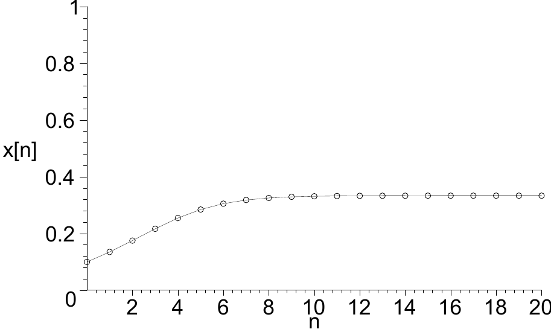
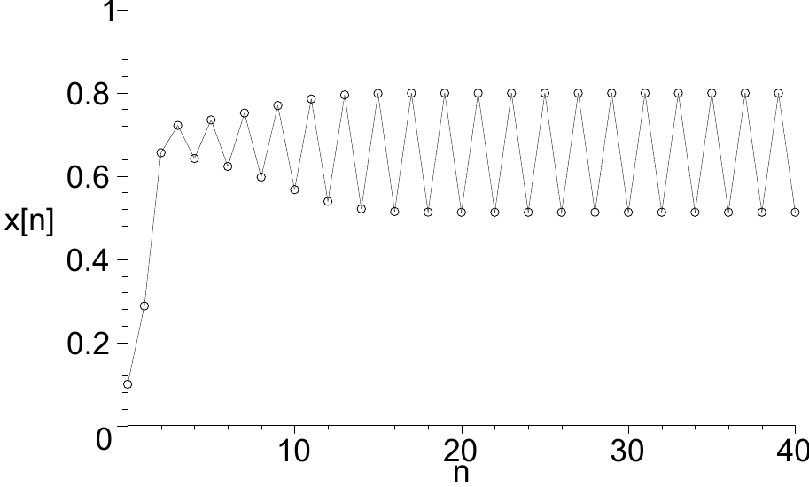
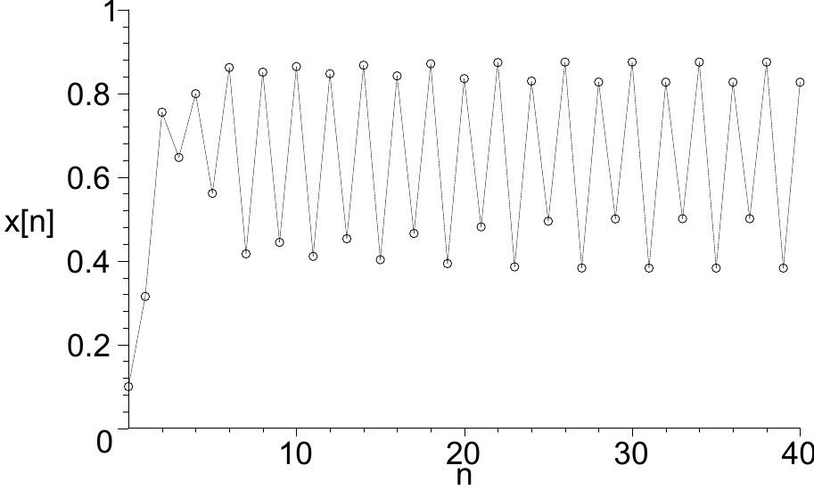
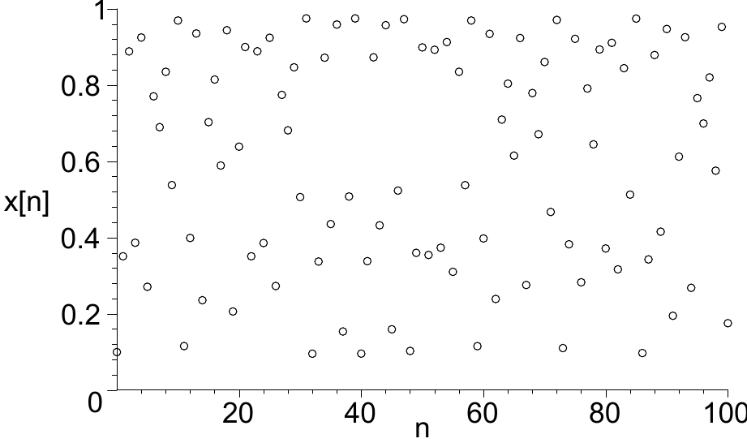

The rich behaviour of the logistic map {eq}`eq:disc1d:def_logistic_map` for various values of the parameter $r$. (a) $r=1.5$ convergence to a fixed point. (b) $r=3.2$, convergence to a period-2 solution. (c) $r=3.5$, convergence to a period-4 solution. (d) $r=3.9$, chaos.
```

One could ask why $r$ has to be confined between $[0,4]$. The reason is that in this range all $x_n$ will be bounded between $[0,1]$ provided that also the initial condition $x_0\in [0,1]$. This follows from the fact that the maximum of $f(x)$ is at $x=1/2$ regardless of the value of $r$. The maximum value is therefore $f(1/2) = r/4$, while the minimum value of $f$ in the interval $[0,1]$ is always 0. So, when $x_{n} \in [0,1]$, we know that $x_{n+1} \in [0,r/4]$, which explains that $r$ must be within $[0,4]$.

## Graphical analysis of maps

```{subfigure} 2
:name: fig:disc1d:some_cobwebs_logist
:align: center
:subcaptions: below

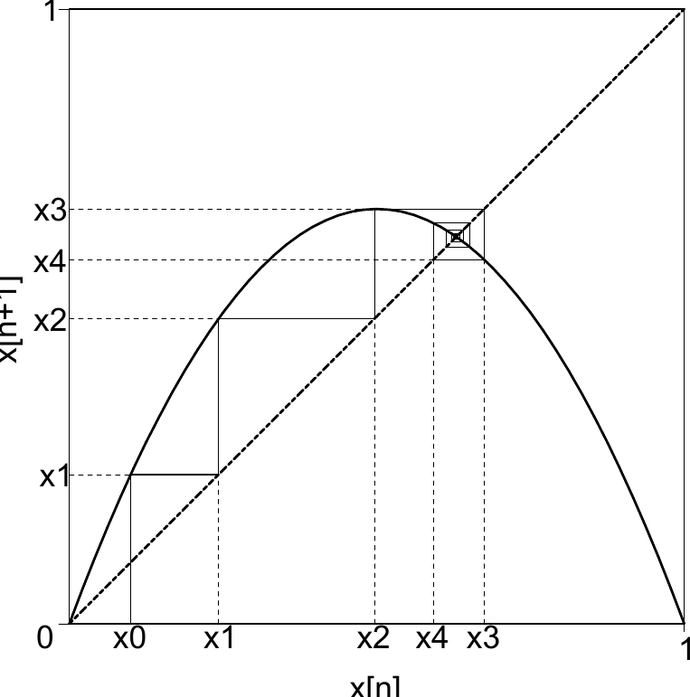
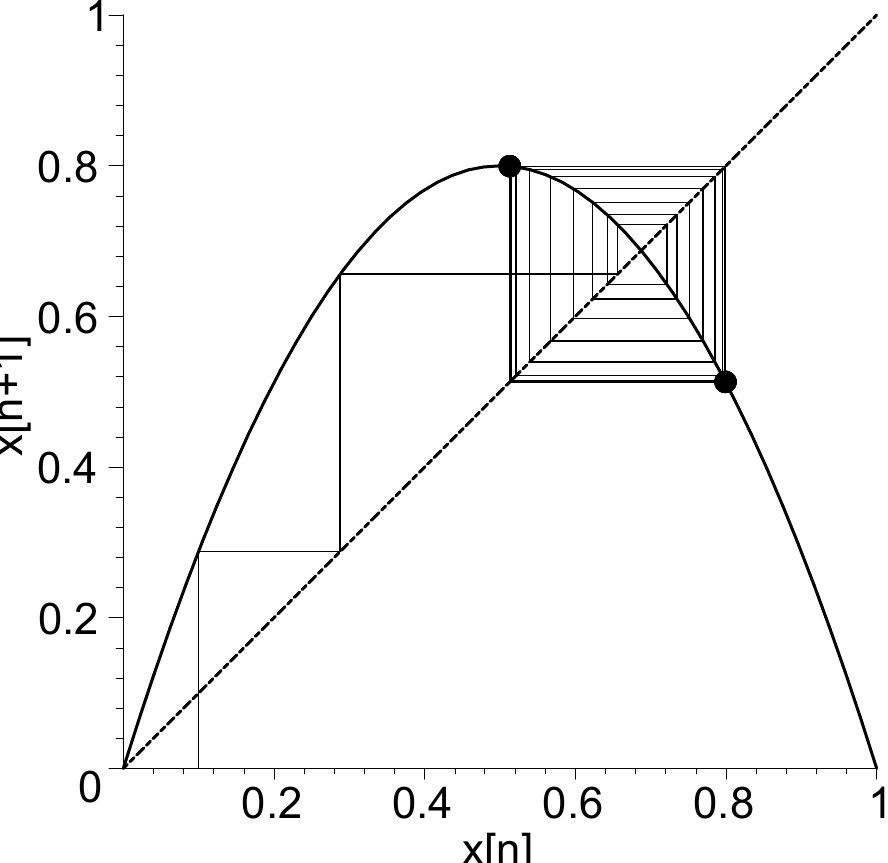
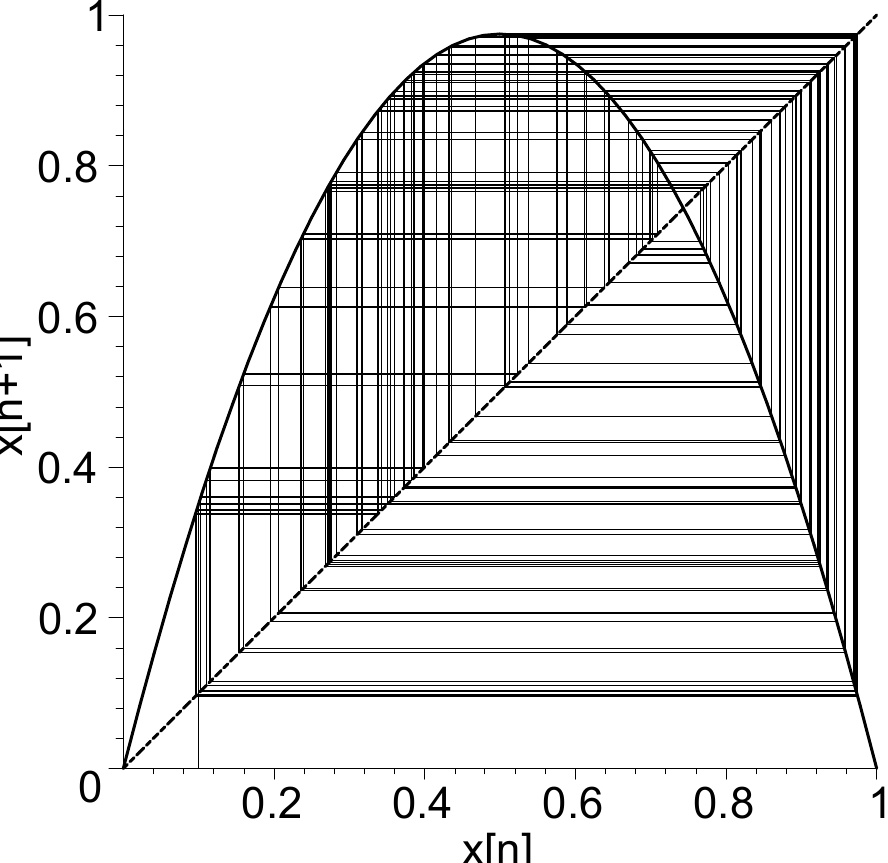

Cobweb graphs of the logistic map for various $r$. (a) $r=2.7$ convergence to a fixed point. (b) $r=3.2$, convergence to a period-2 solution. (c) $r=3.9$, chaos.
```

### The Cobweb method

An interesting graphical way to see how discrete maps work is by making so-called cob-web plots. It works as follows: Plot the mapping function $y=f(x)$ together with the line $y=x$, as is done for $r=2.7$ in {numref}`fig:disc1d:some_cobwebs_logist`. Now starting at $x_0$ use the graph $y=f(x)$ to find the value of $x_1$ by following the solid line in {numref}`fig:disc1d:some_cobwebs_logist`. The trick to proceed is to use the line $y=x$, i.e. follow the horizontal line to the diagonal, then follow the vertical dotted line giving you the point $x_1$ on the $x$-axis. Repeating the previous steps you find graphically $x_2 = f(x_1)$, then $x_3 = f(x_2)$ and so on, until you find a fixed point as in {numref}`fig:disc1d:some_cobwebs_logist`, or for example a period-2 solution as in {numref}`fig:disc1d:some_cobwebs_logist` or chaos as shown in {numref}`fig:disc1d:some_cobwebs_logist`. Note that in the latter two plots we refrained from plotting the dotted lines, because, as one soon realizes, one does not need to really go back to the $x$- and $y$-axis for finding the next point. Instead, it suffices to move back and forth between the graphs of $y=f(x)$ and $y=x$.

One can study the cobweb method in more detail by running the `maple` program below and changing the value of $r$ and/or looking at other mappings like $f(x)=r\sin(\pi x)$.

````{admonition} Maple
:class: maple

```{code-block} maple
restart; with(plots):
f := x -> r * x * (1 - x);
N := 20;
X := Array(0..N):
r := 3.9;
X[0] := 0.1;
for n from 0 to N-1 do
  X[n+1] := evalf( f(X[n]) );
end do:
# Create and plot the cobweb
pp := [X[0], 0]:
for n from 0 to N-1 do
  pp := pp, [X[n], X[n]], [X[n], X[n+1]];
end do:
plot([f(x), x, [pp] ], x=0..1,0..1, color = [black, blue, red],
       labels=["x[n]", "x[n+1]"]);
```
````

(sec:disc1:returnplot)=
### The Return plot

Another useful method to study the outcome of discrete maps is by making a so-called *return-plot*, a plot where one plots the value of $x_{n+1}$ versus the previous value $x_{n}$ for consecutive $n$. Usually it makes sense to take $n$ larger than some number in order to disregard the transient behaviour, i.e. the initial part of the time series in which the system is still evolving to its equilibrium state (which could be periodic or chaotic). As an example we plot in {numref}`fig:disc1d:returnplots_logist` the return-plots corresponding to the time-series of {numref}`fig:disc1d:some_series_logist`. Here is the `maple` -code to make a return-plot.

````{admonition} Maple
:class: maple

```{code-block} maple
restart; with(plots):
f := x -> r * x * (1 - x);
N := 200; X := Array(0..N):
r := 3.9; X[0] := 0.1;
for n from 0 to N-1 do
  X[n+1] := evalf( f(X[n]) );
end do:
nmin := 50;
xr := seq([X[n], X[n+1]], n=nmin..N-1):
pointplot([xr],labels=["x[n]", "x[n+1]"],view=[0..1,0..1]);
```
````

```{subfigure} 2
:name: fig:disc1d:returnplots_logist
:align: center
:subcaptions: below

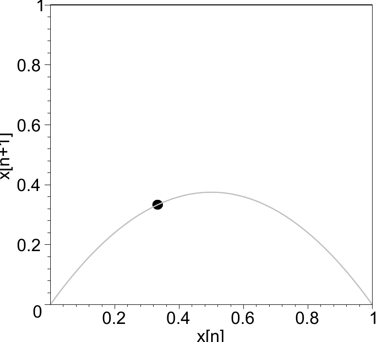
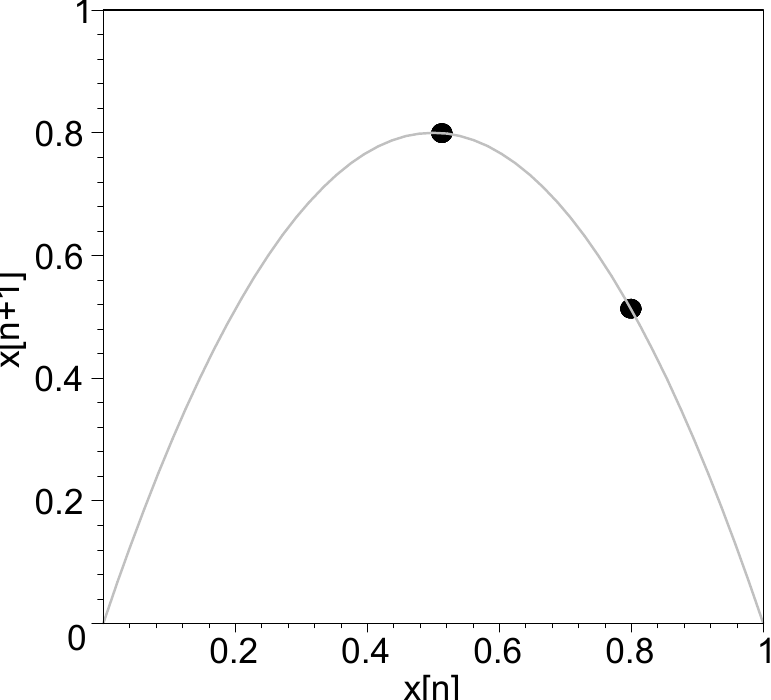
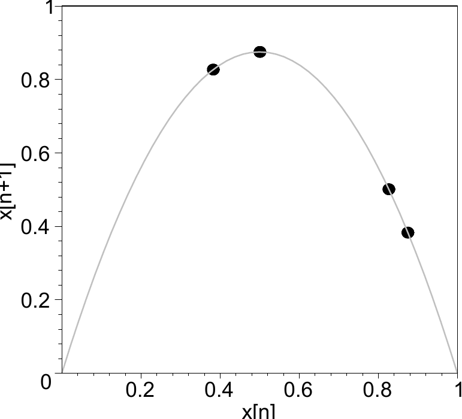
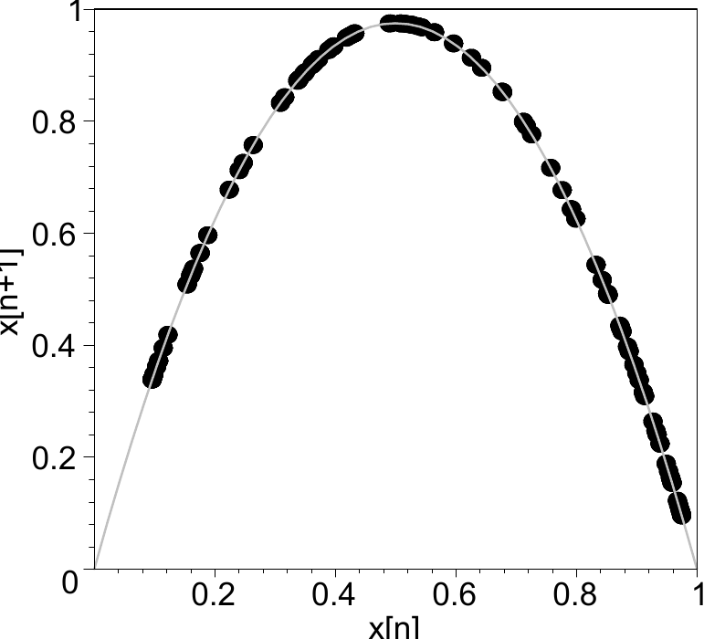

Return-plots of the logistic-map data corresponding to the time series plotted in {numref}`fig:disc1d:some_series_logist`. Solid gray line represents the mapping {eq}`eq:disc1d:def_logistic_map` (a) $r=1.5$, fixed point. (b) $r=3.2$, period-2 solution. (c) $r=3.5$, period-4 solution. (d) $r=3.9$, chaos.
```

The information conveyed by the return-plots may seem slightly trivial when one knows the expression of the mapping that was used to generate the data, as is the case for the example of {numref}`fig:disc1d:returnplots_logist` where it was easy to plot the gray line representing the mapping $f(x)$. But in a practical situation where one analyses the results of some experiment one usually does not know exactly which mapping describes the data-sets. In such a situation it is useful to make a return-plot since it gives an impression what kind of mapping lurks behind. Consider for example the three time-series plotted in the left column in {numref}`fig:disc1d:unknownmappings`. Judging from the time-series alone, one has a hard time figuring out which data-set is 1) uncorrelated noise, 2) chaotic data from a one-dimensional mapping, 3) chaotic data from a higher-dimensional mapping. The return-plots in the right column, on the other hand, are very instructive in this respect: clearly the first time-series originates from a higher dimensional mapping because the data-points in the return-plot cannot be described by a function of $x$ alone; the second time-series is the uncorrelated noise since the return-plot does not display any correlation between $x_{n}$ and $x_{n+1}$; the third time-series is well described by a first-order mapping (it is $x_{n+1} = -4x_{n}^{3} + 3x_{n}$).

```{subfigure} 2
:name: fig:disc1d:unknownmappings
:align: center
:subcaptions: below

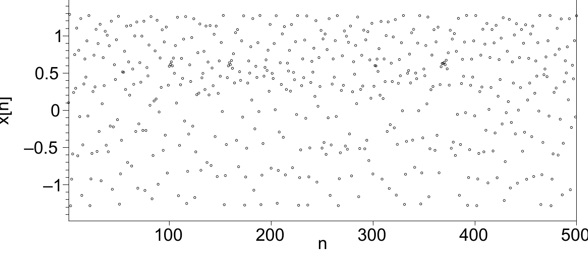
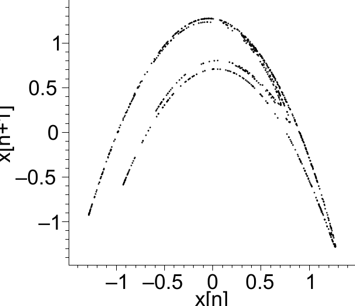
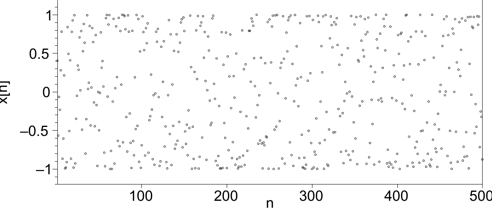
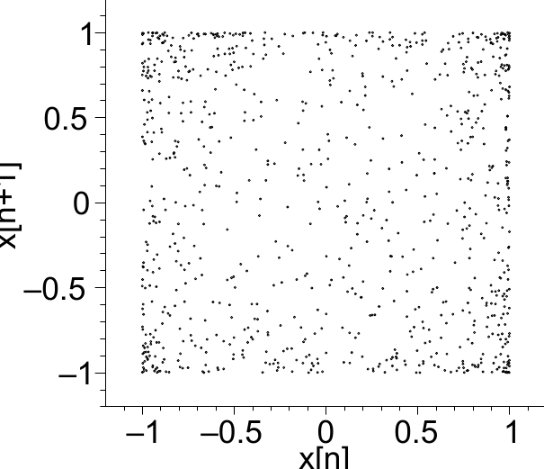
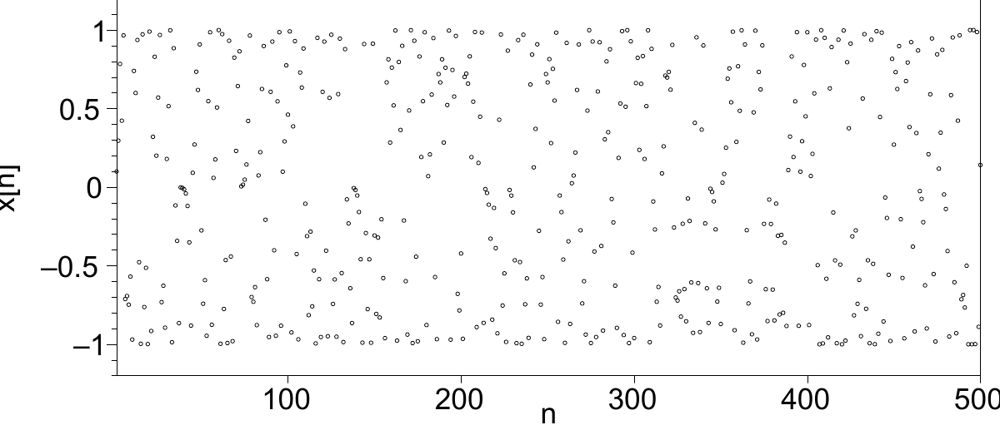
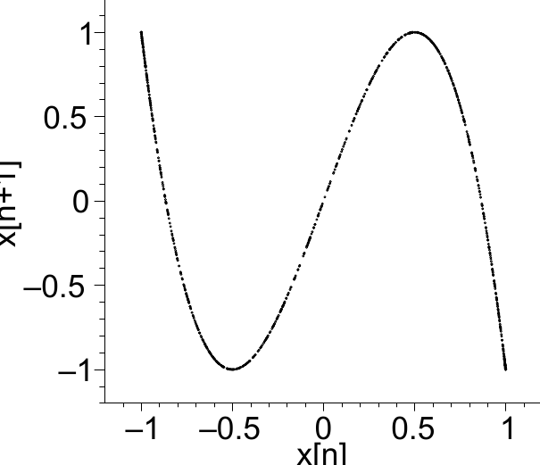

Three (unknown) data-sets: their time series and corresponding return-plots.
```

(sec:disc1:fixedstab)=
## Fixed points and stability analysis

While gaining some understanding of chaotic behaviour is the main objective of this chapter, it will prove useful to first get some firm ground under our feet and focus on the stationary behaviour we noticed in the system for $r < 3$, i.e. when the series converges to a fixed point $x_n \rightarrow x^*$, see for example {numref}`fig:disc1d:some_series_logist`. A fixed point solution of the map $x_{n+1} = f(x_n)$ can be found analytically by realizing that in the end: $\lim_{n\rightarrow\infty}x_{n+1} = x_{n}$, hence the fixed point solution $x^*$ to {eq}`eq:disc1d:def_iterative_map` must satisfy

```{math}
:label: eq:disc1d:def_fixed_point
x^{*} = f(x^{*})
```

For the logistic map we find two possibilities

```{math}
:label: eq:disc1d:fixed_point_logist
x^{*} = r x^{*} (1-x^{*})\,\,\,\,\,\,\,\,\,\,\rightarrow\,\,\,\,\, x^{*} = 0,\,\,\,\,\text{or}\,\,\,\,x^{*} = 1-\frac{1}{r}
```

Indeed, the series for $r=3/2$ depicted in {numref}`fig:disc1d:some_series_logist` converges to $x_{n} \rightarrow x^{*} = 1/3$ as predicted by {eq}`eq:disc1d:fixed_point_logist`. It will do that for any initial value $x \in \langle 0,1\rangle$ as shown in {numref}`fig:disc1d:logist_attractor`. The other fixed point of {eq}`eq:disc1d:fixed_point_logist`, $x^{*} = 0$, is only attainable when you start at exactly $x_0 = 0$ or $x_0 =1$. Any deviation will inevitably lead to $x^{*} = 1/3$. So we can say that for $r=3/2$ there is a fixed point $x^{*} = 1/3$ which is *stable*, and a fixed point $x^{*} = 0$ which is *unstable*.

Let us try to make the notion of stability of fixed points more precise. If we start the sequence at a fixed point $x_0 = x^{*}$, the system will remain in the fixed point by definition, see {eq}`eq:disc1d:def_fixed_point`. But what if we slightly perturb the initial value, i.e. we start with $x_0 = x^{*} + \epsilon_0$, where the perturbation is really small: $\epsilon_0 \ll 1$. Will the series $x_n$ return to the fixed point? Or will it diverge? Put differently, if we write $x_n = x^{*} + \epsilon_n$, then will the deviations $\epsilon_n$ approach to zero for increasing $n$ or not?

One can answer this question by substituting $x_n = x^{*} + \epsilon_n$ in {eq}`eq:disc1d:def_linear_map` and employing a Taylor expansion of $f$ around $x^{*}$

```{math}
:label: eq:disc1d:fixed_point_epsilon_taylor
x^{*} + \epsilon_{n+1} = f(x^{*} + \epsilon_n) = f(x^{*}) + \epsilon_n f'(x^{*}) + {\cal O}(\epsilon_{n}^{2})
```

where $f'(x^{*})$ is the shorthand notation for $\left.\frac{\mathrm{d} {f}}{\mathrm{d} {x}}\right|_{x=x^{*}}$. Using the fixed point definition $x^{*} =f(x^{*})$ and neglecting the higher order terms in $\epsilon$ one arrives at the following evolution equation (or mapping) for the deviations $\epsilon_n$:

```{math}
:label: eq:disc1d:fixed_point_epsilon_series
\epsilon_{n+1} = \epsilon_n \sigma
```

where $\sigma = f'(x^{*})$. It is important to note that $\sigma$ does not depend on $n$. The $\epsilon$ series {eq}`eq:disc1d:fixed_point_epsilon_series` is therefore similar to the series produced by the linear equation {eq}`eq:disc1d:def_linear_map` studied earlier. Using {eq}`eq:disc1d:sol_linear_map` we can express $\epsilon_n$ in terms of the initial perturbation $\epsilon_0$ and the derivative of $f$ at the fixed point

```{math}
:label: eq:disc1d:fixed_point_epsilon_solution
\epsilon_{n} = \epsilon_0 \sigma^{n}
```

Clearly the value of $\sigma$ determines the stability of the system, since $\epsilon_{n} \rightarrow 0$ when $- 1 < \sigma <1$. We conclude

```{math}
:label: eq:disc1d:fixed_point_stability
\sigma = f'(x^{*})\,\,\,\,\,\,\,\left\{
\begin{array}{ll}
 |\sigma| > 1 & x^*\ \text{is an unstable fixed point}\\
 |\sigma| < 1 & x^*\ \text{is a stable fixed point}
\end{array}\right.
```

```{figure} _static/disc1d/disc1d_logist_attractor_r1_5.png
:name: fig:disc1d:logist_attractor
:width: 70mm

Series of the logistic map at $r=1.5$ for different initial values $x_0$. The fixed point $x^* = 1/3$ is clearly stable. The fixed point $x^* = 0$ is unstable since a small perturbation is sufficient to escape from it.
```

If the derivative is positive and smaller than 0, i.e. $0 < \sigma < 1$, then the system will monotically approach the fixed point. If $-1 < \sigma < 0$, the system will converge to the fixed point $x^{*}$ in an alternating fashion. Note that when $|f'(x^{*})| = 1$ exactly, we cannot decide on the stability of the fixed point on the basis of the first derivative $f'$ alone. In such a situation (marginal stability) we must have a closer look at the higher order terms appearing in {eq}`eq:disc1d:fixed_point_epsilon_taylor`, as the governing equation for the deviations becomes

$$
\epsilon_{n+1} = \epsilon_n + \frac{1}{2}f''(x^{*})\epsilon_{n}^{2} + {\cal O}(\epsilon_{n}^{3})
$$

In this book we will generally not deal with these kind of exceptions.

```{subfigure} 2
:name: fig:disc1d:logist_attractor_local
:align: center
:subcaptions: below

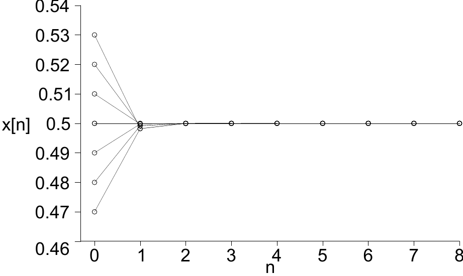
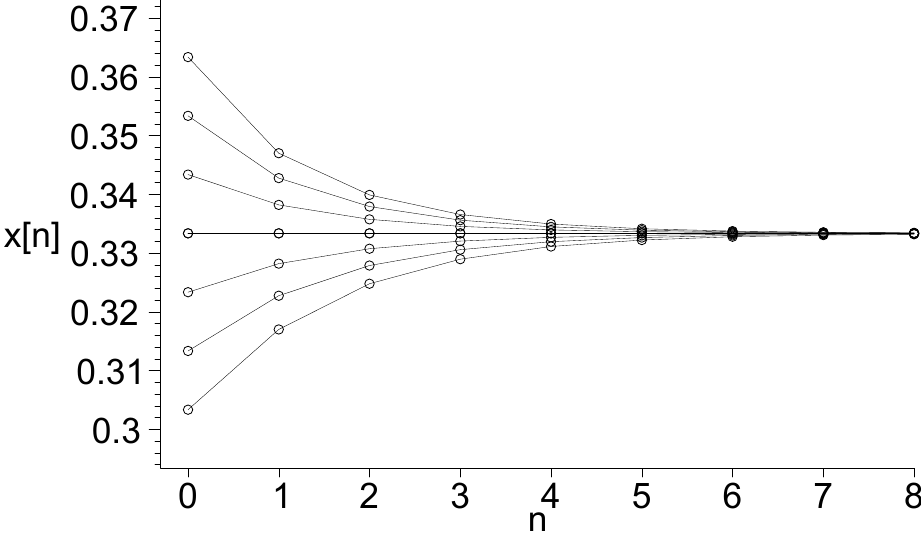

The convergence to the fixed point in a superstable situation and and ordinary stable situation. (a) $r=2$ Superstable situation, i.e. $\sigma = 0$: the convergence to the fixed point is extremely fast. (b) $r=1.5$ local convergence to the fixed point $x^{*}=1/3$.
```

A situation of special interest though, is when $\sigma = 0$. In this case the system is called *superstable*, since the convergence to the fixed point is extremely fast as one can observe in {numref}`fig:disc1d:logist_attractor_local`. Clearly the convergence rate is much faster than the exponential behaviour described by {eq}`eq:disc1d:fixed_point_epsilon_solution` for $\sigma \neq 0$. To find the convergence behaviour in the superstable case we must retain the second-order term in {eq}`eq:disc1d:fixed_point_epsilon_taylor`. If we write $a= f''(x^{*})/2$, the deviations are governed by $\epsilon_{n+1} = a \epsilon_{n}^{2}$, which enables one to express $\epsilon_{n}$ as a function of $\epsilon_{0}$:

```{math}
:label: eq:disc1d:fixed_point_epsilon_solution_superstable
\epsilon_{n} = a^{2^{\scriptstyle n} -1} \,\epsilon_{0}^{2^{\scriptstyle n}}
```

In {eq}`eq:disc1d:fixed_point_epsilon_solution_superstable` one should pay attention to the entirely different dependence on $\epsilon_{0}$ compared to the linear dependence in {eq}`eq:disc1d:fixed_point_epsilon_solution`, which explains the unusually rapid convergence in case of superstability.

````{admonition} Example
:class: example

The fixed points for the logistic map were given in {eq}`eq:disc1d:fixed_point_logist`: $x^{*} = 0$, $x^{*} = 1-\frac{1}{r}$. The derivative is $f'(x) = r(1-2x)$. Inserting the first fixed point yields

$$
f'(0) = r
$$

{eq}`eq:disc1d:fixed_point_stability` tells us that $x^{*} = 0$ is stable for $0 \leq r < 1$.  Similarly we have

$$
f'(1-\frac{1}{r}) = 2 - r
$$

which shows that the fixed point $x^{*} = 1-1/r$ is stable when $|2-r| < 1$, i.e. when $r \in \langle 1,3 \rangle$. The fixed point is superstable at $r=2$.
````

```{figure} _static/disc1d/disc1d_logist_p2graph.png
:name: fig:disc1d:plot_of_g
:width: 60mm

Plot of $f(x)$ and $g(x)=f(f(x))$ for $r=3.2$, together with $y = x$. The period-2 solution, which satisfies $x=g(x)$, is indicated with the solid black circles. The two (unstable) fixed points that correspond to period-1 solutions, i.e. $x=f(x)$, are indicated by gray circles. Note that these points also satisfy $x=g(x)$ and could be mistakenly interpreted as period-2 solutions.
```

(sec:disc1d:periodicstability)=
## Periodic solutions and their stability

In the time-series plots of the logistic map shown in {numref}`fig:disc1d:some_series_logist` we observe, apart from chaos and stationary solutions, sustained periodic behaviour (viz. {numref}`fig:disc1d:some_series_logist` and {numref}`fig:disc1d:some_series_logist`). Below we will show how one can find periodic solutions in discrete maps and how one can determine the stability of these solutions. We start with a period-2 solution and then generalize the method for periodic solutions of arbitrary order.

A period-2 solution, as for example depicted in {numref}`fig:disc1d:some_series_logist`, is a solution that looks like

$$
x^{*}_{1},x^{*}_{2}, x^{*}_{1},x^{*}_{2}, x^{*}_{1},x^{*}_{2},\ldots
$$

Apparently these points map onto each other and satisfy the following relation

```{math}
:label: eq:disc1d:p2_fixed_points_mutual
x^{*}_{2} = f(x^{*}_1)\,\,\,\,\,\,\,x^{*}_{1} = f(x^{*}_2)
```

One could also state that for $n$ large enough period-2 solutions satisfy $x_{n+2}=f(x_n)$. Both considerations lead to

```{math}
:label: eq:disc1d:p2_fixed_points
x^{*}_{1} = f(f(x^{*}_1))\,\,\,\,\,\,\,x^{*}_{2} = f(f(x^{*}_2))
```

which shows that both $x^{*}_{1}$ and $x^{*}_{2}$ are fixed points to the map

```{math}
:label: eq:disc1d:p2_fixed_points_g
x^{*} = g(x^{*})\,\,\,\,\,\,\,\,\,\,\,\,\,\,\,\,g(x) = f(f(x))
```

For the logistic map we have for example

```{math}
:label: eq:disc1d:p2_g_logisticmap
g(x) = r\,f(x) (\,1- f(x)\,) = r^2 x(1-x)(1-rx+rx^2)
```

which is plotted for $r=3.2$ in {numref}`fig:disc1d:plot_of_g`, together with $y=x$, and $y = f(x)$. The period-2 solutions {eq}`eq:disc1d:p2_fixed_points_g` are the crossing points of the curves $y=g(x)$ and $y=x$ and can be determined analytically or numerically by solving $x=g(x)$. But it is important to bear in mind that a solution to $x=f(x)$ is also a solution to $x=g(x)$. Indeed, the curves $f(x)$ and $g(x)$ cross each other in the fixed point solution indicated by the gray dot in {numref}`fig:disc1d:plot_of_g`. This means that if one has found solutions to $x=g(x)$, one has to be careful not to interpret these solutions necessarily as period-2 solutions, because it could also just be a period-1 solution.

````{admonition} Example
:class: example

In the following maple program we determine the true period-2 solutions for the logistic map.

```{code-block} maple
restart; with(plots):
f := x->r*x*(1-x);
g := x->f(f(x));
fp2 := {solve(x=g(x),x)};
```

`maple` returns the general solution to $x=g(x)$, where $g$ is given by {eq}`eq:disc1d:p2_g_logisticmap`; we have added the curly bars to store the solution in the form of a *set*:

$$
\mathtt{fp2} = \left\{ 0\,,{1-\frac{1}{r}}\,, {\frac {r+1-\sqrt {{r}^{2}-2\,r-3}}{2r}}\,, {\frac {r+1+\sqrt {{r}^{2}-2\,r-3}}{2r}}\, \right\}
$$

In this set we also recognize the fixed points solutions $x^* = f(x^*)$ derived earlier in {eq}`eq:disc1d:fixed_point_logist`. To get the 'true' period-2 solutions, we calculate the period-1 solutions separately and exclude this set of solutions from the former set by issuing the `maple` command `minus`:

```{code-block} maple
fp1 := {solve(x=f(x),x)};
truefp2 := fp2 minus fp1;
```

```{math}
:label: eq:disc1d:p2_logist
\mathtt{truefp2} = \left\{\frac {r+1\pm\sqrt {{r}^{2}-2\,r-3}}{2r}\right\}
```

Substituting $r=3.2$ we get $x^{*}_{1,2} \approx \{0.513,0.799\}$, consistent with {numref}`fig:disc1d:some_series_logist`.
````

### Stability of period-2 solutions

Now that we have seen that period-2 solutions to $f(x)$ are simply fixed-point solutions to the map $g(x) = f(f(x))$, we can get directly derive their stability from {eq}`eq:disc1d:fixed_point_stability`:

$$
\sigma_{1}^{(2)} = g'(x^{*}_{1})\,\,\,\,\,\text{and}\,\,\,\,\,\, \sigma_{2}^{(2)} = g'(x^{*}_{2})
$$

where the superscript $^{(2)}$ reminds us that we are dealing with a period-2 solution. Although not *a priori* clear, it turns out that both expressions yield the same value for the stability, i.e. $\sigma_{1}^{(2)} = \sigma_{2}^{(2)}$. To see this, we work out the derivative using the chain-rule for differentiation

$$
\begin{aligned}
\sigma_{1}^{(2)} &= \frac{d}{dx} \left[ f\left( f(x) \right) \right]_{x=x^{*}_{1}}
= \left[ f'\left( f(x) \right) f'(x)\right]_{x=x^{*}_{1}} \\
 &= f'\left( f(x^{*}_{1}) \right) f'(x^{*}_{1}) = f'(x^{*}_{2}) f'(x^{*}_{1})
\end{aligned}
$$

where in the last step we used {eq}`eq:disc1d:p2_fixed_points_mutual`. In the same fashion one can work out the expression for $\sigma_{2}^{(2)}$ leading to the same outcome. So, we can drop the subscripts and state for the stability

```{math}
:label: eq:disc1d:period2_stability_general
\sigma^{(2)} = g'(x^{*}_{1}) = g'(x^{*}_{2}) = f'(x^{*}_{1}) f'(x^{*}_{2})
```

As in {eq}`eq:disc1d:fixed_point_stability`, the period-2 solution pair $(x^{*}_{1},x^{*}_{2})$ is stable if $\sigma^{(2)}$ computed from {eq}`eq:disc1d:period2_stability_general` satisfies

$$
|\sigma^{(2)}| < 1
$$

````{admonition} Example
:class: example

To determine the stability range of the period-2 solutions of the logistic map we extend the maple-code of the previous example by the following commands

```{code-block} maple
dg := D(g):
dg(x);
```

This gives

$$
g'(x) = r^2(1 - 2 r x + 2 r x^2) (2x-1)
$$

Next we determine the stability range by

```{code-block} maple
solve(abs(dg(truefp2[1]))=1,r);
```

which, ignoring negative solutions, yields

$$
3,1+\sqrt{6}
$$

Hence the stability range for the period-2 solution is $r \in \langle 3,3.4494\rangle$. The period-2 solution is found to be superstable (i.e. $\sigma^{(2)}=0$) for $r=1+\sqrt{5}= 3.236\ldots$.
````

(sec:disc1d:period_m)=
### Higher order periodic solutions and their stability

```{subfigure} 2
:name: fig:disc1d:plot_of_f3
:align: center
:subcaptions: below

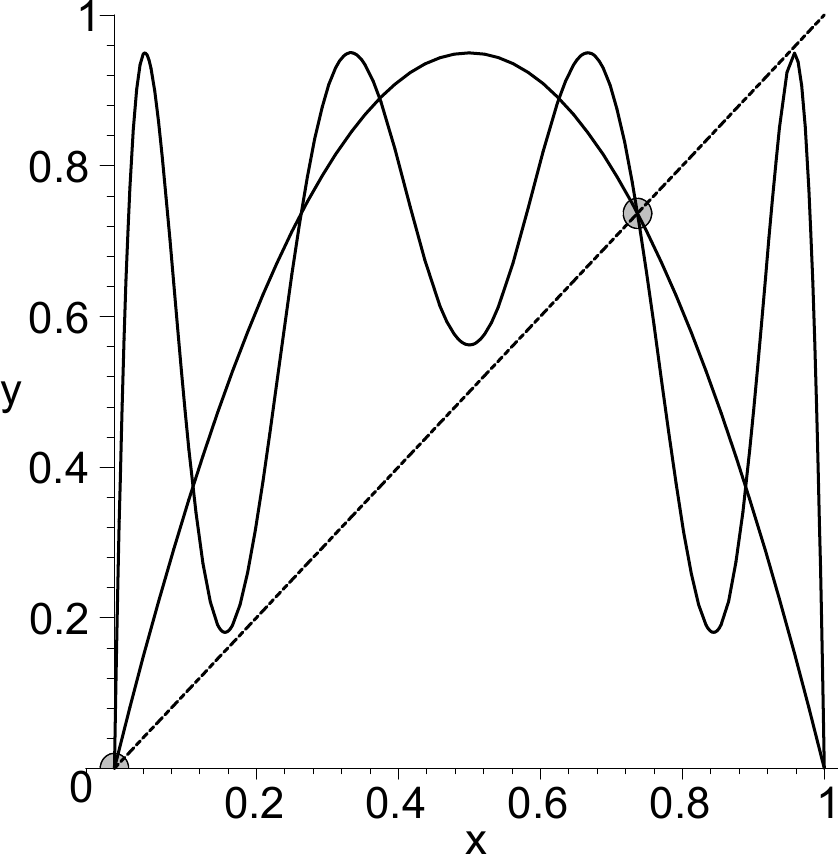
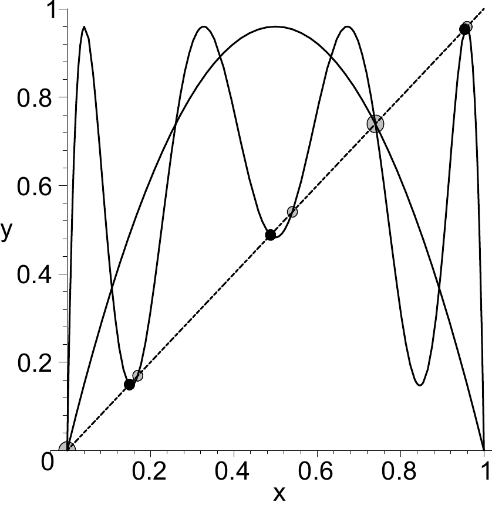

Plots of $f(x)$ and $g(x)=f^{(3)}(x)$ together with $y = x$. True period-3 solutions are indicated with the solid small black circles (stable) and small gray circles (unstable). The (unstable) fixed points $x=f(x)$ are indicated by big gray circles. Note that these points also satisfy $x=g(x)$. (a) $r=3.80$, no true period-3 exists. (b) $r=3.84$, two sets of period-3 solutions are found.
```

The notions discussed above can easily be generalized to periodic solutions of any order. A periodic solution of order $m$, or shortly a period-$m$ solution, looks like

$$
x^{*}_{1},x^{*}_{2},\ldots x^{*}_{m},\, x^{*}_{1},x^{*}_{2},\ldots,x^{*}_{m},\, x^{*}_{1},x^{*}_{2},\ldots,x^{*}_{m},\, \ldots
$$

which are related to each other by the following relations

```{math}
:label: eq:disc1d:pm_fixed_points_mutual
x^{*}_{1} = f(x^{*}_{m}),\,\,\,\, x^{*}_{2} = f(x^{*}_{1}),\,\,\,\, x^{*}_{3} = f(x^{*}_{2}),\,\,\,\, \ldots
```

One can also state that for $n$ large enough, a period-$m$ solution satisfies $x_{n+m} = f(x_n)$. Hence we define $g(x)=f^{(m)}(x) = f(f(f(\ldots f(x))))$, i.e. $g$ is equal to $m$-times recursive application of $f$. The equation from which the periodic solutions can be derived is then

```{math}
:label: eq:disc1d:pm_fixed_points
x^{*}_{k} = g(x^{*}_k)\,\,\,\,\,\,\,\text{all}\,k=1,\ldots,m
```

Again one must be careful with the interpretation of the solutions to {eq}`eq:disc1d:pm_fixed_points`, since they might contain 'stowaways', i.e. the solution of lower order periodic solutions. For example, when looking for a period-4 solution, not only the fixed point $x^*=f(x^*)$ will satisfy {eq}`eq:disc1d:pm_fixed_points`, but also the period-2 solution $x^*=f^{(2)}(x^*)$ will contaminate the outcome.

The stability of the period-$m$ solution can be derived either from

```{math}
:label: eq:disc1d:periodm_stability_general1
\sigma^{(m)} = g'(x^{*}_{1}) = g'(x^{*}_{2}) = \ldots = g'(x^{*}_{m})\\
```

or, equivalently, from

```{math}
:label: eq:disc1d:periodm_stability_general2
\sigma^{(m)} = f'(x^{*}_{1}) f'(x^{*}_{2}) \ldots f'(x^{*}_{m})
```

The period-$m$ solution is stable if $\sigma^{(m)}$ in {eq}`eq:disc1d:periodm_stability_general1` or {eq}`eq:disc1d:periodm_stability_general2` satisfies

```{math}
:label: eq:disc1d:periodm_stability_criterion
|\sigma^{(m)}| < 1
```

````{admonition} Example
:class: example

To find a period-3 solution for the logistic map we must solve $x^* = g(x^*)$ with $g(x) = f^{(3)}(x)$. In Fig {numref}`fig:disc1d:plot_of_f3` we have plotted $y = g(x)$ together with $y=f(x)$ and $y=x$. The left graph is for $r=3.80$ and shows that there are no crossings between $y=x$ and $y=g(x)$ other than the crossings $x=f(x)$, implying that there are no period-3 solutions possible. The right graph is for $r=3.84$. For this value there are *two* sets of period-3 solutions, i.e. there are six solutions, next to the fixed point solutions $x^* = f(x*)$ (indicated by the big gray dots). One set of the period-3 solutions turns out to be stable (indicated by the black dots), whereas the other set appears to be unstable (indicated by the gray dots).

```{code-block} maple
restart; with(plots):
f := x->r*x*(1-x);
g := x->(f@@3)(x);
fp1 := {solve(x=f(x),x)};
fp3 := {solve(x=g(x),x)};
truefp3 := fp3 minus fp1;
r := 3.84;
tfp3 := allvalues(op(truefp3));
```

The latter command yields

```{code-block} maple
  tfp3 := 0.149406, 0.169433, 0.488004, 0.540387, 0.953736, 0.959447
```

The stability can be calculated using {eq}`eq:disc1d:periodm_stability_general1`. We determine the derivative $g'$ by the `maple` command `D(g)`, which directly yields the derivative as a function. Next we use the `seq` command to enumerate all the values

```{code-block} maple
dg := D(g):
seq(dg(tfp3[i]),i=1..6);
  -0.875276, 2.74407, -0.875276, 2.74407, 2.74407, -0.875276
```

which confirms the message of {eq}`eq:disc1d:periodm_stability_general1` to the extent that the stabilities of the individual solutions $x_k$ that constitute a periodic solution are the same.

An alternative way to calculate the stability is by using {eq}`eq:disc1d:periodm_stability_general2`. We start with one solution and apply {eq}`eq:disc1d:pm_fixed_points_mutual` to find the other values that belong to the same periodic solution. This is necessary since the expression for `tfp3` does not tell which solutions belong to each other.

```{code-block} maple
..
df := D(f):
x3a := tfp3[1]: x3b := f(x3a): x3c := f(x3b):
stab := df(x3a)*df(x3b)*df(x3c);
                stab := -.875276

x3a := tfp3[2]: x3b := f(x3a): x3c := f(x3b):
stab := df(x3a)*df(x3b)*df(x3c);
                stab := 2.74407
```

As expected, the stability values match exactly those of the previous method.
````

(sec:disc1d:bifurcation_diagrams)=
## Bifurcation-diagrams

The fixed points solutions and periodic solutions usually depend on the parameters of the system. It is therefore often very useful to make a graph of the solutions as a function of the parameter(s) of the system. In {numref}`fig:disc1d:theobifurcationdiagram` we have done this for the logistic map, plotting as a function of the parameter $r$ the fixed point solution {eq}`eq:disc1d:fixed_point_logist`, the period-2 solution {eq}`eq:disc1d:p2_logist`, the period-4 solution, and, in the right graph, the period-3 solution. The left graph nicely shows that the fixed-point loses its stability at the exact same point where the period-2 solution becomes stable. It seems as if the solution is split into two branches. This is called a bifurcation, after the Latin word *bifurc* meaning fork. Then for larger $r$ the period-2 solution becomes unstable itself and bifurcates into a period-4 solution. Although not shown here, the period-4 solution soon bifurcates again into a period-8 solution, and so on. This process of subsequent bifurcations is called *period-doubling*. We will get back to this issue in section {numref}`sec:disc1d:universality`.

```{subfigure} 2
:name: fig:disc1d:theobifurcationdiagram
:align: center
:subcaptions: below

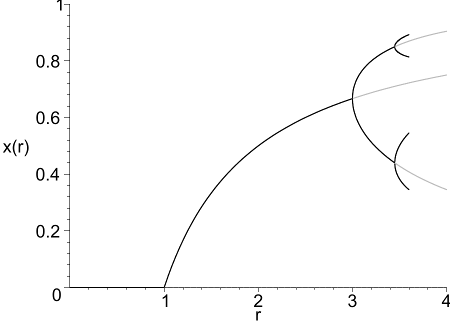
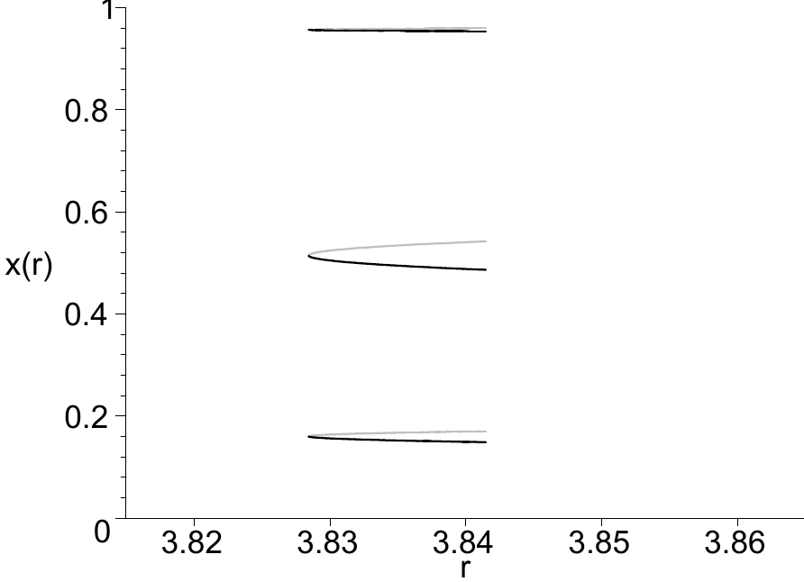

Bifurcation diagrams based on the analytical solutions to the logistic map (a) Period-doubling. (b) Period-3.
```

In {numref}`fig:disc1d:theobifurcationdiagram` the solutions for a period-3 are plotted. It turns out that this solution cannot exist for $r$-values below $3.828427\ldots$. In the graph one observes the stable and unstable branch, the existence of which we already encountered in {numref}`fig:disc1d:plot_of_f3`. But the stable branch (black lines) becomes unstable quite soon and bifurcates (not shown) into a stable period-6 solution for $r>3.841499\ldots$. The reason for not showing the period-6 solution is that the analysis becomes rather involved. With use of `maple` it is not impossible but surely it is rather cumbersome.

We mention in passing that `maple` does provide a fast *numerical* way to get a quick glance of the bifurcations of a map. See the small code below where we calculate and plot the solutions to $x=f^{(4)}(x)$ for the *sine map*

$$
x_{n+1} = f(x_n) = r \sin(\pi x_{n})
$$

We do this by employing the `maple` command `implicitplot`.

````{admonition} Maple
:class: maple

```{code-block} maple
restart; with(plots):
f := x->r*sin(Pi*x);
implicitplot([x=(f@@4)(x)],r=0.0..1,x=0..1,grid=[150,150],
  view=[0..1,-0.1..1],labels=["r","x(r)"],thickness=2,axes=framed);
```
````

The method cannot distinguish between true period-4 solutions and double period-2 solutions, or quadruple period-1 solutions. Nor does it provide insight into the stability of the solutions. Nevertheless the method is capable of rapidly providing the global structure of the solutions. Note the extra period-4 solutions near $r=1$. They are not stable however.

```{figure} _static/disc1d/disc1d_bifurcation_implicit_sin.png
:name: fig:disc1d:bifurcation_implicit_sin
:width: 80mm

Numerical solutions to $x=f^{(4)}(x)$ as a function of $r\in[0.1]$ for the sine map $x_{n+1} = f(x_n) = r \sin(\pi x_{n})$ calculated and plotted by using the `maple` command `implicitplot`
```

An alternative efficient method to study the equilibrium behaviour as a function of the system parameters is the following. The idea is to keep $r$ fixed and iterate the map under study for, say, 1000 steps and then plot only the *last* half of the series at that particular $r$-value. By throwing away the first part of the series one disregards on purpose the *transient* behaviour, allowing one to focus on the *equilibrium* behaviour of the system. If one repeats this procedure for different values of $r$ one obtains a plot like {numref}`fig:disc1d:series_bifurcation_logist`, usually referred to as the 'bifurcation diagram' of the map.

````{admonition} Maple
:class: maple

```{code-block} maple
restart; with(plots):
f := x -> r * x * (1 - x);
Nr := 500; rmin := 3.3; rmax := 4;
N := 1000; Nmin := ceil(0.8*N);
X := Array(0..N):
X[0] := 0.57:
for i from 0 to Nr do
  r := evalf(rmin + (rmax - rmin)*i/Nr);
  for n from 0 to N-1 do X[n+1] := evalf( f(X[n]) ); end do:
  pl[i] := seq([r,X[n]],n=Nmin..N);
end do:
pointplot([seq(pl[i],i=1..Nr)],symbolsize=1,view=[rmin..rmax,0..1],
            labels=["r", "x(r)"]);
```
````

This bifurcation diagram is very instructive to the extent that one can see in one blink for which values of $r$ there is chaos, or periodic behaviour. By zooming in on a specific range of $r$, as done in {numref}`fig:disc1d:series_bifurcation_logist_zooms` one can get a closer look at the behaviour. One may have noted the correspondence between the bifurcation diagrams and the analytical graphs in {numref}`fig:disc1d:theobifurcationdiagram`. The difference is that with the method just outlined one will not obtain the unstable branches appearing in {numref}`fig:disc1d:theobifurcationdiagram`.

```{figure} _static/disc1d/disc1d_logist_series_bifurcation.png
:name: fig:disc1d:series_bifurcation_logist
:width: 100mm

Bifurcation diagram of the logistic map obtained by plotting the entire series for different values of $r$
```

```{subfigure} 2
:name: fig:disc1d:series_bifurcation_logist_zooms
:align: center
:subcaptions: below

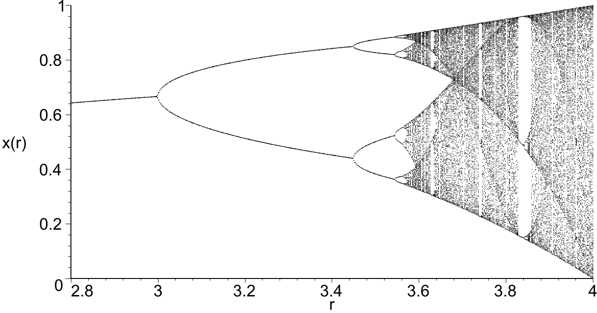
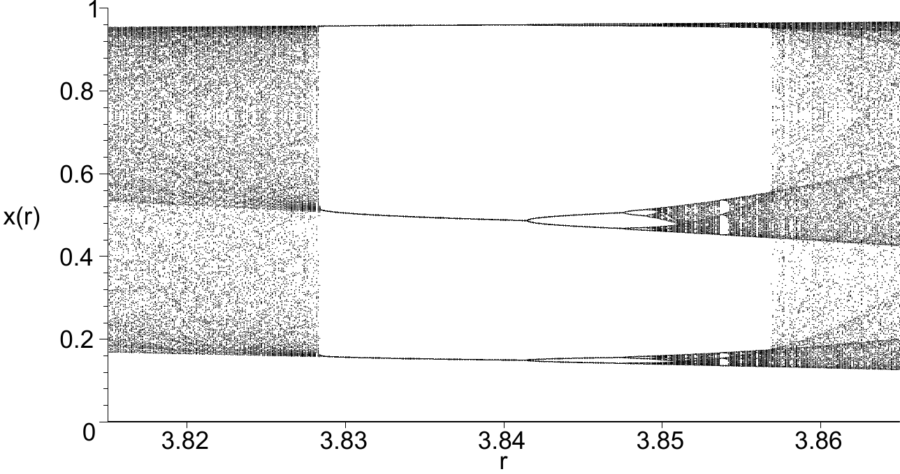

Various close-ups of {numref}`fig:disc1d:series_bifurcation_logist` (a) Period doubling route to chaos. (b) Region around the period-3 solution.
```

Closer inspection of the graphs in {numref}`fig:disc1d:series_bifurcation_logist_zooms` shows two 'routes to chaos'. In the left graph one observes the subsequent period-doubling for increasing $r$, which tend to happen sooner and sooner, until for $r=r_{\infty} \approx 3.56\ldots$ the behaviour is no longer periodic but becomes chaotic. In the next section we make this notion more precise, how one can distinguish chaos from periodic behaviour with a very high order. Another way to enter chaos becomes clear from {numref}`fig:disc1d:series_bifurcation_logist_zooms`: if one starts at $r=3.83$ in the stable period-3 solution and one gradually *lowers* $r$ then at $r=3.82\ldots$ the period-3 solution loses its stability and the behaviour suddenly jumps into the chaotic mode. In this case chaos comes 'out of the blue sky'. Interestingly though, when looking at the series for $r$ slightly below the critical value $3.82$, we can already see the period-3 solution lurking behind: the systems appears to be settling into the period-3 solution, but since it is not yet stable, it escapes from it at seemingly arbitrary instances. This behaviour is called *intermittent*. This is why the transition to chaos is often called *intermittency transition* to(/from) chaos. Note that for increasing $r$, a period-doubling route to chaos is followed. Indeed, the period-3 solution bifurcates into a period-6, which bifurcates into a period-12, until for some critical value ($r=\ldots$) the solution is chaotic again.

(sec:disc1d:lyapunov_theory)=
## Quantifying chaos: Lyapunov exponents

```{figure} _static/disc1d/disc1d_logist_lyap_r39_lin.png
:name: fig:disc1d:logist_lyap_two_sets
:width: 100mm

Logistic map at $r=3.9$. Two sets with slightly different initial conditions $y_0 = x_0 + 10^{-9}$. The difference becomes already obvious at $n=25$.
```

If the essential aspect of chaos is the sensitive dependence on initial conditions, would it then be possible to quantify this sensitivity? Could we for example measure it? To this end, let us study two series $x_n$ and $y_n$ that are ruled by the same evolution equation but which are initiated by slightly different initial conditions, i.e. $y_0 = x_0 + \epsilon_0$; see the maple code below.

````{admonition} Maple
:class: maple

```{code-block} maple
restart; with(plots): Digits := 40;
f := x -> r * x * (1 - x);
r := 3.9;
N := 100;
X := Array(0..N): Y := Array(0..N):
X[0] := 0.1: Y[0] := X[0] + epsilon;
epsilon := 1e-9;
for n from 0 to N-1 do
  X[n+1] := evalf( f(X[n]) );
  Y[n+1] := evalf( f(Y[n]) );
end do:
```
````

The two resulting series are plotted in {numref}`fig:disc1d:logist_lyap_two_sets`. It is interesting to see that the difference between the two sets becomes clear already around $n=25$. Furthermore one gets the impression that the sets diverge quite suddenly. This however is rather deceiving as becomes clear when we plot the logarithm of the absolute differences, $\ln|y_n-x_n|$, see {numref}`fig:disc1d:logist_lyap_r39_log`. The graph shows clearly that the deviations were growing steadily from the very beginning, and that the log-values were merely following a straight line. From this one can conclude that the error growth is exponential, i.e.

```{math}
:label: eq:disc1d:lyapunov_phenomenological
|y_n-x_n| \simeq |\epsilon_0| \,\text{e}^{\Lambda n}
```

The exponent $\Lambda$ in {eq}`eq:disc1d:lyapunov_phenomenological` is called the *Lyapunov-exponent*. The exponential growth of deviations turns out to be a generic feature of chaotic systems and by means of $\Lambda$ one can quantify the rate of growth. The Lyapunov-exponent thus provides a measure of how sensitive the system depends on the initial conditions. In the present example we find $\Lambda \approx 0.6$, based on the slope of the dashed line in {numref}`fig:disc1d:logist_lyap_r39_log`.

```{figure} _static/disc1d/disc1d_logist_lyap_r39_log.png
:name: fig:disc1d:logist_lyap_r39_log
:width: 80mm

Evolution of the deviations $|y_n - x_n|$ plotted on a log-scale.
```

To arrive at a more formal definition of $\Lambda$,  let us follow the evolution of the deviations between the series $x_n$ and $y_n$, i.e. $\epsilon_n = y_n - x_n$. We consider the situation where the deviations are still so small that a first order Taylor approximation is applicable. In the first step the difference between $y_1 = f(y_0)$ and $x_1 = f(x_0)$ to first order becomes

$$
\epsilon_1 = y_1 - x_1 = f(x_0 + \epsilon_0) - f(x_0) = \epsilon_0 f'(x_0)
$$

In the second step we use that $y_1 = x_1 + \epsilon_1$

$$
\epsilon_2 = y_2 - x_2 = f(x_1 + \epsilon_1) - f(x_1) = \epsilon_1 f'(x_1) = \epsilon_0 f'(x_0) f'(x_1)
$$

Repeating these steps $N$ times, we arrive at

```{math}
:label: eq:disc1d:epsilon_evolution
\epsilon_N = \epsilon_0 f'(x_0) f'(x_1) f'(x_2) \ldots f'(x_{N-1})
```

provided that all $\epsilon_n$ are still small enough to justify a Taylor expansion. The Lyapunov exponent introduced in {eq}`eq:disc1d:lyapunov_phenomenological` can now be determined through $\Lambda=\frac{1}{N}\ln(|\epsilon_N/\epsilon_0|)$, which, by virtue of {eq}`eq:disc1d:epsilon_evolution`, amounts to

```{math}
:label: eq:disc1d:lyapdef
\begin{aligned}
\nonumber
 \Lambda &= \frac{1}{N} \ln\left(|f'(x_0)| |f'(x_1)| |f'(x_2)| \ldots |f'(x_{N-1})|\right)\\
 &= \frac{1}{N} \sum_{n=0}^{N-1} \ln\left(|f'(x_n)|\right)
\end{aligned}
```

This result implies that the rate of error-growth can be calculated *a priori* from the evolution of a single series $x_1,\ldots,x_N$ and the derivative of the mapping function. As a check we apply {eq}`eq:disc1d:lyapdef` to the first 25 values of the series $x_n$ plotted in {numref}`fig:disc1d:logist_lyap_two_sets`, from which we obtain $\Lambda = 0.61\ldots$, in good agreement with the slope of the dashed line in {numref}`fig:disc1d:logist_lyap_r39_log` with an estimated value of 0.6.

From a conceptual point of view, the Lyapunov exponent $\Lambda$ is very instructive. $\Lambda$ smaller than zero implies that the deviations become smaller as $n$ increases; consequently the two series converge to each other. Conversely, $\Lambda$ larger than zero implies that the two series diverge from each other. Again we stress that the rate of divergence is exponential.

This brings us to an important issue: how can one distinguish a chaotic set from a periodic solution with a very large order? The answer is that the chaotic series will have a positive Lyapunov exponent, whereas the periodic series will have a negative Lyapunov exponent. In this context it is illuminating to combine the bifurcation-diagram with a plot of the Lyapunov-exponent as a function of $r$. The result is shown in {numref}`fig:disc1d:lyapunovdiagram`.

```{figure} _static/disc1d/disc1d_logist_lyap_bifurcation.png
:name: fig:disc1d:lyapunovdiagram
:width: 100mm

Bifurcation diagram $x(r)$ combined with Lyapunov exponents $\Lambda(r)$
```

The combined plot nicely reveals the relation between the character of the solutions for different $r$ and the corresponding Lyapunov exponents. For $r<3$ the Lyapunov exponent is always smaller than zero consistent with the stationary behaviour of the solutions. At $r=3$, that is at the first bifurcation, $\Lambda=0$. In fact one sees that at every bifurcation $\Lambda=0$. Between two consecutive bifurcations the Lyapunov exponent is negative, reaching about halfway very negative values. At these points the solutions are superstable, and the corresponding Lyapunov exponent is minus infinity. The lack of sufficient resolution in $r$ used when plotting {numref}`fig:disc1d:lyapunovdiagram` prohibits $\Lambda$ from becoming really that small. Note that a value of $\Lambda=-\infty$ implies a convergence rate that is even faster than exponential.

Another crucial point is where $\Lambda$ becomes positive the first time. This is at $r=r_c = 3.56\ldots$, where the subsequent period-doublings have culminated into a solution that can actually be referred to as chaotic. For $r>r_c$ the Lyapunov exponents are predominantly positive, in line with the well filled bands in the bifurcation diagram. Interestingly one can observe within the chaotic range small windows with stable periodic solutions, which comply well with the negative value Lyapunov exponents.

For stable periodic solutions there is direct connection between the (negative) Lyapunov exponent $\Lambda$ and the stability $\sigma$ of the period solution. For example, in case of a stable fixed point all $x_n = x^*$ for $n$ sufficiently large. So, provided we disregard the transient phase, equation {eq}`eq:disc1d:lyapdef` becomes

$$
\Lambda = \ln\left(|f'(x^*)|\right) = \ln |\sigma|
$$

see also {eq}`eq:disc1d:fixed_point_stability`. For a period-2 we have $x_n = x^{*}_{1}, x_{n+1} = x^{*}_{2}$ in a repetitive manner, hence equation {eq}`eq:disc1d:lyapdef` reduces to

$$
\Lambda = \frac{1}{2} \left[ \ln\left(|f'(x^{*}_{1})|\right)+ \ln\left(|f'(x^{*}_{2})|\right)\right] = \frac{1}{2} \ln |\sigma^{(2)}|
$$

where $\sigma^{(2)}$ is the stability of the period-2 solution as derived in {eq}`eq:disc1d:period2_stability_general`. The generalisation to period-$m$ is straightforward

```{math}
:label: eq:disc1d:lyap_period-m
\Lambda = \frac{1}{m} \sum_{n=1}^{m} \ln\left(|f'(x^{*}_{n})|\right) = \frac{1}{m} \ln |\sigma^{(m)}|
```

see also {eq}`eq:disc1d:periodm_stability_general2`.

Since the condition for stability of any periodic solution requires $|\sigma^{(m)}| <1$, equation {eq}\mathtt{eq:disc1d:lyap_period-m} immediately implies that $\Lambda<0$, consistent with the interpretation of the Lyapunov exponent given above. In addition we can understand why $\Lambda=0$ exactly at bifurcations, since these points are characterized by $|\sigma^{(m)}|=1$, i.e. period-$m$ loses its stability, while the period-$2m$ comes into existence. {eq}`eq:disc1d:lyap_period-m` also clarifies why in the superstable situation, i.e. when $\sigma^{(m)}=0$, $\Lambda$ tends to $- \infty$. The interpretation is that the convergence rate is faster than exponential, in accord with {eq}`eq:disc1d:fixed_point_epsilon_solution_superstable`.

### Lyapunov exponents and prediction horizon

Knowledge of the value of the Lyapunov exponent for a certain process, together with the exponential relation {eq}`eq:disc1d:lyapunov_phenomenological`, provides us with the rate at which the uncertainties in the initial condition propagate during subsequent iterations. Generally one does not mind small inaccuracies in the computations, provided that the error in the calculation should stay well below the typical values belonging to the problem under study. For example, in the logistic map the values of $x_n$ range between 0 and 1. Two sets iterated from slightly different initial conditions can be visibly distinguished from each other when their deviations exceed say 1%. So the question is how many steps $N$ can we iterate the map, assuming an initial inaccuracy of say $\epsilon_0 = 10^{-9}$, before $\epsilon_N$ exceeds 1%? Rewriting {eq}`eq:disc1d:lyapunov_phenomenological` gives the answer

```{math}
:label: eq:disc1d:lyap_prediction_horizon
N = \frac{1}{\Lambda} \ln|\epsilon_N/\epsilon_0|
```

In the example of {numref}`fig:disc1d:logist_lyap_two_sets` and {numref}`fig:disc1d:logist_lyap_r39_log`, with $r=3.9$ and $\epsilon_0 = 10^{-9}$, we found $\Lambda = 0.6$, which gives $N \approx 27$. This then is the *prediction horizon*. Proceeding beyond the prediction horizon, in this case proceeding for $N>27$, makes limited sense, since the inaccuracies are of the same order as the predicted values themselves.

What can we do to move the prediction horizon forward? Since $\Lambda$ is a characteristic of the process, one cannot change it. So the only option is to decrease the error or uncertainty in the initial condition. But equation {eq}`eq:disc1d:lyap_prediction_horizon` conveys rather bad news owing to the logarithmic dependence: one wishes for instance to remain accurate for 400 steps, the inaccuracy in the initial condition should be smaller than $10^{-100}$, – a costly effort.

But even if it were possible to know the initial conditions with extreme accuracy, then the accuracy of our computer would spoil matters. This process can be best illustrated by the following striking example obtained from {cite}`Broer1992`. The idea is to iterate two series with exactly the same initial condition. In principle this will yield two identical series, since, although the computer may be inaccurate, it will at least be reproducibly inaccurate. The essence of the example is, however, that the mapping is implemented in two different ways: $x_{n+1} = rx_n(1-x_n)$ and $y_{n+1} = r y_n - r y_{n}^{2}$. See the `maple` -code below:

````{admonition} Maple
:class: maple

```{code-block} maple
N := 50; r := 3.9;
X := Array(0..N): Y := Array(0..N):
Y[0] := X[0]; X[0] := 0.1:
for n from 0 to N-1 do
  X[n+1] := evalf( r*X[n]*(1-X[n]) );
  Y[n+1] := evalf( r*Y[n]-r*Y[n]^2 );
  printf("%2d  %12.10f  %12.10f\n",n,X[n],Y[n]);
end do:
```
````

Mathematically speaking there should be no difference between the implementations, because $rx(1-x)= rx-rx^2$. But look at the output

```{code-block} text
    n       X[n]          Y[n]        n      X[n]           Y[n]
    0  0.1000000000  0.1000000000    25  0.9242090679  0.9242333454
    1  0.3510000000  0.3510000000    26  0.2731820002  0.2731016680
    2  0.8884161000  0.8884161000    27  0.7743590205  0.7742168729
    3  0.3866184397  0.3866184400    28  0.6814357987  0.6817399150
    4  0.9248640251  0.9248640254    29  0.8466160987  0.8461853520
    5  0.2710131847  0.2710131840    30  0.5064433925  0.5076072380
    6  0.7705036496  0.7705036490    31  0.9748380826  0.9747743060
    7  0.6896283246  0.6896283260    32  0.0956623017  0.0958984970
    8  0.8347602842  0.8347602820    33  0.3373930004  0.3381377036
    9  0.5379486532  0.5379486590    34  0.8718799586  0.8728223283
   10  0.9693836087  0.9693836070    35  0.4356506560  0.4329136940
   11  0.1157482087  0.1157482150    36  0.9588507313  0.9574477676
   12  0.3991671874  0.3991672063    37  0.1538784249  0.1588920060
   13  0.9353477013  0.9353477165    38  0.5077794355  0.5212168121
   14  0.2358422780  0.2358422260    39  0.9747639733  0.9732444030
   15  0.7028607218  0.7028606147    40  0.0959367617  0.1015549670
   16  0.8145053574  0.8145055270    41  0.3382583078  0.3558420672
   17  0.5892368827  0.5892364660    42  0.8729745372  0.8939521125
   18  0.9439434374  0.9439437270    43  0.4324709789  0.3697267590
   19  0.2063654751  0.2063644720    44  0.9572153423  0.9088126424
   20  0.6387371866  0.6387348891    45  0.1597211100  0.3232016710
   21  0.8999327730  0.8999352580    46  0.5234200804  0.8530951686
   22  0.3512097306  0.3512019780    47  0.9728608496  0.4887628280
   23  0.8886596771  0.8886506793    48  0.1029702060  0.9745075312
   24  0.3858802561  0.3859075330    49  0.3602326364  0.0968861510
```

In this output one can see how the inaccuracies enter at the least significant digit, but steadily move to the more significant digits. At step $n=45$ the difference between the two series is as large as the values themselves. This teaches us an important lesson: round-off errors, which are always bound to happen, propagate in the same fashion as the uncertainty in the initial conditions does, i.e. with $\sim\exp(\Lambda n)$, where $\Lambda$ is the Lyapunov exponent of the system. Thus there is no point in knowing the initial conditions with a better accuracy than the accuracy with which your computer performs the calculations.

But if the particular implementation as well as the particular computer does exert an influence, then why, one may wonder, would one plot the series for $N>50$, as we did in for example in {numref}`fig:disc1d:some_series_logist`? Indeed, it is pointless to the extent that no one can reproduce this plot in a *quantitative manner* if one uses a different computer and/or a different implementation of the mapping. However, in this situation one does obtain a plot that resembles {numref}`fig:disc1d:some_series_logist` in a *qualitative manner*, that is, the plots would be similar in a statistical sense. We will get get back to this issue in section {numref}`sec:disc1d:statistical`. First we will diagnose in more detail the process of error propagation in a numerical calculation.

(sec:disc1d:shiftmap)=
### Shift map

The Bernouilli shift-map is an interesting map because it reveals in a simple way how inaccuracies in the initial conditions together with computer round-off errors propagate during the iterations. The shift-map is defined by

```{math}
:label: eq:disc1d:shift_map
y_{n+1} = 2y_{n}\,\text{mod}\,1
```

The chaotic series resulting from {eq}`eq:disc1d:shift_map` with $y_0 = 1/\pi$ is shown in {numref}`fig:disc1d:shiftmapseriesreturnplot`, together with the return-plot. See the maple-code below. Note that we first define the modulo-function `modf`, since it is not a standard function of `maple` .

````{admonition} Maple
:class: maple

```{code-block} maple
restart; with(plots):
modf := x->x-floor(x);
f := x->modf(2*x);
N :=400;
Y := Array(0..N):
Y[0] := evalf(1/Pi);
for n from 0 to N-1 do
  Y[n+1] := f(Y[n]);
od:
l := seq([n,Y[n]],n=0..N):
pointplot([l],x=0..N,0..1,labels=["n","y[n]"]);
ret := seq([Y[i],Y[i+1]],i=0..N-1):
pointplot([ret],labels=["y[n]","y[n+1]"]);
```
````

We will make a close study of the evolution of the series $y_0,y_1,\ldots$ by looking at the *binary* representation of the numbers. Since the numbers $y_n$ are confined to the range $[0,1]$, they can be represented by a bit-series $\{b\}$ via: $y = b_1 2^{-1} + b_2 2^{-2} + b_3 2^{-3} + \ldots$, where the 'bits' $b_i$ are either 0 or 1. For example, $y = 1/4$ is represented by $\{b\} = \{0100 \ldots 0\}$ and $y = 5/8$ by $\{b\} = \{1010 \ldots 0\}$. An irrational number like $y=1/\pi$ or $y=\sqrt{2}-1$ cannot be represented by a finite bit-series; the computer representation of such a number will therefore be inaccurate.

```{subfigure} 2
:name: fig:disc1d:shiftmapseriesreturnplot
:align: center
:subcaptions: below

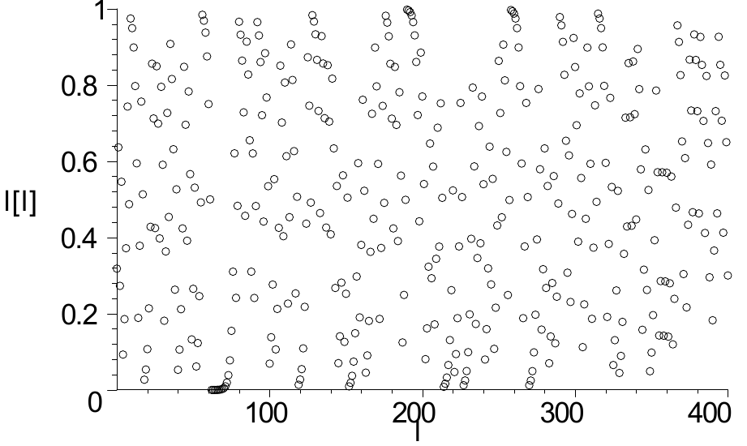
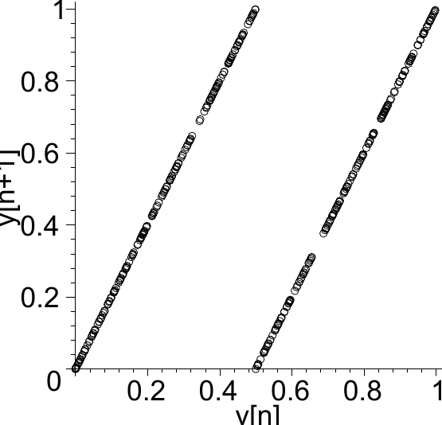

Series and return-plot of the shift-map {eq}`eq:disc1d:shift_map` (a) Series. (b) Return-plot.
```

```{table} Propagation of inaccuracies in the shift-map visualized as a flow in the binary representation of the numbers.
:name: table:shiftmapconcept

|  | $2^{-1}$ | $2^{-2}$ | $2^{-3}$ | $2^{-4}$ | $\ldots$ | $2^{-K+3}$ | $2^{-K+2}$ | $2^{-K+1}$ | $2^{-K^{\,}}$ |
| --- | --- | --- | --- | --- | --- | --- | --- | --- | --- |
| $y_0$ | 0 | 1 | 0 | 1 | $\ldots$ | 1 | 1 | 0 | ? |
| $y_1$ | 1 | 0 | 1 |  | $\ldots$ | 1 | 0 | ? | ? |
| $y_3$ | 0 | 1 |  |  | $\ldots$ | 0 | ? | ? | ? |
| $y_4$ | 1 |  |  |  | $\ldots$ | ? | ? | ? | ? |
| $\vdots$ |  |  |  |  |  |  |  |  |  |
| $y_{K-3}$ | 1 | 1 | 0 | ? | ? | ? | ? | ? | ? |
| $y_{K-2}$ | 1 | 0 | ? | ? | ? | ? | ? | ? | ? |
| $y_{K-1}$ | 0 | ? | ? | ? | ? | ? | ? | ? | ? |
| $y_{K}$ | ? | ? | ? | ? | ? | ? | ? | ? | ? |
```

Suppose that we know the initial condition $y_0$ accurately up to bit number $K$. Whether the limited accuracy is due to lack of precise knowledge of the initial condition, or due to the limited computer precision, is irrelevant for the example. In either case it means that the bits below $K$ are specified and those beyond $K$ are unknown. See {numref}`table:shiftmapconcept` where we have indicated the unknown bits by a question mark. What can we say about $y_1$? Applying {eq}`eq:disc1d:shift_map` involves a multiplication by 2, which, in the bit-series representation, amounts to shifting all bits one position to the left. The modulo-function makes sure that the numbers will stay within $[0,1]$, meaning that the left-most bit is simply shifted out of the domain, and can henceforth be disregarded. The relevant point to notice in {numref}`table:shiftmapconcept` is that during the multiplication operation the unknown bit shifts one position to the left, while a new unknown bit enters from the right – a process that continues for each subsequent multiplication. We observe that already after $K$ steps even the most-significant bit is no longer known: the entire bit-series is vacated by question marks; they can be either 0 or 1, but we have no way of knowing. Clearly we have come beyond the prediction horizon, and no longer can we identify a relation between $y_K$ and the initial value $y_0$. The Lyapunov exponent of this map can be found by realizing that each step the error grows by a factor 2, i.e. $\epsilon_n/\epsilon_0 \sim 2^n$. The Lyapunov exponent of the shift-map is therefore $\Lambda = \ln 2$.

It might seem that the error propagation as illustrated in {numref}`table:shiftmapconcept` only holds for the shift-map, but below we will show that this underlying principle is more general. Consider the following transform of variables

```{math}
:label: eq:disc1d:relation_shiftmap_logist
x_n = \frac{1-\cos2\pi y_n}{2}
```

Next we work out $x_{n+1}$ and try to express it in terms of $x_n$:

$$
\begin{aligned}
x_{n+1} &= \frac{1-\cos2\pi y_{n+1}}{2} = \frac{1-\cos(4\pi
 y_{n}\,\text{mod}\,2\pi)}{2} = \frac{1-\cos(4\pi y_{n})}{2}\\
 &= 1- \cos^2 (2\pi y_{n}) =
(1- \cos2\pi y_{n})(1+ \cos 2\pi y_{n}) = 4x_n(1-x_n)
\end{aligned}
$$

An unexpected and surprising result: the logistic map {eq}`eq:disc1d:def_logistic_map` for $r=4$ is intimately related to the shift-map. In effect, there is no real difference between iterating the logistic map, or iterating the shift-map and subsequently applying {eq}`eq:disc1d:relation_shiftmap_logist`. It shows that the Lyapunov-exponent of the logistic map for $r=4$ is $\Lambda=\ln 2$.

Finally we mention one more related mapping, the so-called tent-map

```{math}
:label: eq:disc1d:tent_map
z_{n+1} = 1 - 2\left|z_n -\frac{1}{2}\right|
```

Series and returnplot in {numref}`fig:disc1d:tentmapseriesreturnplot`.

```{subfigure} 2
:name: fig:disc1d:tentmapseriesreturnplot
:align: center
:subcaptions: below

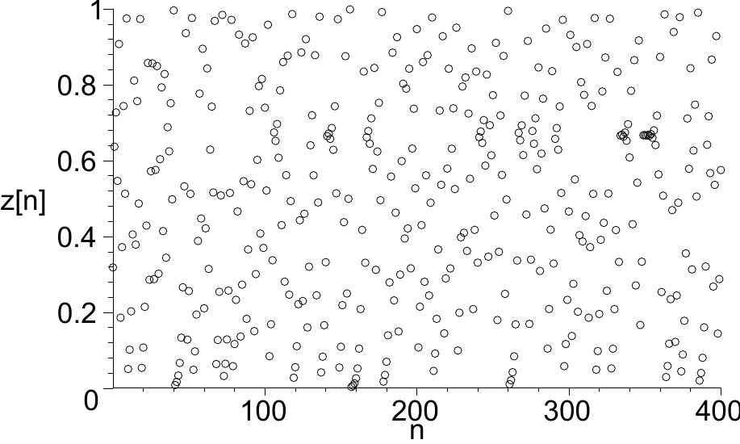
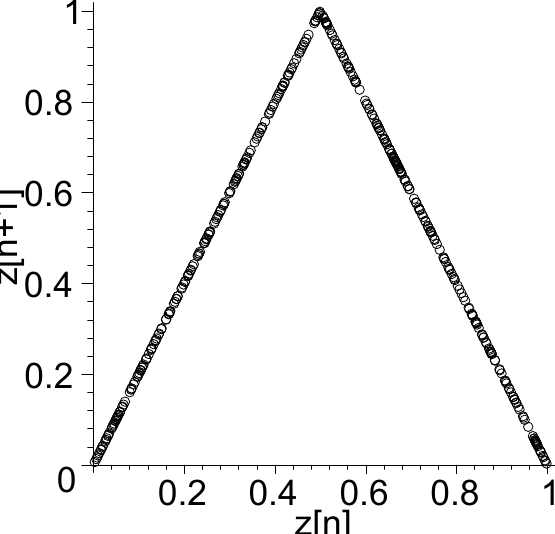

Series and return-plot of the tent-map {eq}`eq:disc1d:tent_map` (a) Series. (b) Return-plot.
```

Similar to the shift-map, a relation can be established with the $r=4$ logistic map. The transformation is

```{math}
:label: eq:disc1d:relation_tentmap_logist
x_n = \frac{1-\cos\pi z_n}{2}
```

(sec:disc1d:analytical)=
## Analytical solutions to chaotic series

The title of this section may sound rather paradoxical – after all, if the point of chaos is the impossibility to *compute* the system over a sufficiently long period of time, then certainly we would not be able to write down the solution in a closed form, would we? Surprisingly, however, it turns out that occasionally one can find closed form solutions in the chaotic range. For example, the formula below provides the solution to the logistic map {eq}`eq:disc1d:def_logistic_map` at $r=4$

$$
x_n = \sin^{2}(2^{n}\theta)\,\,\,\,\,\,\,\text{with $\theta$ such that}\,\,\,\,\, x_0 = \sin^{2}(\theta)
$$

Indeed:

$$
\begin{aligned}
x_{n+1} &= \sin^{2}(2^{n+1} \theta) = \sin^{2}(2 \,2^{n}\theta) = [2\sin(2^{n}\theta )\cos(2^{n}\theta )]^2 \\
 &= 4\sin^2(2^{n}\theta)\cos^2(2^{n}\theta ) = 4\sin^2(2^{n}\theta)[1-\sin^2(2^{n}\theta)] \\
 &= 4 x_n (1-x_n)
\end{aligned}
$$

Before we interpret this fascinating result, let's focus on a method to formally derive a closed form solution to a map like

```{math}
:label: eq:disc1d:generalmap
x_{n+1} = f(x_n)
```

Assume the solution $x_n$ can be expressed as

$$
x_{n} = F[a^n \theta] \,\,\,\,\,\,\,\text{with $\theta$ such that}\,\,\,\,\, x_{0} = F[\theta]
$$

then the function $F$ would have to satisfy

```{math}
:label: eq:disc1d:generatingf
F[a z] = f(F[z])
```

To see this take $z= a^n \theta$, then the left-hand side and right-hand side of {eq}`eq:disc1d:generalmap` are respectively

$$
\begin{aligned}
x_{n+1} &= F[a^{n+1} \theta] = F[a z] \\
 f(x_n) &= f(F[a^n \theta]) = f(F[z])
\end{aligned}
$$

So one has obtained a solution to {eq}`eq:disc1d:generalmap` if one is able to find a function $F$ that satisfies {eq}`eq:disc1d:generatingf`. This is however not so easy for general mappings $f$. So usually it works the other way around: if one knows a non-trivial relation for {eq}`eq:disc1d:generatingf`, one can derive the corresponding mapping function $f$ for which one has just found a closed-form solution. Below we work out a few examples which follow from doubling formulas, like $\sin(2z)$ or $\tanh(2z)$ or a tripling formula like $\sin(3z)$.

$$
\begin{aligned}
\sin(2z) = 2 \sin(z) \cos(z) &\rightarrow \sin(2z)^2 = 4 \sin^2(z)
 (1-\sin(z))^2\\
 F[z] = \sin^2(z) &\rightarrow F[2z] = 4 F[z](1-F[z])\\
 &\rightarrow f(x) = 4 x(1-x)
\end{aligned}
$$

So the corresponding map and closed form solution are

```{math}
:label: eq:disc1d:closedlogist
x_{n+1} = 4rx_n(1-x_n) \,\,\,\,\,\,\,x_n = \sin^2(2^n \theta)
```

In {numref}`fig:disc1d:logist_analytical` we have plotted the analytical solution together with the first few iterations obtained from the mapping.

```{figure} _static/disc1d/disc1d_logist_analytical.png
:name: fig:disc1d:logist_analytical
:width: 100%

The analytical solution $x_n=\sin^2(2^n \theta)$ from {eq}`eq:disc1d:closedlogist` for $x_0 = 0.36$ ($\theta = 0.64\ldots$) together with the first few iterations $x_1,\ldots,x_7$ of the logistic map for $r=4$.
```

Next we work out the doubling formula for $\tanh(z)$

$$
\begin{aligned}
\tanh(2z) = \frac{2\tanh(z)}{1+\tanh^2(z)} \,\,\,\,\,\,\,\,\,
F[z] = \tanh(z) &\rightarrow F[2z] = \frac{2F[z]}{1+F^2[z]} \\
 &\rightarrow f(x) = \frac{2x}{1+x^2}
\end{aligned}
$$

The corresponding map and closed form solution are therefore

```{math}
:label: eq:disc1d:closedtanh
x_{n+1} = \frac{2x_n}{1+x_{n}^{2}} \,\,\,\,\,\,\,x_n = \tanh(2^n \theta)
```

The results are plotted in {numref}`fig:disc1d:tanh_analytical`. Apparently there is no chaotic behaviour and the system settles into the fixed-point $x^{*} = 1$. Note also that the system is superstable, as $f'(x^*) = 0$.

```{figure} _static/disc1d/disc1d_tanh_analytical.png
:name: fig:disc1d:tanh_analytical
:width: 100%

The analytical solution $x_n = \tanh(2^n \theta)$ from {eq}`eq:disc1d:closedtanh` for $x_0 = 0.05$ ($\theta = 0.05\ldots$) together with the first few iterations $x_1,\ldots,x_{14}$ of the map $x_{n+1} = 2x_n/(1+x_{n}^{2})$.
```

In our last example we elaborate the tripling formula for $\sin(z)$, which yields

$$
\begin{aligned}
\sin(3z) = -4\sin^3(z) + 3 \sin(z) \,\,\,\,F[z] = \sin(z) &\rightarrow F[3z] = -4F^{3}[z] + 3F[z]\\
 &\rightarrow f(x) = -4x^3+3x
\end{aligned}
$$

Hence the corresponding map and closed form solution are

```{math}
:label: eq:disc1d:closedsin3map
x_{n+1} = -4x_{n}^{3}+3x_n \,\,\,\,\,\,\,x_n = \sin(3^n \theta)
```

While these solutions are definitely entertaining, they bring us no closer to an accurate prediction of $x_n$ for large $n$. Although it seems that the closed form solutions are now computable for arbitrary $n$, they still possess at their heart the key problem of chaos: sensitivity on initial conditions. Take for example expression {eq}`eq:disc1d:closedlogist`. An error in the initial condition translates directly to an error in $\theta$, say $\epsilon_0$. The solution

$$
x_n = \sin^2(2^n [\theta+\epsilon_0]) = \sin^2(2^n \theta+ 2^n\epsilon_0)
$$

The error in the argument grows as $2^n \epsilon_0$ which may be small compared to $2^n \theta$ but that notion is irrelevant because the sine function works modulo $2\pi$, which implies that the effect of $2^n \epsilon_0$ comes into play rather soon.

The closed-form solutions are also useful to the extent that they provide us direct insight into the error-growth and therefore the value of the Lyapunov-exponent. When $2^n \epsilon_0$ is still small the deviation of two sets with slightly perturbed initial conditions evolves as

$$
|\sin^2(2^n [\theta+\epsilon_0]) - \sin^2(2^n \theta)| = |\sin^2(2^n \theta+ 2^n \epsilon_0) - \sin^2(2^n \theta)| \simeq |\sin(2^{n+1} \theta)\epsilon_0| \,2^n
$$

This shows that $\delta_n \sim 2^n = \exp(\Lambda n)$, with $\Lambda=\ln 2$, consistent with the finding mentioned in section {numref}`sec:disc1d:shiftmap`. In the same vein we conclude that $\Lambda=\ln 3$ for the mapping of {eq}`eq:disc1d:closedsin3map`.

Finally it is instructive to determine the Lyapunov exponent of {eq}`eq:disc1d:closedtanh`; the deviations evolve according to

$$
|\tanh(2^n [\theta+\epsilon_0]) - \tanh(2^n \theta)| = |(1-\tanh^2(2^n \theta))\epsilon_0| 2^n
$$

It would seem that $\delta_n \, 2^n$, i.e. $\Lambda=\ln 2$, but closer inpection tells us that the first term approaches zero rapidly. Working out the asymptotics of $1-\tanh^2(y) \sim 4\exp(-2y)$, yields

$$
|1-\tanh^2(2^n \theta)|2^n \sim 4\exp(-2^{n+1} \theta) 2^n = 4\exp(-2^{n+1} \theta + n \ln2 ) \rightarrow 0
$$

i.e. $\Lambda  \rightarrow \infty$, consistent with the earlier remark above that the system is superstable.

(sec:disc1d:statistical)=
## A statistical approach to deterministic chaos

The message of sections {numref}`sec:disc1d:lyapunov_theory` and {numref}`sec:disc1d:analytical` is that in case of chaotic behaviour there is no use in following an analytical or computational approach in predicting the (far) future state of the system. One might have the analytical solution e.g. {eq}`eq:disc1d:closedlogist` or a straigtforward computational scheme like $x_{n+1} = f(x_n)$ to calculate $x_n$, but in the end accumlating errors render both approaches useless. The system behaves in a seemingly random fashion. In fact it does make sense to treat the *deteministic* chaotic system as a *stochastic* system. Formally the probability density function (pdf) is given by

```{math}
:label: eq:disc1d:defpdf
p(x) = \lim_{N\rightarrow\infty} \frac{1}{N} \sum_{n=1}^{N} \delta(x-x_n)
```

with $\delta$ the Dirac delta-function. There is a variety of methods to elaborate {eq}`eq:disc1d:defpdf`

, but they are beyond our scope. Here we show how one can find the pdf in some particular cases.

The pdf of the logistic map for $r=4$ can for example be found by employing its relation to the shift-map {eq}`eq:disc1d:relation_shiftmap_logist`. Using the transformation rule for densities

```{math}
:label: eq:disc1d:pdfrelations
p(x) \mathrm{d}x = p(y) \mathrm{d}y
```

and the fact that the shift-map data $y_n$ are uniformly distributed, $p(y)=1$ between $0$ and $1$, giving

```{math}
:label: eq:disc1d:pdflogist
p(x) = \frac{1}{\pi \sqrt{x(1-x)}}\,\,\,\,\,\,\,\,\,\,\,x\in\langle 0,1\rangle
```

Note that the same result could be derived from the analytical solution {eq}`eq:disc1d:closedlogist`:

$$
x_n = \sin^2(2^n \theta)
$$

Since $2^n\theta  \mod  2\pi$ will visit values between 0 and $2\pi$ uniformly, we can elaborate {eq}`eq:disc1d:defpdf` into

$$
\begin{aligned}
p(x) &= \lim_{N\rightarrow\infty} \frac{1}{N} \sum_{n=1}^{N} \delta(x-x_n)
= \frac{1}{2\pi} \int_{0}^{2\pi} \delta(x-\sin^2(t)) \mathrm{d}t \\
 &= \frac{2}{\pi} \int_{0}^{\pi/2} \delta(x-\sin^2(t)) \mathrm{d}t
\end{aligned}
$$

Substition of $y=\sin^2 t$, with $\mathrm{d}y = 2 \sin(t) \cos(t) \mathrm{d}t = 2 \sqrt{y}\sqrt{1-y}\,\mathrm{d}t$ then leads to the same result as {eq}`eq:disc1d:pdflogist`.

$$
p(x) = \frac{1}{\pi} \int_{0}^{1} \frac{\delta(x-y)}{\sqrt{y(1-y)}} \mathrm{d}y = \frac{1}{\pi \sqrt{x(1-x)}}
$$

````{admonition} Example
:class: example

The `maple` code below determines the pdf based on $N=8192$ iterations of the logistic map and plots the result together with the expression derived in {eq}`eq:disc1d:pdflogist`, producing {numref}`fig:disc1d:pdfs`.

```{code-block} maple
restart; with(plots): with(stats[statplots]):
f := x -> 4 * x * (1 - x);
N := 8192; X := Array(0..N):
X[0] := 0.1:
for n from 0 to N-1 do X[n+1] := evalf( f(X[n]) ); end do:
pdf := x -> 1/(Pi*sqrt(x*(1-x)));
p1 := histogram(convert(X[0..N], list), numbars=32,color=gray):
p2 := plot(pdf(x),x=0.025..0.975,thickness=5,color=black):
display([p1,p2],view=[0..1,0..2],labels=["x","p(x)"]);
```
````

```{subfigure} 2
:name: fig:disc1d:pdfs
:align: center
:subcaptions: below

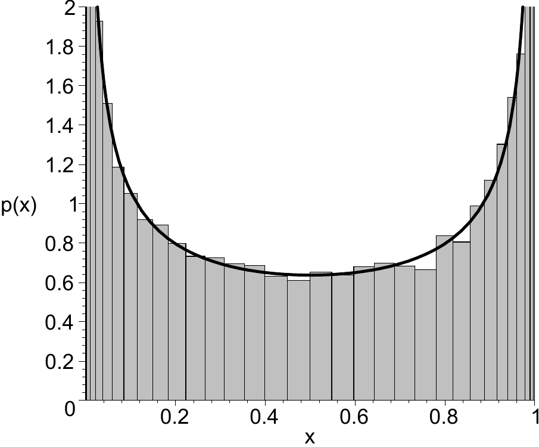
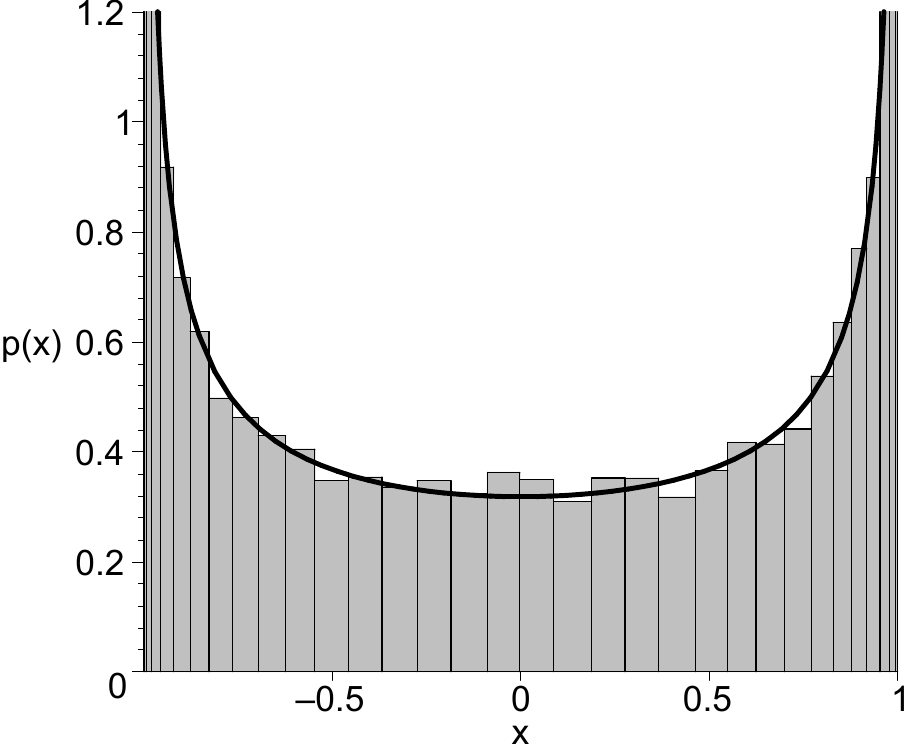

pdfs (a) Pdf for the logistic map at $r=4$; solid line represents {eq}`eq:disc1d:pdflogist`. (b) Pdf for the mapping $x_{n+1} = -4x_{n}^{3}+3x_n$; solid line represents {eq}`eq:disc1d:pdfsin3map`.
```

In a similar way we can find the pdf for mapping {eq}`eq:disc1d:closedsin3map` for which we know that

$$
x_n = \sin(3^n \theta)
$$

```{math}
:label: eq:disc1d:pdfsin3map
\begin{aligned}
p(x) &= \lim_{N\rightarrow\infty} \frac{1}{N} \sum_{n=1}^{N} \delta(x-x_n)
= \frac{1}{\pi} \int_{-\pi/2}^{\pi/2} \delta(x-\sin(t)) \mathrm{d}t \nonumber \\
 &= \frac{1}{\pi} \int_{-1}^{1} \frac{\delta(x-y)}{\sqrt{1-y^2}}
 \mathrm{d}y = \frac{1}{\pi\sqrt{1-x^2}}
\end{aligned}
```

(sec:disc1d:universality)=
## The universal period-doubling route to chaos

```{subfigure} 2
:name: fig:disc1d:universality
:align: center
:subcaptions: below

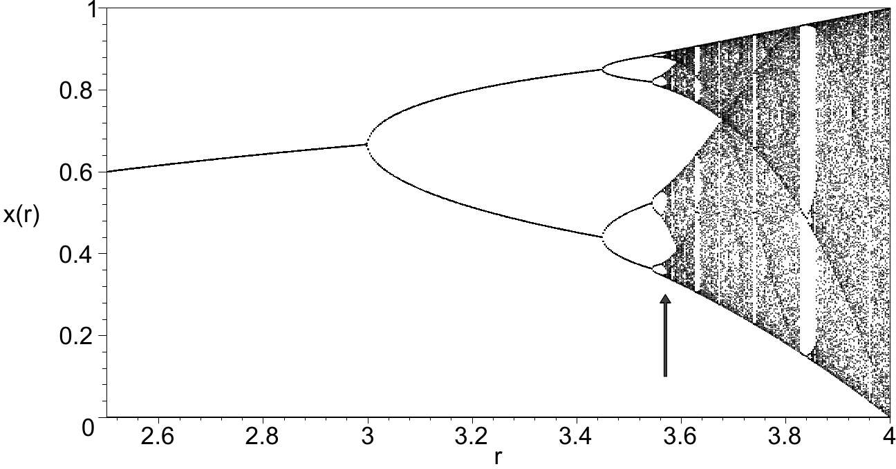
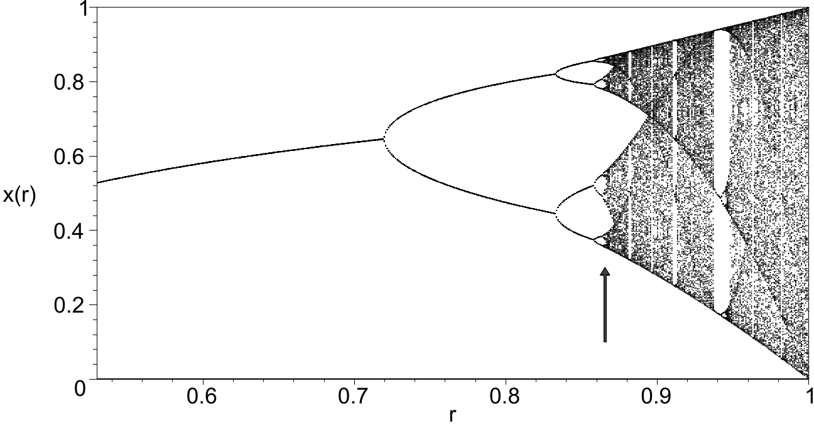

Period-doubling in two different mappings. (a) Period doubling in the logistic map until $r_{\infty}= 3.56994537$ (arrow). (b) Period doubling in the sine-map until $r_{\infty}= 0.86557928$ (arrow).
```

If one compares in {numref}`fig:disc1d:universality` the bifurcation diagram of the logistic map with that of the sine map, given by respectively,

$$
\begin{aligned} x_{n+1} &= r x_{n} (1-x_{n})\,\,\,r \in [0,4] & x_{n+1} &= r \sin(\pi x_{n}) \,\,r \in [0,1] \end{aligned}
$$

one might be struck by the qualitative similarity of the graphs. Both exhibit a period doubling route to chaos with the subsequent bifurcations occurring progressively 'faster'. More precisely, if we denote by $r_p$ the value of $r$ at the onset of a period $2^p$, then it appears that for both iterative maps the distance $r_{p+1}-r_{p}$ strongly decreases for increasing $p$. Using the techniques outlined in section {numref}`sec:disc1d:periodicstability` we can calculate $r_p$ for the logistic map for the first bifurcations $r_1 = 3, r_2 = 1+\sqrt{6} = 3.449489743, r_3 = 3.544090360$, which indeed shows that the period-doublings progressively densify on the $r$-axis, until the border to chaos is reached at $r_{\infty}= 3.56994537$ (indicated by the arrow). For the sine-map the same happens, $r_1 = 0.7199616829, r_2 = 0.8332663536, r_3 = 0.8586090598, \ldots$ until $r_{\infty}= 0.86557928$ is reached. It was Feigenbaum who made the remarkable discovery that this similarity is not only qualitative, but also quantitative. If one measures the relative distances between succesive bifurcations

```{math}
:label: eq:delta_p
\delta_p = \frac{r_{p}-r_{p-1}}{r_{p+1}-r_{p}}
```

then, for $p\rightarrow \infty$, $\delta_p$ approaches a *universal* number $\delta = 4.6692\ldots$, now called the Feigenbaum constant. Feigenbaum proved mathematically that this holds for *any* iterative map of the form $f_r(x) = r   q(x)$, where $q(x)$ is a differentiable function with only *one* quadratic maximum; the latter means that a Taylor expansion around the maximum has lowest order 2. Note that both $q(x) = x(1-x)$ and $q(x) = \sin(\pi x)$ satisfy these criteria, but also, say, $q(x) = \exp(-x^2)$.

We will not go into the mathematical details of this complicated proof; for a very nice 'pedestrian' treatment one is referred to {cite}`Strogatz1994`. Rather, we show a simple way to get a better appreciation of the regularity of the period-doubling. It is not easy to see this in a normal bifurcation diagram because the succesive bifurcations densify really fast according to (approximately)

```{math}
:label: eq:r_p
r_{p} \simeq r_{\infty} - c \delta^{-p}
```

which can be verified by substituting {eq}`eq:r_p` into {eq}`eq:delta_p` and assuming that $\delta_p \simeq \delta$. The values of $r_{\infty}$ and $c$ depend on the specific mapping. {eq}`eq:r_p` inspires us to plot the bifurcation diagram not as a function of $r$, but as a function of a new parameter $a$:

```{math}
:label: eq:def_a
\begin{aligned}
a&=-\ln[r_{\infty} - r] & &\Rightarrow a_p &\simeq p \ln \delta - \ln c
\end{aligned}
```

Plotted as a function of $a$, bifurcations thus show up in an equidistant fashion with separation equal to $\ln \delta$. The resulting diagrams are plotted in {numref}`fig:disc1d:universality_regular`. The plots, which were generated with a `maple` -code similar to the one shown below, now nicely reveal the regular spacing between the subsequent bifurcations.

````{admonition} Maple
:class: maple

```{code-block} maple
restart; with(plots):
f := x -> r * sin(Pi*x);
rc := 0.86557928;
Na := 500; rmin := 0.3;
amin := -log(rc - rmin); amax := 10.2;
N := 1000; Nmin := ceil(0.8*N);
X := Array(0..N): X[0] := 0.57:
for i from 0 to Na do
  a := evalf(amin + (amax - amin)*i/Na);
  r := rc - exp(-a);
  for n from 0 to N-1 do X[n+1] := evalf( f(X[n]) ); end do:
  pl[i] := seq([a,X[n]],n=Nmin..N);
end do:
pointplot([seq(pl[i],i=1..Na)],view=[amin..amax,0.33..0.9],
  labels=["a", "x(a)"],color=black,axes=BOXED);
```
````

```{subfigure} 2
:name: fig:disc1d:universality_regular
:align: center
:subcaptions: below

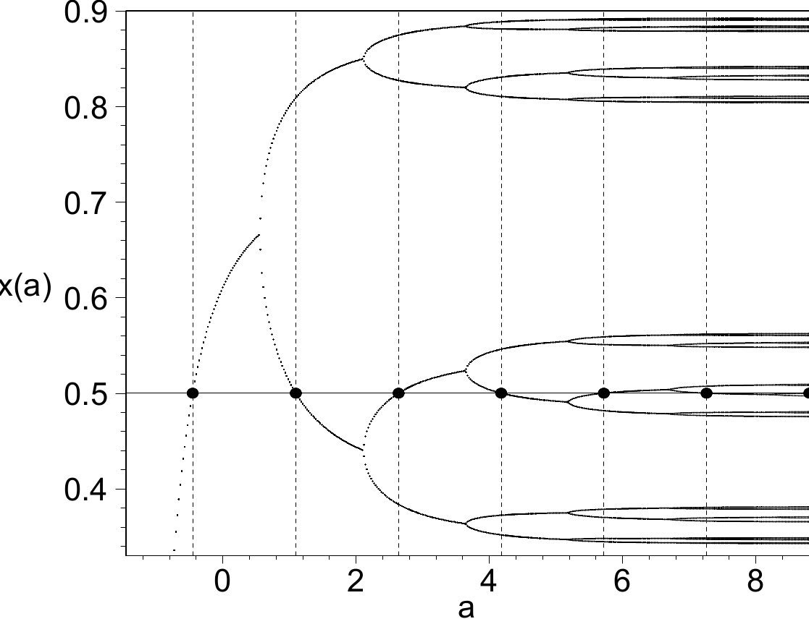
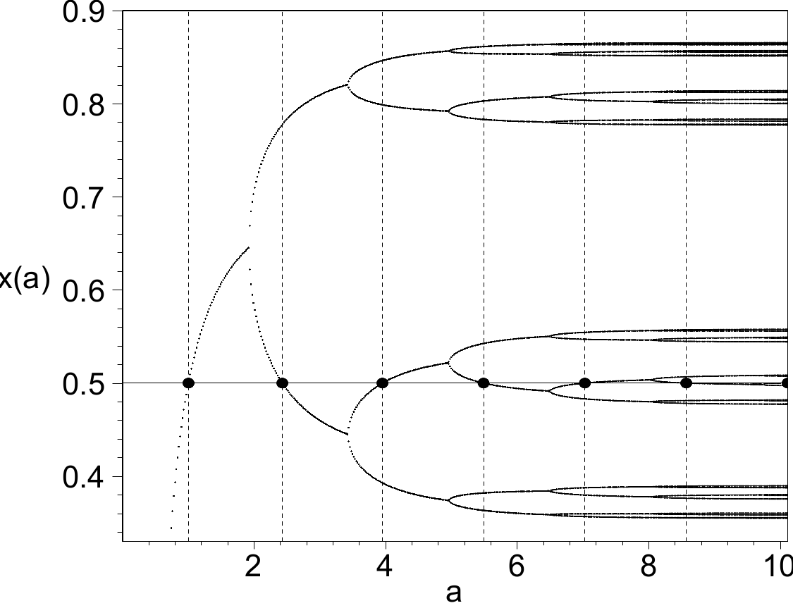

Graphs revealing the universal period-doubling for the logistic map and the sine map. (a) Bifurcation diagram of the logistic map $x_{n+1} = r x_n(1-x_n)$ as a function of $a = -\ln(r_{\infty}-r)$ with $r_{\infty}= 3.56994537$. (b) Bifurcation diagram of the sine map $x_{n+1} = r \sin(\pi x_n)$ as a function of $a = -\ln(r_{\infty}-r)$ with $r_{\infty}= 0.86557928$.
```

Yet if you would wish to make a similar plot for a different mapping, you find that you need to know *a priori* the value of $r_c$ for that mapping and you might wonder how we derived those values for the two mappings. This is not so easy, but below we explain a way to do it. First it must be noted that in figure {numref}`fig:disc1d:universality_regular` the big dots do not indicate locations of bifurcations, but rather locations of 'superstability', i.e. where the stability $\sigma = 0$ (see section {numref}`sec:disc1:fixedstab`). For example a superstable period-$m$ solution $x^{*}_{k},\,(k=1,\ldots,m)$ then satisfies (see also section {numref}`sec:disc1d:period_m` for a discussion of stability of periodic solutions)

$$
\begin{aligned} \forall_{k \in \{ 1,\ldots,m\}}:\,\,f^{(m)}(x^{*}_{k}) & = x^{*}_{k} & \sigma^{(m)} &= \prod_{k=1}^{m} f'(x^{*}_{k}) = 0 \end{aligned}
$$

Consequently, mappings of the form $f_r(x) = r   q(x)$, as considered by Feigenbaum, are superstable when at least one of the $m$-periodic points satisfies $q'(x^{*}_{k})=0$. For the sine-map $q'(x) = \pi \cos\pi x$ and for the logistic map $q'(x) = 1-2x$, so in both cases one finds that $q'(1/2) = 0$. Therefore, whenever one of the periodic branches crosses $x=1/2$ in the corresponding bifurcation diagrams, we know that the solution is superstable.

The advantage of focussing on superstable points is that the convergence is extremely fast compared to points of bifurcation which are associated with very slow convergence, which can also be seen from the corresponding Lyapunov exponents $\Lambda\rightarrow -\infty$ and $\Lambda = 0$, respectively. In principle the foregoing paves the way towards rapidly determining the locations $r_p$ and finding $\delta_p$. Since we know we must look at $x=1/2$ and find $r$ such that

$$
f_{r}^{(2^p)}\left(\frac{1}{2}\right) = \left(\frac{1}{2}\right)
$$

Execution of the simple maple commands below

````{admonition} Maple
:class: maple

```{code-block} maple
f := x-> r*x*(1-x):
fsolve((f@@8)(1/2) = 1/2,r,2..3.6);
```
````

directly gives the first four values of $r$ of superstability (recall that a period 8 also solves for periods 1,2,4)

$$
2., 3.236067977, 3.498561699, 3.554640863
$$

Unfortunately this method breaks down for period 16 and higher due to practical reasons; $f^{(m)}(1/2)$ is a polynomial in $r$ with leading order $r^{2^m-1}$. For $m=8$ this gives already $r^{255}$; for period-16 it amounts to $r^{65535}$ which is hardly managable of course.

Seed at $x_0$ where $x_0$ satisfies $q'(x_0) = 0$ to satisfy the superstability criterion. For the logistic map and the sine map $x_0 = 1/2$. Next we pick some value of $r$ and generate

$$
x_1(r) = f(x_0), x_2(r) = f(x_1), \ldots \,\,x_m(r) = f(x_{m-1})
$$

If $r$ is such that $x_m(r) = x_0$ we have found a superstable period $m$ solution. To find $r$ we use the well-known Newton-Raphson iterative method

```{math}
:label: eq:feigennewtonraphson
r_{i+1} = r_{i} - \frac{g(r_i)}{\dfrac{dg}{dr}(r_i)}
```

with

$$
g(r) = x_m(r) - x_0
$$

Findig the derivative $dg(r)/dr = d x_{m}(r)/dr$ needs some extra effort. One can express $x_{m}(r)$ as $f[x_{m-1}(r)]$, which is equal to $r q[x_{m-1}(r)]$, and use the prodcut rule and the chain rule of differentiation to find a recursive relation:

$$
\begin{aligned}
\frac{d}{dr} x_m(r)
 &= \frac{d}{dr} \{f[x_{m-1}(r)]\} = \frac{d}{dr} \{r q[x_{m-1}(r)]\} \\
 &= q[x_{m-1}(r)] + r \frac{d}{dr} \{q[x_{m-1}(r)]\} \\
 &= \frac{1}{r} f[x_{m-1}(r)] + r \frac{\partial q}{\partial x} [x_{m-1}(r)] \frac{d}{dr} x_{m-1}(r)\\
 &= \frac{1}{r} x_{m}(r) + f'[x_{m-1}(r)] \frac{d}{dr} x_{m-1}(r)
\end{aligned}
$$

where we also used $r \partial q/\partial x = f'(x)$. Below find the maple implementation. First we define $f(x,r)$, $f'(x,r)$ and $h(r)$, which the right-hand side of {eq}`eq:feigennewtonraphson`; next we loop over $p$ from zero to 11, thus addressing period-0 to period-2048, and perform the Newton-Raphson iteration until a stop-criterion (related to the numerical precision) has been reached. It turns out that a good initial guess for $r_p$ helps a lot in finding the correct value, in particular for larger $p$. We therefore calculate the Feigenbaum numbers $\delta_p$ of previous periods when possible and use it to guess what the next value of $r_p$ will be. The subsequent Newton-Raphson iteration  then refines this value. The `maple` code will give numbers such as given in table {numref}`table:disc1d:feigenbaum_numbers`; for the sine-map one should replace $r[0]$ by an appropriate number ($r[0] =  0.9$ works) to get the first 3 values of $r_p$ right.

````{admonition} Maple
:class: maple

```{code-block} maple
restart: with(plots):
Digits := 20; stopcrit := 10^(-Digits+2):
f := (x,r)-> r*x*(1-x);
df := unapply(diff(f(x,r),x),[x,r]);
# define function for Newton-Raphson procedure
  h := proc(r,m)
  local n,X,dg,result;
     X := Array(0..m); X[0] := 1/2;
     for n from 0 to m-1 do X[n+1] := evalf(f(X[n],r)): end do:
     dg := 0; for n from 1 to m do dg := evalf(X[n]/r + df(X[n-1],r)*dg); end do:
     result := r - (X[m]-X[0])/dg;
end proc:
P := 11; # calculations until period 2^11 = 2048
for p from 0 to P do
     m := 2^p;
  # use previous value of delta for a smart start value of r
    if( p >= 3 ) then
        delta[p-2] := (rc[p-2]-rc[p-3])/(rc[p-1]-rc[p-2]);
        r[0] := rc[p-1]+(rc[p-1]-rc[p-2])/delta[p-2];
    else r[0] := 3.57;
    end if:
  # Newton-Raphson iteration to find zero-crossing of h
    eps := 1;
    for i from 0 to 100 while eps > stopcrit do
       r[i+1]  := evalf(h(r[i],m));
       eps := abs(r[i+1]-r[i]);
    end do:
    rc[p] := r[i];
  end do:
# print results of r and delta
  seq( print(p,rc[p],(rc[p]-rc[p-1])/(rc[p+1]-rc[p])),p=1..P-1);
```
````

The universality of $\delta$ in (quadratic unimodal) maps is a truly facinating element, and $\delta=4.67$ has been 'measured' in a variety of physical systems. But it may be good to put the latter result in some perspective because one might get the false impression that physical systems should obey the universal behaviour. This is not necessary at all as will become clear when we revisit the assumptions: 1) that the mapping is one-dimensional, 2) that the mapping has only one maximum (unimodal), 3) that this maximum is quadratic. Let us investigate the impact of the latter assumption and look at the follwowing map in more detail:

```{math}
:label: eq:disc1d:nonuniversal_nonquadratic
\begin{aligned}
f(x) &= r (1-|2x-1|^{\eta}) & &r \in[0,1]\,\,\,\eta \geq 1
\end{aligned}
```

This map has a maximum that is not quadratic, except when $\eta = 2$ for which we recover the logistic map.

Mapping {eq}`eq:disc1d:nonuniversal_nonquadratic` gives us a possibility to find the dependence of $\delta$ on the value of $\eta$ by using the procedure outlined above. Adapting the `maple` code slightly gives the data-points plotted in {numref}`fig:disc1d:not_so_universal`, showing values of $\delta$ ranging from 3 to as much as 7 for an order-4 maximum $\eta=4$.

```{table} $\delta_p = (r_{p}-r_{p-1})/(r_{p+1}-r_{p})$ for the logistic map and the sine-map produced by the maple code. As shown, the values of $\delta_p$ rapidly converge for both maps to the Feigenbaum constant $\delta = 4.6692\ldots$.
:name: table:disc1d:feigenbaum_numbers

| LOGISTIC MAP |  |  | SINE MAP |  |  |
| --- | --- | --- | --- | --- | --- |
| p | r[p] | delta[p] | p | r[p] | delta[p] |
| 0 | 2.00000000 | 0 | 0.50000000 |  |  |
| 1 | 3.23606798 | 4.708943 | 1 | 0.77773377 | 4.045742 |
| 2 | 3.49856170 | 4.680771 | 2 | 0.84638217 | 4.555853 |
| 3 | 3.55464086 | 4.662960 | 3 | 0.86145035 | 4.645182 |
| 4 | 3.56666738 | 4.668404 | 4 | 0.86469418 | 4.664075 |
| 5 | 3.56924353 | 4.668954 | 5 | 0.86538967 | 4.668106 |
| 6 | 3.56979529 | 4.669157 | 6 | 0.86553866 | 4.668967 |
| 7 | 3.56991347 | 4.669191 | 7 | 0.86557057 | 4.669151 |
| 8 | 3.56993877 | 4.669199 | 8 | 0.86557741 | 4.669191 |
| 9 | 3.56994419 | 4.669201 | 9 | 0.86557887 | 4.669199 |
| 10 | 3.56994536 | 4.669201 | 10 | 0.86557918 | 4.669201 |
```

```{figure} _static/disc1d/disc1d_not_so_universal.png
:name: fig:disc1d:not_so_universal
:width: 80mm

Feigenbaum number $\delta$ as a function of $\eta$ for the map $f_{\eta}(x) = r (1-|2x-1|^{\eta})$. The mapping $f_\eta$ represents the logistic map for $\eta = 2$, in which case the 'universal' value of $\delta=4.669\ldots$ is retrieved. For $\eta\rightarrow1$ the map becomes equal to the tent-map {eq}`eq:disc1d:tent_map`, which has no period-doubling route. This explains the bend near $\eta\rightarrow1$.
```

```{include} _includes/disc1d_exercises.md
```
