(sec:disc2d)=
# Discrete mappings of higher order

(sec:disc2d:twodimmaps)=
## Fixed points and stability

A two-dimensional iterative map has the form

```{math}
:label: eq:disc2d:2dgeneric_x
\begin{aligned}
x_{n+1} &= f(x_{n},y_{n}) \\
y_{n+1} &= g(x_{n},y_{n})
\end{aligned}
```

Fixed points can be determined by realizing that for large $n$: $x_{n+1}  \rightarrow x_{n} \rightarrow  x^*$, and $y_{n+1}  \rightarrow y_{n} \rightarrow  y^*$; hence the fixed point $(x^*,y^*)$ satisfies

```{math}
:label: eq:disc2d:2dfixedpoint
x^* &= f(x^*,y^*)\\
y^* &= g(x^*,y^*)
```

If one finds solutions satisfying {eq}`eq:disc2d:2dfixedpoint`, one can determine the stability of the fixed point(s) by perturbing it slightly and studying the development, i.e. $x_{n} = x^* + \delta_n$, $y_{n} = y^* + \epsilon_n$ with $|\delta_n|\ll 1$, $|\epsilon_n|\ll 1$. Employing a Taylor series approximation

$$
\begin{aligned}
x^* +\delta_{n+1} &= f(x^*+\delta_n,y^*+\epsilon_n) \\
 &= f(x^*,y^*) + \frac{\partial f}{\partial x} \delta_n + \frac{\partial
f}{\partial y}
\epsilon_n + {\cal O}(\delta^{2},\epsilon^{2})\\
y^* +\epsilon_{n+1} &= g(x^*+\delta_n,y^*+\epsilon_n)\\
 &= g(x^*,y^*) + \frac{\partial g}{\partial x} \delta_n + \frac{\partial
g}{\partial y}
\epsilon_n + {\cal O}(\delta^{2},\epsilon^{2})
\end{aligned}
$$

Using {eq}`eq:disc2d:2dfixedpoint` and neglecting terms of order $\delta^{2},\epsilon^{2}$ one arrives at the equations governing the deviations from the fixed-point:

```{math}
:label: eq:disc2d:2dfixedpoint_x_expansion
\begin{aligned}
\delta_{n+1} &= \frac{\partial f}{\partial x}(x^*,y^*) \delta_n +
\frac{\partial f}{\partial y}(x^*,y^*)
\epsilon_n \\
\epsilon_{n+1} &= \frac{\partial g}{\partial x}(x^*,y^*) \delta_n +
\frac{\partial g}{\partial y}(x^*,y^*)
\epsilon_n
\end{aligned}
```

We write this into a more formal form, by introducing the Jacobian $J(x,y)$

$$
J(x,y)
= \left(\begin{array}{ll}
\frac{\partial f}{\partial x} & \frac{\partial f}{\partial y} \\[1mm]
\frac{\partial g}{\partial x} & \frac{\partial g}{\partial y} \\[1mm]
\end{array}\right)
$$

Hence with $J^* = J(x^*,y^*)$, the Jacobian in the fixed point, ({eq}`eq:disc2d:2dfixedpoint_x_expansion`) can be cast into

$$
\left(\begin{array}{l}
 \delta_{n+1} \\
 \epsilon_{n+1} \\
\end{array}\right)
= J^*
\left(\begin{array}{l}
 \delta_{n} \\
 \epsilon_{n} \\
\end{array}\right)
$$

Stability of the fixed point requires that deviations $\delta_n, \epsilon_n$ vanish as $n$ increases. Whether this is the case will depend on the *eigenvalues* of $J^*$. Let $S$ be the (invertible) matrix that reduces $J^*$ to its diagonal form $\tilde{J}^*$ (we disregard the exceptional situations when it is not possible to diagonalize $J^*$):

$$
\tilde{J}^* = S^{-1}J^* S =
\left(\begin{array}{ll}
\sigma_{1} & 0 \\
 0 & \sigma_{2}\\
\end{array}\right)
$$

where $\sigma_{1,2}$ denote the eigenvalues. Denoting the deviations in the diagonal system by $\tilde{\delta}_n, \tilde{\epsilon}_n$

$$
\left(\begin{array}{l}
 \tilde{\delta}_{n} \\
 \tilde{\epsilon}_{n} \\
\end{array}\right)
= S^{-1}
\left(\begin{array}{l}
 \delta_{n} \\
 \epsilon_{n} \\
\end{array}\right)
$$

$$
\left(\begin{array}{l}
\tilde{\delta}_{n+1} \\
\tilde{\epsilon}_{n+1} \\
\end{array}\right)
= \tilde{J}^*
\left(\begin{array}{l}
\tilde{\delta}_{n} \\
\tilde{\epsilon}_{n} \\
\end{array}\right)
=
\left(\begin{array}{l}
\sigma_{1}\tilde{\delta}_{n} \\
\sigma_{2}\tilde{\epsilon}_{n} \\
\end{array}\right)
$$

one observes that the system decouples, meaning that $\tilde{\delta}_n$ and $\tilde{\epsilon}_n$ do not affect each other's evolution. Using the exact solution we can express the evolution of the devations as a function of the initial deviations and the eigenvalues

$$
\tilde{\delta}_{n} = \sigma_{1}^{n} \tilde{\delta}_{0} \,\,\,\,\,\,\,\,\,\,\,\,\,\,\,\,\,\,\, \tilde{\epsilon}_{n} = \sigma_{2}^{n} \tilde{\epsilon}_{0}
$$

Requiring in case of stability that both $\tilde{\delta}_n \rightarrow 0$ and $\tilde{\epsilon}_n \rightarrow 0$, implies that the *absolute value* of both eigenvalues be smaller than 1. Hence

$$
(x^*,y^*) \, \text{is stable when:} \, |\sigma_{1}| < 1 \, \text{and} \, |\sigma_{2}| < 1
$$

Note that the eigenvalues $\sigma_{1,2}$ can be complex valued.

## Higher order mappings

One can readily generalize the results of the previous section to mappings of arbitrary order $m$:

```{math}
:label: eq:disc2d:general_map
\mathbf{x}_{n+1} = \mathbf{f}(\mathbf{x}_{n})
```

where both $\mathbf{x}$ and $\mathbf{f}$ are $m$-dimensional vectors. A fixed points satisfies

```{math}
:label: eq:disc2d:general_map_fp
\mathbf{x}^{*} = \mathbf{f}(\mathbf{x}^{*})
```

Its stability follows from evaluating the $m\times m$ dimensional Jacobian matrix

```{math}
:label: eq:disc2d:jacobian
J (\mathbf{x}) =
\begin{pmatrix}
\dfrac{\partial f_{1}}{\partial x_{1}} &
\dfrac{\partial f_{1}}{\partial x_{2}} & \dots & \dfrac{\partial f_{1}}{\partial x_{m}} \\
\dfrac{\partial f_{2}}{\partial x_{1}} &
\dfrac{\partial f_{2}}{\partial x_{2}} & \dots & \dfrac{\partial f_{2}}{\partial x_{m}} \\
\vdots & \vdots & \ddots & \vdots\\
\dfrac{\partial f_{m}}{\partial x_{1}} &
\dfrac{\partial f_{m}}{\partial x_{2}} & \dots & \dfrac{\partial f_{m}}{\partial x_{m}}
\end{pmatrix}
```

in the fixed point $\mathbf{x}^{*}$, i.e. $J^* = J(\mathbf{x}^*)$, and subsequently calculating its $m$ eigenvalues $\sigma_i$, $i=1,\ldots,m$. The fixed point is stable when the absolute value of all eigenvalues is smaller than unity

$$
\forall_{i\in \{1,\ldots,m\}} \,\,\left| \sigma_i \right| < 1
$$

Period 2 solutions can be found by realizing that they are fixed points of the mapping between second iterates, i.e.: $\mathbf{x}_{n+2}=\mathbf{x}_{n}=\mathbf{x}^{**}$. Hence one must look for solutions that satisfy

$$
\begin{aligned} \mathbf{x}^{**} &= \mathbf{g}(\mathbf{x}^{**}) \qquad \text{with}\qquad\mathbf{g}(\mathbf{x})=\mathbf{f}(\mathbf{f}(\mathbf{x})) \end{aligned}
$$

while keeping in mind that from the resulting solution set one must exclude period-1 solutions which satisfy $\mathbf{f}(\mathbf{x}^*) = \mathbf{x}^*$ and therefore also satisfy $\mathbf{f}(\mathbf{f}(\mathbf{x}^*)) = \mathbf{f}(\mathbf{x}^*) = \mathbf{x}^*$. Stability of a period 2 solution can be determined in the same way as for period 1 solutions, that is, by calculating the Jacobian of $\mathbf{g}$ in the period-2 solution $\mathbf{x}^{**}$, determinig the eigenvalues $\sigma_i$ and checking whether or not all $\left| \sigma_i \right| < 1$.

(sec:disc2d:duffing)=
### Example: calculating fixed points and their stability for the Duffing map

```{subfigure} 2
:name: fig:disc2d:duffing_series
:align: center
:subcaptions: below

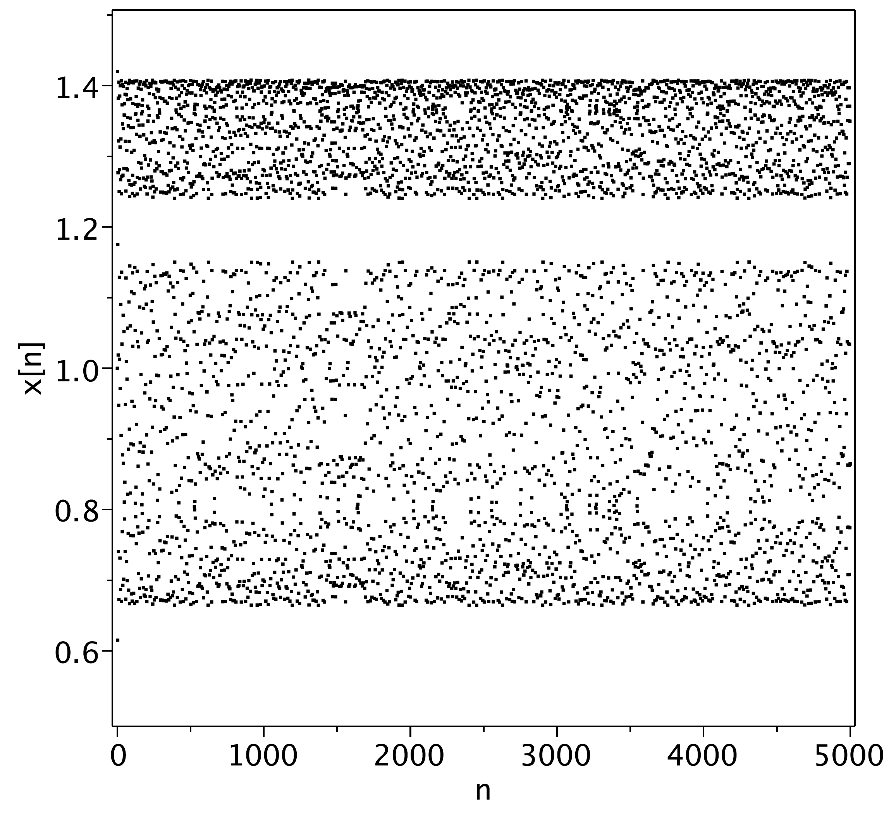
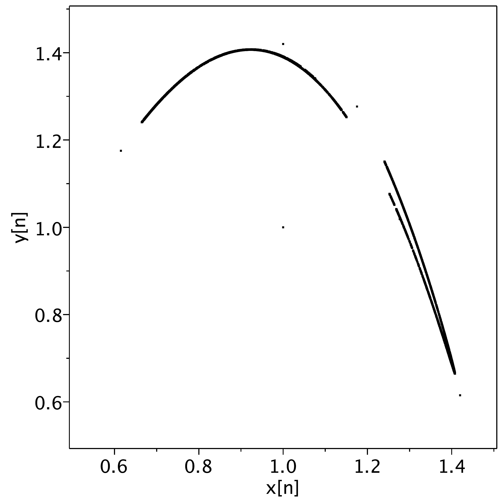
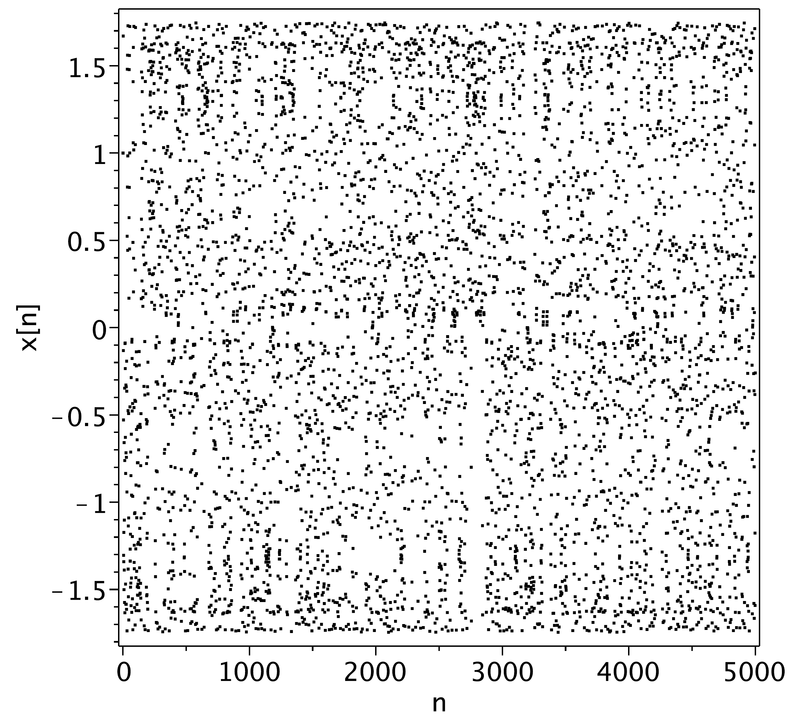
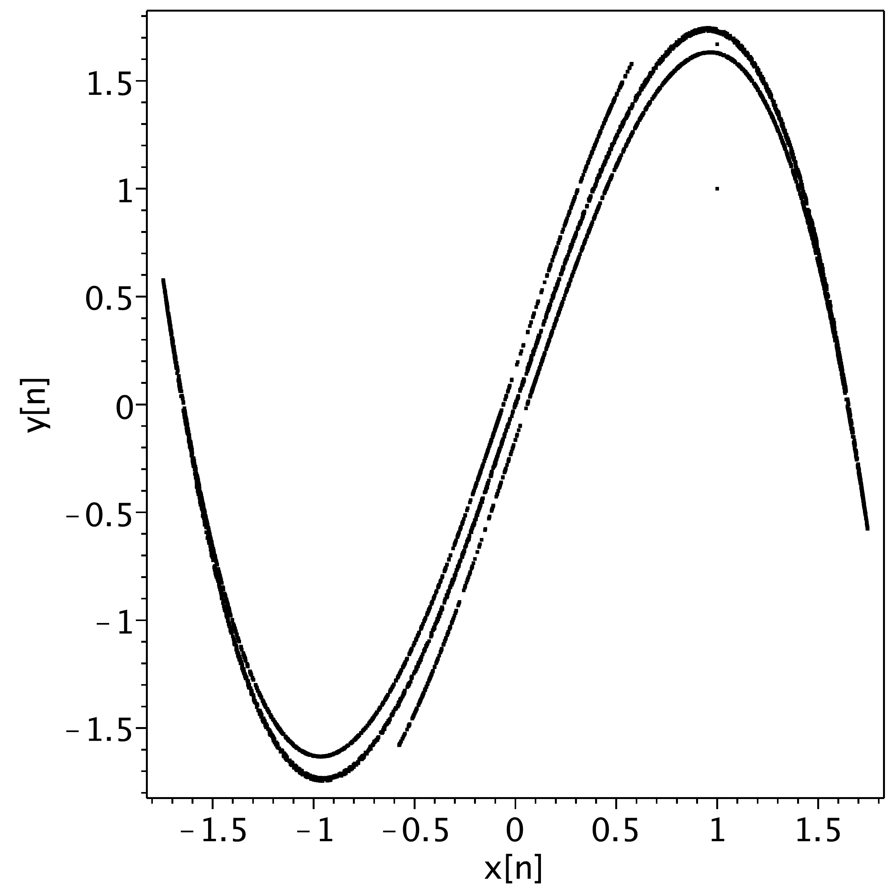

Series and phase space plots of the Duffing map {eq}`eq:duffing_map` with $b=0.1$. (a) Series of $x_n$ for $a=2.52$. (b) Phase plot $(x_n,y_n)$ for $a=2.52$. (c) Series $x_n$ for $a=2.77$. (d) Phase plot $(x_n,y_n)$ for $a=2.77$.
```

The so-called Duffing map is given by

```{math}
:label: eq:duffing_map
\begin{aligned}
x_{n+1} & =y_n\\
 y_{n+1} &=-bx_n+ay_n-y_{n}^{3}
\end{aligned}
```

with $a,b$ parameters. See {numref}`fig:disc2d:duffing_series` for a few time series and phase space plots, i.e. plots of $(x_n,y_n)$. They were made with the following `maple` program

````{admonition} Maple
:class: maple

```{code-block} maple
restart; with(plots):
f1 := (x, y) -> y;
f2 := (x, y) -> -b*x+a*y-y^3;
a := 2.52; b := 0.1;
N:=5000;
X := Array(0..N): X[0] := 1.0:
Y := Array(0..N): Y[0] := 1.0:
for n from 0 to N-1 do
    X[n+1] := evalf( f1(X[n], Y[n]) );
    Y[n+1] := evalf( f2(X[n], Y[n]) );
  end do:
pointplot([seq([n  , X[n]], n=0..N)], color=black,
                    symbol=point,labels=["n"   ,"x[n]"]);
pointplot([seq([X[n],Y[n]], n=0..N)], color=black,
                    symbol=point,labels=["x[n]","y[n]"]);
```
````

The map can be cast into the generic form {eq}`eq:disc2d:general_map` by defining

$$
\begin{aligned}
f_1(x,y) &= y\\
 f_2(x,y) &= -bx +ay -y^{3}
\end{aligned}
$$

Fixed points $(x^*,y^*)$ follow from solving {eq}`eq:disc2d:general_map_fp`, which in this case amounts to solving

$$
\begin{aligned} x^* &= y* & y^* &=-b y^* +ay^*-y^{*3} \end{aligned}
$$

This yields three fixed points

$$
\begin{aligned} \mathbf{x}_{1}^{*} &= (0,0) \qquad \mathbf{x}_{2}^{*} = (\,\sqrt{a-b-1},\,\sqrt{a-b-1}) \qquad \mathbf{x}_{3}^{*} = -\mathbf{x}_{2}^{*} \end{aligned}
$$

To determine the stability of these fixed points, we first determine the Jacobian {eq}`eq:disc2d:jacobian` for this map:

$$
\begin{aligned}
J (\mathbf{x}) &=
\begin{pmatrix}
0 & 1 \\ -b & a-3y^2
\end{pmatrix}
\end{aligned}
$$

Substitution of the fixed points gives

$$
\begin{aligned}
J(\mathbf{x}_{1}^{*}) &=
\begin{pmatrix}
0 & 1 \\ -b & a
\end{pmatrix}
&
J(\mathbf{x}_{2}^{*}) &=
\begin{pmatrix}
0 & 1 \\ -b & -3b+3-2a
\end{pmatrix}
\end{aligned}
$$

The third fixed point yields the same matrix as the second fixed point ($J(\mathbf{x}_{2}^{*}) = J(\mathbf{x}_{3}^{*})$) and therefore has exactly the same stability characteristics as $\mathbf{x}_{2}^{*}$. The corresponding eigenvalues are

$$
\begin{aligned}
\sigma_{\pm}(\mathbf{x}_{1}^{*}) &= \frac{1}{2} a \pm \frac{1}{2} \sqrt{a^2-4b}\\
\sigma_{\pm}(\mathbf{x}_{2}^{*}) &= \frac{1}{2} (3b+3-2a) \pm \frac{1}{2}\sqrt { (3b+3-2a)^2-4b}
\end{aligned}
$$

which reveals the stability of the fixed points for arbitrary $a,b$. Taking $b$ fixed and solving $a$ from $|\sigma_{\pm}|=1$,  gives $a=1+b$ as the critical value for $(0,0)$ to become unstable. Repeating the analysis for the second fixed point shows that it is stable for $a$ in the interval $[1+b,2+2b]$. By making a bifurcation diagram one can check the predictions, see {numref}`fig:disc2d:duffing_bifur` for the case of $b=1/10$; indeed the transitions are found at $a=1.1$ and $a=2.2$.

```{figure} _static/disc2d/disc2d_Duffing_bifurx.png
:name: fig:disc2d:duffing_bifur
:height: 40mm

Bifurcation diagram of the Duffing map {eq}`eq:duffing_map` as a function of $a$. $b=0.1$ is fixed.
```

It also possible to calculate the period-2 solutions and their stability range. To this end we first define the mapping associated with the second iterates:  $x_{n+2} = g_1(x_n,y_n)$, $y_{n+2} = g_2(x_n,y_n)$

$$
\begin{aligned}
g_1 (x,y) &= f_1( f_1(x,y), f_2(x,y) )\\
g_2 (x,y) &= f_2( f_1(x,y), f_2(x,y) )
\end{aligned}
$$

A period-2 solution to mapping $\mathbf{f}$ is a fixed point to the mapping $\mathbf{g}$. So we search for solutions to $\mathbf{x}^{**} = \mathbf{g}(\mathbf{x}^{**})$. The stability of these solution follows from determining the Jacobian of $\mathbf{g}$, substituting the fixed point solution to get $J^*$ and calculating when the corresponding eigenvalues are $\pm 1$. This is what is carried out by the following `maple` implementation

````{admonition} Maple
:class: maple

```{code-block} maple
restart; with(plots): with(LinearAlgebra):
f1 := (x, y) -> y;
f2 := (x, y) -> -b*x+a*y-y^3;
g1 := (x, y) -> f1(f1(x,y),f2(x,y));
g2 := (x, y) -> f2(f1(x,y),f2(x,y));
sol:=solve({x=g1(x,y),y=g2(x,y)},{x,y});
fp2:=allvalues(sol[4]);
Jac:= VectorCalculus:-Jacobian([g1(x,y), g2(x,y)], [x,y]);
Jac1:= subs(fp2[1],Jac);
ev1:=Eigenvalues(Jac1);
solve(ev1[1]=1,a); solve(ev1[1]=-1,a);
solve(ev1[2]=1,a); solve(ev1[2]=-1,a);
```
````

It reveals that the period-2 solution is stable for $a$ in the interval $[2b+2,\sqrt{5b^2+8b+5}]$. For $b=1/10$ this amounts to approximately $[2.2,2.419]$, which nicely corresponds to the behaviour seen in the bifurcation diagram in {numref}`fig:disc2d:duffing_bifur`. Note in the `maple` program the period-1 solutions, which also satisfy $\mathbf{x}^* = \mathbf{g}(\mathbf{x}^*)$, are disregarded by ignoring the first three solutions. A closer look at `sol[4]` reveals that it contains two families of period-2 solutions (so four entries in total), because of the symmetry in the map: If $\mathbf{x}^{**} = \mathbf{g}(\mathbf{x}^{**})$, then also $-\mathbf{x}^{**} = \mathbf{g}(-\mathbf{x}^{**})$ is a solution.

### Example: a bouncing ball in a bowl

```{subfigure} 2
:name: fig:disc2d:bouncing_ball_in_a_bowl
:align: center
:subcaptions: below

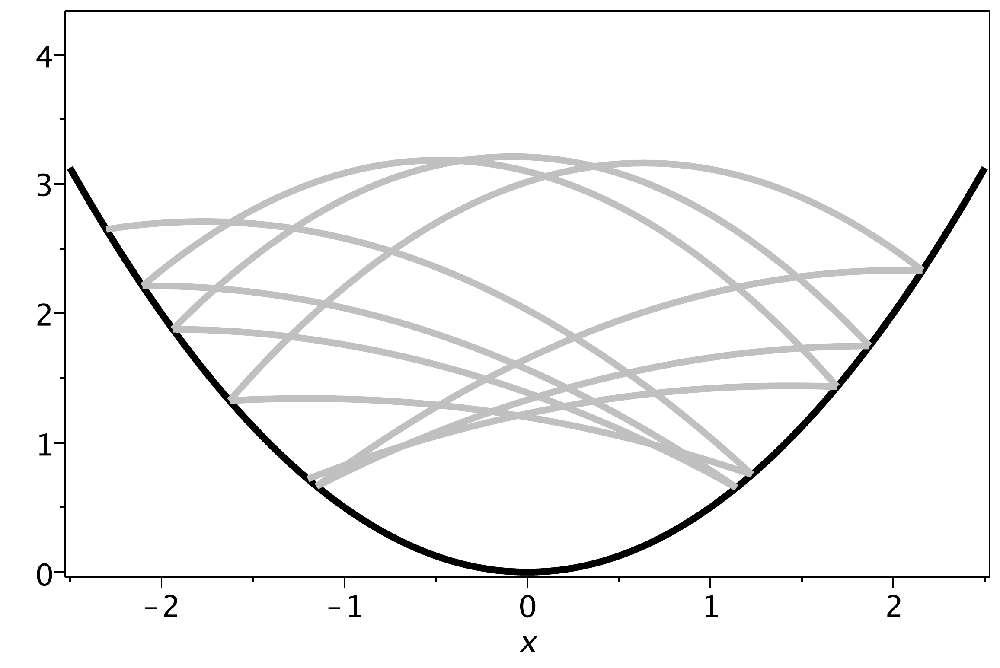
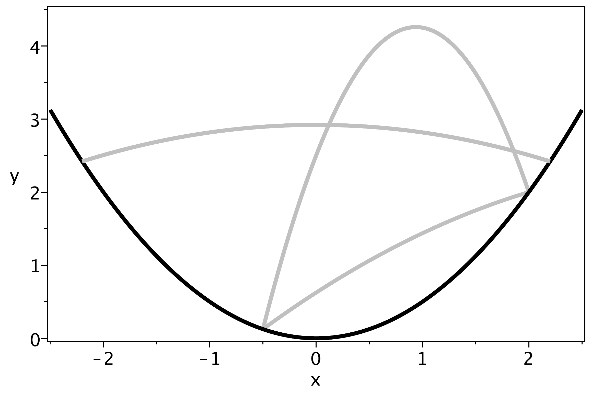

Trajectories of a bouncing ball in a parabolic bowl. (a) First 10 bounces for $X_0 = -1.2, U_0 = 2.2, V_0 =1.2$. (b) Two examples of a periodic solution.
```

Consider a ball bouncing in a parabolically[^fn1] shaped bowl, see {numref}`fig:disc2d:bouncing_ball_in_a_bowl`. The bowl is parametrized by

```{math}
:label: eq:bowl
y_b(x) = \frac{x^2}{2\ell}
```

in which the parameter $\ell$ is a measure of the concavity of the bowl. Both $\ell$, $x$ and $y$ have dimension meter. As the ball moves under the influence of gravity, the equations of motion are given by

```{math}
:label: eq:ball_space_time
\begin{aligned}
x(t) &= x_0 + u_0 t & u(t) &= u_0 \\
y(t) &= y_0 + v_0 t - \frac{1}{2} g t^2 & v(t) &= v_0 -gt
\end{aligned}
```

where $x_0$ and $y_0$ are the initial horizontal and vertical position, respectively; $u_0$ and $v_0$ are the corresponding initial velocities. Time can be eliminated from the problem using the first equation, giving

```{math}
:label: eq:ball_free_fall
y(x) = y_0 + v_0 \left(\frac{x - x_0}{u_0}\right)- \frac{1}{2} g \left(\frac{x - x_0}{u_0}\right)^2
```

We wish to determine the free fall trajectory between the previous bounce location $(x_0,y_0)$ and the next one $(x_1,y_1)$. From {eq}`eq:bowl` we know that both $y_0 = x^{2}_0/(2\ell)$ and $y_1 = x^{2}_1/(2\ell)$, hence using {eq}`eq:ball_free_fall` we can solve $x_1$ from

$$
\frac{x^{2}_1}{2\ell} = \frac{x^{2}_0}{2\ell} + v_0 \left(\frac{x_1 - x_0}{u_0}\right)- \frac{1}{2} g \left(\frac{x_1 - x_0}{u_0}\right)^2
$$

Apart from the trivial solution $x_1=x_0$ this yields

```{math}
:label: eq:ball_new_position
x_1 = \frac{2\ell u_0 v_0 + x_0\left(g\ell -u_0^{2}\right)}{g\ell + u_0^{2}}
```

which in addition gives the velocities just before the bounce

```{math}
:label: eq:ball_new_velocities
\begin{aligned}
u_1 &= u_0 & v_1 &= v_0 -g \left(\frac{x_1 - x_0}{u_0}\right)
\end{aligned}
```

The collision is elastic, which implies that the wall-normal velocity exactly changes sign. Using vector notation $\mathbf{u}=(u,v)$, one can decompose the velocity vector into a wall-normal and a parallel component $\mathbf{u} = \mathbf{u}_{\perp}+\mathbf{u}_{\parallel}$. Let us denote velocity fields before the bounce by  $\mathbf{u}^-$ and after the bounce by $\mathbf{u}^+$. In this notation we have $\mathbf{u}_{\parallel}^{+}=\mathbf{u}_{\parallel}^{-}$, $\mathbf{u}_{\perp}^{+} = -\mathbf{u}_{\perp}^{-}$. This yields the velocity vector after the bounce

$$
\begin{aligned} \mathbf{u}^{+} &= \mathbf{u}_{\parallel}^{+}+\mathbf{u}_{\perp}^{+}=\mathbf{u}_{\parallel}^{-}-\mathbf{u}_{\perp}^{-}= \mathbf{u}^{-} -2\mathbf{u}_{\perp}^{-} \end{aligned}
$$

Denoting the wall-normal vector (normalized vector perpendicular to the wall) by $\mathbf{n}$ allows one to express $\mathbf{u}^{-}_{\perp} = \mathbf{n}  ( \mathbf{n}\cdot \mathbf{u}^{-})$, where $( \mathbf{n}\cdot \mathbf{u}^{-})$ is the inner product of $\mathbf{n}$ and $\mathbf{u}^{-}$. So for the $n$-th bounce

```{math}
:label: eq:bounce
\begin{aligned}
\mathbf{u}^{+}_{n} &= \mathbf{u}^{-}_{n} -2 \mathbf{n} ( \mathbf{n}\cdot \mathbf{u}^{-}_{n})
\end{aligned}
```

For the parabolic bowl {eq}`eq:bowl` the normal vector at $x_n$ is given by

$$
\mathbf{n} = \frac{1}{\sqrt{x_{n}^{2} + \ell^2}}\, \binom{\,x_n }{-\ell}
$$

so with {eq}`eq:bounce` we get

$$
\begin{aligned}
u_{n}^{+} &= \frac{\ell^2-x_{n}^{2}}{\ell^2+x_{n}^{2}} \,u_{n}^{-} + \frac{2\ell x_n}{\ell^2+x_{n}^{2}} \,v_{n}^{-}\\
v_{n}^{+} &= \frac{2\ell x_n}{\ell^2+x_{n}^{2}} \,u_{n}^{-} - \frac{\ell^2-x_{n}^{2}}{\ell^2+x_{n}^{2}} \,v_{n}^{-}
\end{aligned}
$$

Equations {eq}`eq:ball_new_velocities` and {eq}`eq:ball_new_position` relate $(x_n,u_{n}^{-},v_{n}^{-})$ to  $(x_{n-1},u_{n-1}^{+},v_{n-1}^{+})$, so we are now able to relate successive bounce events $(x_n,u_{n}^{+},v_{n}^{+})\rightarrow (x_{n+1},u_{n+1}^{+},v_{n+1}^{+})$ by the following set of equations

```{math}
:label: eq:ball_dimform
\begin{aligned}
x_{n+1} &= \frac{2\ell u_{n} v_{n} + x_{n}\left(g\ell -u_{n}^{2}\right)}{g\ell + u_{n}^{2}} \\
 u_{n+1} &= \frac{\ell^2-x_{n+1}^{2}}{\ell^2+x_{n+1}^{2}} \,u_{n} + \frac{2\ell x_{n+1}}{\ell^2+x_{n+1}^{2}} \,\left[ v_{n} -g \left(\frac{x_{n+1} - x_{n}}{u_{n}}\right)\right]\\
 v_{n+1} &= \frac{2\ell x_{n+1}}{\ell^2+x_{n+1}^{2}} \,u_{n} - \frac{\ell^2-x_{n+1}^{2}}{\ell^2+x_{n+1}^{2}} \,\left[ v_{n} -g \left(\frac{x_{n+1} - x_{n}}{u_{n}}\right)\right]
\end{aligned}
```

where the $+$-symbols on top of the velocities have now been omitted.

It would seem that the system has two parameters, $g$, and $\ell$. However, upon introducing the non-dimensional variables $X_{n} = x_n/\ell$, $U_{n} = u_{n}/\sqrt{g \ell}$, $V_{n} = v_{n}/\sqrt{g \ell}$, these parameters $g$ and $\ell$ drop out of the equations, revealing the essence of the mapping:

```{math}
:label: eq:ball_dimless
\begin{aligned}
X_{n+1} &= \frac{2 U_{n} V_{n} + X_{n}\left(1 -U_{n}^{2}\right)}{1 + U_{n}^{2}} \\
 U_{n+1} &= \frac{1-X_{n+1}^{2}}{1+X_{n+1}^{2}} \,U_{n} + \frac{2 X_{n+1}}{1+X_{n+1}^{2}} \,\left[ V_{n} - \left(\frac{X_{n+1} - X_{n}}{U_{n}}\right)\right]\\
 V_{n+1} &= \frac{2 X_{n+1}}{1+X_{n+1}^{2}} \,U_{n} - \frac{1-X_{n+1}^{2}}{1+X_{n+1}^{2}} \,\left[ V_{n} - \left(\frac{X_{n+1} - X_{n}}{U_{n}}\right)\right]
\end{aligned}
```

which shows that only the initial conditions $X_0,U_0,V_0$ are relevant for the system. Using the dimensional form {eq}`eq:ball_dimform` with $g$ and $\ell$ would only trivially rescale the outcome.

Below find a `maple` implementation of the bouncing ball, which gives a picture as shown in {numref}`fig:disc2d:bouncing_ball_in_a_bowl`.

````{admonition} Maple
:class: maple

```{code-block} maple
restart; with(plots):
yb := x->x^2/2;
y := (x,x0,u0,v0)->yb(x0)+v0*(x-x0)/u0-1/2*(x-x0)^2/u0^2;
N := 10;
X := Array(0..N): Y := Array(0..N): U := Array(0..N): V := Array(0..N):
X[0] := -1.2; U[0] := 2.2; V[0] := 1.2;
for n from 0 to N-1 do
  X[n+1] := (2*U[n]*V[n]+X[n]*(1-U[n]^2))/(1+U[n]^2);
  vtmp :=  V[n] - (X[n+1]-X[n])/U[n];
  U[n+1] := ((1-X[n+1]^2)*U[n] + 2*X[n+1]*vtmp)/(1+X[n+1]^2):
  V[n+1] := (2*X[n+1]*U[n] - (1-X[n+1]^2)*vtmp)/(1+X[n+1]^2):
  pl[n] := plot(y(x,X[n],U[n],V[n]),x=X[n]..X[n+1]):
end do:
plf := plot(yb(x),x=-1..1):
display(plf,seq(pl[n],n=0..N-1),labels=["x","y"],axes=framed);
```
````

As a result of the elastic collisions, the system will conserve energy. In {numref}`fig:disc2d:bowl_energy` we have plotted the (dimensionless) kinetic and potential energy at the bounces $E_{\text{k},n} = \frac{1}{2}[U_{n}^{2} + V_{n}^{2}]$, $E_{\text{p},n} = Y_{n} = \frac{1}{2} X_{n}^{2}$. In addition we have indicated the sum, which is indeed conserved for all $n$, i.e.

$$
E_{\text{t},n} = E_{\text{k},n} + E_{\text{p},n} = E_{\text{k},0} + E_{\text{p},0}
$$

```{figure} _static/disc2d/disc2d_bowl_energies.png
:name: fig:disc2d:bowl_energy
:width: 100%

Evolution in time of the potential energy $E_{\text{p},n}$ (circles), kinetic energy $E_{\text{k},n}$ (diamonds) and the sum of both $E_{\text{t},n}$ (boxes). Time $t$ was 'recreated' using {eq}`eq:ball_space_time`, allowing the values between bounces to be displayed as well.
```

Does the system {eq}`eq:ball_dimless` allow stationary (periodic) situations? There is a period-1 solution possible where the ball hops up and down precisely in the center with no horizontal velocity: $X^*=Y^*=0$. One can obtain infinitely many period-2 solutions when $v_0=1$:

$$
\begin{aligned} (x_0,u_0,v_0)&=(-a,a,1) \,\rightarrow \, (a,-a,1) \,\rightarrow \,(-a,a,1) \,\rightarrow \, \end{aligned}
$$

with arbitrary $a$. With a little more effort one can also find less obvious solutions such as the asymmetric periodic trajectory

$$
\begin{aligned} (x_0,u_0,v_0)&=\Bigl(-\frac{1}{2},\frac{1}{2},\frac{23}{8}\Bigr) \,\rightarrow \,\Bigl(2, -2, -\frac{7}{8}\Bigr)\,\rightarrow \,\Bigl(-\frac{1}{2},\frac{1}{2},\frac{23}{8}\Bigr)\,\rightarrow \, \end{aligned}
$$

Both periodic solutions are shown in {numref}`fig:disc2d:bouncing_ball_in_a_bowl`.

## Growth of errors revisited: Lyapunov exponents of higher order mappings

Consider two data-sets resulting from the same mapping $\mathbf{x}_{n+1}=\mathbf{f}(\mathbf{x}_{n})$, $\mathbf{y}_{n+1}=\mathbf{f}(\mathbf{y}_{n})$ but resulting from slightly differing initial conditions, i.e. $\mathbf{y}_{n} = \mathbf{x}_0+\boldsymbol{\epsilon}_0$ with $\lVert\boldsymbol{\epsilon}_0\rVert\ll 1$. Denoting the difference between the two data-sets at step $n$ as $\boldsymbol{\epsilon}_n$ and assuming the differences are still small, one can derive (see section {numref}`sec:disc2d:twodimmaps`)

$$
\begin{aligned}
\boldsymbol{\epsilon}_{n+1} &= \mathbf{y}_{n+1} - \mathbf{x}_{n+1}\\
&= \mathbf{f}(\mathbf{x}_{n}+\boldsymbol{\epsilon}_n) - \mathbf{f}(\mathbf{x}_{n})\\
&= J(\mathbf{x}_{n}) \boldsymbol{\epsilon}_n
\end{aligned}
$$

where $J(\mathbf{x}_{n})$ is the Jacobian matrix {eq}`eq:disc2d:jacobian` evaluated at data-point $\mathbf{x}_{n}$. Using the above expression recursively until $n=0$, one obtains

```{math}
:label: eq:disc2d:errors
\boldsymbol{\epsilon}_{n} = J(\mathbf{x}_{n-1}) J(\mathbf{x}_{n-2}) \ldots J(\mathbf{x}_{1}) J(\mathbf{x}_{0}) \boldsymbol{\epsilon}_0
```

It is important to note that these matrices might all be different because they are evaluated at different $\mathbf{x}_{n}$ and probably will not commute, i.e. $J(\mathbf{x}_{n})J(\mathbf{x}_{n-1})\neq J(\mathbf{x}_{n-1})J(\mathbf{x}_{n})$, which is to say that they do not acquire their diagonal form by the same transformation $S$. To proceed let us recapitulate how Lyapunov exponents $\Lambda$ were derived in one-dimensional mappings (see {eq}`eq:disc1d:epsilon_evolution` and {eq}`eq:disc1d:lyapdef`). Rewriting slightly, we get

```{math}
:label: eq:disc2d:lyap1d
\begin{aligned}
\overline{\sigma}^{N} &= f'(x_0) f'(x_1) f'(x_2) \ldots f'(x_{N-1}) & \rightarrow \,\,\Lambda &= \log \lvert \overline{\sigma} \rvert
\end{aligned}
```

showing that Lyapunov exponent $\Lambda$ is the log of $|\overline{\sigma}|$, where $\overline{\sigma}$ can be viewed as the *geometric average* of the derivatives  $f'(x_n)$, $n=0\ldots N-1$. In the same vein we can think of an average Jacobian $\overline{J}^{n}$ in {eq}`eq:disc2d:errors`

$$
\overline{J}^{N} = J(\mathbf{x}_{N-1}) J(\mathbf{x}_{N-2}) \ldots J(\mathbf{x}_{1}) J(\mathbf{x}_{0})
$$

If we denote the (possibly complex valued) eigenvalues of $\overline{J}$ by $\overline{\sigma}_1,\ldots,\overline{\sigma}_m$, then the eigenvalues of $\overline{J}^{N}$  are $\overline{\sigma}_{1}^{N},\ldots,\overline{\sigma}_{m}^{N}$. Conversely, if one has calculated the eigenvalues of $\overline{J}^{N}$, then the eigenvalues of $\overline{J}$ are found by taking the $N$-th root. When the eigenvalues $\overline{\sigma}_1,\ldots,\overline{\sigma}_m$ are known, then by analogy with {eq}`eq:disc2d:lyap1d` we can express the Lyapunov exponents as

```{math}
:label: eq:disc2d:lyap_anyorder
\begin{aligned}
\Lambda_1 &= \log \lvert \overline{\sigma}_1 \rvert, & \Lambda_2 &= \log \lvert \overline{\sigma}_2 \rvert, &\ldots & & \Lambda_m &= \log \lvert \overline{\sigma}_m \rvert
\end{aligned}
```

One observes that an $m$-dimensional mapping has $m$ Lyapunov exponents.

In short, a (formal) procedure for finding the $m$ Lyapunov exponents of a mapping $\mathbf{x}_{n+1}=\mathbf{f}(\mathbf{x}_n)$ consists of (i) creating a series $\mathbf{x}_n$, $n=0\ldots N-1$, (ii) calculating $\overline{J}^{N}$ and determining its eigenvalues $\overline{\sigma}^{N}$, (iii) applying {eq}`eq:disc2d:lyap_anyorder`.

A more practical way for getting information on the sensitivity on initial conditions of a certain mapping would be to create two data-sets $\mathbf{x}_{n+1}=\mathbf{f}(\mathbf{x}_{n})$, $\mathbf{y}_{n+1}=\mathbf{f}(\mathbf{y}_{n})$ started from slightly different initial conditions $\mathbf{y}_0 = \mathbf{x}_0 + \boldsymbol{\epsilon}_0$, and monitoring the evolution of the distance $\delta_n =  \lVert\boldsymbol{\epsilon}_n\rVert = \sqrt{\boldsymbol{\epsilon}_n \cdot \boldsymbol{\epsilon}_n}$ One anticipates a dependence of the form

$$
\delta_N = \delta_0 \exp \bigl( \Lambda_{\text{e}}N \bigr)
$$

where $\Lambda_{\text{e}}$ can be considered an *effective* Lyapunov exponent. But what is the relation between $\Lambda_{\text{e}}$ and the 'formal' Lyapunov exponents of {eq}`eq:disc2d:lyap_anyorder`?

Using {eq}`eq:disc2d:errors` we see that

$$
\begin{aligned} \text{e}^{2\Lambda_{\text{e}}N} &= \frac{\delta_{N}^{2}}{\delta_{0}^{2}} = \frac{\boldsymbol{\epsilon}_{N} \cdot \boldsymbol{\epsilon}_{N}}{\boldsymbol{\epsilon}_{0} \cdot \boldsymbol{\epsilon}_{0}}= \frac{\overline{J}^{N} \boldsymbol{\epsilon}_{0} \cdot \overline{J}^{N} \boldsymbol{\epsilon}_{0}}{\boldsymbol{\epsilon}_{0} \cdot \boldsymbol{\epsilon}_{0}} \end{aligned}
$$

If $\boldsymbol{\epsilon}_{0}$ is exactly aligned with the $k$-th eigenvector of $\overline{J}$, which corresponds to the eigenvalue $\overline{\sigma}_k$, then $\overline{J}^{N} \boldsymbol{\epsilon}_{0}= \overline{\sigma}_k^{N} \boldsymbol{\epsilon}_{0}$, and therefore

$$
\begin{aligned} \text{e}^{2\Lambda_{\text{e}}N} &= \overline{\sigma}_k^{2N} = \text{e}^{2\Lambda_{k}N} \qquad\rightarrow \qquad \Lambda_{\text{e}} = \Lambda_{k}\qquad k\in[1,\ldots,m] \end{aligned}
$$

Ordering the Lyapunov exponents from small to large, we can write for the effective Lyapunov exponent

$$
\Lambda_1 \leq \Lambda_{\text{e}} \leq \Lambda_m
$$

showing that the 'measured' effective  Lyapunov exponent will always be between the values obtained from {eq}`eq:disc2d:lyap_anyorder`. But it is incorrect to assume that $\Lambda_{\text{e}}$ will be an average of the $\Lambda_1,\ldots,\Lambda_m$.

(sec:disc2d:henonlyap)=
### Example: Lyapunov exponents of the Hénon map

```{figure} _static/disc2d/disc2d_HenonAttractor.png
:name: fig:disc2d:henonattractor
:height: 4cm

The Hénon attractor for $a=1.4$, $b=0.3$.
```

The Hénon map is given by $\mathbf{x}_{n+1} = \mathbf{f}(\mathbf{x}_n)$ with

```{math}
:label: eq:disc2d:henonmap
\begin{aligned}
f_1(x,y) &= y + 1 - ax^2\\
 f_2(x,y) &= b x
\end{aligned}
```

where $a \in [ 0, 1.5 ]$ and $b \in [0, 1 ]$ are adjustable parameters. The Jacobian {eq}`eq:disc2d:jacobian` for this map is

$$
\begin{aligned}
J (\mathbf{x}) &=
\begin{pmatrix}
-2ax & 1 \\ b& 0
\end{pmatrix}
\end{aligned}
$$

In {numref}`fig:disc2d:henonattractor` we show the classical result in phase space $(x_n,y_n)$ for the parameter choice of $a = 1.4$ and $b = 0.3$. To obtain such a graph one can use the same `maple` code as used for the Duffing map in section {numref}`sec:disc2d:duffing`.  Below we set out to obtain the Lyapunov exponents {eq}`eq:disc2d:lyap_anyorder` for the Hénon map with $a = 1.4$ and $b = 0.3$. See the `maple` code. First we define the mapping and determine the Jacobian; using the `unapply` command we can later easily pass the arguments via a call to $J(X[n],Y[n])$. Next we iterate the mapping $N=400$ times, each time performing the matrix multiplication with $J(\mathbf{x}_n)$ and storing the cumulative result in $\mathbf{C}$, which in the end therefore contains $\overline{J}^N$. In the next steps the eigenvalues are calculated, from which the Lyapunov exponents are derived using {eq}`eq:disc2d:lyap_anyorder`. The `maple` code below produces something like $\Lambda_1 \approx -1.6, \Lambda_2 \approx +0.4$. It is important to note that one Lyapunov exponent is positive and one is negative. This explains why we used a very large number of digits in the code. This is crucial because one eigenvalue rapidly decreases as $\exp(\Lambda_1 N)$, while the other rapidly grows as $\exp(\Lambda_2 N)$; this obviously necessitates a high numerical precision to continue to perform the matrix multiplications with reasonable accuracy. Probably more sophisticated algorithms are available to perform the above procedure, but we chose to employ maple's feature to set `Digits` to a very large number and use a brute force method which has the advantage of being very straightforward.

````{admonition} Maple
:class: maple

```{code-block} maple
restart; with(plots): with(LinearAlgebra): with(VectorCalculus,Jacobian);
Digits := 800;
f1 := (x, y) -> y + 1 - a * x^2;
f2 := (x, y) -> b * x;
J := unapply(Jacobian([f1(x,y), f2(x,y)],[x,y]),[x,y]):
a := 1.4; b := 0.3;
N := 400;
X := Array(0..N): Y := Array(0..N):
X[0] := 0.1; Y[0] := 0.3;
C := Matrix([[1,0],[0,1]]);
for n from 0 to N-1 do
  X[n+1] := evalf( f1(X[n], Y[n]) );
  Y[n+1] := evalf( f2(X[n], Y[n]) );
  C := MatrixMatrixMultiply(J(X[n],Y[n]),C);
end do:
lam := Eigenvalues(C):
Lyap1 := log(min(abs(lam)))/N:
Lyap2 := log(max(abs(lam)))/N:
evalf[10](Lyap1); evalf[10](Lyap2);
```
````

One may wonder whether the obtained values for the Lyapunov exponents still depend on $N$ and/or the initial conditions. To answer this we have put an extra loop around the above computation such that it is performed $P$ times, taking the last data point of the previous computation as inital conditions for the next computation. The results are displayed in {numref}`fig:disc2d:henonlyap`: one notices the large scatter when $N$ is small and the convergence to a constant value when $N$ is large enough. Taking an average of the $N=1$ results, tends to provide wrong estimates ($\Lambda_1 = -1.8$ and $\Lambda_2=0.6$ respectively, where the latter is about 50% too large).

```{figure} _static/disc2d/disc2d_HenonLyap.png
:name: fig:disc2d:henonlyap
:width: 10cm

The two Lyapunov exponents of the Hénon map determined in three different ways: 1) black lines (and circles): calculated 20 times with $N=200$, 2) dark gray lines: calculated 400 times with $N=10$ and 3) light gray lines: calculated 4000 times with $N=1$.
```

The finding that one Lyapunov exponent is positive and one is negative is typical for chaotic systems. The positive Lyapunov exponent reveals the sensitive dependence on initial conditions and the precise value of $\Lambda_2$ thus quantifies this sensitivity. The negative exponent, on the other hand, demonstrates that the mapping also exerts significant *contraction*; this explains why different initial conditions are *attracted* to the object – the attractor – displayed in {numref}`fig:disc2d:henonattractor`. The action of attraction can be nicely observed in {numref}`fig:disc2d:henonfolding` where we have plotted the first 5 steps for a large number of random initial conditions (the 'holes' represent initial conditions that produce a divergent series and are omitted). The effect of *stretching* due to the positive Lyapunov exponent can be seen in {numref}`fig:disc2d:henonstretching` where we have shown the evolution of the same number of initial conditions, which are now very close to each other.

```{figure} _static/disc2d/disc2d_HenonFold0.png
:name: fig:disc2d:henonfolding
:width: 4cm

The action of *contraction* due to the negative Lyaponov exponent: shown are the first 5 steps of the evolution of $10^4$ initial conditions which were randomly drawn from the interval $[-1.25,1.25]\times[-0.4,0.4]$.
```

```{figure} _static/disc2d/disc2d_HenonStretch0.png
:name: fig:disc2d:henonstretching
:width: 4cm

The action of *stretching* due to the positive Lyaponov exponent: the evolution is shown of $10^4$ initial conditions very close to each other (max separation of $0.02$).
```

## Periodically kicked systems

(sec:disc2d:kickedrotor)=
### The damped kicked rotor: from continuous to discrete

```{figure} _static/disc2d/disc2d_kickedrotor.png
:name: fig:disc2d_kickedrotor

Sketch of a kicked rotor system
```

The conceptually most straightforward example of a system with periodic kicking is the kicked rotor. Imagine a mass $m$ attached to an arm of length $r$ rotating in a horizontal plane ({numref}`fig:disc2d_kickedrotor`). The system is not influenced by gravity, but is subject to linear friction. At fixed intervals $T$, the system is 'kicked': it receives a finite amount of angular momentum in a negligibly short time. The kicking strength $I$ depends on the angle $\theta$.

```{figure} _static/disc2d/disc2d_kickedrotor_delta.png
:name: fig:disc2d_kickedrotor_cont
:width: 60mm

The dynamics of the undamped kicked rotor system
```

Before deriving the governing equations, let us analyse a typical timeseries of the kicked rotor system ({numref}`fig:disc2d_kickedrotor_cont`). The rotor is kicked at intervals $T=10$ and for simplicity friction has been neglected. {numref}`fig:disc2d_kickedrotor_cont` shows the impulsive forcing $F_t$ due to the kicks, the radial velocity $v_\theta$ and the phase angle $\theta$ as a function of time. In between the kicks, no force acts on the rotor so the velocity stays constant. As a result, the angle $\theta$ changes linearly with time. At $t=10$, the system is kicked ($F_t$ shows the direction and relative magnitude of the forcing), by which the velocity changes instanteneously. The angle does not change in this short instance. As the kick at $t=10$ is large and positive, the rotor speeds up ($v_\theta$ increases), which translates to an increase in the slope of $\theta$. As the kicking strength $I$ depends on the angle $\theta$, each kick is generally of different strength. This property gives rise to some very complicated dynamics. But before we can explore this complexity, we need to develop the governing equations for the kicked rotor system.

The kicked rotor is governed by conservation of angular momentum $J$, which states that the rate-of-change of $J$ is equal to the applied torque:

$$
\dot{J} = \sum F_\theta r.
$$

Here $F_\theta$ is the force in the $x,y$ plane perpendicular to the arm. In between the kicks, the rotor is subject to linear friction $F_\theta=-\gamma v_\theta$, where $v_\theta$ is the radial velocity and $\gamma$ a friction coefficient. The angular momentum $J$ is defined as $J=m r v_\theta$ and $v_\theta = r \dot{\theta}$, so that the rotor (in absence of kicks) is governed by the following two linear ODE's:

```{math}
:label: eq:disc2d:thetadot
\begin{aligned}
r \dot{\theta} &= v_\theta, \\
 m \dot{v}_\theta &= - \gamma v_\theta.
\end{aligned}
```

Due to linearity, we can solve the system ({eq}`eq:disc2d:thetadot`) without complications. Denoting the state of the system immediately after a kick by ($\theta_n^+,v_n^+)$, the phase angle $\theta$ and radial velocity $v_\theta$ evolve according to

```{math}
:label: eq:disc2d:kickedrotor_sol_theta
\begin{aligned}
\theta(t) &= \frac{v_n^+ \tau}{r} (1 - e^{-t/\tau}) + \theta_n^+, \\
 v_\theta(t) &= v_n^+ e^{-t/\tau},
\end{aligned}
```

where $\tau$ is the relaxation timescale $\tau = \frac{m}{\gamma}$.

Because we have the solution of the dynamics between the kicks, we can use ({eq}`eq:disc2d:kickedrotor_sol_theta`) to 'fast forward' the state of the system to just before the next kick $T$ seconds later, which we will denote by $\theta_{n+1}^-$ and $v_{n+1}^-$:

```{math}
:label: eq:disc2d:kickedrotor_theta_minus
\begin{aligned}
\theta_{n+1}^- &= \frac{v_n^+ \tau}{r} (1 - e^{-T/\tau}) + \theta_n^+, \\
v_{n+1}^- &= v_n^+ e^{-T/\tau}.
\end{aligned}
```

The kick-relations, which connect the state of the system just before and after a kick are given by:

```{math}
:label: eq:disc2d:kickedrotor_theta_plus
\begin{aligned}
\theta_n^+ &= \theta_n^-, \\
v_n^+ &= v_n^- + V(\theta_n).
\end{aligned}
```

Thus, the kick happens over such a short time that the angle does not change. However, the velocity changes by an amount of $V(\theta) = I(\theta)/mr$, where $I(\theta)$ is the angular momentum added to or extracted from the system. Using ({eq}`eq:disc2d:kickedrotor_theta_plus`) to eliminate $v_n^+$ and $\theta_n^+$ from ({eq}`eq:disc2d:kickedrotor_theta_minus`), we obtain the following discrete two-dimensional map which governs the kicked rotor system:

```{math}
:label: eq:disc2d:kickedrotor_theta
\begin{aligned}
\theta_{n+1}^{-} &= \frac{\tau}{r} (1 - e^{-T/\tau}) (v_n^{-} - V(\theta_n)) + \theta_n^{-} \\
v_{n+1}^{-} &= (v_{n}^{-} - V(\theta_n)) e^{-T/\tau}
\end{aligned}
```

It is insightful to write this system in matrix format

$$
\left(\begin{array}{c}
 \theta_{n+1} \\
 v_{n+1}
\end{array}\right)
=
\left(\begin{array}{cc}
 1& \frac{\tau}{r} \left(1- e^{-T/\tau}\right) \\
 0& e^{-T/\tau}
\end{array}\right)
\left(\begin{array}{c}
 \theta_n \\
 v_n
\end{array}\right) -
\left(\begin{array}{c}
 \frac{\tau}{r} \left(1- e^{-T/\tau}\right) \\
 e^{-T/\tau}
\end{array}\right) V(\theta_n),
$$

because this clearly elicits where the nonlinearity originates from. Note that the minus superscripts have been dropped. Note that the matrix is constant and therefore the operation is linear. The nonlinearity is purely contained in the phase-dependent kicking function $V(\theta)$.

### Limit of $T \gg \tau$

From the general damped kicked rotor system ({eq}`eq:disc2d:kickedrotor_theta`), there are two important limit cases. The first limit is when the kicking interval $T$ is much larger than the relaxation time $\tau$, i.e. $T \gg \tau$. In this case, the system ({eq}`eq:disc2d:kickedrotor_theta`) reduces to

$$
\begin{aligned}
\theta_{n+1} &= \theta_n - \frac{\tau}{r} V(\theta_n), \\
 v_{n+1} &= 0.
\end{aligned}
$$

Clearly, $v_{n+1} = 0$ holds for all $n$ (as $T \gg \tau$, the rotor has come to a halt before the next kick). Hence, the system is governed by the following one-dimensional discrete map:

$$
\theta_{n+1} = \theta_n - \frac{\tau}{r} V(\theta_n). \\
$$

When we take for $V(\theta)$ a function of the form $V(\theta) = A+B\sin \theta$  and normalise $\theta$ and $v$ appropriately we obtain the *circle map*. This map will be discussed in detail in section {numref}`sec:disc2d:circlemap`.

### Limit of $\tau \rightarrow \infty$

The second important map can be obtained from ({eq}`eq:disc2d:kickedrotor_theta`), by considering the limit to an undamped rotor system. When the friction coefficient $\gamma \rightarrow 0$, the relaxation timescale $\tau = m/\gamma \rightarrow \infty$. Using that

$$
\lim_{\tau \rightarrow \infty} \tau (1-e^{-T/\tau}) = \lim_{\tau \rightarrow \infty} \tau \left(1-\left[1- \frac{T}{\tau}+\mathcal{O}\left(\frac{T^2}{\tau^2}\right) \right] \right) = T,
$$

the system ({eq}`eq:disc2d:kickedrotor_theta`) simplifies to

$$
\begin{aligned}
\theta_{n+1} &= \theta_n + \frac{T}{r} v_{n+1}, \\
 v_{n+1} &= v_n - V(\theta_{n}).
\end{aligned}
$$

When we take for $V(\theta)$ a sinusoidally varying function $I(\theta) = A \sin \theta$ and normalise $\theta$ and $v$ appropriately, we obtain the *standard map*. This map will be discussed in detail in section {numref}`sec:disc2d:standardmap`.

(sec:disc2d:lincircle)=
### Linear maps on the circle

In this section, we will explore mappings defined on circular domains ({numref}`fig:disc2d_circle`). Although these mappings can be treated with the same tools we used before, there are some important new features due to the different topology (moving from a line to a circle). The difference is demonstrated by the seemingly trivial linear map:

$$
x_{n+1} = f(x_n) = x_n + \Omega,
$$

where $\Omega > 0$ is a parameter. This linear equation has solution $x_n = x_0 + n \Omega$, and does not allows fixed points $x_{n+1} = x_n = x^*$ except when $\Omega=0$.

```{figure} _static/disc2d/disc2d_circle.png
:name: fig:disc2d_circle
:width: 40mm

Sketch of a flow on a circle.
```

However, fixed points become possible when we consider the same equation on a circular domain of unity size, given by

```{math}
:label: eq:disc2d:lincircle
x_{n+1} = x_n + \Omega \mod 1
```

Now $x$ is a variable associated with a phase angle $\theta$ by $x=\theta/(2\pi)$ ({numref}`fig:disc2d_circle`). The parameter $\Omega$ determines how fast the system rotates. In terms of the kicked rotor ({numref}`fig:disc2d_kickedrotor`), {eq}`eq:disc2d:lincircle` corresponds a constant rotation number rate of the rotor which is sampled periodically. If we determine the fixed points of {eq}`eq:disc2d:lincircle` we see that period-1 solutions occur when

$$
\Omega = 0 \mod 1\qquad (\text{or}\quad\Omega=0,1,2,\ldots).
$$

Thus, this result shows that when $\Omega$ is equal to an arbitrary number of full rotation numbers, the system will have a period-1 solution. Note that the absence of $x$ in the solution shows that this result is valid for any $x_0$.

Let us now generalize this result to a solution of period $m$. Applying {eq}`eq:disc2d:lincircle` $m$ times, we obtain

$$
x_{n+m} = f^{(m)}(x_n) = x_n + m \Omega \mod 1.
$$

Requiring that $x_{n+m} = x_n = x^*$ shows that a period-$m$ solution occurs when

```{math}
:label: eq:disc2d:lincircle_p
\Omega = 0 \mod 1/ m \qquad (\text{or}\quad\Omega=0,\frac{1}{m},\frac{2}{m},\ldots).
```

As was the case for determining higher order fixed points (section {numref}`sec:disc1d:periodicstability`), lower order periodic solutions have to be excluded from {eq}`eq:disc2d:lincircle_p`. For example, period-3 solutions occur for $\Omega \in \{ 0, \frac{1}{3}, \frac{2}{3}, 1, \ldots \}$, but one has to exclude the period-1 contributions $\Omega \in \{ 0, 1, \ldots \}$. Therefore, true period-3 solutions occur for $\Omega \in \{  \frac{1}{3}, \frac{2}{3}, \frac{4}{3} \ldots \}$.

In `maple` , the following fragment generates a period-3 solution of {eq}`eq:disc2d:lincircle`:

````{admonition} Maple
:class: maple

```{code-block} maple
restart;
mod1 := x -> (x- floor(x));
f := x -> x + Omega;
fmod1 := x -> mod1(f(x));
N := 40;
X := Array(0..N):
Omega := 1 / 3;
X[0] := 0.2;
for n from 0 to N-1 do
  X[n+1] := evalf( fmod1(X[n]) );
end do:
```
````

{numref}`fig:disc2d_lincircle_cobweb` shows the cobweb diagram for the period-3 solution. Note that it is necessary to define a $\mathtt{mod1}$ function, as the built-in function $\mathtt{mod}$ is meant for integer arithmetic.

```{figure} _static/disc2d/disc2d_lincircle_cobweb.png
:name: fig:disc2d_lincircle_cobweb
:width: 60mm

Cobweb diagram for a period-3 solution of the linear map {eq}`eq:disc2d:lincircle`.
```

Besides establishing the periodicity $m$ of a solution, it is useful to define how many cycles $R$ the system undergoes during these iterations. A periodic state then, can be uniquely characterised by the *rotation number* $w$ defined by

```{math}
:label: eq:disc2d:windingnumber
w=\frac{\#\mathrm{cycles}}{\#\mathrm{iterations}} = \frac{R}{m}.
```

Denoting the map by $x_{n+1} = f(x_n)$, the number of cycles $R$ can be calculated by $R=f^{(m)}(x_n) - x_n$. The mapping $f(x)$ should not contain the modulo operator, as it eliminates historical information like the number of cycles

For the linear map {eq}`eq:disc2d:lincircle`, $f^{(m)}(x_n) = x_n + m \Omega$, so that $R$ is simply $R=m \Omega$.

As an example, we characterise the period-3 solutions $\Omega=\frac{1}{3}$ and $\Omega=\frac{2}{3}$. For $\Omega=\frac{1}{3}$, the system returns to its original position each three iterations ($m=3$) after one revolution ($R=m \Omega = 1$), and thus $w=1/3$. For $\Omega=\frac{2}{3}$, the system returns to its original position each three iterations ($m=3$) but after two revolutions ($R=m \Omega = 2$), and thus $w=2/3$. Thus, for the linear map, the rotation number $w$ is identical to the value of $\Omega$ when the solution is periodic.

Intended to quantify periodic solutions on the circle, the rotation number $w$ is by definition a rational number. However, the standard simplification rules of fractions do not apply to $w$. Take for example $w=4/6$, which one may want to simplify to $w=2/3$. This simplification is not allowed because $w=4/6$ corresponds to a period-6 cycle and $w=2/3$ to a period-3 cycle. If we could make this simplification, then the $w=4/6$ case was not a period-6 solution in the first place, but two subsequent period-3 solutions. [^fn2]

```{subfigure} 2
:name: fig:disc2d_lincircle_quasi
:align: center
:subcaptions: below

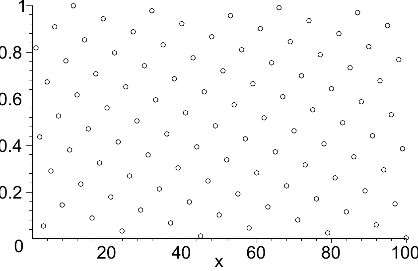
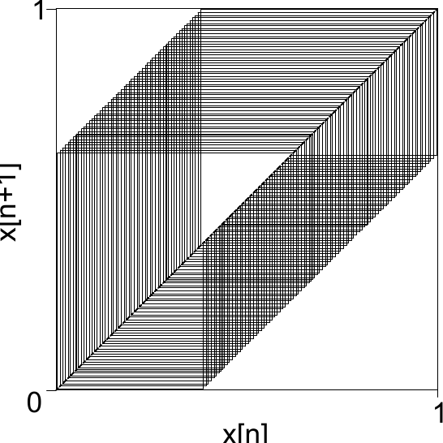

Quasi-periodicity of system {eq}`eq:disc2d:lincircle` for $\Omega=10.17$. (a) Series. (b) Cobweb.
```

As follows from {eq}`eq:disc2d:lincircle_p`, there are an infinite number of cases for $\Omega$ with periodic solutions. Nevertheless, there are infinitely more cases for which the system is not periodic. That is, for all $\Omega$ that are *not* a fraction but an irrational number, the solution will not be periodic. {numref}`fig:disc2d_lincircle_quasi` shows the behavior of the system for $\Omega=\frac{1}{2} (1 + \sqrt{5})$. Although the iteration sequence shows that there is much order in the system, the cobweb diagram fills up as $n \rightarrow \infty$, indicating that the system traverses the entire domain. This is naturally a direct result of the choice of $\Omega$: an irrational number cannot be converted to a fraction. Thus, no matter how many iterations and revolutions, the system will never return to its original location. A series like this is called *quasi-periodic*, as the space-filling behavior is a result of the mismatch between $\Omega$ and the size of the domain (which is 1).

Quasi-periodic and chaotic series share the ability never to return at the same location. Nevertheless, the two are fundamentally different. The difference resides in the sensitivity to initial conditions. The exact solution of {eq}`eq:disc2d:lincircle` is given by $x_n = x_0 + n \Omega \mod 1$. Introducing a second series $y_n$ with slightly perturbed initial conditions $y_0 = y_0 + \epsilon_0$ and solution $y_n = y_0 + n \Omega \mod 1$, the difference $y_n - x_n$ is given by

$$
y_n - x_n = y_0 - x_0 = \epsilon_0.
$$

The distance between the two series remains the same for all $n$, and we conclude that the system is not sensitive to initial conditions. This is a general feature of quasi-periodic solutions: even though never returning to the same location, a quasi-periodic solution lacks serious sensitivity to initial conditions. In terms of  Lyapunov exponents, this situation corresponds to $\Lambda =0$.

(sec:disc2d:circlemap)=
### Phase-locking and the Devil's staircase

In the previous section the linear map {eq}`eq:disc2d:lincircle` was shown to have an infinite number of periodic solutions. Nevertheless, there were infinitely many more solutions which were quasi-periodic. In this section we add a sinusoidal term to {eq}`eq:disc2d:lincircle`, thereby obtaining what is called the *circle map*

```{math}
:label: eq:disc2d:circlemap
x_{n+1} = x_n + \Omega + \frac{K}{2 \pi} \sin (2 \pi x_n) \,\, \mod 1.
```

This map can be derived from the kicked rotor when one assumes that the kicking interval is much larger that the time it takes for the system to stop rotating due to friction and adding a suitable forcing term (see section {numref}`sec:disc2d:kickedrotor`).

The question we set out to answer is how a non-linear sinusoidal term modifies the (quasi-)periodic behavior in {eq}`eq:disc2d:circlemap` one would have for $K=0$. One could surmise that the nonlinear term will destroy the periodic states and creates chaotic series. However, as we will see, instead of destroying periodic solutions, the nonlinear term in {eq}`eq:disc2d:circlemap` does the opposite: it stabilises the system.

Let us set $K = 1$ and vary $\Omega$ in the neighbourhood of $\Omega=1/2$. In {numref}`fig:disc2d_phaselocking`, series are shown for $\Omega \in \{ 0.460, 0.464, 0.500, 0.536, 0.540 \}$. Apparently, the system has period-2 behavior in the entire interval $\Omega \in [ 0.464, 0.536]$. This is interesting, since without the nonlineary, period-2 solutions were only present for $\Omega=1/2$. To compare, without the nonlinearity $\Omega = 0.464$ would result in a periodic solution with a rotation number $w=\frac{464}{1000}$.

Instead the nonlinearity causes the system to lock into a period-2 solution. This behavior is called *mode locking* or also *phase locking*.

```{figure} _static/disc2d/disc2d_circlemap_series.png
:name: fig:disc2d_phaselocking
:width: 8.50cm

phase locking in a period-2 solution for $\Omega \in [0.464; 0.536]$ and ($K=1$) in the circle map.
```

The tendency of a system to modify its frequency due to external impulses occurs in many situations. For example, crickets in South East Asia are known to chirp at a certain frequency and do so over extensive periods of time. Apparently, the crickets can increase or decrease their own natural chirping frequency depending on stimuli from outside to lock their phase with the other crickets.

For more information on this topic, see {cite:p}`Strogatz1994`.

Normally, phase-locking is the result of two competing timescales: a natural internal timescale (such as the cricket's preferred chirping rate) and an external forcing time scale (the chirping rate of the other crickets).

The spontaneous locking into specific modes may seem quite mysterious, but unlocking the secret behind the mode-locking of the circle map will require nothing more than the tools of chapter {numref}`sec:disc1d`. As we are interested in period-2 solutions $x_{n+2} = x_n = x^*$, it is natural to consider the second iterate $x_{n+2} = f(f(x_n))$ and study it for various values of $\Omega$. Shown in {numref}`fig:disc2d_circlemap_return_p2` are the mappings for $\Omega=0.464$, $0.500$ and $0.536$. As $\Omega$ increases, the mappings shift upwards. Around $\Omega=0.464$ (thin dashed line), the mapping starts intersecting with $y=x$, which lasts up to $\Omega=0.536$ (dash-dotted line). Thus, the phase-dependent acceleration or deceleration introduced by the nonlinearity, makes that period-2 solutions are possible over a finite range of $\Omega$.

```{figure} _static/disc2d/disc2d_circlemap_return_p2.png
:name: fig:disc2d_circlemap_return_p2
:width: 60mm

The second iterate $f(f(x))$ for the circle map at $K=1$. Shown are the mappings for $\Omega=0.464$ (thin dashed line), $\Omega=0.500$ (solid line) and $\Omega=0.536$ (dash-dotted line).
```

The interval for stable period-2 solutions of $\Omega \in [0.464, 0.536]$ was obtained by trial and error. However, it is possible calculate the stable resions directly by focusing on the point where period-2 solution become stable. At this point of bifurcation, in addition to $f(f(x))=x$, the stability $\sigma$ is exactly 1 (as can be seen in {numref}`fig:disc2d_circlemap_return_p2`; at bifurcation $f(f(x))$ has the same slope as $y=x$). This results in two equations, allowing us to solve for $x$ and $\Omega$ in parallel.

The method to solve for the stability region of period-2 solutions with `maple` is shown below. Unfortunaly, because of the particur nonlinearities of the problem, it is not possible to use `solve`. However, `fsolve` deals with this problem efficiently, although we will have to take comfort with numerical approximations.

````{admonition} Maple
:class: maple

```{code-block} maple
Omega := 'Omega':
f2 := x -> f(f(x));
f2mod1 := x-> mod1(f2(x));
df2 := D(f2);
sys := {df2(x) = 1, f2mod1(x) = x}:
fp1 := fsolve(sys, {x=0..1, Omega=0..1}):
fp2 := fsolve(sys, {x=0..1, Omega=0..1}, avoid={fp1}):
fp3 := fsolve(sys, {x=0..1, Omega=0..1}, avoid={fp1, fp2}):
fp4 := fsolve(sys, {x=0..1, Omega=0..1}, avoid={fp1, fp2, fp3}):
sols := fp1, fp2, fp3, fp4;
```
````

$$
\begin{aligned}
\mathtt{sols :=} && \{\Omega = 0.46302,\, x = 0.32904\},
 \{\Omega = 0.53698,\, x = 0.06801\}, \\
 && \{\Omega = 0.15915,\, x = 0.75000\},
 \{\Omega = 0.84085,\, x = 0.25000 \}.
\end{aligned}
$$

The first two solutions are the ones we are looking for; judging from the fact that $x=0.25$ and $x=0.75$ are on the line $y=x$ they must correspond to period-1 solutions. Therefore, the stability region for the period-$2$ solution is $\Omega \in [ 0.46301; 0.53698 ]$.

The circle map {eq}`eq:disc2d:circlemap` has some very special characteristics for $K=1$ and $\Omega \in [0,1]$. To demonstrate this, we introduce a generalized rotation number $W$ defined by

```{math}
:label: eq:disc2d:windingnumber__2
W = \frac{f^{(n)}(x_0) - x_0}{n} = \frac{x_n - x_0}{n}.
```

It is stressed that $f(x)$ may not contain the modulo operator, as it eliminates information about the number of cycles the system has undergone.

As opposed to $w$, the generalized rotation number $W$ is by definition a real number. When the solution is periodic, $W$ converges to $w$ as $n \rightarrow \infty$:

```{math}
:label: eq:disc2d:windingnumber_limit
\lim_{n\rightarrow \infty} W = w.
```

This can be shown as follows. Assume that the system has a period-$m$ solution with rotation number $w$. Now note that

$$
W = \frac{x_n - x_0}{n} = \frac{x_m - x_0}{n} + \frac{x_{2m} - x_m}{n} + \ldots + \frac{x_n - x_{r m}}{n},
$$

where $r$ is the number of full cycles of size $m$ in $n$. Due to the periodicity, $x_m - x_0 = x_{2m} - x_m = \ldots = m w$, by the definition of the rotation number {eq}`eq:disc2d:windingnumber`. Thus,

$$
W = \frac{r m w}{n} + \frac{x_n - x_{r m}}{n}.
$$

Approximating the number of full cycles $r$ by $r\approx n/m$ and the residual $x_n - x_{rm} \approx m w$ (which is assumed to include any contributions due to transients as well), we obtain that

$$
\lim_{n\rightarrow \infty} W \approx \lim_{n\rightarrow \infty} \left(1 + \frac{m}{n} \right) w = w
$$

which demonstrates {eq}`eq:disc2d:windingnumber_limit`.

Using {eq}`eq:disc2d:windingnumber__2`, we can create a plot of $W$ vs. $\Omega$ which gives information about the mode-locking behavior of the circle map at $K=1$. The following `maple` fragment creates this diagram.

````{admonition} Maple
:class: maple

```{code-block} maple
restart; with(plots):
f := (x,Omega)->x + Omega + K/twopi * sin(twopi*x);
twopi := evalf(2*Pi);
K := 1;
N := 200;
x0 := 0;
M := 500; Omin := 0; Omax := 1;
for m from 0 to M do
    Om[m] := evalf(Omin + m*(Omax-Omin)/M);
    xN := x0; for n from 0 to N-1 do xN := evalf( f(xN,Om[m]) ); end do:
    W[m] := (xN-x0)/N;
  end do:
plot([[seq([Om[m],W[m]],m=0..M)], x], x=0..1, 0..1,
       style=[point,line],symbolsize=1);
```
````

Note that instead of taking the limit of $n \rightarrow \infty$, $W$ is based on a a series of 200 iterations only. Therefore, residuals will not be negligible for periodic solutions with $m > 10$. The result is shown in {numref}`fig:disc2d_circlemap_devilstaircase`. The horizontal plateaus represent the mode-locked states. Clearly, there are many mode-locked states in the system, such as $w=1/3$, $w=2/3$, $w=1/4$, $w=3/4$ etc. The width of the plateaus decreases as the denominator of $w$ becomes larger. It can be shown that for $K=1$, the circle map is in a mode-locked state almost everywhere {cite:p}`Schuster1995` for $\Omega \in [0,1]$, see  {numref}`fig:disc2d_circlemap_devilstaircase`. In fact this graph forms a so-called *Devil's staircase*, because it consists of an infinite number of plateaus and an infinite number of steps. If one were to climb this staircase step by step, it would take forever to reach the top.

```{figure} _static/disc2d/disc2d_circlemap_winding.png
:name: fig:disc2d_circlemap_devilstaircase
:height: 60mm

Generalized rotation number $W$ as a function of $\Omega$. This is a Devil's staircase.
```

```{figure} _static/disc2d/disc2d_circlemap_bifurcation.png
:name: fig:disc2d_circlemap:bifurcation
:height: 50mm

bifurcation diagram and Lyapunov exponents
```

In the case of the circle map at $K=1$, the set of measure 0 is provided by the quasi-periodic states. {numref}`fig:disc2d_circlemap:bifurcation` shows the bifurcation diagram for $\Omega$ at $K=1$ and the corresponding Lyapunov exponents $\Lambda$. As can be seen, $\Lambda$ is generally negative, indicating the periodic states. Upon moving from one mode-locked state to the next, $\Lambda$ increases to approximately zero, after which it becomes negative again. Interestingly, this situation is entirely opposite from the situation when $K=0$. In that case, quasi-periodic states are present almost everywhere except where $\Omega$ is a rational number.

One may wonder why there are no chaotic solutions, as $\Lambda$ never seems to get above zero. This is because {eq}`eq:disc2d:circlemap` is invertible for $K \le 1$.

Chaos sets in above $K=1$, although regions with mode-locking and with chaos are intertwined as a function of $K$ and $\Omega$. Mode-locked states can exist very near to chaotic states in the $\Omega-K$ phase space. Shown in {numref}`fig:circlemap:lyapunov` are the Lyapunov exponents for a large portion of the $\Omega$-$K$ phasespace. The color code is such that the periodic states for which $\Lambda<0$ are colored blue, and the chaotic regions for which $\Lambda>0$ are colored red. For $\Lambda=0$, corresponding to quasi-periodic states, the color is white.

```{figure} _static/disc2d/disc2d_circlemap_lyapunov.png
:name: fig:circlemap:lyapunov
:width: 80mm

Lyapunov exponents $\Lambda$ in the $\Omega$-$K$ parameter-space. Coloring is $[-1,1]$; colorscheme: blue=-1; white=0; red=1
```

(sec:disc2d:standardmap)=
### The standard map

Another widely studied chaotic discrete map is the *standard map*. This system represents the frictionless kicked rotor system (section {numref}`sec:disc2d:kickedrotor`), but also describes many other systems in the fields of mechanics of particles, accelerator physics, plasma physics, and solid state physics. The standard map is given by

```{math}
:label: eq:disc2d:standardmap_x
\begin{aligned}
x_{n+1} &= x_n + y_{n+1} \quad \mod 1,\\
 y_{n+1} &= y_n + \frac{K}{2 \pi} \sin( 2 \pi x_n ) \quad \mod 1.
\end{aligned}
```

Here, $x$ and $y$ are associated with the phase angle and angular momentum, respectively. Clearly, for $K=0$, the map reduces to the linear map we studied in section {numref}`sec:disc2d:lincircle`.

```{subfigure} 2
:name: fig:disc2d_standardmap:quasi_series
:align: center
:subcaptions: below

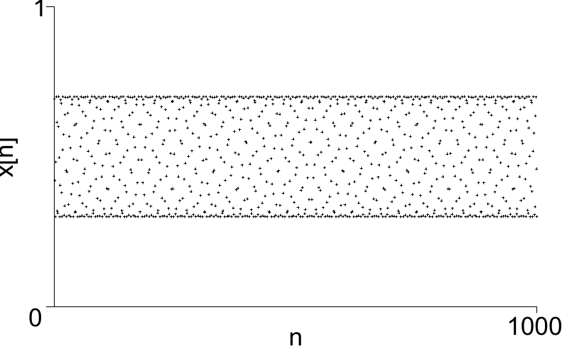
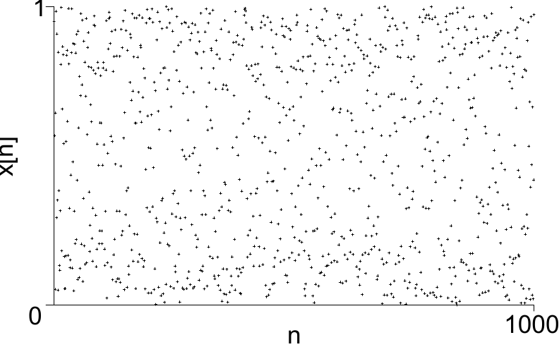
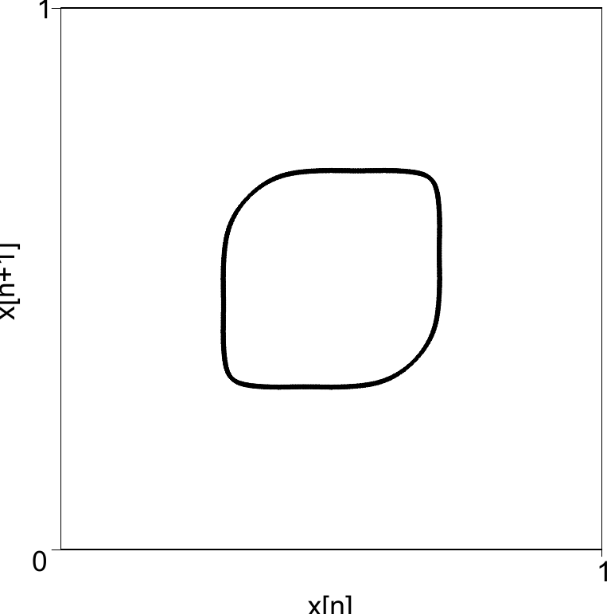
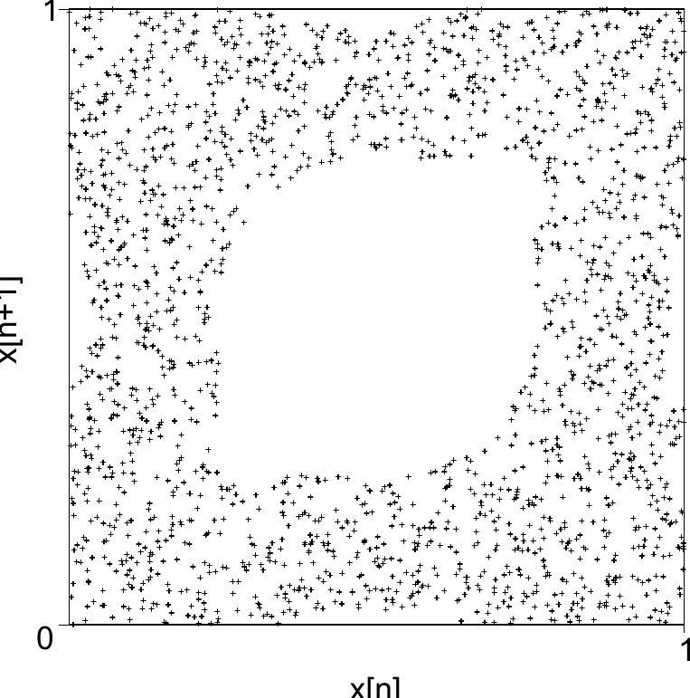
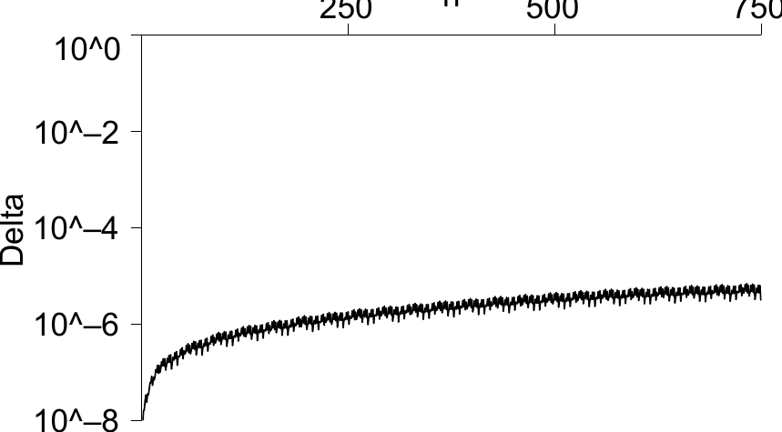
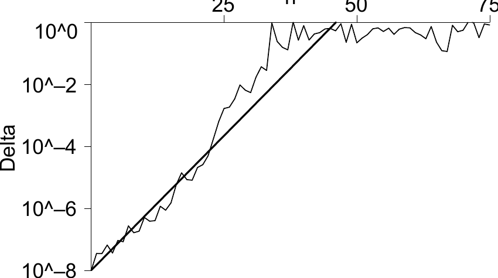

Coexistence of chaotic and quasi-periodic solutions at $K=2$. Note the factor 10 difference in scale for the $x$-axis between {numref}`fig:disc2d_standardmap:quasi_series` and {numref}`fig:disc2d_standardmap:quasi_series`. (a) Quasi-periodic; series. (b) Chaotic; series. (c) Quasi-periodic; return plot. (d) Chaos; return plot. (e) Quasi-periodic; deviations. (f) Chaos; deviations.
```

Unlike the maps we studied so far, the behavior of the standard map depends strongly on its initial conditions. Indeed, chaotic behavior was normally obtained by changing a system parameter, such as $r$ in the case of the logistic map. For the standard map, (quasi-) periodic solutions can coexist with chaotic solutions at fixed $K$. {numref}`fig:disc2d_standardmap:quasi_series` shows a time-series with initial conditions $(x_0, y_0) = (0.4, 0.1)$ at $K=2$. Although there seems to be some order in the system judging from the hexagonal-like patterns, the series seems to traverse an entire interval of $x$.  The return plot of ({numref}`fig:disc2d_standardmap:quasi_series`) shows that all points fall on one curve, which suggests that the series is either quasi-periodic or chaotic. One can distinguish between the two by studying the sensitivity to initial conditions, and {numref}`fig:disc2d_standardmap:quasi_series` shows that deviations seems to saturate at $10^{-5}$. The assiocated Lyapunov exponent $\Lambda \approx 0$, and we conclude that this series is quasi-periodic.

On the other hand, using initial conditions $(x_0, y_0) = (0.1, 0.1)$, the standard map displays chaotic behavior. The series is shown in {numref}`fig:disc2d_standardmap:quasi_series`, and its return plot in {numref}`fig:disc2d_standardmap:quasi_series`. The return plot reveals very little order in the system: based on a current value $x_n$ practically all values can be expected for $x_{n+1}$, except when $x_n$ is near $0.5$. The chaotic nature of the series can be verified by the sensitive dependence on initial conditions ({numref}`fig:disc2d_standardmap:quasi_series`), with an estimated (effective) Lyapunov exponent of $\Lambda \simeq 0.4$.

The return plot for the chaotic series ({numref}`fig:disc2d_standardmap:quasi_series`) shows no sign of an attractor. In this respect, the standard map is fundamentally different from other 2D discrete maps such as the Hénon map . This is because the standard map is *area preserving*. If one were to start out with a little square of initial conditions and apply ({eq}`eq:disc2d:standardmap_x`) its area will remain the same. This can be shown by calculating the determinant of the Jacobian:

````{admonition} Maple
:class: maple

```{code-block} maple
restart: with(LinearAlgebra): with(VectorCalculus, Jacobian):
twopi := 2 * Pi;
f := (x, y) -> x + g(x, y);
g := (x, y) -> y + K/twopi * sin(twopi * x);
J := Jacobian([f(x, y), g(x, y)], [x, y]);
det := Determinant(J);
```
````

$$
\begin{gathered}
J = \left( \begin{array}{cc} 1 + K \cos(2 \pi x) & 1 \\
 K \cos(2 \pi x) & 1
 \end{array} \right) \\
 \mathtt{det} = 1
\end{gathered}
$$

Although the Jacobian $J$ has a functional dependence on $x$, its determinant does not. The mapping preserves its area because $\det J = 1$. Recall that the determinant of a matrix $J$ is related to its eigenvalues by $\det J = \sigma_1 \sigma_2$. In the eigenframe, an infinitesimal square of size $\delta_1 \times \delta_2$ would map to $\sigma_1 \delta_1 \times \sigma_2 \delta_2= \det J \delta_1 \times \delta_2$. Therefore, if $\det J = 1$, areas are preserved. The preservation of area means that this system cannot settle on an attractor, as this requires a convergence of initial conditions (i.e. $|\det J | < 1$) to a small region of space.

The phase space $(x, y)$ of the standard map for $K=2$ is shown in {numref}`fig:disc2d_standardmap_phase`. The different colors in the diagram are series obtained with different initial conditions. A large part of the phasespace has chaotic behavior (black dots). However, there are islands of order in this 'sea of chaos' (other colors). In particular, there is a large region around $(x,y)=(1/2, 0)$ with quasi-periodic solutions. Note that the grey-coloured quasi-periodic solution around $(1/2, 1/2)$ actually consists of two regions (the other one around $(0, 1/2)$) between which it alternates.

The standard map is periodic (modulo 1) in both $x$ and $y$. Therefore, the phase space is topologically a *torus*. Imagine that the phase space of {numref}`fig:disc2d_standardmap_phase` is glued on a thin sheet of rubber. As $x=0$ and $x=1$ represent the same point, we bring them together, obtaining a cylinder. Now, $y=0$ and $y=1$ also represent identical points, and on bringing together the two ends of the cylinder, one ends up with a torus ({numref}`fig:disc2d_standardmap_phase`).

```{subfigure} 2
:name: fig:disc2d_standardmap_phase
:align: center
:subcaptions: below

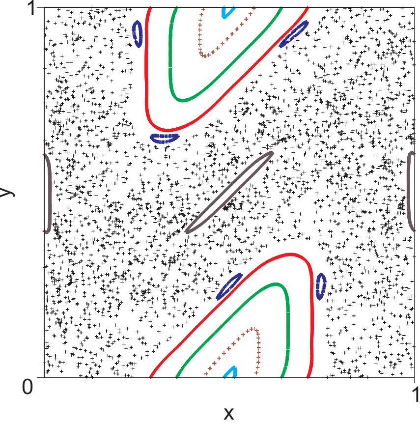
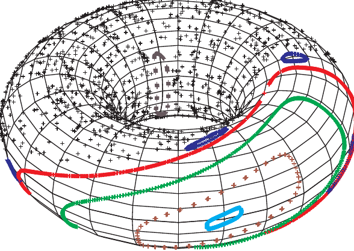

Islands of order in a sea of chaos for the standard map at $K=2$ (a) Phasespace. (b) Mapped onto torus.
```

(sec:disc2d:manifolds)=
### Stable and unstable manifolds

The standard map ({eq}`eq:disc2d:standardmap_x`) has a fixed point at $(0, 0)$ and the eigenvalues of the Jacobian in the fixed point $J^*=J(0,0)$ are given by

$$
\sigma_{1,2} = 1 + \frac{1}{2} K \pm \frac{1}{2} \sqrt{K (K+4)}.
$$

For all $K>0$, $\sigma_1 > 1$ and $0 < \sigma_2 < 1$. Therefore, the fixed point $(0,0)$ is a saddle node. In many ways, this saddle node in the domain is the source of the complex behavior, and we will explore this below.

Let us follow the evolution of a large cloud of initial conditions focused very near the saddle node $(0, 0)$.

The initial shape is a small square square, which is shown in {numref}`fig:disc2d_standardmap_saddlenode_n=-6`. As before, we take $K=2$, for which the eigenvalues and eigenvectors can be calculated by

````{admonition} Maple
:class: maple

```{code-block} maple
K := 2;
fp := {x=0, y=0};
(v,e) := Eigenvectors(subs(fp, J));
```
````

Thus, the largest eigenvalue $\sigma_1=3.73$ with eigenvector $\mathbf{e}_1 = (0.8, 0.6)$ and the other eigenvalue $\sigma_2 = 0.27$ with eigenvector $\mathbf{e}_2 = (-0.35, 0.97)$. Based on $\mathbf{e}_1$, we expect that the cloud will expand at an angle of about $40^o$ with the horizontal.

```{subfigure} 2
:name: fig:disc2d_standardmap_saddlenode_n=-6
:align: center
:subcaptions: below

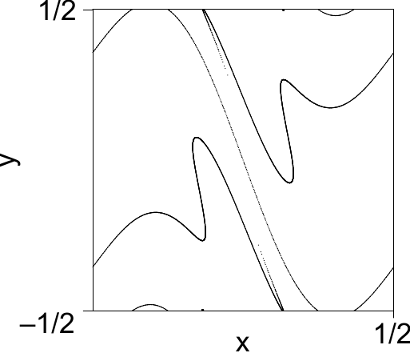
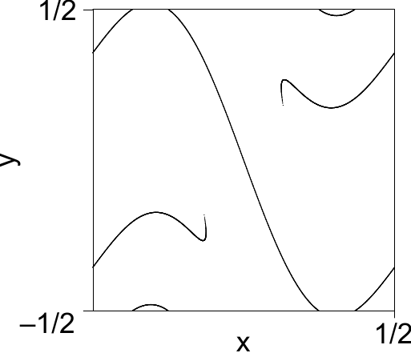
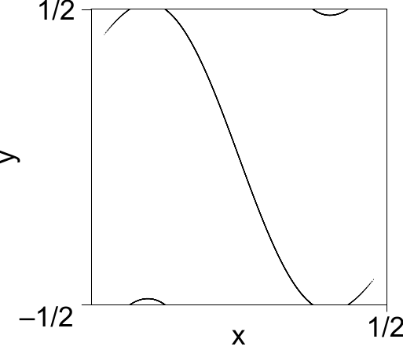
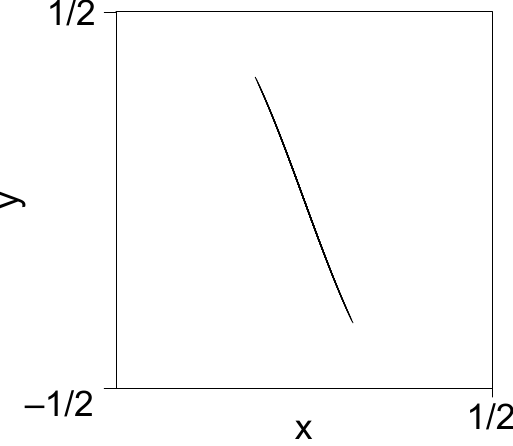
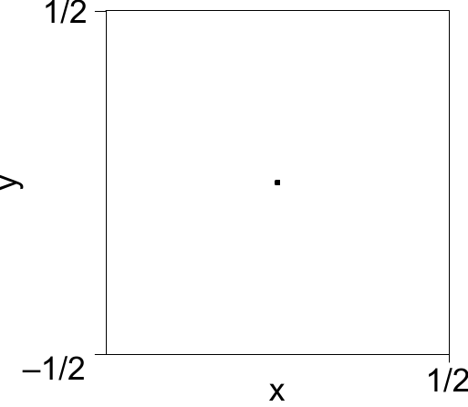
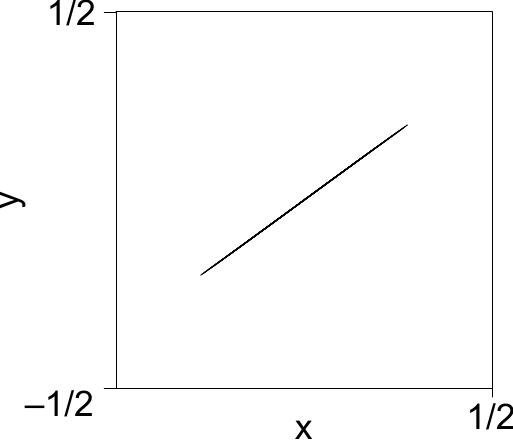
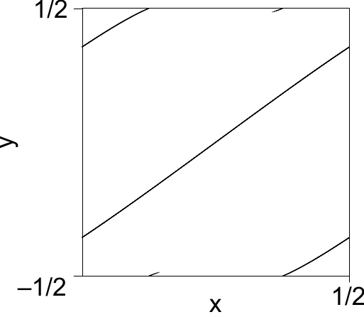
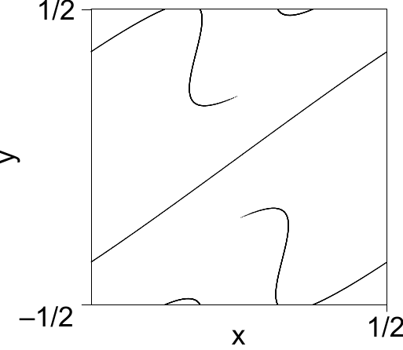
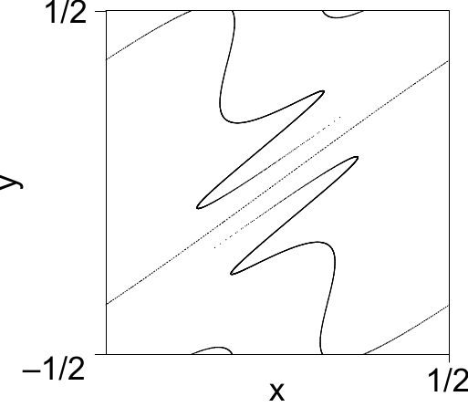

Unfolding of the stable and unstable manifolds by following a small cloud of initial conditions around $(0,0)$ (fig e). (f-i) shows the unfolding of the unstable manifold. By iterating the inverse ({eq}`eq:disc2d:standardmap_xi`), (a-d) show the unfolding of the stable manifold. (a) N=-6. (b) N=-5. (c) N=-4. (d) N=-3. (e) N=0. (f) N=3. (g) N=4. (h) N=5. (i) N=6.
```

Indeed, when we apply ({eq}`eq:disc2d:standardmap_x`) on the square, it deforms into a parallelogram; expanding in the direction of $\sigma_1$ and contracting in the direction of $\sigma_2$ whilst preserving its area. In the first few iterations, changes are too small to be visible at the size of the domain, but at $n=3$ ({numref}`fig:disc2d_standardmap_saddlenode_n=-6`) the points have escaped the vicinity of the fixed point. Note that due to constant expansion in one direction and contraction into the other, the initial square deforms into a curve. In the next iteration ({numref}`fig:disc2d_standardmap_saddlenode_n=-6`), the curve spans the entire domain and at $n=5$ ({numref}`fig:disc2d_standardmap_saddlenode_n=-6`), the curve deflects back towards its origin but now from the stable direction. As the curve approaches the fixed point ({numref}`fig:disc2d_standardmap_saddlenode_n=-6`) it starts oscillating back and forth with increasing amplitude as the fixed point approaches.

```{figure} _static/disc2d/disc2d_manifolds.png
:name: fig:disc2d_manifolds
:width: 9cm

Sketch of the stable and unstable manifolds
```

The curve that is emerging in {numref}`fig:disc2d_standardmap_saddlenode_n=-6` is called the *unstable manifold*, and is denoted by $W^u$. The unstable manifold $W^u$ is defined as the set of points in the domain which originate from the fixed point. Denoting the map by $\mathbf{f}$, its inverse by $\mathbf{f}^{-1}$ and the fixed point by $\mathbf{x}^*$, the unstable manifold $W^u$ is the set of all $\mathbf{x}$ for which

$$
\lim_{n \rightarrow \infty} \mathbf{f}^{(-n)}(\mathbf{x}) = \mathbf{x}^*
$$

An example is sketched in {numref}`fig:disc2d_manifolds` with a series $\mathbf{x}^{u}$ which travels away from the fixed point over the unstable manifold. If we invert $\mathbf{f}$, stable directions become unstable and vice versa. Furthermore, the series $\mathbf{x}^{u}$ is reversed by which it ends up in $\mathbf{x}^*$ in the limit.

If there is a unstable manifold, then there must be a *stable manifold* as well. This is indeed the case, and the stable manifold $W^s$ is defined as

$$
\lim_{n \rightarrow \infty} \mathbf{f}^{(n)}(\mathbf{x}) = \mathbf{x}^*
$$

Thus, the requirement of $W^s$ is that by iterating $\mathbf{f}$ forward to infinity, one must end up in $\mathbf{x}^*$. To find $W_s$ with `maple` , we employ exactly the same strategy as for $W^u$ but now we iterate with the *inverse* mapping. The inverse of ({eq}`eq:disc2d:standardmap_x`) is given by

```{math}
:label: eq:disc2d:standardmap_xi
\begin{aligned}
x_n = f^{-1}(x_{n+1}, y_{n+1})
 =& x_{n+1} - y_{n+1}, \\
 y_n = g^{-1}(x_{n+1}, y_{n+1})
 =& y_{n+1} - \frac{K}{2 \pi} \sin (2 \pi x_n).
\end{aligned}
```

As mentioned before, by inverting ({eq}`eq:disc2d:standardmap_x`), the stable directions near the fixed point become unstable and vice versa. If we repeatedly apply ({eq}`eq:disc2d:standardmap_xi`) to the cloud of initial conditions ({numref}`fig:disc2d_standardmap_saddlenode_n=-6`), we obtain after 3 iterations {numref}`fig:disc2d_standardmap_saddlenode_n=-6`, after 4 iterations {numref}`fig:disc2d_standardmap_saddlenode_n=-6` and so on. As can be seen, the stable manifold has qualitatively the same features as the unstable manifold, in that it turns back on itself and starts oscillating with increasing amplitude as it approaches the fixed point.

```{figure} _static/disc2d/disc2d_standardmap_manifolds.png
:name: fig:disc2d_standardmap_manifolds
:width: 7.5cm

Intertwining of the unstable (black circles) and stable (grey diamonds) manifolds, showing how incredibly complex the phase plane is. Note that this only a small part of the manifolds, as we have only iterated 7 times instead of infinite.
```

By plotting the stable and unstable manifolds $W^s$ and $W^u$ in one graph ({numref}`fig:disc2d_standardmap_manifolds`), we see that the stable and unstable manifolds intersect many times. This means that there are points in the phase space which end up in the saddle node at (0, 0) both in the limit of $n \rightarrow - \infty$ or $n \rightarrow \infty$. An intersection of a stable and unstable manifold originating from the same fixed point is called a *homoclinic intersection*. If a stable manifold from a fixed point intersects with an unstable manifold from another fixed point, the intersection is called an *heteroclinic* intersection. There are either zero or infinitely many intersections of $W^s$ and $W^u$. This is easy to verify, because when there is one intersection $\mathbf{x}_i$, applying the mapping $\mathbf{f}$ will generate another intersection. Iterating again will generate another intersection and so on to infinity. The same holds for applying the inverse $\mathbf{f}^{-1}$ on $\mathbf{x}_i$.

For more information, we refer to e.g. {cite}`Ott1993,Schuster1995`.

[^fn1]: This is a somewhat simpler version of a ball bouncing in a wedge shaped confinement
[^fn2]: The state $w=4/6$ does not exist for the linear map {eq}`eq:disc2d:lincircle`. The realisable period-6 solutions, after excluding the period 1,2 and 3 solutions from {eq}`eq:disc2d:lincircle_p`, are $w= \in \{ 1/6, 5/6 \}$. However, for nonlinear maps a state like $w=4/6$ can exist, because not all increments have the same size.

```{toctree}
:hidden:

exercises_disc2d
```
