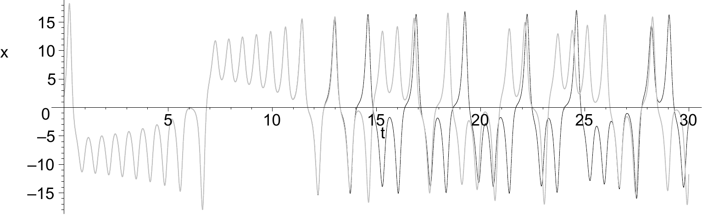
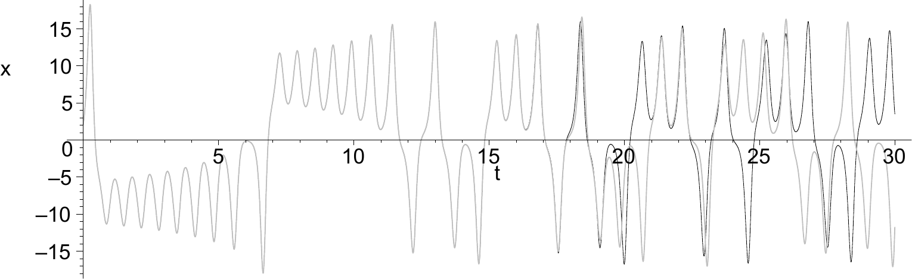
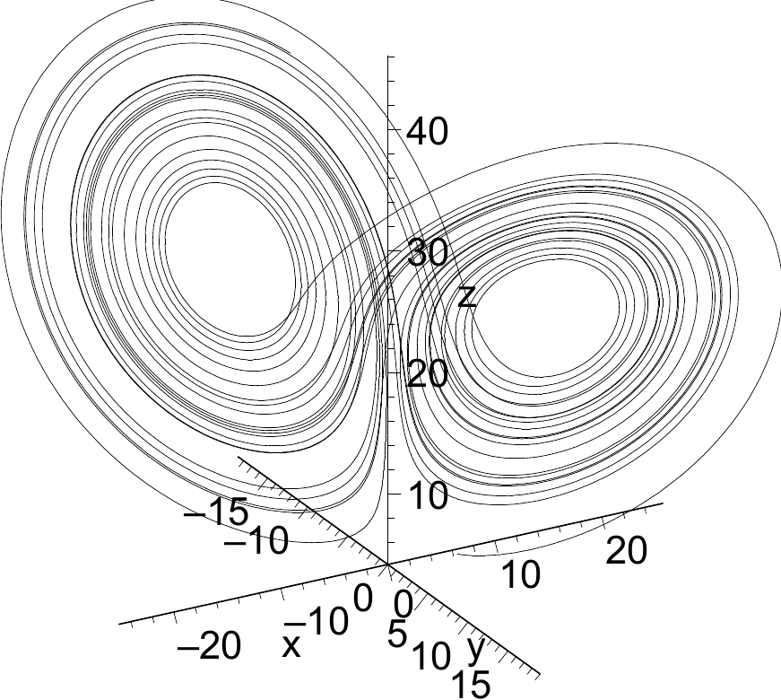
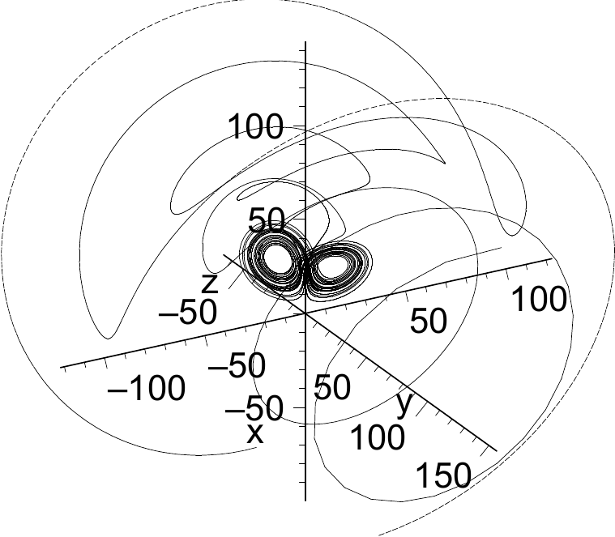
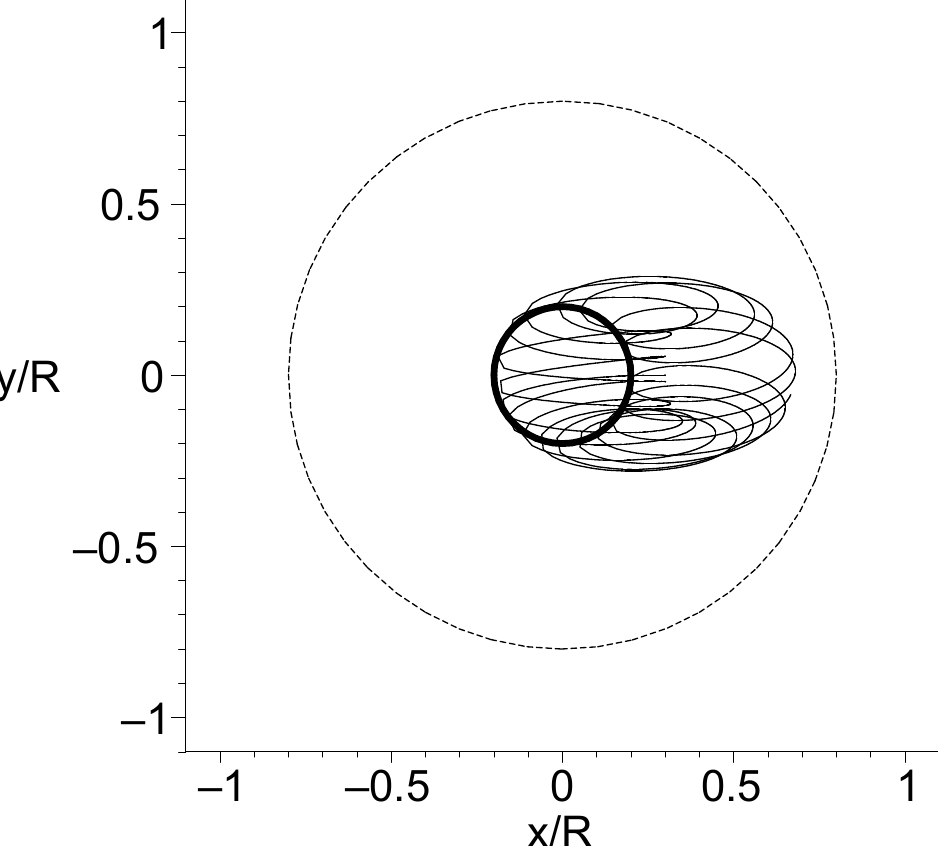
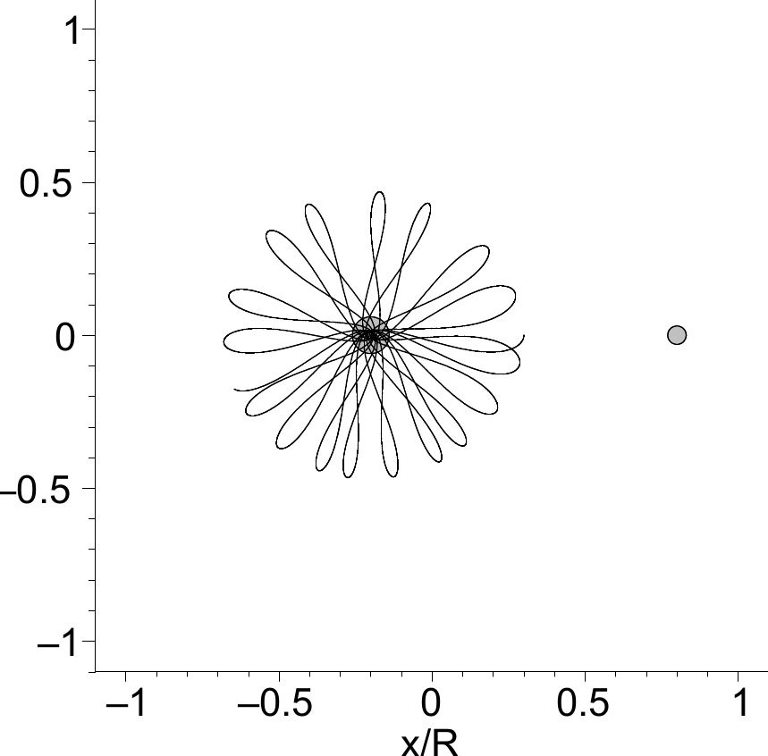
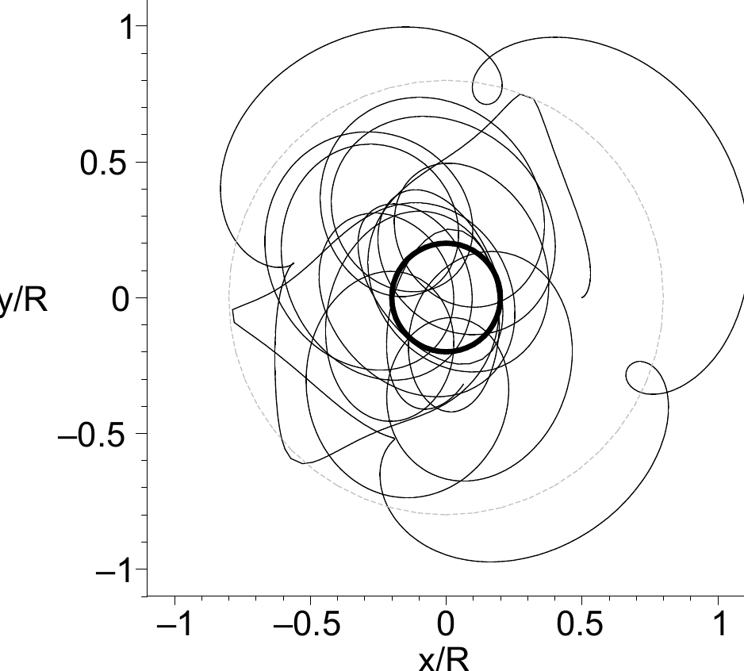
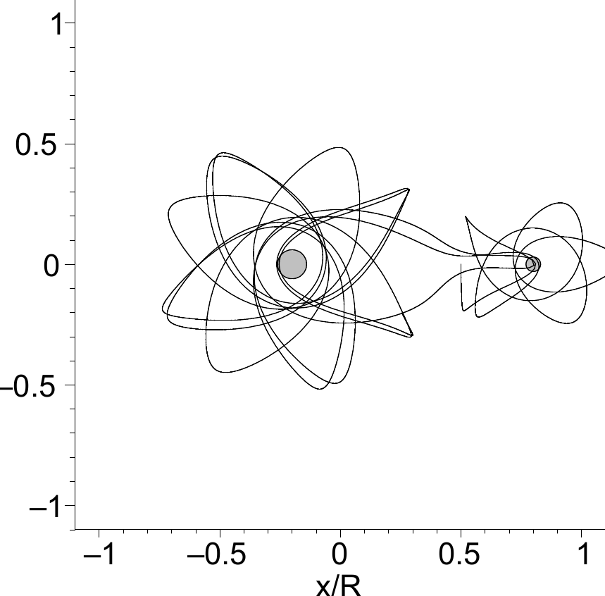
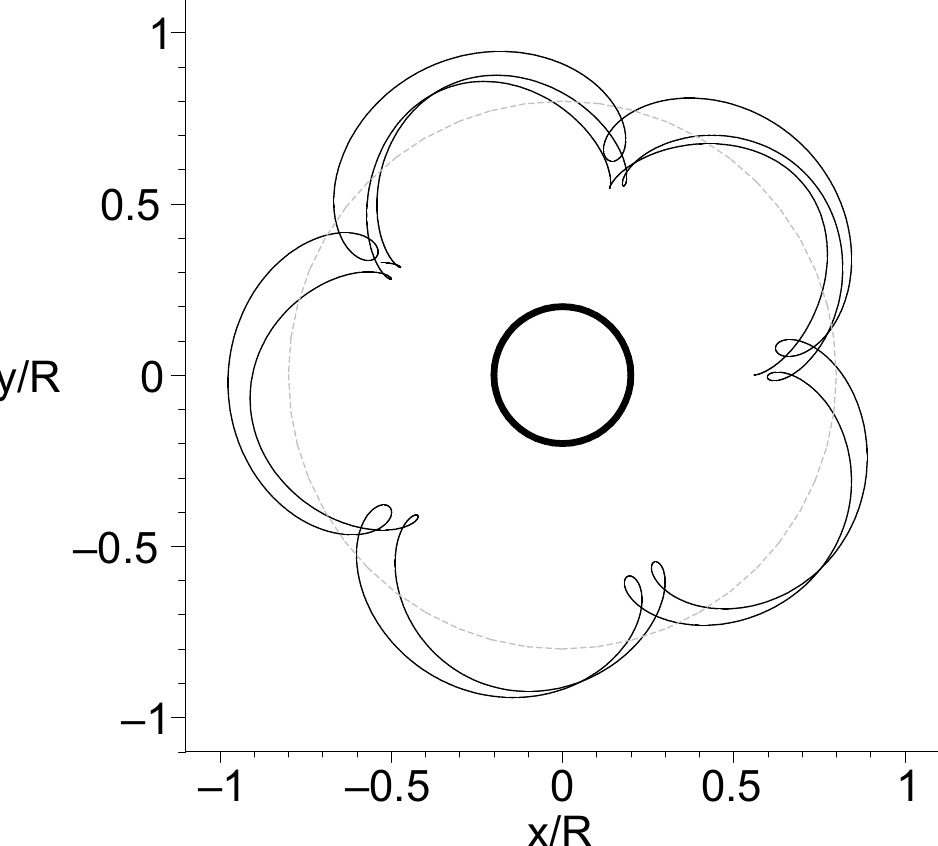
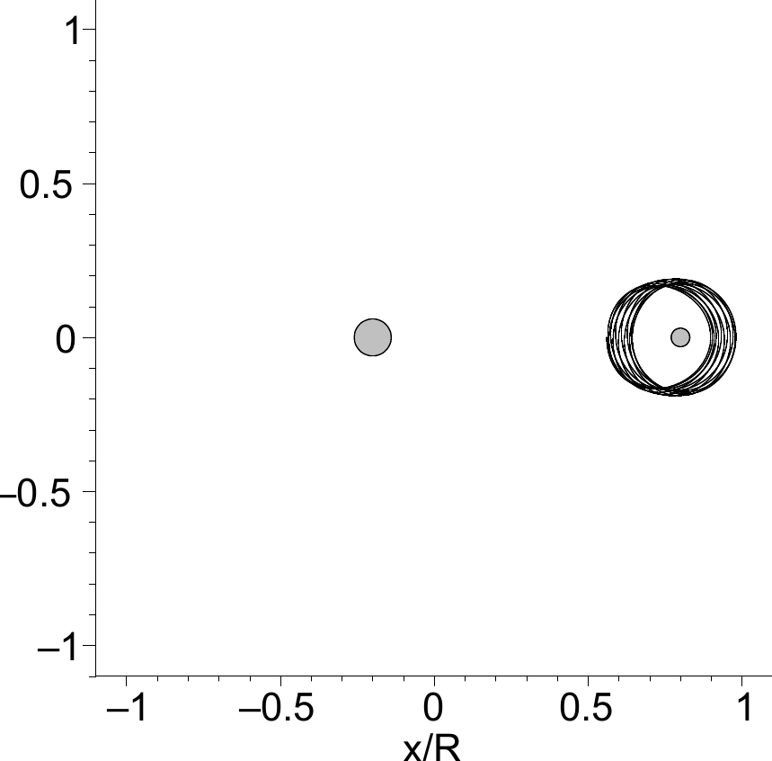

(chap:endstart)=
# A start at the end

## Sensitive dependence on initial conditions: the butterfly effect

Around 1960 Edward Lorenz made an odd discovery. Working at MIT Lorenz worked on the issue of weather prediction, but rather than studying the full equations describing atmospheric flow and weather phenomena, he chose to focus on a highly simplified set of equations that still retained some essential elements of the atmospheric system. The governing equations of his abstract system are

```{math}
:label: eq:phenomenon_lorenz
\dot{x} &= \sigma(y-x)\\
\dot{y} &= rx - y -xz\\
\dot{z} &= xy-bz
```

where $r, b$ and $\sigma$ are parameters and $\dot{x}$ denotes $\mathrm{d}x/\mathrm{d}t$. Making use of an early supercomputer he could numerically integrate the equations in time to obtain long-term predictions. In order to be able to calculate the system's behaviour over very long periods, Lorenz sometimes started a new simulation from the 'halfway' result of a calculation that was still running. But when he plotted such a continued calculation together with the original calculation in one graph, he noted to his utter surprise that after a brief period the two curves started to diverge rapidly, ultimately displaying entirely different behaviour. Lorenz figured out that the "stored" values that he used as initial conditions for the second calculations differed slightly from the original values due to round-off effects. This led him to conclude that a minute perturbation of the initial conditions can lead to enormous differences over time. The perspective of weather prediction provided an excellent metaphor to express the effect that small causes can have big impacts: *Does the flap of a butterfly's wings in Brazil set off a tornado in Texas?*

With a modern PC we can today easily retrace Lorenz' footsteps and experience ourselves the remarkably rich behaviour of his simple system as well as the sensitive dependence on initial conditions. To this end, we start `maple` and load the file `LorenzSensitiveDependence_start.mws`, which contains an implementation of the system {eq}`eq:phenomenon_lorenz`, listed below (text comments are preceded by an '[')

````{admonition} Maple
:class: maple

```{code-block} maple
restart; with(plots): with(DEtools):
#  Define the Lorenz equations
f1 := (x, y, z) -> sigma * (y - x);
f2 := (x, y, z) -> -x * z + r * x - y;
f3 := (x, y, z) -> x * y - b * z;
DE1 := diff(x(t), t) = f1(x(t), y(t), z(t)):
DE2 := diff(y(t), t) = f2(x(t), y(t), z(t)):
DE3 := diff(z(t), t) = f3(x(t), y(t), z(t));
DE := DE1, DE2, DE3;
#  Set the parameters
r:=28; b:=8/3; sigma:=10;
#  Set the initial conditions
ic1 := x(0)=2, y(0)=5, z(0)=5;
#  Solve system with dsolve.
sol1 := dsolve({DE, ic1}, [x(t), y(t), z(t)], type=numeric,maxfun=-1);
#  Set the integration range ..
tstart := 0; tend := 30;
#  And plot the timeseries ..
odeplot(sol1, [t, x(t)], tstart..tend, labels=["t","x"]);
```
````

Running the entire worksheet produces the time series of $x(t)$ shown in {numref}`fig:phenomenon_lorenz_xt_series`.

```{figure} _static/phenomenon/phenomenon_lorenz_xt_series.png
:name: fig:phenomenon_lorenz_xt_series
:width: 100%

Time series $x(t)$ of the Lorenz system {eq}`eq:phenomenon_lorenz`.
```

The time series of $x(t)$ seems to oscillate peacefully, yet no regular pattern has established itself in the range $t \in [0,30]$. One might suspect that this is merely the *transient* phase — the period before the system settles into an equilibrium behaviour — and extend the integration time by adjusting `tstart` and `tend` to, for example, $100 \ldots 130$ or $1000 \ldots 1030$; plotting $y(t)$ or $z(t)$ instead of $x(t)$ tells the same story. However long the integration time is chosen, no regular pattern emerges. This is not yet a proof of chaos, since the transient might simply be even longer. As will be elaborated in the chapters to follow, chaotic behaviour is defined in terms of how sensitively the system responds to a small change in the initial conditions. We can probe this by integrating the Lorenz system for two slightly differing initial conditions: removing the `#` symbols at the end of the worksheet activates the commands below, which produce plots like {numref}`fig:phenomenon_lorenz_xt_two_series`.

````{admonition} Maple
:class: maple

```{code-block} maple
ic2 := x(0)=2+epsilon,y(0)=5,z(0)=5;
epsilon := 1E-3;
sol2 := dsolve({DE,ic2},[x(t),y(t),z(t)],type=numeric,maxfun=-1);
#  plot 2 timeseries in one plot.
tstart := 0; tend := 30;
p1 := odeplot(sol1,[t,x(t)],tstart..tend,labels=["t","x"],color=blue):
p2 := odeplot(sol2,[t,x(t)],tstart..tend,labels=["t","x"],color=red):
display([p1,p2]);
```
````

```{subfigure} 2
:name: fig:phenomenon_lorenz_xt_two_series
:align: center
:subcaptions: below




Sensitive dependence on initial conditions in the Lorenz-system. Two time-series with slightly differing initial conditions in $x$: $x(0)=2$ and $x(0)=2+\epsilon$, respectively. In all cases $y(0)=5,z(0)=5$. (a) $\epsilon = 10^{-3}$. (b) $\epsilon = 10^{-5}$.
```

Reducing $\epsilon$ delays the moment at which the two series visibly diverge, but they always do so eventually. If $\epsilon$ is made small enough the solutions appear to stay together indefinitely; this is deceptive, however, and reflects the finite accuracy of the computation rather than the dynamics of the system. Increasing the working precision — for instance with `> Digits := 20;`, which instructs `maple` to use $20$ digits instead of the default $10$ — restores the divergence.

Apart from analysing the time-series, much can be learned by studying the system in the 3d-*phase-space*. In `maple` this requires only a minor change of the plot command: `odeplot(sol1,[x(t),y(t),z(t)],tstart..tend,labels=["x","y","z"]);`  which gives a plot like {numref}`fig:phenomenon_lorenz_phasespace`.

```{subfigure} 2
:name: fig:phenomenon_lorenz_phasespace
:align: center
:subcaptions: below




Trajectories in phase-space. (a) 'butterfly'-shaped appearance of the system dynamics in phase space. (b) 'attractor'; as the trajectories converge on the butterfly, the object appears to attract the trajectories.
```

Viewed from various angles, the phase-space trajectory reveals the celebrated butterfly shape. Trajectories launched from different initial conditions — even one as far away as $x(0) = 100$ — are all drawn onto the same object: they converge upon the *attractor* (compare {numref}`fig:phenomenon_lorenz_phasespace`).

See the file `LorenzSensitiveDependence.mws` for a worked-out maple-sheet. The Lorenz system will be studied in more detail in chapter {numref}`chap:cont3d`.

(sec:phenomenon:celestial)=
## Celestial Uncertainties

```{figure} _static/phenomenon/3body.png
:name: fig:phenomenon_3body_earthmoon

Three-body problem.
```

Imagine three celestial objects – like stars, planets, moons, meteorites and/or satellites – which influence each other by their gravitational pull. Would it be possible to fully predict the future trajectories of these three interacting objects?

It may come as a surprise that the answer turns out to be 'no, not in general'. As discussed during the first lecture, this so-called 'three body problem' has a long history involving among others Euler, Laplace and Poincaré. In the end it was Henri Poincaré who managed to prove that the system cannot be solved analytically in general situations. Only in a few special cases can the solution be expressed in a closed form. To get a feeling for the enormous complexity of the three body problem, we will analyse the system below and calculate numerically some possible trajectories with the aid of `maple` .

Consider {numref}`fig:phenomenon_3body_earthmoon`. The magnitude of the gravitational force of $m_2$ on $m_1$ is given by Newton's law

$$
f_{21} = G \frac{m_1 m_2}{\left|\mathbf{x}_2 - \mathbf{x}_1\right|^2}
$$

with $G$ the gravitational constant given in {numref}`table:phenomenon_3bodyconstants`. The direction of this force can be expressed by $(\mathbf{x}_2 - \mathbf{x}_1)/{\left|\mathbf{x}_2 - \mathbf{x}_1\right|}$. Hence the complete three body problem can be written as

```{math}
:label: eq:phenomenon_3body_full
\begin{aligned}
m_1 \ddot{\mathbf{x}}_1 &= G m_1 m_2 \frac{\mathbf{x}_2 - \mathbf{x}_1}
 {\left|\mathbf{x}_2 - \mathbf{x}_1\right|^3}
 \,\,+\,\, G m_1 m_3 \frac{\mathbf{x}_3 - \mathbf{x}_1}
 {\left|\mathbf{x}_3 - \mathbf{x}_1\right|^3}\\
 m_2 \ddot{\mathbf{x}}_2 &= G m_2 m_1 \frac{\mathbf{x}_1 - \mathbf{x}_2}
 {\left|\mathbf{x}_1 - \mathbf{x}_2\right|^3}
 \,\,+\,\, G m_2 m_3 \frac{\mathbf{x}_3 - \mathbf{x}_2}
 {\left|\mathbf{x}_3 - \mathbf{x}_2\right|^3}\\
 m_3 \ddot{\mathbf{x}}_3 &= G m_3 m_1 \frac{\mathbf{x}_1 - \mathbf{x}_3}
 {\left|\mathbf{x}_1 - \mathbf{x}_3\right|^3}
 \,\,+\,\, G m_3 m_2 \frac{\mathbf{x}_2 - \mathbf{x}_3}
 {\left|\mathbf{x}_2 - \mathbf{x}_3\right|^3}
\end{aligned}
```

The system constitutes a phase-space with dimension 18: three variables each with six degrees of freedom (three-dimensional position and velocity).

This eighteen-dimensional problem can be reduced dramatically by exploiting the particular structure of the earth–moon–satellite setting. Because the satellite ($m_3$) is exceedingly light compared with the earth ($m_1$) and the moon ($m_2$), i.e. $m_3 \ll m_1,m_2$, it is pulled around by the two heavy bodies but exerts no appreciable influence on them. If, in addition, the two heavy bodies (the *primaries*) are taken to move on circular orbits about their common centre of mass, and the satellite is confined to that orbital plane, the eighteen dimensions collapse to just four. This reduction, from Newton's law {eq}`eq:phenomenon_3body_full` to the compact system below, is carried out step by step in Appendix {numref}`app:twobody`. Writing the satellite position as $\mathbf{x}_{3}(t) = (x(t),y(t))$ and its velocity components as $u=\dot{x}$, $v=\dot{y}$, the resulting equations of motion are

```{math}
:label: eq:phenomenon_3body_simple1_m3_full__phenomenon
\dot{x} &= u\\
 \dot{y} &= v\\
 \dot{u} &= G m_1 [x_1 - x]/d_{1}^{3} \,\,+\,\, G m_2 [x_2 - x]/d_{2}^{3}\\
 \dot{v} &= G m_1 [y_1 - y]/d_{1}^{3} \,\,+\,\, G m_2 [y_2 - y]/d_{2}^{3}
```

with $d_1$ and $d_2$ the distances from the satellite to the earth and to the moon,

```{math}
:label: eq:phenomenon_3body_distances__phenomenon
d_1 = \sqrt{(x_1 - x)^2 + (y_1 - y)^2}\,\,\,\,\,\,\,\,\,\, d_2 = \sqrt{(x_2 - x)^2 + (y_2 - y)^2}
```

and the earth- and moon-positions moving on their circular orbits

```{math}
:label: eq:phenomenon_3body_x1x2__phenomenon
\begin{gathered}
\left[
 \begin{array}{c}
 x_1 \\
 y_1
 \end{array} \right]=
 -\frac{m_2 R}{m_1+m_2} \left[
 \begin{array}{c}
 \cos \omega t \\
 \sin \omega t
 \end{array} \right],\,\,\,\,\,\,\,
 \left[
 \begin{array}{c}
 x_2 \\
 y_2
 \end{array} \right]=
 \frac{m_1 R}{m_1+m_2} \left[
 \begin{array}{c}
 \cos \omega t \\
 \sin \omega t
 \end{array} \right]
\end{gathered}
```

Here $R$ is the (constant) earth–moon distance and $\omega$ the angular frequency of the circular orbit. The parameter values for the problem are listed in {numref}`table:phenomenon_3bodyconstants`. Based on these values one finds for the angular frequency $\omega = 2.96\cdot10^{-6}$ rad s $^{-1}$.

```{table} Parameters in the three-body problem.
:name: table:phenomenon_3bodyconstants

| gravitational constant | $G$ | $6.67 \cdot 10^{-11}$ | Nm$^2$ kg$^{-1}$ |
| --- | --- | --- | --- |
| distance between earth and moon | $R$ | $3.84 \cdot 10^{8}$ | m |
| mass of earth | $m_1$ | $5.97 \cdot 10^{24}$ | kg |
| mass of 'moon' in example | $m_2$ | $m_1/4$ | kg |
| real mass of the moon |  | $7.36 \cdot 10^{22}$ | kg |
```

```{subfigure} 2
:name: fig:phenomenon_3body_some_examples
:align: center
:subcaptions: below








Some examples of possible trajectories in the three-body problem for different initial conditions. In all cases $y(0) = u(0) = v(0) = 0$; $x(0)$ is being varied. The integration time is two months. Left row: Trajectories of the earth (thick black line), moon (gray line) and satellite (thin black line), plotted in the reference frame that moves with the center of mass. Right row: Same situation as left but trajectories plotted in a reference frame that additionally co-rotates with the earth and moon. a,b] Satellite orbits around the earth. c,d] Satellite has a chaotic trajectory, orbiting both the earth and moon in a random fashion. e,f] Satellite orbits the moon. (a) $x(0)/R = 0.3$. (b) $x(0)/R = 0.3$. (c) $x(0)/R = 0.5$. (d) $x(0)/R = 0.5$. (e) $x(0)/R = 0.56$. (f) $x(0)/R = 0.56$.
```

With these substantial simplifications the order of the system has been reduced to four and does not look overly complicated, but it still cannot be analytically solved. With use of `maple` we can however integrate the system numerically and study the complex trajectories that occur for different initial positions and velocities of the satellite. To simplify the numerical integration a bit, we take for the mass of the moon $m_2 = m_1/4$ instead of the real value $m_2 = m_1/81$. Examples of trajectories for different initial conditions are given in {numref}`fig:phenomenon_3body_some_examples`. One observes regular trajectories (orbits around the Earth or the moon) and irregular (chaotic) trajectories. Additional insight can be gained by viewing the trajectories in a reference frame that co-rotates with the circular orbit. In this view both the earth and moon have a stationary position, which simplifies the interpretation of the satellite trajectory.

A characteristic feature of chaos is the sensitive dependence on initial conditions. This feature can be nicely observed in {numref}`fig:phenomenon_3body_example_sensitivity` in which two trajectories are plotted for slightly different initial conditions (relative difference 0.01%).

In the exercise  you can manipulate a `maple` -worksheet that contains an implementation of the three-body problem {eq}`eq:phenomenon_3body_simple1_m3_full__phenomenon`. You can change the initial position and velocity of the satellite and get a feeling for the sensitivity on the initial conditions.

```{figure} _static/phenomenon/phenomenon_3body_example_sensitivity.png
:name: fig:phenomenon_3body_example_sensitivity
:width: 100mm

Sensitivity on initial conditions: two trajectories initiated from slightly different positions with a relative difference in $x(0)$ of $10^{-4}$. Integration time is two months. Diamond: initial locations. Circles: end position of satellites after two months. Top: trajectories in reference frame that moves with the center of mass. Bottom: the trajectories in the reference frame that additionally co-rotates with the earth and moon.
```

:::{only} latex
```{toctree}
:hidden:

exercises_phenomenon
```
:::
